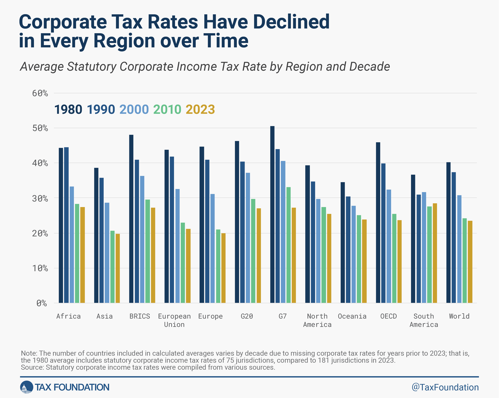

## Table of Contents

## What is a corporate tax rate?

A corporate tax rate is the percentage of a company's profits that it must pay to the government as tax. This rate is set by the government and can vary from one country to another. When a company earns money, it calculates its taxable income after subtracting allowable expenses and deductions. The corporate tax rate is then applied to this taxable income to determine the amount of tax the company owes.

Different countries have different corporate tax rates, and these rates can also change over time. Some countries have a flat rate, meaning all companies pay the same percentage regardless of their income. Other countries use a progressive system, where the tax rate increases as the company's income increases. Understanding the corporate tax rate is important for businesses because it affects their net profits and can influence decisions about where to operate or invest.

## Why are corporate tax rates important for businesses?

Corporate tax rates are important for businesses because they affect how much money the business keeps after paying taxes. When a business makes money, it has to pay a part of that money to the government. The corporate tax rate tells the business what percentage of its profit it needs to pay. If the tax rate is high, the business will have less money left to use for growing the business, paying employees, or giving back to shareholders.

Knowing the corporate tax rate also helps businesses decide where to set up their operations. Different countries have different tax rates, and a business might choose to operate in a country with a lower tax rate to keep more of its profits. This can influence big decisions like where to build factories or offices. So, understanding corporate tax rates is key for businesses to plan their finances and make smart choices about where and how to grow.

## How do corporate tax rates vary globally?

Corporate tax rates are different in every country. Some countries have high rates, like Japan, where the corporate tax rate can be around 30%. Other countries have lower rates, like Ireland, where the rate is about 12.5%. These differences can make a big impact on where companies decide to do business. If a company wants to keep more of its profits, it might choose to set up in a country with a lower tax rate.

In some places, the tax rates change depending on how much money a company makes. This is called a progressive tax system. For example, in the United States, smaller companies might pay a lower rate, but bigger companies pay more. Other countries use a flat rate, meaning every company pays the same percentage no matter how much they earn. These differences in how tax rates are applied around the world can affect how and where companies choose to operate and grow.

## What are the current corporate tax rates in major economies like the USA, China, and Germany?

In the United States, the corporate tax rate is 21%. This is a flat rate, which means all companies pay the same percentage of their profits as tax, no matter how big or small they are. Before 2018, the rate was much higher at 35%, but it was lowered to make it easier for businesses to keep more of their money and to encourage more companies to invest in the U.S.

In China, the standard corporate tax rate is 25%. However, there are some special rules that can lower this rate for certain companies. For example, small businesses might pay less, and companies in certain industries or regions might get tax breaks. This means the actual rate a company pays can be different from the standard rate.

In Germany, the corporate tax rate is a bit more complicated. The basic rate is 15%, but there's also a solidarity surcharge of 5.5% and a trade tax that varies by region. When you add all these together, the effective tax rate can be around 30% or more. This means that businesses in Germany need to think about all these different taxes when figuring out how much they will pay.

## How have global corporate tax rates changed over the last decade?

Over the last decade, many countries have been lowering their corporate tax rates. This is because they want to attract more businesses and keep them in their country. For example, the United States used to have a corporate tax rate of 35%, but in 2018, they lowered it to 21%. This big change was meant to make the U.S. a more appealing place for companies to do business. Other countries like the United Kingdom and Canada also made their corporate tax rates lower to stay competitive and encourage more investment.

However, not all countries have followed this trend. Some countries, like Germany, have kept their rates pretty stable. Germany's corporate tax rate includes several parts, like the basic rate, a solidarity surcharge, and a trade tax, which together can add up to around 30% or more. Even though the rates haven't changed much, the way they are calculated can make a big difference for businesses. Overall, the global trend has been towards lower corporate tax rates, but there are still big differences from one country to another.

## What factors influence a country's decision to set its corporate tax rate?

A country decides its corporate tax rate based on many things. One big thing is wanting to attract businesses. If a country has a lower tax rate, more companies might want to set up there because they can keep more of their profits. This can help the country's economy grow because more businesses mean more jobs and more money being spent. Another thing is how much money the government needs. If the government needs more money for things like schools or roads, they might keep the tax rate higher. But they have to balance this with not scaring businesses away.

Also, countries look at what other countries are doing. If a nearby country lowers its tax rate, a country might feel pressure to do the same so it doesn't lose businesses to its neighbor. This can start a kind of race where countries keep lowering their rates to stay competitive. But countries also think about fairness. They want to make sure big companies pay their fair share, so they might keep rates high enough to collect enough money without making it too hard for businesses to operate.

## How do tax havens affect global corporate tax rates?

Tax havens are places where businesses can pay very low or no taxes. This can make a big difference in how much money companies keep. When companies can move their money to these places, they might choose to set up parts of their business there. This can make other countries feel like they need to lower their own tax rates to keep businesses from leaving. So, tax havens can push down corporate tax rates around the world as countries try to stay competitive.

But not all countries can lower their rates as much as they want. They still need money to run the country and help their people. So, while tax havens can lead to lower rates in some places, other countries might keep their rates higher because they need the money. This can create a tricky situation where countries have to balance keeping businesses happy and getting enough money to do what they need to do.

## What is the impact of double taxation treaties on corporate tax rates?

Double taxation treaties are agreements between countries that help businesses avoid paying taxes on the same income in two different places. When a company makes money in one country but is based in another, it might have to pay taxes in both countries without these treaties. But with a treaty, the company only pays taxes in one country or gets a credit for taxes paid in the other country. This makes it easier for companies to do business across borders because they don't have to worry about being taxed twice on the same money.

These treaties can affect how countries set their corporate tax rates. If a country has many treaties, it might not need to lower its tax rates as much to attract businesses because companies know they won't be taxed twice. On the other hand, countries without many treaties might feel more pressure to lower their rates to compete. So, double taxation treaties can help keep corporate tax rates more stable and make it easier for businesses to plan where to operate and invest.

## How do multinational corporations manage their tax liabilities across different jurisdictions?

Multinational corporations manage their tax liabilities by carefully planning where they make their money and how they move it around the world. They often set up parts of their business in countries with lower tax rates, called subsidiaries. By doing this, they can move profits to these low-tax places and pay less tax overall. They also use something called transfer pricing, where they set prices for goods or services they sell between their own companies in different countries. This helps them move profits to where the taxes are lower.

Another way they manage their taxes is by using double taxation treaties. These are agreements between countries that help companies avoid paying taxes on the same income in two places. If a company makes money in one country but is based in another, it might have to pay taxes in both without these treaties. But with a treaty, the company only pays taxes in one country or gets a credit for taxes paid in the other. This makes it easier for companies to do business across borders and plan their taxes better.

Overall, multinational corporations use a mix of strategies to keep their tax bills as low as possible. They look at where to set up their business, how to move money around, and what tax treaties they can use. By doing this, they can manage their tax liabilities across different countries and keep more of their profits.

## What are the proposed reforms to global corporate taxation, such as the OECD's global minimum tax?

One big idea to change global corporate taxes is the OECD's global minimum tax. This plan says that big companies should pay at least a certain amount of tax no matter where they do business. The idea is to stop companies from moving their money to places with very low taxes, called tax havens. If a company pays less tax in one country, other countries can make them pay more to reach the minimum. This way, countries hope to get more tax money and make it fairer for everyone.

Another part of the plan is about where companies make their money. Right now, companies can say they made money in a low-tax country even if they sold things in a high-tax country. The new rules would change this so companies have to pay more tax in the countries where they actually sell things. This could help countries get more tax money from big companies that do business all over the world. Both parts of this plan are trying to make the global tax system more fair and stop companies from avoiding taxes.

## How do different accounting standards affect the reported corporate tax rates?

Different countries use different accounting standards, which can change how much tax a company says it has to pay. For example, the United States uses something called GAAP (Generally Accepted Accounting Principles), while many other countries use IFRS (International Financial Reporting Standards). These standards can affect how a company calculates its profits and what it can count as expenses. If a company can count more things as expenses under one standard, it might show lower profits and pay less tax.

Because of these differences, the same company might report different tax rates in different countries. This can make it hard to compare tax rates between companies from different places. For example, a company might show higher profits in a country that uses IFRS because it has fewer rules about what can be counted as an expense. This could mean the company pays more tax in that country. So, understanding the accounting standards used in each country is important for figuring out why corporate tax rates might look different.

## What are the economic theories supporting high versus low corporate tax rates?

Economic theories supporting high corporate tax rates argue that they help governments raise money to pay for important things like schools, roads, and healthcare. When companies pay more taxes, the government can use that money to help everyone in the country. Some people also believe that high taxes can make sure big companies pay their fair share. They think that if companies have to pay more, it can reduce inequality and make the economy more fair. High taxes might also encourage companies to reinvest their profits in the business instead of just keeping them, which could help the economy grow in the long run.

On the other hand, theories supporting low corporate tax rates say that they help attract businesses and encourage them to invest more. If a country has lower taxes, companies might choose to set up there because they can keep more of their profits. This can lead to more jobs and more money being spent in the economy. Some people think that lower taxes can make companies more competitive, which can help the whole economy grow. They argue that if companies have more money to spend, they might invest in new projects or expand their business, which can be good for everyone.

## References & Further Reading

[1]: ["Action 13: Country-by-Country Reporting"](https://www.oecd.org/en/topics/sub-issues/country-by-country-reporting-for-tax-purposes/guidance-handbooks.html) by OECD

[2]: ["The Tax Cuts and Jobs Act of 2017: A Legislative History"](https://taxfoundation.org/research/all/federal/2017-tax-cuts-jobs-act-analysis/)

[3]: De Mooij, R.A., & Ederveen, S. (2008). ["Corporate tax elasticities: a reader's guide to empirical findings."](https://www.jstor.org/stable/pdf/23606837.pdf) Oxford Review of Economic Policy, 24(4), 680-697.

[4]: ["Base Erosion and Profit Shifting (BEPS)"](https://www.oecd.org/en/topics/base-erosion-and-profit-shifting-beps.html) by OECD

[5]: ["Taxing the Digital Economy"](https://www.cambridge.org/core/books/taxing-the-digital-economy/ECCEDF3338921D06A823826407827EF0) by the International Monetary Fund (IMF)