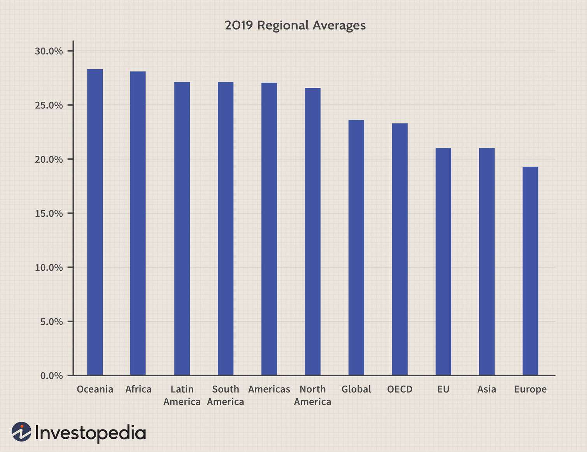

In today's globalized economy, understanding corporate tax rates is crucial for businesses operating internationally. Corporate taxes, which are a primary source of revenue for governments, can significantly impact a company's financial standing and strategic planning. The way these taxes are structured influences corporate decisions on location, investment, and even business model adaptations. 

This article explores the intricacies of international corporate taxes, global taxation trends, and their implications on algorithmic trading. Algorithmic trading, which involves using computer algorithms to execute trades at high speeds and volumes, can be significantly affected by taxation policies. This impact extends to trading strategies, particularly in how firms might adjust their operations across different tax jurisdictions to optimize financial outcomes.



As nations compete to attract multinational enterprises, tax policies continue to evolve and shift. Countries are constantly adjusting tax rates and incentives to make themselves more attractive to businesses while maintaining adequate revenue streams. This dynamic environment requires businesses to be highly adaptable and informed about changes in tax laws and international tax agreements.

We'll compare corporate tax rates across different regions and examine what they mean for businesses worldwide. This comparative analysis will highlight the competitive nature of global tax policies and underscore the necessity for companies to integrate tax considerations into their broader strategic planning. By understanding the current landscape of international corporate taxes and anticipating future trends, businesses can position themselves for sustained success in an increasingly interconnected global market.

## Table of Contents

## Understanding Corporate Tax Rates

Corporate tax rates are a crucial aspect of national fiscal policies, representing the percentage of a corporation's profits that is paid to the government as tax. These rates play a significant role in influencing business decisions, especially for multinational corporations deciding where to establish their operations. The variability of corporate tax rates across different countries stems from the distinct economic strategies and fiscal needs of each region.

### Variability of Corporate Tax Rates

The disparity in corporate tax rates among countries can be attributed to various factors, including economic development levels, political priorities, and competition for foreign direct investment. Developed countries often have intricate tax systems with higher tax rates designed to support extensive public services and welfare programs. For instance, certain European Union nations like Germany and France historically have imposed higher corporate tax rates compared to developing nations, where rates might be lower to attract foreign investors.

### Impact on Business Location Decisions

High corporate tax rates can significantly influence decisions about business locations and operations. Corporations may favor locations with lower tax rates to minimize tax liabilities and maximize after-tax profits. This [factor](/wiki/factor-investing) contributes to phenomena such as tax inversion and the strategic relocation of headquarters to countries with more favorable tax regimes. For example, Ireland's relatively low corporate tax rate has made it an attractive location for numerous multinational corporations.

### Tax Avoidance and Planning

The presence of high corporate tax rates often leads companies to develop sophisticated tax avoidance strategies. These strategies can include profit shifting, where profits are reported in low-tax jurisdictions irrespective of the location of the economic activity, and the use of tax havens. Thus, an understanding of varying corporate tax rates is critical for effective corporate tax planning and compliance. Such strategies can be complex but essential for optimizing tax efficiency while staying within legal frameworks.

### Comparative Analysis

Analyzing corporate tax rates across major economies helps illuminate trends influencing international business operations. According to data from the Organisation for Economic Co-operation and Development (OECD), corporate tax rates have seen a general downward trend over the past few decades. The push for competitive tax rates to attract multinational companies has led many countries to reduce their rates or introduce various fiscal incentives. Countries such as the United States implemented sweeping tax reforms with the Tax Cuts and Jobs Act of 2017, which lowered the federal corporate tax rate from 35% to 21%.

Such comparative analysis underscores the balance governments must achieve between maintaining competitive tax rates to attract foreign investment and ensuring sufficient revenue generation for public expenditure. As businesses navigate this complex tax landscape, strategic corporate tax planning becomes increasingly important for legal compliance and financial optimization.

## The Landscape of International Corporate Taxes

International corporate taxation encompasses a complex framework of taxation principles and systems applied to multinational corporations, which must navigate varying tax laws across different jurisdictions. One of the primary challenges in this sphere is tax base erosion, where significant portions of a company’s taxable income are shifted from high-tax jurisdictions to low-tax jurisdictions to minimize tax liabilities. This practice, often termed as profit shifting, can lead to substantial revenue losses for governments. Multinational corporations utilize strategies such as transfer pricing and intellectual property migrations to facilitate profit shifting, which poses a risk to fair taxation and erodes national tax bases.

To maintain a competitive balance and secure tax revenues, various international organizations and agreements have been instituted to standardize corporate taxation. The Organization for Economic Co-operation and Development (OECD) plays a pivotal role in these efforts through its Base Erosion and Profit Shifting (BEPS) initiatives. BEPS aims to equip governments with tools to prevent tax avoidance strategies that exploit mismatches and gaps in tax rules to artificially shift profits to low or no-tax locations. The initiatives comprise a series of actions to tackle issues such as hybrid mismatch arrangements, limit base erosion via interest deductions, and curb harmful tax practices, including the strategy of treaty shopping.

The impact of these efforts is significant for businesses globally, as they necessitate adaptations in corporate tax strategies and increased transparency in financial reporting. Compliance with the OECD’s BEPS measures requires multinational corporations to undertake thorough documentation, particularly with respect to transfer pricing, thus influencing their operational and financial strategies. For instance, Action 13 of the BEPS provides guidance on country-by-country reporting, compelling MNEs to disclose detailed financial and tax information on a global scale. Consequently, businesses must align their internal tax practices to meet these international standards, which could impact their overall tax liability and global operational framework.

In conclusion, as international corporate tax systems evolve with initiatives like the BEPS reports, multinational corporations face new regulatory landscapes that demand comprehensive strategies for compliance and optimization. Understanding these elements is crucial for businesses striving to maintain fiscal sustainability while adhering to international tax norms.

## Global Taxation Trends

Recent global trends in taxation highlight a shift towards more coordinated international efforts to address the challenges posed by an evolving economic landscape. The rapid growth of digital economies has necessitated a reevaluation of traditional tax systems, especially in addressing how digital giants are taxed. Multinational digital companies often use complex arrangements to minimize tax liabilities by shifting profits to low-tax jurisdictions, a practice known as base erosion and profit shifting (BEPS). This has led to significant discussions among policymakers about creating equitable tax systems capable of capturing revenue fairly in the digital era.

In response to these challenges, there is a growing movement towards the establishment of global minimum tax rates. This initiative aims to prevent countries from engaging in a "race to the bottom," where jurisdictions competitively lower corporate tax rates to attract multinational enterprises, often at the expense of their tax base. The Organization for Economic Co-operation and Development (OECD) has been influential in guiding these discussions, with the Base Erosion and Profit Shifting (BEPS) project serving as a framework for reform. In 2021, an agreement was reached among over 130 countries to implement a global minimum corporate tax rate of 15%, aimed at ensuring that large corporations pay a fair share of taxes regardless of where they generate their profits. 

This push towards standardized tax rates is accompanied by an increasing focus on taxing the digital economy. Efforts are underway to develop new tax regimes that align with modern economic realities, such as the OECD's Pillar One proposal. This suggests reallocating some taxing rights to countries where businesses generate revenue, regardless of whether they have a physical presence there. Such developments are reshaping international tax planning strategies for businesses, necessitating a more nuanced understanding of varying tax obligations across jurisdictions.

As these trends continue to unfold, predictions indicate further harmonization and collaboration in international tax policy. Businesses must develop strategic approaches that incorporate compliance with these changing regulations while optimizing tax liability. For instance, investment in technology capable of monitoring and responding to tax developments in real time is becoming increasingly important. Additionally, engagement with policymakers may help influence future tax legislation in ways that consider the interests of both nations and corporations.

The transformation in global taxation trends reflects a broader sentiment towards fairness and equity in international business practices. As tax systems adapt to the challenges of globalization and digitalization, companies must anticipate and respond to these changes to maintain competitiveness and ensure sustainable operations.

## The Role of Algorithmic Trading in Global Tax Strategy

Algorithmic trading, often synonymous with high-frequency trading ([HFT](/wiki/high-frequency-trading-strategies)), employs computer algorithms to execute trades at speeds and frequencies beyond human capabilities. These systems use predefined criteria, including market conditions and statistical analysis, to determine the optimal timing, pricing, and execution of trades. 

In the context of global taxation, [algorithmic trading](/wiki/algorithmic-trading) provides unique opportunities to enhance tax efficiency. Tax considerations can significantly influence how algorithmic trading strategies are formulated and executed. For instance, the timing of trades can be adjusted to benefit from favorable short-term or long-term capital gains tax treatments, depending on the jurisdiction. Additionally, algorithms can be structured to trade in assets or through entities located in regions with advantageous tax regimes, thereby maximizing after-tax returns.

Understanding the tax implications of algorithmic trading is essential, especially for firms engaged in HFT, as they often operate across multiple tax jurisdictions. Each jurisdiction may [carry](/wiki/carry-trading) distinct tax obligations and incentives, which algorithms can be programmed to incorporate when assessing market opportunities. For example, a trading algorithm might prioritize transactions in a jurisdiction with lower tax rates on specific financial instruments or higher tax deductions.

Algorithmic trading also plays a role in resource allocation decisions across different tax regimes. By analyzing tax rates and regulations, firms can use algorithms to optimize the location of profits and transactions, legally minimizing their tax liabilities. This aspect of algorithmic trading requires continuous updates and adaptations to the algorithms, reflecting changes in tax laws and international agreements aimed at preventing tax avoidance through practices such as profit shifting.

Here's a simple Python example to illustrate how an algorithm might consider tax implications:

```python
def optimal_trade_decision(price, market_condition, tax_rate):
    """
    Determines the optimal trade decision based on market condition and tax rate.

    :param price: Current price of the asset
    :param market_condition: Integer representing market condition (e.g., 1 for bullish, -1 for bearish)
    :param tax_rate: Applicable tax rate in percentage
    :return: Trade decision
    """
    if market_condition > 0 and tax_rate < 20:
        return "Buy"
    elif market_condition < 0 and tax_rate > 20:
        return "Sell"
    else:
        return "Hold"

price = 150
market_condition = 1
tax_rate = 15  # Example tax rate

decision = optimal_trade_decision(price, market_condition, tax_rate)
print(f"Trade Decision: {decision}")
```

In this example, the function `optimal_trade_decision` makes trade decisions based not only on market conditions but also on tax rates, demonstrating how tax efficiency can be programmed into trading algorithms.

Finally, algorithmic strategies are particularly aligned with tax optimization on a global scale due to their capability to manage large volumes of transactions in various markets simultaneously. This enables companies to better navigate the intricacies of different tax environments by rapidly adapting to changes and avoiding potential tax inefficiencies. The scalability and adaptability of algorithmic systems make them a powerful tool in the global tax strategy of any trading firm.

## Strategies for Navigating International Corporate Taxes

Effective tax management strategies are crucial for companies aiming to maintain a competitive edge in a global market characterized by varying corporate tax rates. By strategically navigating international corporate taxes, businesses can optimize their financial performance and ensure compliance with diverse regulatory environments.

Transfer pricing, a key component of international tax strategy, involves setting prices for transactions between related entities within a multinational corporation. Proper transfer pricing ensures that profits are appropriately allocated, minimizing the risk of tax audits and penalties. Businesses must stay informed about changes in transfer pricing regulations to maintain alignment with local tax laws and international guidelines such as the OECD Transfer Pricing Guidelines.

Tax treaties are another vital consideration for companies operating across borders. These treaties are agreements between countries that provide relief from double taxation and promote tax cooperation. Understanding the provisions and benefits of relevant tax treaties can significantly impact a company's tax liability. It allows businesses to capitalize on reduced withholding tax rates and other treaty benefits, enhancing overall profitability.

Additionally, unilateral measures, which are domestic tax laws or policies enacted by a country independently, can affect international tax strategy. Companies must be vigilant about changes in these measures, as they can alter the effectiveness of existing tax plans. For instance, anti-avoidance rules or specific digital services taxes may require businesses to adapt their strategies to remain compliant and efficient.

Tax incentives, varying widely by jurisdiction, offer opportunities for companies to increase their profitability. Governments often provide incentives such as tax credits, exemptions, or accelerated depreciation to attract foreign investment. An in-depth understanding of these incentives, alongside strategic planning, can lead to substantial tax savings and improved competitive positioning.

Cross-border tax planning necessitates a comprehensive perspective that incorporates both local and global considerations. Effective strategies should synchronize compliance with international tax requirements while leveraging jurisdiction-specific advantages. Businesses must assess the tax implications of their entire operational structure, including supply chains, financing arrangements, and intellectual property allocations.

Strategies that prioritize compliance, efficiency, and optimization include adopting sophisticated tax reporting technologies, conducting regular tax audits, and engaging tax advisory services to anticipate and respond to regulatory changes. By aligning their operations with tax-efficient structures and practices, companies can mitigate risks and take advantage of lucrative opportunities in the international market.

In conclusion, as businesses adapt to the global tax landscape, they must integrate forward-thinking tax strategies with their broader financial and operational goals. By harnessing the benefits of transfer pricing, tax treaties, unilateral measures, and localized incentives, companies can navigate complex tax environments effectively. A well-informed and proactive approach to international corporate taxes can yield significant competitive advantages and contribute to sustained success.

## Conclusion

Navigating the complex world of corporate tax rates and international taxation requires strategic insight. This dynamism demands that businesses remain agile and adaptable to the frequently evolving tax laws and trends. A corporation's competitiveness in the global market hinges significantly on its ability to respond to changes in tax regulations, ensuring compliance while optimizing its tax liabilities. 

The synchronization of global taxation offers both opportunities and challenges for businesses. As countries collaborate to create more harmonized tax systems, businesses face the potential for reduced complexities and greater predictability in tax planning. However, this convergence also means that companies must be vigilant of overlapping tax jurisdictions and the potential for double taxation. 

Informed decision-making is paramount for leveraging these developments towards favorable outcomes. Tax strategies should be data-driven, taking into account the specificities of different tax regimes, potential reforms, and the overall economic environment. Tools such as predictive analytics and scenario analysis can be useful in forecasting changes and preparing appropriate responses.

To achieve global success, staying informed and proactive in tax strategies will be essential. This involves continuous monitoring of international tax discourse, engaging with policymakers, and participating in global tax forums. By adopting a forward-looking approach, businesses can ensure their strategies remain robust against future shifts in the international taxation landscape.

## References & Further Reading

[1]: ["Action 13: Country-by-Country Reporting"](https://www.oecd.org/en/topics/sub-issues/country-by-country-reporting-for-tax-purposes/guidance-handbooks.html) by OECD

[2]: ["The Tax Cuts and Jobs Act of 2017: A Legislative History"](https://taxfoundation.org/research/all/federal/2017-tax-cuts-jobs-act-analysis/)

[3]: De Mooij, R.A., & Ederveen, S. (2008). ["Corporate tax elasticities: a reader's guide to empirical findings."](https://www.jstor.org/stable/pdf/23606837.pdf) Oxford Review of Economic Policy, 24(4), 680-697.

[4]: ["Base Erosion and Profit Shifting (BEPS)"](https://www.oecd.org/en/topics/base-erosion-and-profit-shifting-beps.html) by OECD

[5]: ["Taxing the Digital Economy"](https://www.cambridge.org/core/books/taxing-the-digital-economy/ECCEDF3338921D06A823826407827EF0) by the International Monetary Fund (IMF)