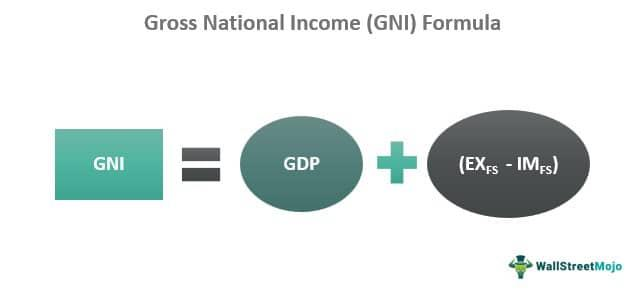

In the rapidly evolving world of finance, algorithmic trading has become an indispensable tool for investors and analysts. As technology advances, the speed and efficiency of trade execution have increased, rendering traditional trading methods less competitive. Understanding economic indicators is pivotal to developing effective trading algorithms that harness this new capability.

Gross National Income (GNI) and Gross Domestic Product (GDP) are two of the most critical economic metrics for traders. These indicators provide essential insights into a nation’s economic health and performance, influencing global financial markets. Traders utilize GNI and GDP data to gauge economic strength, anticipate market trends, and make informed investment decisions.



This article explores how GNI and GDP can be leveraged in algorithmic trading strategies to optimize investment outcomes. Understanding their definitions, significance, and roles in financial markets is key to harnessing their potential in algorithmic models. Through this exploration, we aim to highlight the impact of these indicators on asset valuation and market dynamics, establishing a foundation for more robust and predictive trading systems.

## Table of Contents

## Understanding Economic Indicators: GNI and GDP

Economic indicators are essential statistical tools used to assess the performance and health of an economy. Among these, Gross National Income (GNI) and Gross Domestic Product (GDP) are particularly significant. 

GNI measures the total income earned by the residents and businesses of a nation, including both domestic and international income sources. This encompasses all wages, investments, and company profits generated by enterprises owned by a country's residents, irrespective of where they are located. In formula form, GNI can be expressed as:

$$
\text{GNI} = \text{GDP} + \text{Net income from abroad}
$$

where "Net income from abroad" includes income such as dividends and interest received from foreign investments minus similar payments made to entities outside the country.

GDP, on the other hand, represents the total market value of all finished goods and services produced within a country's borders over a specific period, usually calculated on an annual or quarterly basis. GDP is a comprehensive measure of a domestic economy's production and is often used to indicate economic health and growth trends. The calculation of GDP can be approached in three primary ways:

1. **Production Approach**: 

$$
\text{GDP} = \sum (\text{Gross value added by all industries}) - \sum (\text{Intermediate consumption})
$$

2. **Income Approach**:

$$
\text{GDP} = \text{Sum of all incomes earned in the production process}
$$

3. **Expenditure Approach**:

$$
\text{GDP} = C + I + G + (X - M)
$$

where:
- $C$ stands for consumption,
- $I$ represents investment,
- $G$ is government spending,
- $X$ denotes exports of goods and services, and
- $M$ indicates imports of goods and services.

Both GNI and GDP are indispensable for formulating economic strategies due to their ability to provide insights into economic health and growth patterns. While GDP is a crucial metric for understanding the economic activity within a country, GNI offers a broader perspective by capturing the total economic output of a nation's residents, including those abroad. These indicators are pivotal not only for investors seeking to optimize their investment strategies but also for policymakers and economists responsible for economic planning and strategy. Understanding these metrics allows for a comprehensive analysis of macroeconomic stability and growth potential, fostering informed decision-making in both public policy and investment domains.

## The Significance of GNI and GDP in Financial Markets

Accurate interpretation of Gross National Income (GNI) and Gross Domestic Product (GDP) can significantly enhance a trader's understanding of economic cycles and identify potential trading opportunities. These indicators are pivotal in determining market sentiment, investment climate, and underlying economic trends. 

High GDP growth rates are often seen as indicators of an expanding economy, leading to increased corporate profits and consumer spending. Consequently, such growth typically results in a bullish market sentiment, encouraging traders to increase their exposure to equities and riskier assets. Conversely, economic contraction, indicated by a declining GDP, typically leads to bearish market outlooks, prompting investors to pivot towards safer, more stable investments such as bonds or commodities.

While GDP focuses on the total market value of goods and services produced within a country, GNI provides a broader look by including international economic activities. GNI takes into account the total income earned by a nation’s residents and businesses from both domestic and international sources. This broader perspective aids traders by adding additional dimensions for analysis, such as the impact of foreign exchange rates and international trade dynamics.

Both GNI and GDP are instrumental in assessing national economic stability. A stable or growing GDP and GNI are indicative of a robust economic environment, reducing perceived investment risks and fostering a conducive environment for both domestic and foreign investments. Furthermore, these indicators are essential for gauging global trade dynamics, providing insights into a country’s balance of trade, trade deficits, or surpluses.

Understanding GNI and GDP is also critical for anticipating government monetary policies. Central banks and monetary authorities use these indicators to devise policies that stabilize or stimulate the economy. For instance, in periods of rapid GDP growth, central banks may increase interest rates to prevent overheating. Conversely, in times of economic downturn indicated by declining GDP, they may implement lower interest rates or quantitative easing to spur economic activity. Traders who anticipate such policy changes can adjust their strategies to optimize asset allocation and mitigate risks.

In summary, GNI and GDP are indispensable tools for traders, offering vital insights into the economic environment and guiding strategic investment decisions. They lay the groundwork for analyzing economic health, predicting policy shifts, and adapting to market changes, ultimately providing a competitive edge in financial markets.

## Algorithmic Trading: A Brief Overview

Algorithmic trading, commonly known as algo trading, is a modern approach to financial market trading that utilizes computer algorithms to conduct trades at optimal speed and efficiency. This method leverages mathematical models and statistical analyses to make systematic trading decisions. By minimizing human intervention, algo trading reduces the incidence of errors and emotional biases which can often lead to poor trading outcomes.

One of the key advantages of [algorithmic trading](/wiki/algorithmic-trading) is its ability to process large volumes of data more quickly than human traders. For instance, an algorithm can analyze thousands of securities across multiple markets and execute trades in milliseconds. This capability enables traders to employ timely and precise trading strategies, acting on opportunities that would otherwise be missed by manual trading processes. These strategies can range from simple moving average crossovers to more complex [arbitrage](/wiki/arbitrage) opportunities that involve high-frequency trading.

Recent technological advancements have democratized access to algorithmic trading, bringing it within reach of retail investors in addition to institutional players. Platforms offering algorithmic trading tools have proliferated, providing retail traders with user-friendly interfaces and pre-built algorithmic strategies. This accessibility has allowed a broader audience to leverage sophisticated trading techniques that were once the exclusive domain of institutional traders equipped with extensive resources and infrastructure.

In addition to trading speed and efficiency, algorithmic trading often incorporates [machine learning](/wiki/machine-learning) techniques to enhance predictive accuracy. For example, algorithms can be designed to recognize patterns in historical price data or identify correlations between different financial instruments. These algorithms can also adapt to changing market conditions, refining their strategies based on new data inputs.

To illustrate a basic concept in algorithmic trading, consider a simple moving average crossover strategy implemented in Python:

```python
import pandas as pd

# Load historical market data
data = pd.read_csv('market_data.csv')
data['SMA_20'] = data['Close'].rolling(window=20).mean()
data['SMA_50'] = data['Close'].rolling(window=50).mean()

# Generate trading signals
data['Signal'] = 0
data['Signal'][20:] = np.where(data['SMA_20'][20:] > data['SMA_50'][20:], 1, -1)

# Calculate returns
data['Returns'] = data['Close'].pct_change()
strategy_returns = data['Signal'].shift(1) * data['Returns']

# Performance metrics
cumulative_returns = (1 + strategy_returns).cumprod()
print(cumulative_returns.tail(1))
```

This example demonstrates how an algorithm can automate trading decisions based on statistical criteria, such as the crossover of short-term and long-term moving averages. As the technology continues to evolve, the potential for more intricate and effective trading algorithms grows, paving the way for innovations in the financial markets.

## Integrating GNI and GDP into Algorithmic Trading Strategies

Integrating Gross National Income (GNI) and Gross Domestic Product (GDP) into algorithmic trading strategies involves leveraging these economic indicators to anticipate market movements and make more informed trading decisions. Understanding the impact of changes in GNI and GDP on asset prices is crucial for enhancing algorithmic trading strategies. This approach allows traders to develop algorithms that respond dynamically to economic data, improving the precision of their trading actions.

Programming algorithms to analyze real-time GDP releases enables the execution of trades aligned with predefined economic forecasts. For example, if a country reports stronger-than-expected GDP growth, an algorithm can be programmed to take advantage of the likely positive market sentiment by initiating buy orders in equity markets. Conversely, if GDP data falls short of expectations, the algorithm might trigger sell orders to capitalize on anticipated bearish market reactions.

GNI and GDP indicators are also pivotal in predicting currency fluctuations, making them essential for [forex](/wiki/forex-system) trading algorithms. Changes in GDP can influence a country's currency value. For instance, stronger GDP growth may lead to an appreciation of the domestic currency as investors anticipate higher interest rates, thus attracting capital inflows. By integrating such economic indicators, forex algorithms can adjust positions automatically in response to economic news, maximizing potential returns while managing risks effectively.

Machine learning models play a significant role in integrating GNI and GDP data for predictive analytics. These models can be trained to recognize patterns in historical economic data, allowing for more accurate forecasts of future economic conditions. A typical approach might involve using regression models or time series analysis to predict GDP growth based on various economic inputs. Python code can be employed to illustrate such an approach:

```python
import pandas as pd
from sklearn.model_selection import train_test_split
from sklearn.linear_model import LinearRegression

# Load historical GDP data
gdp_data = pd.read_csv('gdp_data.csv')

# Feature engineering and preprocessing
X = gdp_data[['previous_quarter_gdp', 'economic_indicators_1', 'economic_indicators_2']]
y = gdp_data['current_quarter_gdp_growth']

# Split data into training and test sets
X_train, X_test, y_train, y_test = train_test_split(X, y, test_size=0.2, random_state=42)

# Create and train the regression model
model = LinearRegression()
model.fit(X_train, y_train)

# Predict GDP growth
predictions = model.predict(X_test)
```

Incorporating GNI and GDP data into trading algorithms gives traders a competitive edge by optimizing entry and [exit](/wiki/exit-strategy) points, especially in volatile markets. By aligning trading activities with economic cycles, traders leverage insights to make strategic decisions that align with broader economic trends. This integration allows traders to capitalize on opportunities presented by economic shifts, ensuring that their trading strategies are both resilient and adaptive to evolving market conditions.    

By using advanced technologies such as machine learning, traders can automate these processes, consistently refining their strategies to enhance performance based on a robust understanding of key economic indicators.

## Challenges and Considerations in Using Economic Indicators for Algo Trading

While integrating Gross National Income (GNI) and Gross Domestic Product (GDP) into algorithmic trading offers significant advantages, a few challenges and considerations must be addressed to maximize the effectiveness of these economic indicators.

One primary challenge is the susceptibility of economic data to revisions. Both GNI and GDP figures are often released as preliminary estimates and subject to corrections. For example, an initial GDP growth rate of 2% might later be revised to 1.8% based on new information. Such adjustments can significantly impact trading decisions made on the basis of the initial data. Thus, algorithms must be designed to quickly adapt to updated information. This requires programming flexibility and responsiveness, potentially utilizing machine learning models capable of adjusting to new data inputs in real time.

Global economic events can also alter the effectiveness of strategies based on GNI and GDP. Recessions, financial crises, or sudden geopolitical developments can skew these indicators from the typical economic cycles they represent. During such periods, GNI and GDP may not provide reliable signals for algorithmic trading strategies. Therefore, relying solely on these metrics without considering broader economic contexts can lead to misinformed trading decisions. Algorithms must incorporate external data sources and alternative indicators to maintain robust performance under various economic conditions.

Risk management techniques are crucial when using GNI and GDP in algorithmic trading. Economic indicators alone cannot account for unexpected shifts in market dynamics. Implementing stop-loss orders, diversifying asset portfolios, and employing hedging strategies are essential risk management practices that safeguard against potential losses. Algorithms should be equipped to not only execute trades based on economic indicators but also respond to sudden market changes with appropriate risk mitigations.

Lastly, [backtesting](/wiki/backtesting) with historical data forms an integral part of developing reliable trading algorithms. By testing algorithms on previously encountered market conditions, traders can assess how well GNI and GDP-based strategies perform under different scenarios. Backtesting helps identify any weaknesses or biases in the algorithm, providing opportunities for refinement before live deployment. A comprehensive backtest includes a wide range of historical periods, ensuring that algorithms can handle diverse market environments.

In summary, while incorporating GNI and GDP into algorithmic trading can greatly enhance trading strategies, the adaptability to data revisions, understanding of global economic contexts, incorporation of robust risk management, and thorough backtesting are essential for overcoming the challenges associated with these indicators.

## Conclusion

Incorporating GNI and GDP into algorithmic trading strategies presents a valuable opportunity for traders to enhance decision-making. These indicators provide robust, data-driven insights that can improve the precision and strategic depth of trading decisions. Their integration into trading algorithms allows for a nuanced understanding of economic signals, offering traders the ability to anticipate shifts in market dynamics.

While challenges exist, such as the need for algorithms to quickly adapt to revised data and the unpredictability of global economic events, the evolution and improvement of these strategies continue. Algorithmic trading that effectively incorporates GNI and GDP is more resilient and better equipped to handle unexpected changes in economic conditions.

Traders who can dynamically adjust to changing economic signals are well-positioned to gain significant benefits in the competitive financial markets. These traders are not only able to optimize their trading strategies but also enhance their overall market performance. Whether used by institutional investors or retail traders, GNI and GDP remain indispensable tools for achieving long-term success and sustainable trading advantage. The integration of these economic indicators into algorithmic trading systems is not merely a trend but an essential component of modern financial strategy.

## References & Further Reading

[1]: Bergstra, J., Bardenet, R., Bengio, Y., & Kégl, B. (2011). ["Algorithms for Hyper-Parameter Optimization."](https://papers.nips.cc/paper/4443-algorithms-for-hyper-parameter-optimization) Advances in Neural Information Processing Systems 24.

[2]: ["Advances in Financial Machine Learning"](https://www.amazon.com/Advances-Financial-Machine-Learning-Marcos/dp/1119482089) by Marcos Lopez de Prado

[3]: ["Evidence-Based Technical Analysis: Applying the Scientific Method and Statistical Inference to Trading Signals"](https://books.google.com/books/about/Evidence_Based_Technical_Analysis.html?id=jbD47VkOHAEC) by David Aronson

[4]: ["Machine Learning for Algorithmic Trading"](https://github.com/stefan-jansen/machine-learning-for-trading) by Stefan Jansen

[5]: ["Quantitative Trading: How to Build Your Own Algorithmic Trading Business"](https://www.amazon.com/Quantitative-Trading-Build-Algorithmic-Business/dp/1119800064) by Ernest P. Chan