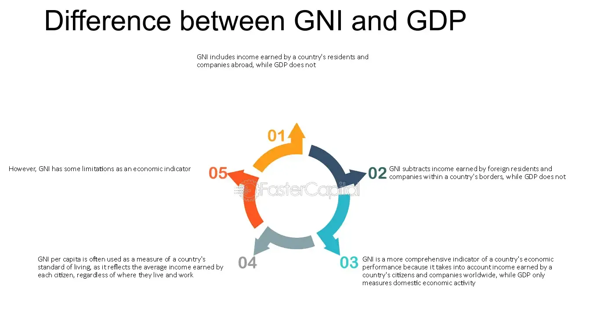

## Table of Contents

## What is GNI?

GNI stands for Gross National Income. It is a measure of the total amount of money earned by a country's people and businesses, no matter where they are in the world. If a company from the United States makes money in another country, that money is included in the U.S. GNI.

GNI is different from Gross Domestic Product (GDP), which only counts the money made within a country's borders. GNI helps us understand how much a country's citizens and businesses are earning overall, which can be useful for comparing the economic health of different countries. It is often used by organizations like the World Bank to classify countries as high-income, middle-income, or low-income.

## What is GDP?

GDP stands for Gross Domestic Product. It is the total value of all goods and services produced within a country's borders in a specific time period, usually a year. This includes everything from cars and computers to haircuts and hotel stays. If a company in the United States makes something, it counts toward the U.S. GDP, no matter who owns the company.

GDP is an important way to measure the size and health of a country's economy. It helps us see if the economy is growing or shrinking. When GDP goes up, it usually means more jobs and more money for people. When it goes down, it can mean fewer jobs and less money. Governments and businesses use GDP to make decisions about spending and investments.

## How is GNI calculated?

GNI is calculated by starting with a country's Gross Domestic Product (GDP). GDP is all the money made from goods and services inside the country. To get GNI, you add the money that people and businesses from the country earn in other countries. You also subtract the money that foreigners earn inside the country. This way, GNI shows the total income of a country's people and businesses, no matter where they are.

For example, if a company from the United States makes money in Japan, that money is added to the U.S. GNI. If a company from Japan makes money in the United States, that money is subtracted from the U.S. GNI. This helps to show the true income of a country's citizens and businesses around the world.

## How is GDP calculated?

GDP, or Gross Domestic Product, is the total value of all the goods and services made within a country in a year. To calculate GDP, you can use three different methods, but they all should give the same result. The first method is the production approach, where you add up the value of all the things produced, minus the cost of the materials used to make them. This is called the value added.

The second method is the income approach. Here, you add up all the income earned by everyone in the country, including wages, profits, and taxes minus subsidies. The third method is the expenditure approach, where you add up all the spending on goods and services. This includes what people, businesses, and the government spend, plus what the country exports minus what it imports. All these methods should give the same GDP number, showing how much the economy is producing.

## What are the main differences between GNI and GDP?

GNI and GDP are two ways to measure how much money a country's economy is making, but they look at it from different angles. GDP, or Gross Domestic Product, counts all the money made from goods and services inside a country's borders, no matter who makes it. So, if a foreign company makes something in the United States, it counts toward the U.S. GDP. On the other hand, GNI, or Gross National Income, counts the money made by a country's people and businesses, no matter where they are in the world. If a U.S. company makes money in Japan, it counts toward the U.S. GNI.

The main difference between GNI and GDP is where the money is made. GDP focuses on the location where the production happens, while GNI focuses on who is [earning](/wiki/earning-announcement) the money. This means that GNI can give a better picture of how much money a country's citizens and businesses are earning, even if they are working or investing in other countries. For example, if many people from a country work abroad and send money home, this will make the country's GNI higher than its GDP.

## Why might a country's GNI be higher than its GDP?

A country's GNI might be higher than its GDP if its people and businesses are making a lot of money in other countries. For example, if many people from the country work abroad and send money back home, this money counts toward the country's GNI but not its GDP. Also, if a country's companies make a lot of money in other countries, this money is added to the country's GNI.

This situation can happen when a country has a lot of citizens working overseas or when its businesses have big investments and operations in other countries. For instance, if a company from the United States makes a lot of profit in Europe, this profit is part of the U.S. GNI but not its GDP. So, if a country's people and businesses are successful outside its borders, its GNI can be higher than its GDP.

## In what scenarios is GDP a more useful indicator than GNI?

GDP is a better indicator to use when you want to see how much money is being made inside a country. It shows the total value of all the goods and services produced within the country's borders. This makes GDP useful for understanding how the economy is doing at home. For example, if a country wants to know if its factories and businesses are growing, or if people are buying more things inside the country, they would look at GDP.

GDP is also important for governments and businesses when they need to make decisions about spending and investments within the country. It helps them see if the economy is getting bigger or smaller, which can affect things like jobs and taxes. If a government is trying to plan a new road or a business is thinking about opening a new store, they would use GDP to understand the local economic conditions.

## How do GNI and GDP reflect a country's economic health?

GNI and GDP both help us understand how well a country's economy is doing, but they look at different things. GDP tells us about all the money made from things produced inside the country. If GDP is going up, it means more things are being made and sold, which usually means more jobs and more money for people. This is good for the country's economy because it shows growth. But if GDP goes down, it might mean fewer jobs and less money, which can be bad for the economy.

GNI, on the other hand, tells us about the money made by a country's people and businesses, no matter where they are in the world. If a country's GNI is high, it means its people and businesses are doing well, even if they are working or investing in other countries. This can be important for understanding how much money is coming into the country from abroad. Both GNI and GDP give us different pieces of information about a country's economic health, and together they help us get a full picture of how the economy is doing.

## What are the limitations of using GNI as an economic indicator?

GNI, or Gross National Income, is a good way to see how much money a country's people and businesses are making around the world. But it has some problems. One big problem is that GNI does not tell us how the money is shared among the people. A country might have a high GNI, but if only a few people are getting all the money, most people might still be poor. Also, GNI does not show if the money is being used to make life better for everyone, like building schools or hospitals.

Another problem with GNI is that it does not count things that do not have a price tag, like taking care of family or helping in the community. These things are important for a country's well-being, but they do not show up in GNI numbers. GNI also does not think about how using up natural resources, like cutting down forests, might hurt the country in the future. So, while GNI is useful, it does not give us the whole picture of a country's economic health.

## What are the limitations of using GDP as an economic indicator?

GDP, or Gross Domestic Product, is a good way to see how much money is being made inside a country. But it has some problems. One big problem is that GDP does not show how the money is shared among the people. A country might have a high GDP, but if only a few people are getting all the money, most people might still be poor. GDP also does not tell us if the money is being used to make life better for everyone, like building schools or hospitals.

Another problem with GDP is that it does not count things that do not have a price tag, like taking care of family or helping in the community. These things are important for a country's well-being, but they do not show up in GDP numbers. GDP also does not think about how using up natural resources, like cutting down forests, might hurt the country in the future. So, while GDP is useful, it does not give us the whole picture of a country's economic health.

## How do international organizations like the World Bank use GNI and GDP?

International organizations like the World Bank use GNI and GDP to understand and compare the economic health of different countries. They look at GNI to see how much money a country's people and businesses are making, no matter where they are in the world. This helps them classify countries into groups like high-income, middle-income, and low-income. For example, the World Bank uses GNI per capita, which is GNI divided by the number of people in the country, to decide which countries need more help and support.

GDP is also important for the World Bank because it shows how much money is being made inside a country's borders. They use GDP to see if a country's economy is growing or shrinking. This information helps them make decisions about loans and aid. For instance, if a country's GDP is going down, the World Bank might give more help to support that country's economy. Both GNI and GDP give the World Bank different pieces of information that help them understand and help countries around the world.

## What advanced statistical methods can be used to analyze trends in GNI and GDP over time?

To understand how GNI and GDP change over time, people use advanced statistical methods like time series analysis. This method helps them see patterns and trends in the numbers. For example, they can use something called ARIMA, which stands for AutoRegressive Integrated Moving Average. ARIMA looks at past data to predict what might happen in the future. It can help show if GNI or GDP is going up or down, and how fast it is changing. Another method is called exponential smoothing, which helps smooth out the ups and downs in the data to see the overall trend more clearly.

Another useful method is regression analysis, which can show how different things affect GNI and GDP. For example, it can help see how changes in things like population, education, or technology might make GNI or GDP go up or down. People can also use something called cointegration analysis to see if GNI and GDP move together over time, or if they are affected by the same things. These methods help give a deeper understanding of what is happening with a country's economy and why.

## What is the understanding of economic indicators like GNI and GDP?

Economic indicators are essential statistical tools used to assess the performance and health of an economy. Among these, Gross National Income (GNI) and Gross Domestic Product (GDP) are particularly significant. 

GNI measures the total income earned by the residents and businesses of a nation, including both domestic and international income sources. This encompasses all wages, investments, and company profits generated by enterprises owned by a country's residents, irrespective of where they are located. In formula form, GNI can be expressed as:

$$
\text{GNI} = \text{GDP} + \text{Net income from abroad}
$$

where "Net income from abroad" includes income such as dividends and interest received from foreign investments minus similar payments made to entities outside the country.

GDP, on the other hand, represents the total market value of all finished goods and services produced within a country's borders over a specific period, usually calculated on an annual or quarterly basis. GDP is a comprehensive measure of a domestic economy's production and is often used to indicate economic health and growth trends. The calculation of GDP can be approached in three primary ways:

1. **Production Approach**: 

$$
\text{GDP} = \sum (\text{Gross value added by all industries}) - \sum (\text{Intermediate consumption})
$$

2. **Income Approach**:

$$
\text{GDP} = \text{Sum of all incomes earned in the production process}
$$

3. **Expenditure Approach**:

$$
\text{GDP} = C + I + G + (X - M)
$$

where:
- $C$ stands for consumption,
- $I$ represents investment,
- $G$ is government spending,
- $X$ denotes exports of goods and services, and
- $M$ indicates imports of goods and services.

Both GNI and GDP are indispensable for formulating economic strategies due to their ability to provide insights into economic health and growth patterns. While GDP is a crucial metric for understanding the economic activity within a country, GNI offers a broader perspective by capturing the total economic output of a nation's residents, including those abroad. These indicators are pivotal not only for investors seeking to optimize their investment strategies but also for policymakers and economists responsible for economic planning and strategy. Understanding these metrics allows for a comprehensive analysis of macroeconomic stability and growth potential, fostering informed decision-making in both public policy and investment domains.

## References & Further Reading

[1]: Bergstra, J., Bardenet, R., Bengio, Y., & Kégl, B. (2011). ["Algorithms for Hyper-Parameter Optimization."](https://papers.nips.cc/paper/4443-algorithms-for-hyper-parameter-optimization) Advances in Neural Information Processing Systems 24.

[2]: ["Advances in Financial Machine Learning"](https://www.amazon.com/Advances-Financial-Machine-Learning-Marcos/dp/1119482089) by Marcos Lopez de Prado

[3]: ["Evidence-Based Technical Analysis: Applying the Scientific Method and Statistical Inference to Trading Signals"](https://books.google.com/books/about/Evidence_Based_Technical_Analysis.html?id=jbD47VkOHAEC) by David Aronson

[4]: ["Machine Learning for Algorithmic Trading"](https://github.com/stefan-jansen/machine-learning-for-trading) by Stefan Jansen

[5]: ["Quantitative Trading: How to Build Your Own Algorithmic Trading Business"](https://www.amazon.com/Quantitative-Trading-Build-Algorithmic-Business/dp/1119800064) by Ernest P. Chan