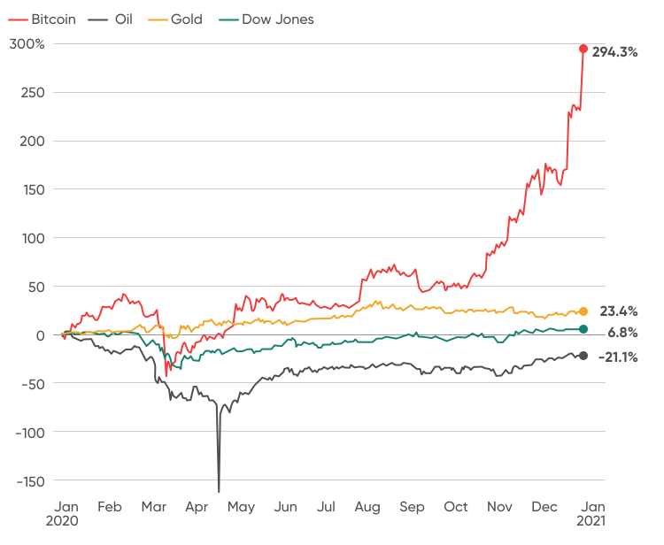

## Table of Contents

## What is gold and how is it traditionally used as a store of value?

Gold is a shiny, yellow metal that people have valued for thousands of years. It is rare, does not rust, and is easy to shape into jewelry or coins. Because of these qualities, people have used gold as money in many cultures. It's also used in small amounts in electronics and medicine, but most gold is kept as a valuable item.

Traditionally, gold has been used as a store of value because it keeps its worth over time. When people are worried about their money losing value, like during wars or economic problems, they often buy gold. They believe that even if paper money becomes worthless, gold will still be valuable. Countries used to back their money with gold, meaning you could trade paper money for gold, but this is less common now. Still, many people and banks keep gold as a safe way to save wealth.

## What is Bitcoin and how does it function as a digital currency?

Bitcoin is a type of digital money that you can use to buy things online. It was created in 2009 by someone using the name Satoshi Nakamoto. Unlike regular money from banks, Bitcoin doesn't have a central authority controlling it. Instead, it uses a technology called blockchain, which is like a public record book that keeps track of all Bitcoin transactions. Anyone can see this record, but it's very hard to change or cheat the system.

To use Bitcoin, you need a digital wallet where you can store your Bitcoins. You can get Bitcoins by buying them with regular money, or you can earn them by solving complex math problems, a process called mining. When you want to send Bitcoin to someone, you use your wallet to create a transaction, which then gets added to the blockchain. This way, everyone can see that the Bitcoin was sent from your wallet to someone else's. Because Bitcoin is digital and not controlled by any one person or group, it can be used anywhere in the world, but it can also be risky because its value can go up and down a lot.

## How does the supply of gold compare to the supply of Bitcoin?

The supply of gold is different from Bitcoin because gold comes from the earth. People find gold by mining it from rocks and soil. The total amount of gold in the world grows slowly because it takes a lot of work to find and dig up new gold. Scientists think there's a limit to how much gold is left to find, but we don't know exactly how much that is. So, the supply of gold can increase a little bit each year, but it's not something that can grow very fast.

Bitcoin, on the other hand, has a fixed supply that is controlled by computer code. There will only ever be 21 million Bitcoins in total. Right now, new Bitcoins are created through a process called mining, where people use computers to solve hard math problems. The number of new Bitcoins created gets smaller over time, and eventually, no more new Bitcoins will be made. This means that unlike gold, the total supply of Bitcoin is known and will not change after it reaches 21 million.

## What are the key differences in the accessibility and ownership of gold versus Bitcoin?

Gold and Bitcoin have different ways of being owned and accessed. Gold is a physical thing, so you can hold it in your hand. You can own gold by buying jewelry, coins, or bars, and you can keep it at home or in a safe place like a bank vault. To buy gold, you usually go to a store or a dealer. But because gold is heavy and hard to move, it can be tricky to take it with you if you need to travel or move to another country.

Bitcoin is different because it's digital. You own Bitcoin by having it in a digital wallet, which is like a special app or website. You can buy Bitcoin online from exchanges, which are like digital marketplaces. Because Bitcoin is not a physical thing, you can take it with you anywhere as long as you have your wallet information. This makes it easier to use Bitcoin all over the world without worrying about carrying heavy gold. But, you need to be careful with your digital wallet because if you lose the information or someone steals it, you could lose your Bitcoin.

## How do the costs and methods of storage for gold compare to those for Bitcoin?

Storing gold can be expensive and requires physical space. You can keep gold at home, but you need a safe place to store it because it's valuable and can be stolen. Some people choose to rent a safe deposit box at a bank, which costs money every year. If you have a lot of gold, you might need a bigger space, like a vault, which is even more expensive. Moving gold is also hard because it's heavy, and you might need insurance to protect it while it's being transported.

Storing Bitcoin is different because it's digital. You don't need a physical space, but you do need a digital wallet. There are different types of wallets: some are on your computer or phone, and some are online. Keeping Bitcoin on your own device is free, but you need to protect your device from hackers. If you use an online wallet, it might cost a small fee, but it's usually cheaper than storing gold. The main cost with Bitcoin is keeping your wallet safe, which might mean buying good security software or using a special hardware wallet that costs money.

## What are the historical price trends of gold and Bitcoin, and how do they correlate?

Gold has been used as a store of value for thousands of years, and its price has generally gone up over time, but it can have big ups and downs. During times of economic trouble, like wars or financial crises, the price of gold often goes up because people want to keep their money safe. For example, after the 2008 financial crisis, the price of gold went from around $700 per ounce to over $1,900 per ounce by 2011. But then it went down again and has been going up and down since. Overall, gold is seen as a safe place to keep money, but it can still change a lot.

Bitcoin is much newer, starting in 2009, and its price has been very wild. In the beginning, Bitcoin was worth almost nothing, but by 2017, it reached nearly $20,000. Then it crashed down to around $3,000 in 2018. Since then, it has gone up and down a lot, reaching over $60,000 in 2021 before falling and rising again. Bitcoin's price changes are much bigger and faster than gold's because it's a new and risky investment. When it comes to how gold and Bitcoin prices move together, they don't always go up or down at the same time. Sometimes, when people are worried about money, they might buy both gold and Bitcoin, but other times, Bitcoin might go up while gold stays the same or goes down.

## How do gold and Bitcoin perform as hedges against inflation and economic uncertainty?

Gold has been used for a long time as a way to protect money from losing value during inflation and economic problems. When prices go up and money loses value, people often buy gold because they think it will keep its worth. For example, during times like the 1970s when inflation was high, the price of gold went up a lot. Gold is seen as a safe place to keep money because it's rare and people have always wanted it. But even though gold can be a good hedge against inflation, its price can still go up and down a lot, so it's not always perfect.

Bitcoin is a newer way to try to protect money from inflation and economic trouble. Some people think Bitcoin can be a good hedge because there will only ever be 21 million Bitcoins, so it can't be printed more like paper money. During times of economic worry, like in 2020 when there was a lot of uncertainty because of the global health crisis, Bitcoin's price went up a lot. But Bitcoin is very risky because its price can change a lot in a short time. So, while some people see it as a way to keep money safe, it's not as proven as gold and can be a big gamble.

## What are the regulatory environments surrounding gold and Bitcoin in major economies?

Gold is seen as a safe and traditional way to keep money, so the rules about buying and selling gold are usually pretty clear in big countries. In the United States, you can buy and sell gold freely, but you need to report it if you have a lot of it. In Europe, countries have different rules, but you can usually buy and sell gold without too much trouble. In places like India and China, the government keeps a close eye on gold because it's very popular, and they might have rules about how much you can bring into the country or how you need to report it. Overall, gold is treated as a normal thing to own, but there are still some rules to follow.

Bitcoin is newer and more complicated when it comes to rules. In the United States, Bitcoin is treated as property for tax purposes, so you need to pay taxes when you make money from it. Some states have their own rules about how Bitcoin can be used. In Europe, different countries have different rules, with some being more open to Bitcoin than others. For example, Germany sees Bitcoin as a type of money, while other places might see it more like a thing you own. In countries like China, the government has made it hard to buy and sell Bitcoin, and they might even ban it at times. Because Bitcoin is digital and can be used all over the world, the rules can be confusing and change a lot.

## How do the transaction speeds and costs of gold and Bitcoin compare?

When you want to buy or sell gold, it can take a while and might cost you money. If you're trading gold with someone nearby, it might be quick, but if you're sending it far away, it can take days or even weeks. You might also need to pay for shipping and insurance to make sure the gold gets where it's going safely. Plus, if you go through a dealer or a bank, they might charge you a fee for their help. So, moving gold around can be slow and expensive.

Bitcoin transactions are usually faster than gold, but the speed can change a lot. If you send Bitcoin to someone else on the same network, it can happen in minutes. But if the network is busy, it might take longer, sometimes even hours. The cost of sending Bitcoin also changes; it depends on how busy the network is and how fast you want your transaction to go. You pay a fee to the people who help check and record your transaction on the blockchain. Sometimes these fees can be small, but during busy times, they can get pretty high. So, Bitcoin can be quicker than gold, but the costs can be unpredictable.

## What are the environmental impacts of mining gold versus mining Bitcoin?

Mining gold can be bad for the environment. When people dig for gold, they often use chemicals like mercury and cyanide to get the gold out of the rocks. These chemicals can pollute water and harm animals and plants. Also, mining gold makes a lot of waste, which can change the land and make it hard for anything to grow there. The machines used for mining use a lot of energy, which can add to air pollution. So, gold mining can hurt the environment in many ways.

Mining Bitcoin is different because it's done with computers, but it can still harm the environment. Bitcoin mining uses a lot of electricity because the computers have to solve hard math problems to create new Bitcoins. This electricity often comes from burning coal or other things that make the air dirty. Some people worry that Bitcoin mining uses too much energy and makes the world warmer. But, some Bitcoin miners are trying to use cleaner energy like wind or solar power to help the environment.

## How do institutional and retail investor behaviors differ between gold and Bitcoin markets?

Institutional investors, like big banks and funds, often see gold as a safe and traditional way to keep their money. They might buy gold when they think the economy is going to have problems because gold has been a good way to keep money safe for a long time. These big investors can buy a lot of gold at once and store it in safe places like vaults. They usually don't buy and sell gold very often because they are looking to keep their money safe over a long time. Retail investors, or regular people, might buy gold too, but they usually buy smaller amounts, like gold coins or jewelry. They might buy gold because they like it or because they want to keep their money safe, but they don't have as much money to spend on it as big investors.

Bitcoin is different because it's newer and riskier. Institutional investors are starting to get more interested in Bitcoin, but they are still careful because its price can change a lot. Some big investors might buy Bitcoin to try to make money quickly or because they think it will be important in the future. They might use special ways to buy and sell Bitcoin to try to make money from its price changes. Retail investors often buy Bitcoin because they think its price will go up a lot. They might buy and sell Bitcoin more often, trying to make money from its big price swings. Because Bitcoin is digital, it's easier for regular people to buy and sell it compared to gold, but it's also riskier.

## What advanced technical analysis tools can be used to predict future price movements of gold and Bitcoin?

To predict future price movements of gold, traders often use advanced technical analysis tools like moving averages, which help smooth out price data to identify trends over time. For example, a simple moving average (SMA) calculates the average price over a certain period, while an exponential moving average (EMA) gives more weight to recent prices. Another tool is the Relative Strength Index (RSI), which measures how fast and how much the price of gold is changing to see if it's overbought or oversold. Traders also use chart patterns like head and shoulders or double tops and bottoms to guess where the price might go next. These tools help traders make better guesses about whether the price of gold will go up or down.

For Bitcoin, the same technical analysis tools can be used, but because Bitcoin's price can change a lot more quickly, traders might use more advanced tools like Bollinger Bands, which show how much the price is moving around its average. If the price goes outside the bands, it might mean a big change is coming. Another tool is the Moving Average Convergence Divergence (MACD), which looks at the difference between two moving averages to spot when the price might change direction. Because Bitcoin is digital and traded all the time, traders can also use more real-time data and automated trading systems to make quick decisions. These tools help traders try to predict Bitcoin's price movements, but because it's so new and unpredictable, it's still very hard to guess right all the time.

## References & Further Reading

[1]: Baur, D. G., & Lucey, B. M. (2010). ["Is Gold a Hedge or a Safe Haven? An Analysis of Stocks, Bonds and Gold."](https://onlinelibrary.wiley.com/doi/10.1111/j.1540-6288.2010.00244.x) Financial Review, 45(2), 217-229.

[2]: Nakamoto, S. (2008). ["Bitcoin: A Peer-to-Peer Electronic Cash System."](https://nakamotoinstitute.org/library/bitcoin/) 

[3]: Gandal, N., & Halaburda, H. (2016). ["Can We Predict the Winner in a Market with Network Effects? Competition in Cryptocurrency Market."](https://papers.ssrn.com/sol3/papers.cfm?abstract_id=2832836) Games, 7(3), 16.

[4]: Treleaven, P., Galas, M., & Lalchand, V. (2013). ["Algorithmic Trading Review."](https://dl.acm.org/doi/10.1145/2500117) Journal of Simulation, 7(3), 199-215.

[5]: World Gold Council. ["Gold as a Strategic Asset."](https://www.gold.org/goldhub/research/relevance-of-gold-as-a-strategic-asset)

[6]: Yermack, D. (2015). ["Is Bitcoin a Real Currency? An Economic Appraisal."](https://www.sciencedirect.com/science/article/pii/B9780128021170000023) Journal of Economic Perspectives, 29(2), 213-238.

[7]: ["Algorithmic and High-Frequency Trading."](https://www.cambridge.org/us/universitypress/subjects/mathematics/mathematical-finance/algorithmic-and-high-frequency-trading) by Álvaro Cartea, Sebastian Jaimungal, and José Penalva.