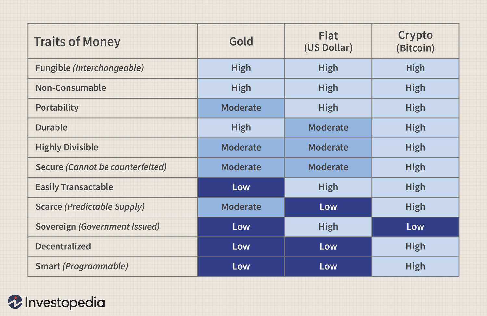

In the modern digital era, investment strategies are continuously evolving, reflecting the dynamic nature of economic landscapes. This article explores the trinity of investment avenues: Gold, Bitcoin, and Algorithmic Trading. Each component signifies a unique paradigm within the multifaceted world of investments, presenting a spectrum of risks and opportunities. Gold has long been considered a traditional safe haven, prized for its intrinsic value and historical significance. On the other hand, Bitcoin represents the digital revolution, introducing decentralization and digital scarcity as appealing factors for investors with a high-risk appetite. Lastly, algorithmic trading epitomizes the future of investing, leveraging advanced data analytics to optimize trading strategies.

Understanding the complex interactions between these investment options can afford investors a comprehensive view, allowing for more informed strategic decisions. These assets are not just isolated entities; they can potentially complement each other, providing balance and diversification within a portfolio. Investors today must be agile and informed to harness the potential of these diverse investment opportunities effectively. By examining these components individually and collectively, we can gain insights into how they might shape the financial future amid ever-evolving market dynamics and technological advancements. As we progress, the objective is to explore the nuances of these investment avenues and their potential impact on our economic landscape.



## Table of Contents

## Gold: The Traditional Safe Haven

Gold has long been esteemed as a reliable store of value, particularly during periods of economic uncertainty. Its appeal is largely due to its intrinsic value, which arises from its unique physical properties and limited supply. Gold's scarcity ensures that it cannot be easily devalued by overproduction, making it a favorite among investors who prioritize stability and security over high returns.

Historically, the performance of gold during financial crises has reinforced its reputation as a safe haven asset. For instance, during the global financial crisis of 2008, gold prices surged as investors flocked to tangible assets amidst declining confidence in financial markets. According to data from the World Gold Council, gold's price increased by over 25% from 2007 to 2008, illustrating its resilience and appeal during economic turbulence.

The demand for gold has also been buoyed by innovations in gold trading, particularly with the advent of exchange-traded funds (ETFs). Gold ETFs provide a cost-effective and convenient way for investors to gain exposure to gold without the need to physically store the metal. This innovation has democratized access to gold investments, allowing even small-scale investors to include gold in their portfolios.

Despite the emergence of modern investment avenues, such as cryptocurrencies and high-frequency trading, gold maintains its position as an essential component of diversified investment portfolios. It acts as a hedge against inflation and currency fluctuations, offering a counterbalance to more volatile investment options. This role is underscored by the principles of modern portfolio theory, which advocates for diversification as a means to reduce risk.

In conclusion, gold's enduring appeal can be attributed to its intrinsic value, historical performance during financial crises, and increased accessibility through ETFs. As investors continue to navigate the complexities of the financial markets, gold remains a steadfast option for those seeking stability and lower risk exposure. While new investment opportunities continue to arise, gold's status as a traditional safe haven is likely to persist.

## Bitcoin: The Digital Revolution

Bitcoin introduces a groundbreaking asset class defined by decentralization and digital scarcity. As a decentralized currency, Bitcoin operates on a peer-to-peer network, allowing transactions to occur without intermediaries like banks. This decentralization is underpinned by blockchain technology, a distributed ledger that records all Bitcoin transactions. Blockchain ensures transparency, security, and immutability, making it a fundamental component of Bitcoin's infrastructure.

Bitcoin's digital scarcity is achieved through a capped supply of 21 million coins. This finite supply contrasts with traditional fiat currencies, which can be subject to inflationary pressures due to central bank policies. As such, Bitcoin is often considered a potential hedge against inflation, appealing to investors concerned with preserving the purchasing power of their assets. Despite its potential advantages, Bitcoin's relevance in the current financial system is an ongoing debate among economists, policymakers, and investors.

The volatile nature of Bitcoin is another defining characteristic that attracts high-risk tolerant investors. Price fluctuations can be dramatic; for instance, Bitcoin's value increased from approximately $10,000 in mid-2020 to over $60,000 in early 2021. Such [volatility](/wiki/volatility-trading-strategies) presents opportunities for substantial returns, but it also involves significant risk. Investors need to weigh their tolerance for sharp price movements against the potential for gain.

Bitcoin's growth trajectory is often linked to technological advancements and regulatory developments. For example, the growing acceptance of blockchain technology in industries such as finance, supply chain, and healthcare contributes to the increasing adoption of Bitcoin. Additionally, regulatory decisions play a crucial role in shaping Bitcoin's investment landscape. Jurisdictions that implement favorable regulations can encourage institutional investment, while stringent regulations may suppress its adoption.

Understanding Bitcoin's role in investment requires a nuanced examination of market sentiment and technological fundamentals. Market sentiment is influenced by factors such as media coverage, macroeconomic trends, and geopolitical events. Technically, Bitcoin's underlying blockchain technology offers potential beyond currency, including applications in smart contracts and decentralized finance (DeFi).

In conclusion, Bitcoin represents a digital revolution in asset classes by combining decentralization, digital scarcity, and technological innovation. Its impact on investment strategies continues to evolve, driven by broader trends in technology and regulation. Investors interested in Bitcoin must assess these dynamics carefully, considering the risks and opportunities presented by this volatile yet potentially lucrative asset.

## Algorithmic Trading: The Future of Investing

Algorithmic trading utilizes complex algorithms to automate trading strategies, offering significant speed and operational efficiency over traditional manual trading methods. By harnessing the power of algorithms, traders can execute large volumes of trades across various markets in milliseconds, a feat impossible for human traders to achieve consistently. This automated approach allows for the rapid processing of market information and the execution of trades based on predefined criteria, minimizing the influence of emotion and human error.

At its core, [algorithmic trading](/wiki/algorithmic-trading) leverages vast datasets and advanced computational techniques to analyze market behavior and predict future trends. By incorporating statistical models and [machine learning](/wiki/machine-learning) algorithms, it can identify profitable opportunities and optimize trading performance. For instance, algorithms might use historical price data and technical indicators to forecast market movements. An example of a simple trading strategy could be a moving average crossover, where a short-term moving average crosses above a long-term moving average, signaling a buy opportunity.

As algorithmic trading gains popularity, its application spreads across various asset classes, including traditional markets like equities and bonds, as well as commodities like gold and emerging digital assets such as cryptocurrencies. This diversification enables traders to capitalize on different market dynamics and hedge against risks. In cryptocurrencies, for example, algorithmic trading tools can help navigate the volatile market conditions by executing timely trades based on rapid changes in price and [volume](/wiki/volume-trading-strategy).

However, reliance on technology and data quality presents certain risks. Poor data can lead to incorrect predictions, and technical glitches in trading algorithms can result in significant financial losses. Additionally, the complexity of these systems requires robust risk management frameworks and thorough testing to ensure reliability and accuracy. Investors must remain vigilant to the potential pitfalls associated with algorithmic trading, including market overfitting, where models are tailored too closely to historical data and fail to perform in future market conditions.

Success stories in algorithmic trading often involve firms that have developed high-frequency trading systems capable of exploiting minute market inefficiencies. For instance, firms like Renaissance Technologies have been renowned for their Medallion Fund, which uses sophisticated quantitative techniques to achieve consistently high returns. Conversely, failures, such as the 2012 Knight Capital Group incident, highlight the importance of thorough testing and risk management. Knight Capital lost $440 million in just 45 minutes due to a software glitch that led to erroneous trades, underscoring the need for rigorous controls.

In conclusion, while algorithmic trading presents significant opportunities for enhanced financial returns, it demands a deep understanding of both its technological and market aspects. Success in this field depends on the ongoing refinement of trading algorithms, robust data management, and comprehensive risk assessment processes. As technology evolves, so too will the practices of algorithmic trading, offering further potential for innovation and efficiency in the investment landscape.

## Synergies and Considerations

Combining gold, Bitcoin, and algorithmic trading presents a unique investment strategy that offers diversification potentially leading to enhanced profitability. By leveraging each asset's unique characteristics—gold's historical stability, Bitcoin's speculative potential, and algorithmic trading's efficiency—investors can aim for a balanced portfolio that mitigates risks while capturing growth opportunities.

### Innovative Platforms
Technological platforms have evolved to enable the seamless integration of different assets into comprehensive algorithmic trading strategies. These platforms use advanced algorithms to manage various assets dynamically, adapting to real-time market conditions. This integration is facilitated through APIs (Application Programming Interfaces) that connect to various exchanges and data sources, offering flexibility in strategy formulation and execution across asset classes.

### Risk Tolerance, Goals, and Market Conditions
Investors are advised to carefully consider their risk tolerance and financial objectives when integrating these elements. Gold typically serves risk-averse investors looking for long-term stability, while Bitcoin appeals to those with a higher risk appetite seeking volatility-driven gains. Algorithmic trading, on the other hand, can suit a broad spectrum of investors by tailoring strategies to specific risk and return goals. The key is to align asset allocation with individual investment horizons and market forecasts.

### Regulatory and Market Considerations
For a successful investment strategy, understanding the regulatory landscape and market dynamics is crucial. Regulatory frameworks for gold are generally well-established, while Bitcoin's regulatory environment is still evolving and can impact its market behavior unpredictably. Algorithmic trading further adds complexity with specific compliance requirements and ethical considerations, such as preventing market manipulation. Staying informed on these issues is critical for investors to protect their interests and adhere to legal standards.

### Optimization of Portfolio Allocation and Risk Management
Strategists can optimize portfolio allocation by analyzing historical data and predictive analytics. Utilizing modern tools like machine learning, investors can [carry](/wiki/carry-trading) out data-driven optimization to adjust asset weightings and improve returns. An example Python approach might include [backtesting](/wiki/backtesting) various asset combinations using libraries such as Pandas and NumPy to simulate historical performance. The code snippet below demonstrates how investors can use Python for such analysis:

```python
import pandas as pd
import numpy as np
from scipy.optimize import minimize

# Sample asset returns data
data = pd.DataFrame({
    'Gold': np.random.normal(0.001, 0.01, 100),
    'Bitcoin': np.random.normal(0.002, 0.05, 100),
    'Algo_Trading': np.random.normal(0.0015, 0.02, 100)
})

# Function to calculate portfolio variance
def portfolio_variance(weights, cov_matrix):
    return np.dot(weights.T, np.dot(cov_matrix, weights))

# Target to minimize the portfolio variance
def minimize_variance(data):
    cov_matrix = data.cov()
    num_assets = len(data.columns)
    args = (cov_matrix,)
    constraints = {'type': 'eq', 'fun': lambda weights: np.sum(weights) - 1}
    bounds = tuple((0, 1) for _ in range(num_assets))
    result = minimize(portfolio_variance, num_assets * [1.0 / num_assets,], args=args, constraints=constraints, bounds=bounds)
    return result.x

# Optimal asset weightings
optimal_weights = minimize_variance(data)
print("Optimal Portfolio Weights:", optimal_weights)
```

This Python code assists in determining optimal asset allocations by minimizing portfolio variance based on historical data, ensuring balanced exposure to gold, Bitcoin, and algorithmic trading strategies. By understanding and applying these insights, investors can enhance risk management and foster more robust financial growth.

## Conclusion

The investment landscape is undergoing significant transformations driven by technological advancements and evolving market dynamics. These changes have presented investors with a multitude of new opportunities and challenges, particularly in areas such as gold, Bitcoin, and algorithmic trading. To effectively navigate these complex environments, investors must remain adaptable and well-informed.

A critical aspect of successful investment is educating oneself about the various asset classes and trading methodologies. Understanding the characteristics, risks, and potential returns of each investment type can significantly enhance decision-making processes. For instance, while gold offers stability as a traditional safe haven, Bitcoin provides a high-risk, high-reward prospect due to its digital and decentralized nature. Algorithmic trading, on the other hand, utilizes technology to optimize investment strategies through speed and efficiency.

Achieving success in the investment world often necessitates a balanced approach. Incorporating both personal investment objectives and market trends allows investors to tailor their strategies to best suit their goals. This balance reduces risk and increases the likelihood of achieving desired financial outcomes. It is essential for investors to continuously assess both their personal circumstances and broader market conditions.

As the financial sector continues to evolve, maintaining a state of informed agility will be a key component of long-term investment success. Staying updated on technological innovations, regulatory changes, and market trends will permit investors to adapt their strategies proactively. Ultimately, the ability to pivot in response to changing conditions will distinguish successful investors in a rapidly transforming financial landscape.

## References & Further Reading

[1]: Baur, D. G., & Lucey, B. M. (2010). ["Is Gold a Hedge or a Safe Haven? An Analysis of Stocks, Bonds and Gold."](https://onlinelibrary.wiley.com/doi/10.1111/j.1540-6288.2010.00244.x) Financial Review, 45(2), 217-229.

[2]: Nakamoto, S. (2008). ["Bitcoin: A Peer-to-Peer Electronic Cash System."](https://nakamotoinstitute.org/library/bitcoin/) 

[3]: Gandal, N., & Halaburda, H. (2016). ["Can We Predict the Winner in a Market with Network Effects? Competition in Cryptocurrency Market."](https://papers.ssrn.com/sol3/papers.cfm?abstract_id=2832836) Games, 7(3), 16.

[4]: Treleaven, P., Galas, M., & Lalchand, V. (2013). ["Algorithmic Trading Review."](https://dl.acm.org/doi/10.1145/2500117) Journal of Simulation, 7(3), 199-215.

[5]: World Gold Council. ["Gold as a Strategic Asset."](https://www.gold.org/goldhub/research/relevance-of-gold-as-a-strategic-asset)

[6]: Yermack, D. (2015). ["Is Bitcoin a Real Currency? An Economic Appraisal."](https://www.sciencedirect.com/science/article/pii/B9780128021170000023) Journal of Economic Perspectives, 29(2), 213-238.

[7]: ["Algorithmic and High-Frequency Trading."](https://www.cambridge.org/us/universitypress/subjects/mathematics/mathematical-finance/algorithmic-and-high-frequency-trading) by Álvaro Cartea, Sebastian Jaimungal, and José Penalva.