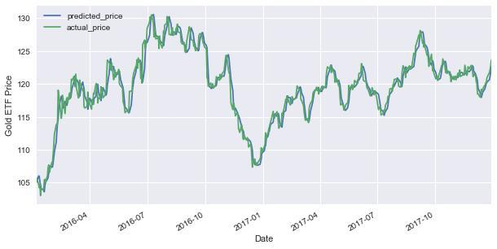

Gold has long been a symbol of wealth and financial stability, making it an attractive asset for investors, especially during times of market uncertainty and volatility. Over centuries, gold has maintained its value and reputation as a safe haven, drawing interest from those seeking to mitigate risks associated with the broader financial markets. Investors often turn to gold for its potential ability to serve as a hedge against inflation and currency devaluation, given its historical performance during economic downturns.

Two prominent investment vehicles provide access to the gold market: gold Futures and gold Exchange-Traded Funds (ETFs). Each offers distinct advantages and poses different risks. Gold Futures allow investors to engage in contracts to buy or sell gold at a predetermined future date and price, offering leverage and flexibility that can lead to significant gains or losses depending on market developments. Meanwhile, gold ETFs are investment funds traded on stock exchanges that track the price of gold, providing a more accessible and diversified avenue for investing without the need to physically own the metal.



The decision between these two instruments largely depends on individual investment goals and risk tolerance. While some may prefer the speculative and potentially lucrative nature of Futures, others might opt for the stability and simplicity of ETFs. As the landscape of investment strategies continues to evolve, algorithmic trading has begun playing a pivotal role in enhancing the efficiency and effectiveness of these gold investment vehicles. This article will explore and compare the intricacies of gold Futures and ETFs, while also examining how algorithmic trading is reshaping the approach to investing in gold.

## Table of Contents

## Understanding Gold Futures

Gold Futures are standardized contracts through which two parties agree to exchange a specified quantity of gold at a predetermined price on a future date. These contracts are traded on regulated exchanges, such as the Chicago Mercantile Exchange (CME), which ensures transparency and accessibility for investors. By engaging in gold futures trading, investors do not take physical possession of gold; instead, they speculate on future price movements, aiming to gain from fluctuations in the market price of gold.

One notable advantage of gold futures is the leverage they offer. Leverage allows investors to control a larger position in gold with a relatively small amount of capital. For instance, if an investor holds a futures contract requiring a margin deposit of 10%, they can control $100,000 worth of gold with just $10,000. This amplification of buying power enhances the potential for profit, although it equally magnifies potential losses – a critical risk [factor](/wiki/factor-investing) for investors.

Gold futures are characterized by high liquidity, a result of being actively traded on major exchanges. High liquidity ensures that investors can buy or sell contracts with minimal price disturbance and at narrow bid-ask spreads, facilitating efficient entry and exit from positions.

In addition, gold futures are commonly used as a hedging tool to mitigate price risk. For instance, mining companies or jewelers can lock in future gold prices to shield themselves from unfavorable price movements. This feature is especially beneficial in volatile markets where price predictability is low.

However, the leverage inherent in futures trading exposes investors to significant risks. If the market moves against their position, investors may be required to post additional margin, leading to potential margin calls. Failure to meet these calls can result in mandatory liquidation of positions at a loss.

Overall, the leverage, [liquidity](/wiki/liquidity-risk-premium), and hedging capabilities of gold futures make them an attractive option for both speculators and those seeking to manage price exposure. However, the substantial risks associated with leverage necessitate a thorough understanding and careful consideration before engaging in futures trading.

## Understanding Gold ETFs

Gold Exchange-Traded Funds (ETFs) are popular investment vehicles that allow individuals to gain exposure to the gold market without the need to physically own and store the precious metal. Gold ETFs function similarly to stocks in that they are traded on major stock exchanges, providing investors with a convenient and liquid means to invest in gold. Most Gold ETFs aim to track the price of gold by holding either physical gold or gold-related assets such as futures contracts.

One of the primary advantages of investing in Gold ETFs is the ease with which they can be purchased and sold. Because they are listed on stock exchanges, investors can trade Gold ETFs as easily as they would any other stock, facilitating quick entry and [exit](/wiki/exit-strategy) from positions. This liquidity can be particularly beneficial in volatile markets, where the ability to react swiftly is advantageous.

Gold ETFs also offer a cost-effective way to invest in gold. Unlike purchasing physical gold, which can incur additional costs for storage and insurance, Gold ETFs typically have lower overall expenses. However, investors should be aware that these funds come with management fees, which can vary depending on the specific [ETF](/wiki/etf-trading-strategies) and its management structure.

Additionally, Gold ETFs can provide diversification within an investment portfolio. As gold generally behaves differently from equities or bonds, including Gold ETFs can help spread risk and stabilize a portfolio's overall performance. Despite their benefits, potential investors should be cautious of possible liquidity risks. While Gold ETFs are generally liquid, market conditions can affect their tradability.

In conclusion, Gold ETFs present an accessible and efficient avenue for investors to engage with the gold market, combining the benefits of liquidity, cost-effectiveness, and diversification. However, it is crucial for investors to consider management fees and market conditions to assess the overall suitability of Gold ETFs in their investment strategy.

## Comparing Gold Futures and Gold ETFs

Gold Exchange-Traded Funds (ETFs) and Gold Futures represent two distinct approaches to investing in gold, each catering to different investor profiles and financial strategies.

Gold ETFs, which are traded on stock exchanges like traditional stocks, provide a more straightforward entry point into the gold market. They are particularly appealing to long-term investors seeking a stable, lower-risk investment avenue. By investing in gold ETFs, individuals gain exposure to the price movements of gold without managing the physical asset. This approach offers ease of buying and selling, as well as the potential to diversify investment portfolios with a single transaction. However, investors must account for management fees associated with ETFs, although these are typically lower than actively managed funds.

On the other hand, Gold Futures are leveraged contracts that enable investors to agree on the purchase or sale of gold at a specified price on a future date. This option allows for substantial leverage, making it attractive to traders who wish to profit from short-term price fluctuations in the gold market. However, the leveraged nature of futures can exacerbate both gains and losses, posing significant risks to investors with a lower risk tolerance. Gold Futures necessitate a thorough understanding of market dynamics and require constant monitoring, along with a readiness to meet margin requirements.

Tax implications also differ between these two investment vehicles. For Gold ETFs, investors face capital gains tax upon selling shares, which is influenced by the holding period. Conversely, profits from Gold Futures are typically treated as 60% long-term and 40% short-term capital gains, irrespective of the holding period, under the IRS "60/40 rule" in the U.S.

Cost structures also vary. While ETFs are subject to expense ratios that cover management and operational costs, futures trading involves commissions, exchange fees, and the potential for margin calls, which can increase the overall investment cost.

In summary, when comparing Gold ETFs and Gold Futures, investors need to carefully consider their investment horizon, risk appetite, tax circumstances, and cost structures. Each option presents unique advantages and challenges, necessitating a strategic approach tailored to individual financial goals and resources.

## The Role of Algorithmic Trading in Gold Investments

Algorithmic trading in gold investments employs sophisticated algorithms and computer programs to execute trades at velocities and frequencies that surpass human capabilities. This approach leverages large datasets and statistical models to predict market behavior and capitalize on price fluctuations in the gold market. By using algorithms, traders can automate the decision-making process, reducing the influence of human emotions, which often lead to suboptimal trading decisions.

In gold investments, algorithms can be designed to monitor and analyze a multitude of market indicators, including historical price data, trading volumes, macroeconomic news, and even geopolitical events. These algorithms can quickly identify patterns and trends and execute trades at optimal times, potentially outperforming traditional trading methods.

For instance, in a basic moving average crossover strategy often used in [algorithmic trading](/wiki/algorithmic-trading), an algorithm could be programmed to buy gold futures or ETFs when a short-term moving average crosses above a long-term moving average, signaling a potential upward trend. Conversely, it could sell when the short-term moving average crosses below the long-term moving average, indicating a downward trend. This strategy can be implemented in Python as follows:

```python
import pandas as pd

# Load historical gold prices
data = pd.read_csv('gold_prices.csv')
data['Short_MA'] = data['Close'].rolling(window=50).mean()  # Short-term moving average
data['Long_MA'] = data['Close'].rolling(window=200).mean()  # Long-term moving average

# Generate buy and sell signals
data['Signal'] = 0.0
data['Signal'][50:] = np.where(data['Short_MA'][50:] > data['Long_MA'][50:], 1.0, 0.0)   
data['Position'] = data['Signal'].diff()
```

This simplistic model illustrates how algorithms can automate the trading process based on predefined criteria. Moreover, the high-speed nature of algorithmic trading allows for exploiting [arbitrage](/wiki/arbitrage) opportunities and executing trades with minimal delay, enhancing the potential for higher returns.

Furthermore, algorithmic trading systems offer increased efficiency not only by executing trades rapidly but also by managing risk through diversification strategies. Algorithms can be configured to rebalance portfolios dynamically, ensuring that exposure to any single asset or market condition remains within acceptable limits. This risk management capability is particularly beneficial in the gold market, known for its [volatility](/wiki/volatility-trading-strategies).

In summary, algorithmic trading in gold investments enhances efficiency, reduces emotional bias, and potentially increases returns by leveraging data analysis and automated trade execution. As technology continues to advance, the role of algorithmic trading in the financial markets, including gold investments, is expected to expand further.

## Conclusion

Both Gold Futures and Gold ETFs offer distinctive advantages and pose challenges for investors looking to gain exposure to the gold market. Gold Futures provide a leveraged approach that can amplify gains but also increases potential losses, making them more suitable for investors with a higher risk tolerance and a focus on short-term price movements. The futures market demands substantial investor attention and the capacity to manage margin requirements, which implies a commitment of both time and resources.

On the other hand, Gold ETFs offer a more straightforward and accessible means to invest in gold, appealing to long-term investors seeking lower risk and ease of entry. ETFs allow for diversification and entail lower transaction costs compared to the futures market, yet they incur management fees and can face liquidity constraints, particularly in turbulent markets.

The decision between Gold Futures and Gold ETFs should align with the investor's financial goals and risk profile. Investors with an appetite for higher risk and the necessary expertise might prefer the speculative potential of futures, while those looking for a stable and manageable investment might choose ETFs.

Integrating algorithmic trading strategies into gold investments can further enhance their profitability by optimizing trade execution and managing risks effectively. Algorithmic systems are capable of analyzing vast amounts of market data and executing trades at optimal moments, thereby increasing efficiency and removing emotional bias from trading decisions. The potential for improved returns, however, requires a thorough understanding of algorithmic trading and sufficient technical infrastructure to implement these strategies effectively. As such, investors should weigh the benefits of algorithmic trading against their capacity to develop and maintain such systems within their gold investment strategy.

## References & Further Reading

[1]: Bodie, Z., Kane, A., & Marcus, A. J. (2014). ["Investments"](https://www.mheducation.com/highered/product/Investments-Bodie.html). McGraw-Hill Education.

[2]: Hull, J. C. (2017). ["Options, Futures, and Other Derivatives"](https://www.semanticscholar.org/paper/Options%2C-Futures%2C-and-Other-Derivatives-Hull/89bdee500c8623864fc9eb7a471546aa713acc44). Pearson.

[3]: Baur, D. G., & Lucey, B. M. (2010). ["Is Gold a Hedge or a Safe Haven? An Analysis of Stocks, Bonds and Gold."](https://onlinelibrary.wiley.com/doi/10.1111/j.1540-6288.2010.00244.x) Financial Review, 45(2), 217-229.

[4]: BlackRock. (2021). ["Understanding iShares Gold Trust."](https://www.blackrock.com/us/individual/products/239561/ishares-gold-trust-fund)

[5]: CME Group. ["Understanding Futures Contracts."](https://www.cmegroup.com/education/courses/introduction-to-futures/definition-of-a-futures-contract.html)  

[6]: Chan, E. (2013). ["Algorithmic Trading: Winning Strategies and Their Rationale"](https://github.com/ftvision/quant_trading_echan_book). John Wiley & Sons.