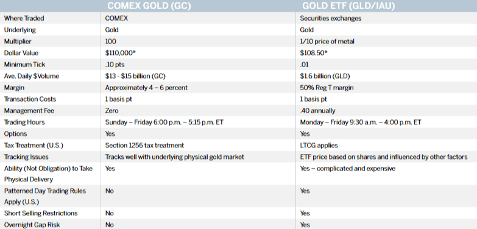

## Table of Contents

## What are Gold ETFs and how do they work?

Gold ETFs, or Exchange Traded Funds, are a type of investment that allows you to invest in gold without actually having to buy and store physical gold. Instead, when you buy shares of a Gold ETF, you are buying into a fund that holds gold or gold-related assets. This makes it easier and more convenient for people to invest in gold, as they can buy and sell shares of the ETF through a brokerage account, just like they would with stocks.

Gold ETFs work by tracking the price of gold. The value of the ETF's shares goes up and down based on the current market price of gold. This means that if the price of gold goes up, the value of your Gold ETF shares will likely go up as well, and if the price of gold goes down, the value of your shares will likely go down. Gold ETFs can be a good way to diversify your investment portfolio and potentially protect against inflation, as gold is often seen as a safe-haven asset during times of economic uncertainty.

## What are Gold Futures and how do they work?

Gold Futures are contracts that let you buy or sell gold at a set price on a specific date in the future. They are traded on futures exchanges, like the COMEX, which is part of the Chicago Mercantile Exchange. When you buy a gold futures contract, you're agreeing to buy gold at the price set in the contract when it expires. If the price of gold goes up before the contract expires, you can make money. But if the price goes down, you could lose money.

Using gold futures can be a way to bet on where you think the price of gold is going. They are often used by investors and businesses that want to protect themselves against changes in gold prices. For example, a jewelry maker might use gold futures to lock in a price for gold they need in the future, so they know what their costs will be. But trading futures can be risky because you might have to put up a lot of money if the price moves against you.

## How do the investment processes for Gold ETFs and Gold Futures differ?

Investing in Gold ETFs is pretty straightforward. You buy shares of the [ETF](/wiki/etf-trading-strategies) through a brokerage account, just like you would with stocks. The price of the ETF goes up and down with the price of gold. So, if you think gold prices will go up, you can buy shares of a Gold ETF and hopefully make money if the price of gold rises. You don't have to worry about storing physical gold, and it's easy to buy and sell the ETF shares whenever you want.

On the other hand, investing in Gold Futures is a bit more complicated. When you buy a Gold Futures contract, you're agreeing to buy or sell gold at a set price on a specific date in the future. This means you're betting on where you think the price of gold will be at that future date. If you're right and the price goes up, you can make money. But if you're wrong and the price goes down, you could lose money. Trading futures can be risky because you might have to put up more money if the price moves against you, and it's not as easy to get in and out of these investments as it is with ETFs.

In summary, Gold ETFs are simpler and more accessible for most investors because they work a lot like buying stocks. Gold Futures, however, are more complex and can be riskier, but they offer the potential for higher returns if you're willing to take on that risk. Both can be good ways to invest in gold, but they suit different types of investors and investment strategies.

## What are the typical costs associated with investing in Gold ETFs?

When you invest in Gold ETFs, you'll usually have to pay a few different costs. One of the main costs is the expense ratio, which is a yearly fee that the ETF charges to cover its operating costs. This fee is a percentage of the money you have invested in the ETF. For example, if the expense ratio is 0.50%, you'll pay $50 a year for every $10,000 you have invested. The expense ratio can vary from one Gold ETF to another, so it's a good idea to compare them before you decide which one to buy.

Another cost to think about is the trading commission. Some brokerages charge a fee every time you buy or sell shares of an ETF. This fee can be a few dollars per trade, and it can add up if you trade a lot. Not all brokerages charge trading commissions, though, so you might be able to find one that lets you trade for free. Lastly, there might be bid-ask spreads, which is the difference between the highest price someone is willing to pay for the ETF and the lowest price someone is willing to sell it for. This isn't a direct cost, but it can affect how much you actually pay when you buy or sell the ETF.

## What are the typical costs associated with investing in Gold Futures?

When you invest in Gold Futures, you'll have to pay a few different costs. One of the main costs is the brokerage commission. This is a fee that you pay to your broker every time you buy or sell a futures contract. The amount can vary depending on the broker, but it's usually a few dollars per contract. Another cost to keep in mind is the exchange fee, which is charged by the futures exchange, like the COMEX, for each trade you make. This fee is usually small, but it can add up if you trade a lot.

Another important cost to consider is margin interest. When you trade futures, you usually have to put down a small amount of money, called the initial margin, to open a position. If the price of gold moves against you, you might have to put up more money, called a margin call, to keep your position open. If you're borrowing money to meet these margin calls, you'll have to pay interest on the borrowed amount. This can make trading futures more expensive, especially if the market is moving a lot.

## How do the risk profiles of Gold ETFs and Gold Futures compare?

Gold ETFs are generally seen as less risky than Gold Futures. When you invest in a Gold ETF, you're buying into a fund that holds gold or gold-related assets. The value of your investment goes up and down with the price of gold, but you don't have to worry about things like margin calls or borrowing money. This makes Gold ETFs a more straightforward and less risky way to invest in gold. However, like any investment, the value of a Gold ETF can still go down if the price of gold drops, so there is still some risk involved.

Gold Futures, on the other hand, are much riskier. When you buy a Gold Futures contract, you're agreeing to buy or sell gold at a set price in the future. This means you're betting on where you think the price of gold will be at that future date. If you're wrong and the price moves against you, you could lose a lot of money, especially if you have to put up more money to meet margin calls. Trading futures can be complicated and involves a lot of risk, so it's usually best for experienced investors who understand how futures work and are willing to take on that risk.

## What are the liquidity differences between Gold ETFs and Gold Futures?

Gold ETFs are usually pretty easy to buy and sell. They trade on stock exchanges just like stocks, so you can buy or sell them whenever the market is open. This makes Gold ETFs very liquid, meaning you can get in and out of your investment quickly. The price you get when you buy or sell a Gold ETF is usually very close to the actual value of the gold it holds, so you don't have to worry about big differences between what you want to pay and what you actually end up paying.

Gold Futures can also be pretty liquid, but it can be a bit trickier. They trade on futures exchanges, and while there are usually a lot of people buying and selling futures, the [liquidity](/wiki/liquidity-risk-premium) can change depending on the specific contract you're looking at. Some futures contracts are more popular and easier to trade than others. Also, because futures contracts have an expiration date, you might need to roll over your contract to a new one if you want to keep your investment going, which can add a bit more complexity and affect the liquidity.

## How does the tax treatment vary between Gold ETFs and Gold Futures?

The tax treatment for Gold ETFs can be different depending on where you live, but generally, they are treated like other types of investments. If you hold a Gold ETF for more than a year before selling it, any profit you make is usually taxed at a lower long-term capital gains rate. If you sell it within a year, the profit is taxed as regular income, which might be higher. Also, some Gold ETFs might give you dividends, and these are usually taxed as regular income too. It's a good idea to talk to a tax advisor to understand how your specific situation might be affected.

Gold Futures have a different tax treatment. When you trade futures, any profits or losses are usually treated as 60% long-term and 40% short-term capital gains, no matter how long you hold the contract. This is called the 60/40 rule, and it can be a bit of a tax advantage because the long-term rate is usually lower than the short-term rate. But, if you're trading futures a lot, you might have to pay something called the wash-sale rule, which can affect how you report your gains and losses. Again, it's smart to talk to a tax professional to get the full picture on how futures are taxed in your situation.

## What are the advantages of investing in Gold ETFs over Gold Futures?

Investing in Gold ETFs is simpler and less risky than trading Gold Futures. When you buy a Gold ETF, you're basically buying a piece of a fund that holds gold or gold-related stuff. You don't have to worry about complicated things like margin calls or borrowing money, which can happen with futures. Plus, ETFs are easy to buy and sell, just like stocks, so you can get in and out of your investment whenever you want. This makes Gold ETFs a good choice if you want to invest in gold without all the extra hassle and risk.

Another advantage of Gold ETFs is that they are usually taxed in a way that's easier to understand. If you hold an ETF for more than a year, any profit you make is taxed at a lower rate. This can be simpler than the tax rules for futures, which can be a bit tricky because of the 60/40 rule. Plus, with ETFs, you don't have to worry about things like the wash-sale rule, which can make your taxes more complicated if you're trading futures a lot. So, if you want a straightforward way to invest in gold with less risk and simpler taxes, Gold ETFs might be the better choice for you.

## What are the advantages of investing in Gold Futures over Gold ETFs?

One advantage of investing in Gold Futures is that they can offer higher potential returns. When you buy a Gold Futures contract, you're betting on where the price of gold will be in the future. If you guess right and the price goes up, you can make a lot more money compared to just buying gold through an ETF. Futures also let you use leverage, which means you can control a big amount of gold with just a small amount of money. This can make your profits bigger if the price goes your way, but it also makes the risk bigger if the price goes against you.

Another advantage of Gold Futures is the way they are taxed. With futures, any profits you make are treated as 60% long-term and 40% short-term capital gains, no matter how long you hold the contract. This can be a good thing because the long-term rate is usually lower than the short-term rate. So, even if you're trading futures a lot, you might end up paying less in taxes compared to if you were trading ETFs. But remember, trading futures can be tricky and risky, so it's usually best for people who really know what they're doing.

## How do market conditions affect the performance of Gold ETFs versus Gold Futures?

Market conditions can affect Gold ETFs and Gold Futures in different ways. Gold ETFs track the price of gold, so if the price of gold goes up, the value of your ETF will usually go up too. If the price of gold goes down, the value of your ETF will go down. This means that things like inflation, economic uncertainty, or changes in the value of the dollar can affect the price of gold and, in turn, the performance of your ETF. But because ETFs are easy to buy and sell, you can quickly change your investment if you think the market is going to move in a certain way.

Gold Futures are a bit more complicated because they let you bet on where you think the price of gold will be in the future. If you think the price of gold will go up, you can buy a futures contract and make money if you're right. But if you're wrong and the price goes down, you could lose money. Market conditions like inflation, economic news, or changes in interest rates can make the price of gold move a lot, which can be good or bad for your futures contract. Because futures use leverage, small changes in the price of gold can lead to big changes in how much money you make or lose, so they can be riskier but also offer the chance for bigger returns if you guess right.

## What advanced strategies can be employed using Gold Futures that are not available with Gold ETFs?

One advanced strategy you can use with Gold Futures but not with Gold ETFs is called hedging. This means you can use futures to protect yourself from changes in the price of gold. For example, if you own a lot of gold and you're worried that the price might go down, you can sell a futures contract. If the price does go down, the money you lose on your gold might be made up by the money you make on the futures contract. This can help you keep your investment safe, but it's something you can't do with ETFs because they don't let you sell something you don't own.

Another strategy is called spread trading. This is when you buy one futures contract and sell another one at the same time. The idea is to make money from the difference in price between the two contracts. For example, you might buy a futures contract for gold that expires in three months and sell one that expires in six months. If the price difference between those two contracts changes in a way you expect, you can make money. This is a more complicated way to trade and it's not something you can do with ETFs, which just follow the price of gold without letting you play with different contract dates.

Using Gold Futures also lets you use leverage, which means you can control a big amount of gold with just a little bit of money. This can make your profits bigger if the price of gold goes your way, but it also makes the risk bigger if the price goes against you. With ETFs, you can't use leverage in the same way, so futures give you more options for trying to make more money, but they also come with more risk.

## References & Further Reading

[1]: Bodie, Z., Kane, A., & Marcus, A. J. (2014). ["Investments"](https://www.mheducation.com/highered/product/Investments-Bodie.html). McGraw-Hill Education.

[2]: Hull, J. C. (2017). ["Options, Futures, and Other Derivatives"](https://www.semanticscholar.org/paper/Options%2C-Futures%2C-and-Other-Derivatives-Hull/89bdee500c8623864fc9eb7a471546aa713acc44). Pearson.

[3]: Baur, D. G., & Lucey, B. M. (2010). ["Is Gold a Hedge or a Safe Haven? An Analysis of Stocks, Bonds and Gold."](https://onlinelibrary.wiley.com/doi/10.1111/j.1540-6288.2010.00244.x) Financial Review, 45(2), 217-229.

[4]: BlackRock. (2021). ["Understanding iShares Gold Trust."](https://www.blackrock.com/us/individual/products/239561/ishares-gold-trust-fund)

[5]: CME Group. ["Understanding Futures Contracts."](https://www.cmegroup.com/education/courses/introduction-to-futures/definition-of-a-futures-contract.html)  

[6]: Chan, E. (2013). ["Algorithmic Trading: Winning Strategies and Their Rationale"](https://github.com/ftvision/quant_trading_echan_book). John Wiley & Sons.