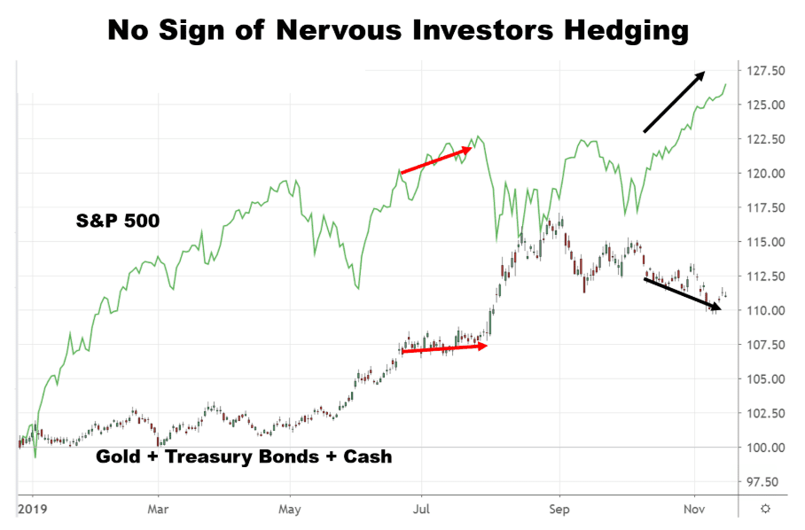

Inflation, characterized by the gradual increase in prices and corresponding decrease in purchasing power, presents challenges for investors seeking to preserve their wealth. Amidst fluctuating economic conditions, it's crucial to understand how inflation impacts investment portfolios. Various financial instruments have been identified as potential hedges against inflation, notably treasury securities and gold. These assets offer different methods of safeguarding wealth against the eroding effects of inflation due to their unique characteristics and historical performance.

Treasury securities, particularly Treasury Inflation-Protected Securities (TIPS), are favored for their government backing and the promise of returns that adjust with inflation. On the other hand, gold has long been revered as a safe-haven asset, its value historically moving inversely to fiat currency performance, providing a buffer during times of economic instability.



Technological advancements have revolutionized how investors manage these assets, with algorithmic trading emerging as a significant tool. Algorithmic trading employs complex algorithms to execute trades at speed and precision beyond human capability, creating opportunities to optimize portfolio performance by leveraging market inefficiencies.

This article investigates the intersection of treasury securities, gold, and algorithmic trading as strategies to counteract inflationary pressures. By examining these tools and their evolving roles, investors can gain insights into constructing resilient portfolios that withstand inflation's challenges.

## Table of Contents

## Treasury Securities as an Inflation Hedge

Treasury securities, issued by the U.S. government, serve as a cornerstone in the arena of conservative investment strategies. They are widely regarded as low-risk investments due to the enduring stability of the U.S. government and its capacity to honor its debt obligations. These securities offer a relatively stable return, making them an attractive choice for risk-averse investors.

One specialized form of treasury securities is the Treasury Inflation-Protected Securities (TIPS), specifically designed to combat inflation. TIPS provide a safeguard against inflationary pressures by automatically adjusting their principal value based on changes in the Consumer Price Index (CPI). The formula for the adjusted principal of TIPS is:

$$
\text{Adjusted Principal} = \text{Initial Principal} \times \left(1 + \frac{\text{CPI}_{\text{current}}}{\text{CPI}_{\text{base}}}\right)
$$

This adjustment mechanism ensures that both the principal and the interest payments increase with inflation, thereby preserving the purchasing power of the investors' returns.

### Pros of Using Treasury Securities as an Inflation Hedge

1. **Safety and Reliability**: Due to the backing of the U.S. government, treasury securities are considered one of the safest investment options. This reliability renders them a preferred choice during volatile economic periods.

2. **Inflation Protection with TIPS**: By directly tying returns to inflation rates, TIPS offer a unique advantage in preserving the real value of investments, which is especially beneficial during inflationary climates.

3. **Predictable Income Stream**: Treasury securities provide a predictable stream of income through interest payments, commonly known as coupon payments. This feature is particularly beneficial for investors seeking steady cash flow.

### Cons of Using Treasury Securities as an Inflation Hedge

1. **Lower Yield**: The safety of treasury securities often translates into lower yields compared to riskier asset classes. Consequently, investors might find their returns insufficient, particularly during periods of low inflation.

2. **Interest Rate Risk**: Although TIPS adjust for inflation, other types of treasury securities can be adversely affected by rising interest rates, as they often lead to declining bond prices, affecting the market value of these securities.

3. **Tax Considerations**: The interest earned from treasury securities is subject to federal income tax, and the inflation adjustments to TIPS are also taxable. This factor can erode the real returns for investors, particularly those in higher tax brackets.

In summary, while treasury securities, and TIPS specifically, offer significant advantages such as safety and inflation protection, they are not without their drawbacks. Lower yields and potential tax implications are critical considerations for investors using these instruments as a hedge against inflation.

## Gold: The Traditional Hedge

Gold has long been regarded as a safe-haven asset, particularly during periods of economic instability and high inflation. Its intrinsic value, scarcity, and universal acceptance make it a preferred choice among investors seeking to preserve wealth over time. During episodes of economic unrest, such as financial crises or periods of geopolitical tension, investors often flock to gold, driving its demand and price higher. Historical data suggest that gold tends to appreciate during high inflation periods, acting as a reliable store of value when fiat currencies lose their purchasing power.

The benefits of investing in gold are primarily its ability to act as a hedge against inflation and currency devaluation, as well as its role in diversifying investment portfolios. Gold's counter-cyclical nature means it often moves inversely to stock markets and other asset classes, providing much-needed stability during volatile market conditions. This diversification reduces overall portfolio risk and can enhance long-term returns.

However, investing in gold is not without drawbacks. One of the primary challenges is its price [volatility](/wiki/volatility-trading-strategies). While gold can protect against inflation over the long run, short-term price fluctuations can be significant, potentially leading to periods of underperformance. This volatility can be influenced by various factors, including changes in global economic policies, interest rates, and shifts in market sentiment.

Moreover, physical gold storage presents logistical and security concerns. Storing gold requires secure facilities, which can add additional costs for investors. Options for gold storage include safety deposit boxes or specialized gold storage firms, each with its associated fees and risks. Another consideration is the lack of yield. Gold does not generate interest or dividends, unlike other investments such as stocks or bonds, potentially impacting total returns over time.

Despite these challenges, gold continues to maintain its status as a trusted inflation hedge, particularly when combined with modern investment vehicles and strategies that mitigate its inherent risks.

## Algo Trading: A Modern Approach

Algorithmic trading, often referred to as algo trading, utilizes computer algorithms to execute trades based on pre-established strategies. This approach is employed across various asset classes, including treasury securities and gold investments, enabling traders to capitalize on market inefficiencies with precision and speed.

For treasury securities, [algorithmic trading](/wiki/algorithmic-trading) systems can analyze multiple data points such as [interest rate](/wiki/interest-rate-trading-strategies) movements, economic indicators, and market sentiment to make informed decisions. The algorithms can evaluate treasury yields and compare them to expected inflation rates, making them particularly useful when trading Treasury Inflation-Protected Securities (TIPS). Similarly, in the gold market, algo trading can employ technical indicators, such as moving averages, to identify optimal entry and [exit](/wiki/exit-strategy) points, thereby capitalizing on the asset's price volatility.

One of the primary advantages of algorithmic trading is the minimization of human intervention and the swift execution of trades. By automating the trading process, algorithms can perform transactions at speeds unattainable by humans, thus enhancing the chances of securing favorable prices. Additionally, the elimination of emotional bias helps maintain strategic consistency, especially in markets characterized by irrational exuberance or panic.

Despite its benefits, relying on automated systems poses several challenges, particularly in unstable markets. Algorithms are only as good as the strategies they execute and the data they analyze. During periods of market turmoil, such as financial crises or unexpected geopolitical events, market conditions can deviate significantly from historical norms. If not properly calibrated, automated systems might execute trades based on anomalies, leading to substantial losses. Furthermore, the reliance on high-frequency data feeds and powerful computational resources can be costly and may introduce systemic risks if multiple algorithms engage in similar strategies.

A primary concern is the potential for technical failures and the risks associated with faulty algorithms. Even a minor coding error can result in significant financial repercussions. Moreover, as more market participants employ similar algorithmic strategies, there is an increased risk of market illiquidity or flash crashes, where a rapid sequence of trades can lead to drastic price swings.

In summary, while algorithmic trading offers significant advantages in terms of efficiency and accuracy, it demands a robust understanding of market mechanics and stringent risk management protocols. The integration of algorithmic systems for treasury and gold investments can enhance portfolio returns but requires meticulous oversight to mitigate potential risks in volatile environments.

## ETFs: Combining Gold and Treasuries

Exchange-Traded Funds (ETFs) have emerged as popular investment vehicles offering diversified exposure to various asset classes, including gold and treasury securities. These financial instruments combine the stability traditionally associated with treasury securities and the safe-haven appeal of gold, providing investors with a balanced strategy that hedges against inflation and market volatility.

### Balanced Investment Strategy

ETFs that focus on gold and treasuries enable investors to manage risk and return efficiently. By holding a basket of assets, these ETFs can diffuse the risk inherent to fluctuations in the individual asset prices. The dual investment in treasury securities, typically seen as low-risk due to government backing, and gold, valued for its resilience in turbulent economic times, allows investors to hedge against inflation while maintaining portfolio flexibility.

### Tax Implications and Cost Efficiencies

One of the significant benefits of ETFs is tax efficiency. Unlike mutual funds that might distribute capital gains to investors, ETFs are generally more tax-efficient due to their unique "in-kind" creation and redemption mechanism. This process minimizes the capital gains taxes incurred by the fund, oftentimes deferring such liabilities. 

Furthermore, ETFs typically have lower expense ratios compared to actively managed funds. The passive nature of ETFs, which track indexes or specific asset classes, results in lower management costs. For investors focusing on gold and treasuries, this cost structure can lead to substantial savings over long holding periods.

### Popular ETFs Focusing on Gold and Treasuries

Several ETFs offer investors exposure to both gold and treasury assets, allowing a mix that can be adjusted according to economic conditions and personal investment goals. Noteworthy among these are:

1. **iShares Gold Trust (IAU)**: Primarily focused on physical gold, this ETF offers investors exposure to gold price movements without the complexities of storage and insurance of physical gold.

2. **iShares TIPS Bond ETF (TIP)**: This ETF offers exposure to Treasury Inflation-Protected Securities (TIPS). TIPS are designed to protect investments from inflation as their principal increases with inflation and decreases with deflation.

3. **SPDR Gold Shares (GLD)**: This fund provides a cost-effective and secure way to access the gold market, closely tracking the performance of the price of gold bullion.

4. **Invesco U.S. Treasury Bond ETF (GOVT)**: This fund seeks to reflect the performance of U.S. Treasury bonds, maintaining the traditional appeal of these secure debt instruments.

By encompassing both gold and treasuries, these ETFs provide an opportunity for investors to pursue diversified financial strategies that align with inflating market dynamics and personal risk preferences.

## Comparative Analysis: Which Hedge is Better?

When evaluating the effectiveness of treasury securities versus gold as hedges against inflation, several factors must be considered, including market conditions and investor profiles. 

**Market Conditions and Investor Profiles**

Treasury securities, specifically Treasury Inflation-Protected Securities (TIPS), provide a government-backed guarantee that compensates for inflation thanks to their principal adjustment according to the Consumer Price Index (CPI). TIPS are particularly suitable for risk-averse investors seeking stability and predictable returns, especially during periods of moderate inflation.

Conversely, gold is often sought after during economic turmoil and high inflation as it is perceived as a safe haven. Its value typically remains uncorrelated with equity markets and fiat currency valuations, making it appealing to investors looking to diversify their portfolios and hedge against currency devaluation.

**Mix Strategies for Optimal Protection**

A balanced investment approach can be achieved by utilizing both TIPS and gold within a portfolio. During stable economic periods with predictable inflation, TIPS can offer a steady return on investment. Meanwhile, gold becomes more attractive when inflation rates soar unpredictably, providing a cushion against purchasing power erosion. 

One strategy could be a dynamic allocation model where an investor adjusts the proportion of TIPS and gold in their portfolio based on economic indicators such as inflation forecasts or market volatility metrics. This might be represented in a pseudo-code as follows:

```python
def adjust_portfolio(current_allocation, inflation_rate, market_volatility):
    if inflation_rate > target_inflation or market_volatility > threshold:
        # Increase gold allocation
        gold_allocation = min(current_allocation['gold'] + adjustment_factor, max_gold)
        tips_allocation = max(current_allocation['tips'] - adjustment_factor, min_tips)
    else:
        # Increase TIPS allocation
        gold_allocation = max(current_allocation['gold'] - adjustment_factor, min_gold)
        tips_allocation = min(current_allocation['tips'] + adjustment_factor, max_tips)

    return {'gold': gold_allocation, 'tips': tips_allocation}
```

**Impact of Algorithmic Trading**

Algorithmic trading introduces a new dimension to asset management by leveraging computational models to optimize trading strategies in real-time. For securities like TIPS, algorithms can execute trades swiftly, capitalizing on interest rate movements or CPI forecasts that signal inflationary trends. This mitigates the reaction time lag, enhancing the investment outcome.

In contrast, algorithmic trading for gold may utilize technical analysis indicators like moving averages or [momentum](/wiki/momentum) oscillators, allowing traders to capitalize on short-term price movements. The algorithmic approach reduces emotional bias and can handle large datasets to identify potential market patterns.

Ultimately, the decision between prioritizing treasury securities or gold is influenced by each investor's risk tolerance and market outlook. Algorithmic trading can strategically influence this balance, optimizing responses to inflationary pressures and maximizing portfolio resilience.

## Conclusion: Strategic Considerations

Investing during inflationary times requires a keen understanding of the merits and limitations of different asset classes. Treasury securities, particularly Treasury Inflation-Protected Securities (TIPS), offer a reliable hedge against inflation due to their low-risk nature and automatic adjustment to inflation rates. These securities preserve purchasing power and provide a stable return, appealing to risk-averse investors looking to protect their portfolios against inflationary pressures.

Gold, a traditional safe-haven asset, serves as a robust hedge during economic instability and high inflation periods. Its intrinsic value and historical resilience against currency depreciation make it attractive. Nevertheless, investors must consider the volatility and storage costs associated with physical gold, which can impact overall returns.

Algorithmic trading introduces a modern approach, enabling investors to execute trades based on predefined strategies with minimal human intervention. This method enhances efficiency, allowing for timely adjustments in portfolios holding treasury securities or gold. However, the reliance on automated systems poses challenges, especially in volatile markets, where rapid price changes can lead to significant risks.

Investors should tailor their strategies by considering personal risk tolerance and prevailing market trends. For those seeking a balanced approach, a combination of these asset classes, possibly through Exchange-Traded Funds (ETFs), can offer diversification and cost efficiencies. ETFs, which include both gold and treasury securities, provide exposure to multiple assets with the benefits of lower transaction costs and easier portfolio management.

Ultimately, an informed investment strategy during inflationary periods must account for individual risk appetites while balancing the unique advantages of these asset classes. Embracing the benefits of algorithmic trading can optimize the risk-return profile, ensuring portfolios remain resilient against inflation's potentially erosive impacts.

## References & Further Reading

[1]: Baur, D. G., & Lucey, B. M. (2010). ["Is Gold a Hedge or a Safe Haven? An Analysis of Stocks, Bonds and Gold."](https://onlinelibrary.wiley.com/doi/10.1111/j.1540-6288.2010.00244.x) Journal of Banking & Finance.

[2]: Campbell, J. Y., & Viceira, L. M. (2001). ["Who Should Buy Long-Term Bonds?"](https://www.aeaweb.org/articles?id=10.1257/aer.91.1.99) American Economic Review.

[3]: Bodie, Z. (1976). ["Common Stocks as a Hedge against Inflation."](https://www.jstor.org/stable/2326617) The Journal of Finance.

[4]: ["The Intelligent Investor: The Definitive Book on Value Investing"](https://www.amazon.com/Intelligent-Investor-Third-Definitive-Investing/dp/0063423537) by Benjamin Graham

[5]: ["Global Asset Allocation: A Survey of the World’s Top Investment Strategies"](https://www.amazon.com/Global-Asset-Allocation-Survey-Strategies/dp/0988679922) by Mebane T. Faber