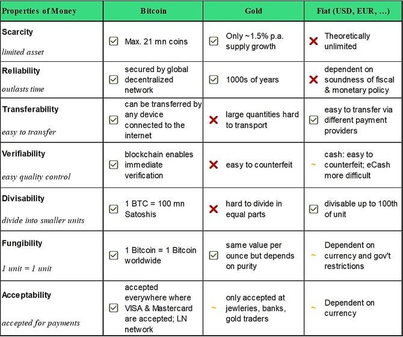

## Table of Contents

## What is inflation and why is it important to hedge against it?

Inflation is when the prices of things we buy, like food and clothes, go up over time. It means that the money we have doesn't buy as much as it used to. For example, if a candy bar costs $1 now, in a few years it might cost $1.20 because of inflation. This happens because the amount of money in the economy grows faster than the goods and services available.

It's important to hedge against inflation because it protects the value of our money. If we don't do anything, the money we save today will be worth less in the future. Hedging can mean investing in things like real estate or stocks, which often go up in value faster than inflation. By doing this, we can make sure our savings keep up with or even beat the rising prices, so we can still afford the things we need and want.

## What are gold and Treasury securities, and how do they function as investment options?

Gold is a shiny metal that people have valued for thousands of years. It's often used in jewelry, but it's also a popular investment. When you invest in gold, you can buy physical gold, like coins or bars, or you can buy gold through something called an ETF, which is like a fund that holds gold. Gold is seen as a safe investment because its value usually stays steady or goes up, especially when the economy is doing badly. People often buy gold to protect their money from inflation or economic uncertainty. However, gold doesn't pay any interest or dividends, so you won't earn money from it unless its price goes up.

Treasury securities are loans you give to the government. When you buy a Treasury security, you're lending money to the U.S. government, and in return, they promise to pay you back with interest. There are different types of Treasury securities, like Treasury bills, notes, and bonds, and they last for different amounts of time, from a few months to 30 years. They are considered very safe because the government is unlikely to default on its debts. Treasury securities can help you earn a steady income from the interest they pay, and they can also be a good way to protect your money from inflation, especially if you buy Treasury Inflation-Protected Securities (TIPS), which adjust their value based on inflation rates.

## How does gold traditionally perform during periods of high inflation?

Gold has often been seen as a good investment when prices are going up a lot, which is called high inflation. When inflation is high, the value of money goes down, and people look for ways to protect their savings. Gold is one of those ways because it tends to keep its value or even go up in price during these times. For example, during the 1970s, when inflation was very high, the price of gold went up a lot. People saw gold as a safe place to put their money because it could protect them from losing value due to inflation.

However, gold doesn't always go up during high inflation. Sometimes, other things can affect its price, like how much people want to buy it or what's happening in the world. But overall, many people still think of gold as a good way to hedge against inflation. It's not perfect, but it has a history of helping people keep their money's value when prices are rising quickly.

## What role do Treasury securities play in an investor's portfolio during inflation?

Treasury securities can be a helpful part of an investor's portfolio when inflation is high. These are loans you give to the government, and in return, they pay you interest. Some special kinds of Treasury securities, called TIPS (Treasury Inflation-Protected Securities), are made to help protect your money from inflation. TIPS adjust their value based on inflation rates, so if prices go up, the value of your TIPS goes up too. This means your investment keeps up with the rising costs, which can be really important when inflation is high.

However, not all Treasury securities are good against inflation. Regular Treasury bonds, bills, and notes don't adjust for inflation, so their value might go down if inflation is high. But they are still seen as very safe because the government is unlikely to not pay you back. So, while TIPS can be a direct way to fight inflation, other Treasury securities can provide a steady income and safety, which can be comforting during uncertain economic times. Balancing both types in a portfolio can help an investor manage the effects of inflation while keeping some of their money safe.

## How have gold and Treasury securities historically correlated with inflation rates?

Gold has often gone up in value when inflation rates are high. During times like the 1970s, when prices were rising a lot, people turned to gold because it kept its value better than money. This happened because gold is seen as a safe place to put money when the economy is uncertain. But gold doesn't always go up with inflation. Sometimes, other things like how much people want to buy gold or what's happening around the world can change its price. Still, many people think of gold as a good way to protect their money from losing value when prices go up.

Treasury securities, especially TIPS, are made to help with inflation. TIPS change their value based on inflation rates, so if prices go up, the value of TIPS goes up too. This makes them a good choice for people who want to keep their money's value during high inflation. Regular Treasury bonds, bills, and notes don't adjust for inflation, so their value might go down if inflation is high. But they are still seen as safe because the government always pays them back. So, while TIPS can directly fight inflation, other Treasury securities can give a steady income and safety, which can be helpful when the economy is uncertain.

## What are the key differences between investing in gold versus Treasury securities for inflation protection?

Gold and Treasury securities both help protect your money from inflation, but they do it in different ways. Gold is a shiny metal that people have always valued. When you buy gold, you can get physical gold like coins or bars, or you can invest in gold through something called an [ETF](/wiki/etf-trading-strategies). Gold often goes up in price when inflation is high because people see it as a safe place to put their money when things are uncertain. But gold doesn't pay you any interest or dividends, so you only make money if the price of gold goes up. This means gold is good for keeping your money's value, but it doesn't give you extra money while you wait.

Treasury securities are different because they are loans you give to the government. When you buy them, the government promises to pay you back with interest. There are different types, like TIPS, which are made to fight inflation directly. TIPS adjust their value based on how much prices go up, so your investment keeps up with inflation. Regular Treasury securities, like bonds and bills, don't adjust for inflation, but they are very safe because the government always pays them back. So, while TIPS can help you directly fight inflation, other Treasury securities give you a steady income and safety, which can be comforting when the economy is uncertain.

## How do the liquidity and accessibility of gold compare to Treasury securities?

Gold can be easy to buy and sell, but it depends on how you own it. If you have physical gold, like coins or bars, you might need to find a buyer and go through the process of selling it, which can take time. But if you own gold through an ETF, which is like a fund that holds gold, you can buy and sell it quickly on the stock market, just like you would with stocks. So, gold's [liquidity](/wiki/liquidity-risk-premium), or how easily you can turn it into cash, can vary, but it's usually pretty good, especially if you use ETFs.

Treasury securities are also pretty easy to buy and sell. You can buy them directly from the government through the TreasuryDirect website, or you can buy them through a bank or a broker. Once you have them, you can sell them on the secondary market, which is like a big place where people trade securities. Treasury securities are very liquid because there are always people buying and selling them, so you can usually turn them into cash quickly if you need to. They are also seen as very safe and easy to access, which makes them a good choice for many investors.

## What are the tax implications of investing in gold versus Treasury securities?

When you invest in gold, you have to think about taxes. If you sell your gold for more than you paid for it, you'll have to pay capital gains tax. This tax is based on how long you held the gold before selling it. If you held it for a year or less, it's a short-term capital gain, and you'll pay your regular income tax rate on the profit. If you held it for more than a year, it's a long-term capital gain, and you'll pay a lower tax rate, usually 0%, 15%, or 20%, depending on your income. Also, if you own physical gold, you might have to pay sales tax when you buy it, depending on where you live.

Treasury securities have different tax rules. If you buy regular Treasury bonds, bills, or notes, the interest you earn is taxable at the federal level but not at the state or local level. This means you'll pay federal income tax on the interest, but you won't have to worry about state or local taxes on it. TIPS, which are made to protect against inflation, work the same way for the interest you earn. But TIPS also have something called inflation adjustments, which can also be taxed at the federal level each year, even though you don't get that money until you sell the TIPS or they mature. So, while both gold and Treasury securities can help with inflation, they have different tax implications that you should think about when deciding where to invest your money.

## How do global economic conditions affect the performance of gold and Treasury securities as inflation hedges?

Global economic conditions can really change how well gold and Treasury securities work as ways to protect your money from inflation. When the world's economy is shaky, like during a big financial crisis, people often turn to gold because they think it's a safe place to keep their money. This can make the price of gold go up, even if inflation isn't the main reason. On the other hand, if the world's economy is doing well, people might not be as worried about inflation, and they might not buy as much gold, which can keep its price from going up a lot. So, what's happening around the world can make gold a good or not-so-good choice for fighting inflation.

Treasury securities, especially TIPS, are also affected by global economic conditions, but in a different way. When the world's economy is doing badly, people might want to put their money in safe investments like Treasury securities because they know the government will pay them back. This can make the price of Treasury securities go up, which can help protect your money from inflation. But if the world's economy is doing really well, people might look for investments that can give them more money, and they might not buy as many Treasury securities. So, while Treasury securities can be a good way to fight inflation, how well they work can depend a lot on what's happening around the world.

## What advanced strategies can investors use to optimize their portfolios with gold and Treasury securities during inflationary periods?

During inflationary times, investors can use a strategy called asset allocation to balance their portfolios with gold and Treasury securities. This means putting some money into gold because it often goes up in price when inflation is high. Gold can help protect your money from losing value. But you don't want all your money in gold because it doesn't pay any interest or dividends. So, you can also put some money into Treasury securities, especially TIPS, which adjust their value based on inflation. This way, you get some protection from inflation and also earn some interest. By spreading your money between gold and Treasury securities, you can keep your portfolio safe and still make some money.

Another strategy is called dollar-cost averaging. This means you invest a fixed amount of money into gold and Treasury securities at regular times, no matter what the prices are doing. This can help you buy more when prices are low and less when prices are high, which can be a good way to manage the ups and downs of inflation. You can also use something called rebalancing, which means you check your portfolio every so often and adjust it to keep the right balance between gold and Treasury securities. If one of them has gone up a lot, you might sell some of it and buy more of the other to keep your portfolio in line with your plan. These strategies can help you make the most of your investments during inflationary periods.

## How do the real yields of Treasury securities compare to the returns on gold during different inflationary environments?

During times when inflation is low, the real yields of Treasury securities, which means the interest they pay after accounting for inflation, can be pretty good. If you buy a regular Treasury bond, you get a steady interest payment that might be more than the inflation rate. This means your money is growing in value. But gold might not do as well because its price might not go up much when inflation is low. People might not see the need to buy gold to protect their money, so its price stays the same or goes up slowly.

When inflation is high, things change. The real yields of regular Treasury securities can go down because the interest they pay might not keep up with the rising prices. But TIPS, which are made to fight inflation, can still give you a good real yield because they adjust their value based on inflation. On the other hand, gold often does better when inflation is high. People buy gold to protect their money from losing value, so its price can go up a lot. This means that during high inflation, gold can give you better returns than regular Treasury securities, but TIPS might still be a good choice because they are made to handle inflation.

## What are the long-term trends and future outlooks for gold and Treasury securities as inflation hedges?

Over the long term, gold has been a good way to protect money from inflation. When prices go up a lot, people often buy gold because they think it will keep its value better than money. This has happened many times in the past, like in the 1970s when inflation was really high. But gold doesn't always go up just because of inflation. Sometimes, other things like what's happening in the world or how much people want to buy gold can change its price. Still, many people think gold will keep being a good choice to fight inflation in the future because it has a long history of doing so.

Treasury securities, especially TIPS, are also used to protect money from inflation. TIPS are made to adjust their value based on inflation rates, so they can help keep your money's value even when prices are going up. Regular Treasury bonds, bills, and notes don't adjust for inflation, so their value might go down if inflation is high. But they are seen as very safe because the government always pays them back. Looking ahead, TIPS will likely keep being a good way to fight inflation because they are made for that purpose. Regular Treasury securities might not be as good during high inflation, but they can still be a safe place to put your money when the economy is uncertain.

## Can Treasury Securities Serve as an Inflation Hedge?

Treasury securities, issued by the U.S. government, serve as a cornerstone in the arena of conservative investment strategies. They are widely regarded as low-risk investments due to the enduring stability of the U.S. government and its capacity to honor its debt obligations. These securities offer a relatively stable return, making them an attractive choice for risk-averse investors.

One specialized form of treasury securities is the Treasury Inflation-Protected Securities (TIPS), specifically designed to combat inflation. TIPS provide a safeguard against inflationary pressures by automatically adjusting their principal value based on changes in the Consumer Price Index (CPI). The formula for the adjusted principal of TIPS is:

$$
\text{Adjusted Principal} = \text{Initial Principal} \times \left(1 + \frac{\text{CPI}_{\text{current}}}{\text{CPI}_{\text{base}}}\right)
$$

This adjustment mechanism ensures that both the principal and the interest payments increase with inflation, thereby preserving the purchasing power of the investors' returns.

### Pros of Using Treasury Securities as an Inflation Hedge

1. **Safety and Reliability**: Due to the backing of the U.S. government, treasury securities are considered one of the safest investment options. This reliability renders them a preferred choice during volatile economic periods.

2. **Inflation Protection with TIPS**: By directly tying returns to inflation rates, TIPS offer a unique advantage in preserving the real value of investments, which is especially beneficial during inflationary climates.

3. **Predictable Income Stream**: Treasury securities provide a predictable stream of income through interest payments, commonly known as coupon payments. This feature is particularly beneficial for investors seeking steady cash flow.

### Cons of Using Treasury Securities as an Inflation Hedge

1. **Lower Yield**: The safety of treasury securities often translates into lower yields compared to riskier asset classes. Consequently, investors might find their returns insufficient, particularly during periods of low inflation.

2. **Interest Rate Risk**: Although TIPS adjust for inflation, other types of treasury securities can be adversely affected by rising interest rates, as they often lead to declining bond prices, affecting the market value of these securities.

3. **Tax Considerations**: The interest earned from treasury securities is subject to federal income tax, and the inflation adjustments to TIPS are also taxable. This factor can erode the real returns for investors, particularly those in higher tax brackets.

In summary, while treasury securities, and TIPS specifically, offer significant advantages such as safety and inflation protection, they are not without their drawbacks. Lower yields and potential tax implications are critical considerations for investors using these instruments as a hedge against inflation.

## References & Further Reading

[1]: Baur, D. G., & Lucey, B. M. (2010). ["Is Gold a Hedge or a Safe Haven? An Analysis of Stocks, Bonds and Gold."](https://onlinelibrary.wiley.com/doi/10.1111/j.1540-6288.2010.00244.x) Journal of Banking & Finance.

[2]: Campbell, J. Y., & Viceira, L. M. (2001). ["Who Should Buy Long-Term Bonds?"](https://www.aeaweb.org/articles?id=10.1257/aer.91.1.99) American Economic Review.

[3]: Bodie, Z. (1976). ["Common Stocks as a Hedge against Inflation."](https://www.jstor.org/stable/2326617) The Journal of Finance.

[4]: ["The Intelligent Investor: The Definitive Book on Value Investing"](https://www.amazon.com/Intelligent-Investor-Third-Definitive-Investing/dp/0063423537) by Benjamin Graham

[5]: ["Global Asset Allocation: A Survey of the World’s Top Investment Strategies"](https://www.amazon.com/Global-Asset-Allocation-Survey-Strategies/dp/0988679922) by Mebane T. Faber