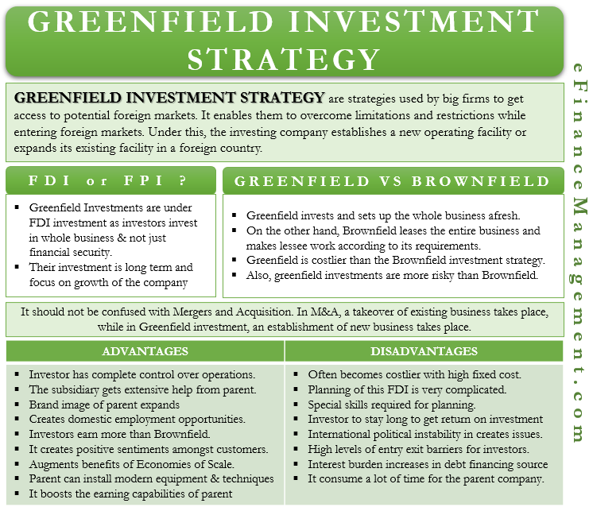

## Table of Contents

## What is a Greenfield investment?

A Greenfield investment is when a company decides to build a new business from scratch in a foreign country. Instead of buying an existing company, the company starts everything new, like building new factories, offices, or stores. This type of investment is called "Greenfield" because it's like starting on a green, empty field where nothing has been built before.

Greenfield investments can be good because the company can create exactly what it wants, without having to deal with old ways of doing things. However, it can also be risky and expensive. It takes a lot of time and money to build everything from the start, and there might be challenges like not knowing the local market well or facing delays in construction. Despite these challenges, many companies choose Greenfield investments to have more control over their new business.

## What is an international acquisition?

An international acquisition happens when a company buys another company that is located in a different country. This is different from starting a new business from scratch in another country, which is called a Greenfield investment. When a company makes an international acquisition, it is buying something that already exists, including its buildings, workers, and customers. This can be a faster way to grow a business in a new country because the company doesn't have to start everything from the beginning.

However, international acquisitions can also be tricky. The company buying the business might not know everything about how the business works in the new country. There could be different laws, cultures, and ways of doing business that they need to learn. Sometimes, the workers in the acquired company might not like the changes that the new owners bring. Despite these challenges, many companies choose international acquisitions because it can be a quicker way to expand and start making money in a new market.

## What are the basic differences between Greenfield investment and international acquisition?

A Greenfield investment means a company builds a new business from the ground up in a foreign country. It's like starting with an empty field and putting up new factories, offices, or stores. This gives the company control over everything, from the design to how the business runs. But it can be slow and costly because everything needs to be built from scratch. The company also has to learn about the local market, which can be hard if they don't know the area well.

An international acquisition is when a company buys an existing business in another country. Instead of starting fresh, they take over something that's already there, including its workers, buildings, and customers. This can be quicker because the business is already running, and the company can start making money sooner. However, there can be challenges, like understanding different laws, cultures, and business practices in the new country. The workers might also not like the changes that come with new owners.

In short, a Greenfield investment is about building new, while an international acquisition is about buying what's already there. Each has its own set of pros and cons, depending on how fast a company wants to grow and how much control they want over their new business.

## What are the initial costs associated with Greenfield investments versus international acquisitions?

Greenfield investments usually have higher initial costs because everything needs to be built from scratch. This includes buying land, constructing buildings, and setting up all the equipment and systems needed to run the business. There are also costs for hiring new staff and training them. On top of that, the company might need to spend a lot of money on market research to understand the new country's customers and business environment. All these costs add up, making Greenfield investments a big financial commitment right from the start.

International acquisitions, on the other hand, can have lower initial costs because the business is already up and running. The main cost is the purchase price of the company being acquired. This price includes the value of the existing buildings, equipment, and sometimes even the brand and customer base. However, there might be additional costs for integrating the new business into the company's operations, like changing systems or training staff. Even though the initial cost might be lower than a Greenfield investment, the total cost can still be high depending on the price of the acquisition and any needed changes.

## How do the timeframes for setting up operations compare between Greenfield investments and international acquisitions?

Greenfield investments take a long time to set up. This is because the company has to find the right land, build new factories or stores, and set up everything needed to start the business. They also need to hire and train new workers. All these steps can take months or even years before the business can start making money. But once everything is ready, the company has a lot of control over how the business works.

International acquisitions can be faster to set up. When a company buys another company in a different country, the business is already running. This means they can start making money right away without waiting for buildings to be built. However, it can still take some time to learn how the new business works and to make any changes needed to fit with the company's way of doing things. Even though it's quicker than a Greenfield investment, there might be some delays in getting everything to work smoothly.

## What are the risks involved in each type of investment strategy?

Greenfield investments have a lot of risks because everything is new. The biggest risk is that it can take a long time and cost a lot of money to build everything from scratch. There's also the risk that the company might not understand the local market well, which can make it hard to attract customers. If the market changes or there are delays in construction, it can be even more expensive and take longer. The company has to be ready to handle these problems without any quick fixes because nothing is already set up.

International acquisitions also come with their own set of risks. One big risk is that the company might pay too much for the business they're buying. There's also the chance that the business might not be as good as it looks on paper, with hidden problems that only show up after the purchase. Another risk is that the workers in the new company might not like the changes the new owners want to make, which can cause problems and slow things down. Even though the business is already running, it can still take time and money to make it work well with the new company's way of doing things.

## How does control over operations differ between Greenfield investments and international acquisitions?

With Greenfield investments, a company has a lot of control over how things are done. They get to decide everything, from where to build the new business to how it will run. This is because they are starting from scratch and can set up the business exactly how they want. But this also means they have to do everything themselves, which can be hard and take a long time. They need to make sure they understand the new country's rules and what people there like, or else they might make mistakes.

With international acquisitions, a company has less control at first. When they buy an existing business, they have to work with what's already there. This means they might have to keep some things the same, like how the business is run or who works there. Over time, they can make changes to fit their way of doing things, but it can be tricky. The people who used to run the business and the workers might not like the changes, which can cause problems. But, the company can start making money right away because the business is already up and running.

## What are the cultural and integration challenges faced in Greenfield investments compared to international acquisitions?

Greenfield investments face cultural challenges because the company is new to the country and might not understand the local culture well. They have to learn how people in the new country like to do business and what they like to buy. This can be hard because they are starting from nothing and have to build everything themselves. They also have to hire new workers and make sure everyone understands the company's way of doing things. It can take a lot of time to fit into the local culture and make sure the new business works well.

International acquisitions also have cultural and integration challenges, but they are different. When a company buys an existing business, they have to work with what's already there. This means they might have to keep some things the same, like how the business is run or who works there. The people who used to run the business and the workers might not like the changes that the new owners want to make. It can be hard to change the way the business works to fit the new company's way of doing things. But, because the business is already running, they can start making money right away while they work on these challenges.

## How do local regulations and government policies impact Greenfield investments and international acquisitions differently?

Local regulations and government policies can make Greenfield investments harder because the company has to start everything from the beginning. They have to learn all the new rules about building, hiring people, and running a business in the new country. Sometimes, the government might have special rules or need a lot of paperwork before the company can start building. This can slow things down and make it more expensive. But, if the company can follow all the rules, they might get help from the government, like tax breaks or other benefits, to start their new business.

For international acquisitions, local regulations and government policies can also be tricky, but in different ways. When a company buys an existing business, they have to make sure that the business is following all the local rules. Sometimes, the government might not let the company buy the business if they think it's not good for the country. There can also be rules about how the company can change things after they buy the business. But, because the business is already running, the company might not have to deal with as many new rules as they would with a Greenfield investment. They can focus more on making the business work well with their own way of doing things.

## What are the long-term strategic benefits of choosing a Greenfield investment over an international acquisition, or vice versa?

Choosing a Greenfield investment can offer long-term strategic benefits because the company gets to build everything exactly how they want. They can design the business to fit their goals and make sure it works well with their other businesses. This can help them grow in a way that makes sense for them. Also, because they start fresh, they can avoid problems that might come with buying an old business, like old ways of doing things or hidden issues. Over time, this can lead to a stronger and more successful business in the new country.

On the other hand, choosing an international acquisition can also have long-term strategic benefits. By buying an existing business, the company can start making money right away without waiting for everything to be built. This can help them grow faster and get a good place in the new market quickly. They also get to use the knowledge and customers that the old business already has. Over time, they can make changes to fit their way of doing things, which can help them build a strong business that works well in the new country.

## How do the financial returns and profitability projections differ between the two investment approaches?

Greenfield investments can take a long time before they start making money. This is because the company has to build everything from scratch, which can be expensive and slow. But once the business is up and running, the company can make a lot of money if everything goes well. They can set prices and control costs in a way that fits their plans. The long-term profit can be high because they built the business exactly how they wanted. But if things go wrong, like if the market changes or there are big delays, it can be hard to make money back quickly.

International acquisitions can start making money right away because the business is already running. This means the company can see profits sooner than with a Greenfield investment. But the long-term profit can be less certain because the company has to deal with what's already there. They might have to spend money to change things to fit their way of doing things, which can cut into profits. If they can make the business work well with their other businesses, they can still make a lot of money over time. But there's a risk that the business might not be as good as they thought, which can make it hard to keep profits high.

## What case studies or real-world examples illustrate the success or failure of Greenfield investments versus international acquisitions?

A good example of a successful Greenfield investment is Toyota's plant in Georgetown, Kentucky. Toyota started building this factory in the 1980s when they wanted to make cars in the United States. They chose to build everything new instead of buying an existing factory. This let them make cars the Toyota way, and now the Georgetown plant is one of the biggest car factories in the world. It took time and a lot of money to build, but it paid off because Toyota could control everything and make high-quality cars that people wanted to buy.

On the other hand, a well-known example of a successful international acquisition is when Lenovo, a Chinese company, bought IBM's personal computer division in 2005. Lenovo didn't start from scratch; they bought an existing business that was already making and selling computers. This helped Lenovo grow quickly because they could use IBM's customers and technology. They faced some challenges, like learning how to run the business in a different country and dealing with different cultures, but they made it work. Now, Lenovo is one of the biggest computer companies in the world.

An example of a Greenfield investment that faced challenges is Walmart's attempt to enter the German market in the late 1990s. Walmart built new stores from the ground up, but they didn't understand the local culture and shopping habits well. German customers didn't like the way Walmart did things, and the company faced a lot of problems with local laws and unions. After trying for several years, Walmart gave up and sold its stores in Germany at a big loss. This shows how hard it can be to succeed with a Greenfield investment if the company doesn't know the local market well.

## What are the differences between Acquisition and Greenfield strategies in a comparative analysis?

When comparing international acquisition and greenfield investment, it is crucial to analyze the conditions that make one strategy more favorable than the other. Market conditions, cost implications, and strategic alignment are key determinants in the selection process. 

**Cost-Analysis:**

International acquisitions typically offer a rapid entry into foreign markets, leveraging the existing infrastructure and customer base of the acquired company. However, this approach may involve substantial upfront costs, including acquisition premiums and due diligence expenses. In contrast, greenfield investments might require higher initial capital expenditure due to construction and setup costs. Nevertheless, they often provide more control over capital allocation and operational processes.

To assess financial viability, businesses frequently employ financial metrics such as Net Present Value (NPV), Internal Rate of Return (IRR), and Discounted Cash Flow (DCF). These tools help in determining the profitability and financial sustainability of each investment option. NPV, for instance, is calculated as:

$$
NPV = \sum_{t=0}^{n} \frac{R_t}{(1 + r)^t} - C_0
$$

where $R_t$ is the net cash inflow-outflows during a single period t, $r$ is the discount rate, and $C_0$ is the initial investment cost. A positive NPV indicates a potentially profitable investment.

Similarly, IRR is the discount rate at which the NPV of all cash flows from a particular project equals zero. It helps in understanding the expected rate of growth an investment might generate.

**Market Share Potential:**

The decision between acquisition and greenfield investment also depends on the potential for market share expansion. Acquisitions can quickly augment market share by absorbing an existing company's customer base and market position, reducing competitive pressures. On the other hand, greenfield investments can be strategically positioned to capture emerging market segments, adapting to local market needs without inheriting existing market constraints or liabilities.

**Strategic Alignment:**

Acquisitions generally align with companies looking to diversify quickly, integrate complementary products, or eliminate competition. This strategy may suit firms with robust integration capabilities and risk tolerance for cultural and operational challenges during post-acquisition integration.

Greenfield investments align well with organizations prioritizing brand control, innovation, and the integration of proprietary processes and technology. They are suitable for companies seeking to establish long-term presence and maintain consistent corporate standards across operations.

In conclusion, the choice between international acquisition and greenfield investment should be informed by a comprehensive analysis of financial metrics, market opportunities, and strategic objectives. The deployment of financial evaluation tools such as NPV, IRR, and DCF provides quantitative insights essential for decision-making.

## References & Further Reading

[1]: Katz, J. O., & McCormick, D. (2000). ["The Encyclopedia of Trading Strategies"](https://www.amazon.com/Encyclopedia-Trading-Strategies-Jeffrey-Ph-D/dp/0070580995). Wiley.

[2]: Markowitz, H. M. (1952). ["Portfolio Selection"](https://onlinelibrary.wiley.com/doi/abs/10.1111/j.1540-6261.1952.tb01525.x). Journal of Finance, 7(1), 77-91.

[3]: Brealey, R. A., Myers, S. C., & Allen, F. (2019). ["Principles of Corporate Finance"](https://www.mheducation.com/highered/product/Principles-of-Corporate-Finance-Brealey.html). McGraw-Hill Education.

[4]: Fernald, J. G. (2015). ["Productivity and Potential Output Before, During, and After the Great Recession"](https://www.nber.org/papers/w20248). Federal Reserve Bank of San Francisco.

[5]: Harvard Business Review. (2015). ["How Smart, Connected Products Are Transforming Competition"](https://hbr.org/2015/10/how-smart-connected-products-are-transforming-companies). Harvard Business Review.