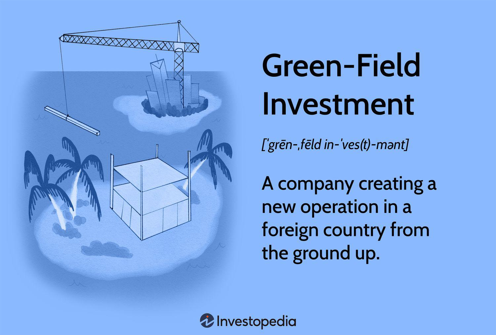

In the modern business landscape, expanding into international markets has become a strategic imperative for many companies seeking growth and diversification. As globalization continues to break down barriers, businesses are increasingly exploring opportunities beyond their domestic borders. This article investigates the key strategies employed by companies pursuing international acquisitions and greenfield investments—two prominent approaches to global expansion.

International acquisitions involve purchasing existing companies in foreign markets, thereby providing an immediate market presence along with established supply chains, customer bases, and operational infrastructure. This method can significantly reduce the time-to-market and aligns with local business regulations owing to the acquired company’s established setup. On the other hand, greenfield investments consist of building new operational facilities from the ground up in foreign territories, granting greater control over brand integration and alignment with the parent company’s operational standards. However, this method presents challenges such as higher initial costs, longer time-to-market, and the requirement to navigate local legal frameworks.



The interaction between these strategies and the use of algorithmic trading represents another layer of complexity. Algorithmic trading can transform international investment strategies by enhancing financial outcomes through efficient risk management and dynamic adaptation to market fluctuations. By integrating data-driven decision-making processes, businesses can assess market entry strategies that are backed by quantitative analysis and real-time insights.

This article aims to provide a comprehensive guide for stakeholders aspiring to navigate the complexities of global expansion. By contrasting international acquisitions and greenfield investments, and exploring the role of algorithmic trading, we deliver insights into how companies can strategically position themselves in the global arena. As businesses venture into international markets, a keen understanding of these strategies, coupled with the utilization of advanced trading algorithms, is essential for optimizing investment efficiency and achieving sustainable growth.

## Table of Contents

## Understanding International Acquisition

International acquisition involves purchasing an existing company in a foreign market, providing acquiring firms with immediate access to that market. By securing a pre-established entity, companies can tap into networks already in place, including supply chains, customer bases, and operational infrastructures. This instantaneous market presence can lead to faster revenue generation as it bypasses the often time-consuming process of establishing a new venture from the ground up.

One of the primary advantages of international acquisitions is the reduced time-to-market. Acquiring a company means taking over its established operations, which includes complying with local business regulations that the company has already met. This aspect mitigates the bureaucratic and administrative hurdles a new entrant would typically face. Furthermore, existing employees, with their knowledge of the market and operational proficiency, can be retained, facilitating a smoother transition and continuity of business operations.

However, international acquisitions are not without challenges. Regulatory hurdles are a significant consideration. Different countries have distinct antitrust and competition laws that can impede or complicate mergers and acquisitions (M&A). These laws aim to prevent monopolistic practices and ensure competitive markets, requiring careful navigation through intricate legal frameworks. Additionally, cultural and socio-political dynamics might affect the acceptance and integration of the newly acquired entity within the existing corporate structure.

Integration challenges are another potential disadvantage. Merging different corporate cultures, operational processes, and management styles can create friction. Companies may face issues aligning the acquired firm's strategy, policies, and practices with those of the parent company. Effective integration requires strategic planning and sensitivity to avoid disrupting the existing business activities and to realize the full potential of the acquisition.

In summary, while international acquisitions offer the advantage of swift market entry and established operational benefits, they demand careful attention to regulatory compliance and integration processes to overcome potential obstacles effectively.

## Exploring Greenfield Investment

Greenfield investment involves establishing a new operational facility from the ground up in a foreign market. This approach is often leveraged to maintain greater control over brand integration and operational processes, ensuring they align meticulously with parent company standards. Through complete control from inception, companies can mold their business operations precisely to their specifications, a distinct advantage over other forms of foreign direct investment (FDI).

One of the significant benefits of greenfield investment lies in the potential government incentives offered to attract foreign capital. Many countries provide tax breaks, grants, and subsidies to entice multinational corporations to invest in their economies, fostering job creation and economic development. These incentives can significantly offset the initial costs associated with constructing new facilities.

Moreover, greenfield investment provides an opportunity to design and build a bespoke business operation. This customization allows for the deployment of cutting-edge technology and the implementation of industry best practices, which can result in more efficient and productive operations. The ability to create an optimal work environment from the start supports long-term strategic goals and competitive advantage in the target market.

However, the greenfield approach is not without its challenges. A primary concern is the higher initial costs compared to acquiring an existing company. Building new facilities involves significant capital expenditure, covering land acquisition, construction, equipment, and recruitment and training of a new workforce.

Additionally, greenfield projects typically require a longer time-to-market. The process of site selection, obtaining necessary permits, and construction can be significantly time-consuming, delaying the start of operations and subsequent revenue generation.

Another critical challenge is adherence to local laws and regulations. Navigating the legal landscape in a foreign country demands extensive research and potentially lengthy compliance processes. Cultural differences might also impact workforce management and operational practices, requiring a nuanced understanding and adaptation to local customs and business etiquette.

In summary, while greenfield investment offers substantial benefits in terms of control, customization, and potential economic incentives, it is essential to weigh these against the higher initial costs, extended time-to-market, and regulatory hurdles. Companies must thoroughly evaluate their strategic objectives and market conditions to determine whether a greenfield approach aligns with their global expansion strategies.

## Comparative Analysis: Acquisition vs. Greenfield

When comparing international acquisition and greenfield investment, it is crucial to analyze the conditions that make one strategy more favorable than the other. Market conditions, cost implications, and strategic alignment are key determinants in the selection process. 

**Cost-Analysis:**

International acquisitions typically offer a rapid entry into foreign markets, leveraging the existing infrastructure and customer base of the acquired company. However, this approach may involve substantial upfront costs, including acquisition premiums and due diligence expenses. In contrast, greenfield investments might require higher initial capital expenditure due to construction and setup costs. Nevertheless, they often provide more control over capital allocation and operational processes.

To assess financial viability, businesses frequently employ financial metrics such as Net Present Value (NPV), Internal Rate of Return (IRR), and Discounted Cash Flow (DCF). These tools help in determining the profitability and financial sustainability of each investment option. NPV, for instance, is calculated as:

$$
NPV = \sum_{t=0}^{n} \frac{R_t}{(1 + r)^t} - C_0
$$

where $R_t$ is the net cash inflow-outflows during a single period t, $r$ is the discount rate, and $C_0$ is the initial investment cost. A positive NPV indicates a potentially profitable investment.

Similarly, IRR is the discount rate at which the NPV of all cash flows from a particular project equals zero. It helps in understanding the expected rate of growth an investment might generate.

**Market Share Potential:**

The decision between acquisition and greenfield investment also depends on the potential for market share expansion. Acquisitions can quickly augment market share by absorbing an existing company's customer base and market position, reducing competitive pressures. On the other hand, greenfield investments can be strategically positioned to capture emerging market segments, adapting to local market needs without inheriting existing market constraints or liabilities.

**Strategic Alignment:**

Acquisitions generally align with companies looking to diversify quickly, integrate complementary products, or eliminate competition. This strategy may suit firms with robust integration capabilities and risk tolerance for cultural and operational challenges during post-acquisition integration.

Greenfield investments align well with organizations prioritizing brand control, innovation, and the integration of proprietary processes and technology. They are suitable for companies seeking to establish long-term presence and maintain consistent corporate standards across operations.

In conclusion, the choice between international acquisition and greenfield investment should be informed by a comprehensive analysis of financial metrics, market opportunities, and strategic objectives. The deployment of financial evaluation tools such as NPV, IRR, and DCF provides quantitative insights essential for decision-making.

## The Role of Algorithmic Trading in International Investments

Algorithmic trading, commonly known as 'algo trading', has become a pivotal tool in enhancing the financial efficiency of international investments. By utilizing complex algorithms to execute trades, businesses can manage risks and optimize trading strategies amidst the fluctuating dynamics of global markets. The deployment of algorithms allows investors to analyze vast datasets, identify trading patterns, and execute orders at speeds and frequencies that traditional human trading cannot achieve.

One of the primary benefits of [algorithmic trading](/wiki/algorithmic-trading) in international investments is its capacity for sophisticated risk management. Algorithms can process real-time data from international markets to evaluate potential risks and forecast market movements with high accuracy. This allows investors to mitigate risks by adjusting their trading positions in response to market signals. For example, Value at Risk (VaR) models can be integrated into algorithmic systems to quantify the potential loss in investment over a specific time frame, providing investors with a clearer understanding of their exposure.

Additionally, algorithmic trading enhances decision-making through optimized trading strategies that cater to international market conditions. By leveraging [machine learning](/wiki/machine-learning) and [artificial intelligence](/wiki/ai-artificial-intelligence), algorithms can adapt to patterns such as [volume](/wiki/volume-trading-strategy) shifts, currency fluctuations, and regulatory changes. For instance, statistical [arbitrage](/wiki/arbitrage) models can be applied to exploit pricing inefficiencies between different international markets, thereby maximizing returns.

The integration of algorithmic solutions also extends to market entry strategies. Algorithmic models can simulate various market scenarios, providing data-driven insights that inform entry strategies. These simulations help in understanding potential impacts of different market conditions and regulatory environments, thereby supporting more informed investment decisions. 

Incorporating Python as a tool for algorithmic trading brings an additional layer of accessibility and customization. Python's rich ecosystem of libraries, such as NumPy for numerical calculations and Pandas for data manipulation, allows for the development of robust trading algorithms. An example Python code snippet for a simple moving average crossover strategy might look like this:

```python
import pandas as pd

def moving_average_crossover(data, short_window, long_window):
    data['short_mavg'] = data['price'].rolling(window=short_window, min_periods=1).mean()
    data['long_mavg'] = data['price'].rolling(window=long_window, min_periods=1).mean()
    signals = pd.DataFrame(index=data.index)
    signals['signal'] = 0.0
    signals['signal'][short_window:] = np.where(data['short_mavg'][short_window:] > data['long_mavg'][short_window:], 1.0, 0.0)
    signals['positions'] = signals['signal'].diff()
    return signals

# Example usage:
# data = pd.DataFrame({'price': price_series})
# signals = moving_average_crossover(data, short_window=40, long_window=100)
```

This code calculates the short-term and long-term moving averages for an asset's price, generating trading signals when the short-term average crosses above or below the long-term average. Such strategies, when enhanced by the precision and speed of algorithmic execution, can significantly improve the success rate of international investments.

In summary, algorithmic trading offers a transformative approach to managing and optimizing international investments. Through advanced analytics, real-time risk assessment, and strategic execution, algorithmic trading empowers investors to navigate the complexities of global markets with agility and precision.

## Case Studies and Real-World Applications

Multinational corporations often pursue expansion through international acquisitions and greenfield investments to gain strategic advantages and enhance their market footprint. Some well-documented cases provide valuable insights into the effectiveness and challenges of these strategies. 

A notable example of international acquisition is the acquisition of Cadbury by Kraft Foods in 2010. By purchasing Cadbury, Kraft not only expanded its portfolio into the confectionery market but also gained access to Cadbury's established distribution networks and strong brand presence, particularly in emerging markets like India and Brazil. This acquisition was facilitated by Kraft’s thorough market analysis and understanding of Cadbury’s operational strengths, which minimized integration challenges and regulatory hurdles [1].

In contrast, a successful greenfield investment is Toyota's establishment of a manufacturing plant in Mississippi, USA. In this case, Toyota opted to build from scratch to fully control production standards and quality. The greenfield strategy allowed Toyota to integrate its advanced manufacturing technologies seamlessly and tailor operations to specific market needs in the U.S., avoiding potential cultural and operational clashes inherent in acquisitions [2]. Furthermore, local government incentives reduced initial costs, favoring the greenfield approach.

Algorithmic trading has increasingly influenced international investment strategies, optimizing financial outcomes by enhancing risk management and trading efficiency. For instance, hedge funds and investment banks employ algorithms to manage currency risks associated with cross-border acquisitions. These algorithms analyze market data rapidly, executing trades to mitigate unfavorable currency fluctuations. The integration of algorithmic trading in the acquisition of a European firm by a U.S.-based company mitigated risks associated with the volatile Euro, securing better foreign exchange rates and reducing transaction costs.

Moreover, algorithms can enhance decision-making processes by evaluating market conditions and investment viability through quantitative models such as Net Present Value (NPV). For example, using Python, a simplified model may look like this:

```python
def npv(rate, cash_flows):
    return sum(cf / (1 + rate) ** i for i, cf in enumerate(cash_flows))

cash_flows = [-1000000, 200000, 300000, 400000, 500000]  # Example cash flows
rate = 0.08  # 8% discount rate
print(npv(rate, cash_flows))
```

This algorithm calculates the NPV of an investment, assisting companies in evaluating the financial viability of expansion projects, whether through acquisition or greenfield investment.

In conclusion, successful international business endeavors hinge on aligning strategic intentions with market realities. Lessons learned include the importance of conducting thorough due diligence, leveraging local market expertise, and incorporating modern technological solutions like algorithmic trading to refine investment strategies. By applying these best practices, companies can navigate the complex landscape of international expansion more effectively.

References:
1. Kraft's Cadbury acquisition fine-tunes global strategy. (2010). Financial Times. Retrieved from [Financial Times](https://www.ft.com)
2. Toyota USA manufacturing. (n.d.). Toyota Motor Corporation. Retrieved from [Toyota](https://corporatenews.pressroom.toyota.com)

## Concluding Insights

International acquisitions and greenfield investments offer distinct pathways for companies aiming to expand their operations into foreign markets. Each strategy presents its own set of advantages and challenges, making the decision a critical one for businesses poised for global growth.

International acquisitions primarily facilitate rapid entry into a new market. By purchasing an existing entity, companies can quickly establish a market presence, leveraging the acquired firm’s existing customer base, supply chains, and operational infrastructure. This approach minimizes time-to-market and provides a degree of regulatory compliance from the outset. However, acquisitions pose integration challenges, including cultural alignment and harmonization of systems, as well as potential regulatory hurdles specific to mergers and acquisitions in foreign jurisdictions.

Conversely, greenfield investments involve establishing new operations from the ground up. This method affords greater control over branding and adherence to the parent company’s operational norms and standards. While allowing for a customized approach and potentially attracting government incentives, greenfield investments demand substantial capital investment and entail a lengthy setup period. Firms also face the challenge of navigating local legal frameworks and market conditions.

When choosing between these strategies, companies must perform a thorough assessment of their market conditions and strategic objectives. Tools like Net Present Value (NPV), Internal Rate of Return (IRR), and Discounted Cash Flow (DCF) analysis can provide valuable quantitative backing to such decisions, as they offer insights into potential financial returns and risks associated with each investment route.

Furthermore, the integration of algorithmic trading in international investment strategies has become increasingly significant. Algorithmic trading, with its capacity for processing large datasets and executing trades at high speeds, enhances risk management and resource allocation in fluctuating market environments. By incorporating algorithms, companies can gain data-driven insights and optimize their investment strategies, thus improving their financial performance in international markets.

In summary, both international acquisitions and greenfield investments are viable strategies for global market expansion, each with unique benefits and drawbacks. A nuanced understanding of market conditions, strategic alignment with company goals, and the adept use of algorithmic trading can provide businesses with a competitive edge in optimizing global investment strategies. This multifaceted approach ensures that companies not only successfully enter international markets but also sustain growth and profitability in a competitive global landscape.

## References & Further Reading

[1]: Katz, J. O., & McCormick, D. (2000). ["The Encyclopedia of Trading Strategies"](https://www.amazon.com/Encyclopedia-Trading-Strategies-Jeffrey-Ph-D/dp/0070580995). Wiley.

[2]: Markowitz, H. M. (1952). ["Portfolio Selection"](https://onlinelibrary.wiley.com/doi/abs/10.1111/j.1540-6261.1952.tb01525.x). Journal of Finance, 7(1), 77-91.

[3]: Brealey, R. A., Myers, S. C., & Allen, F. (2019). ["Principles of Corporate Finance"](https://www.mheducation.com/highered/product/Principles-of-Corporate-Finance-Brealey.html). McGraw-Hill Education.

[4]: Fernald, J. G. (2015). ["Productivity and Potential Output Before, During, and After the Great Recession"](https://www.nber.org/papers/w20248). Federal Reserve Bank of San Francisco.

[5]: Harvard Business Review. (2015). ["How Smart, Connected Products Are Transforming Competition"](https://hbr.org/2015/10/how-smart-connected-products-are-transforming-companies). Harvard Business Review.