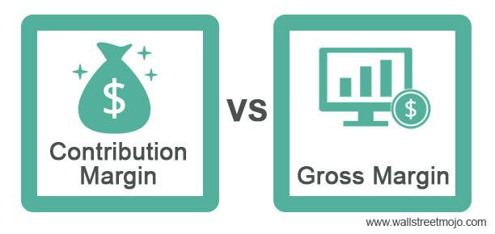

In today's fast-paced financial markets, algorithmic trading has become an essential component, enabling traders to execute trades with remarkable speed and precision. As this trading paradigm continues to grow in prominence, the understanding and application of key financial metrics such as gross margin and contribution margin become critical in optimizing trading strategies. Gross margin, defined as the proportion of revenue that exceeds the cost of goods sold (COGS), and contribution margin, which measures the difference between sales revenue and variable production costs, serve as vital indicators of a business's efficiency and profitability.

In the context of algorithmic trading, these financial metrics provide valuable insights into the cost structure and profit potential of trading strategies. By analyzing gross and contribution margins, traders can assess operational efficiency and make informed decisions that enhance both profitability and efficiency. As algorithmic trading continues to evolve, incorporating these metrics into financial analyses becomes increasingly necessary to ensure trading strategies remain competitive and financially viable. This article explores the significance of gross and contribution margins in financial analyses and their role in enhancing trading strategies within algorithmic trading.

## Table of Contents

## Understanding Gross Margin

Gross margin, often referred to as the gross profit margin, is a fundamental metric in financial analysis that quantifies the proportion of revenue exceeding the cost of goods sold (COGS). It is expressed as a percentage and calculated using the formula:

$$
\text{Gross Margin (\%)} = \left( \frac{\text{Revenue} - \text{COGS}}{\text{Revenue}} \right) \times 100
$$

This metric serves as a vital indicator of a company's core operational efficiency by revealing the percentage of revenue that remains after accounting for the direct costs of producing goods or services. A high gross margin suggests that a company is managing its production processes efficiently, thereby retaining more of its sales revenue as profit. This efficiency can provide businesses with a substantial competitive advantage, as it implies better control over production costs and the ability to generate higher profits from sales.

Gross margin is not a static figure and can vary significantly across different industries. For instance, technology companies may experience higher gross margins due to lower variable costs associated with digital products, while manufacturing industries may have narrower margins due to higher production expenses. Therefore, benchmarking within specific sectors is crucial, as it enables companies to assess their performance relative to industry standards.

In summary, understanding and analyzing gross margin is essential for businesses aiming to optimize operational efficiency and identify areas for cost improvement. By benchmarking against industry peers, businesses can set realistic goals for enhancing their gross margins and ultimately strengthen their market position.

## Contribution Margin Explained

The contribution margin represents the difference between sales revenue and the variable costs associated with producing additional units of a product. This metric can be expressed either as a percentage or in dollar terms. It serves as an essential indicator of the per-unit profitability once variable expenses have been covered. The formula to calculate the contribution margin in monetary terms is:

$$
\text{Contribution Margin} = \text{Sales Revenue} - \text{Variable Costs}
$$

To express the contribution margin as a percentage, the formula is:

$$
\text{Contribution Margin Ratio} = \left(\frac{\text{Sales Revenue} - \text{Variable Costs}}{\text{Sales Revenue}}\right) \times 100
$$

Unlike gross margin, the contribution margin specifically focuses on variable production costs, excluding fixed costs. This focus on variable costs makes it particularly useful for conducting a breakeven analysis, which determines the number of units that must be sold to cover all production costs. It is also instrumental in pricing decisions, as it helps assess how additional sales will affect profits.

By understanding the contribution margin, businesses can make informed decisions about pricing, cost control, and product line expansion. Analyzing this metric allows companies to identify low-margin products that may require price adjustments or cost reduction strategies to improve profitability.

## Gross Margin vs. Contribution Margin: Key Differences

Gross margin and contribution margin, while both essential financial metrics, serve distinct purposes and audiences by focusing on different aspects of a company's cost structure. 

Gross margin is calculated using the formula:

$$
\text{Gross Margin (\%)} = \left( \frac{\text{Revenue} - \text{Cost of Goods Sold (COGS)}}{\text{Revenue}} \right) \times 100
$$

This metric reflects the percentage of revenue that exceeds the cost of goods sold, encompassing both fixed and variable production costs. Gross margin is crucial for external reporting and provides a broad view of a company's overall profitability. Stakeholders such as investors and financial analysts often use it to evaluate a company's efficiency in managing production processes and to compare profitability across companies and industries.

On the other hand, contribution margin isolates variable costs from total revenue, providing insight into the profitability of individual products or units. It can be calculated using the formula:

$$
\text{Contribution Margin (\%)} = \left( \frac{\text{Sales Revenue} - \text{Variable Costs}}{\text{Sales Revenue}} \right) \times 100
$$

This measure focuses solely on variable costs and is vital for internal decision-making. It aids managers in conducting breakeven analysis, making pricing decisions, and evaluating the impact of fixed costs on profitability.

Understanding the scope and implementation of these metrics is critical for accurate financial analysis and strategic planning. While gross margin offers a macro-level perspective, contribution margin provides a micro-level approach, tailored to individual product lines. Together, they offer a comprehensive financial view, enabling more informed decision-making and strategy development.

## The Role of Financial Metrics in Algo Trading

In [algorithmic trading](/wiki/algorithmic-trading), financial metrics such as gross and contribution margins are essential for the evaluation and optimization of trading strategies. Understanding and applying these metrics can lead to enhanced decision-making and performance assessment within trading systems. By analyzing gross margin, traders gain insight into the fundamental cost structure and efficiency of operations. Gross margin, defined as $(\text{Revenue} - \text{COGS}) / \text{Revenue} \times 100$, provides a snapshot of how well a company manages its core production costs relative to sales revenue. This helps algorithmic traders assess the intrinsic efficiency of their strategies in managing transaction costs.

Conversely, the contribution margin, calculated as $(\text{Sales Revenue} - \text{Variable Costs})$, focuses on the profitability of individual trades by considering variable expenses. This metric aids in understanding the profitability scalability of trading strategies, as it emphasizes the impact of variable costs on profitability.

Financial metrics facilitate the continuous assessment of cost efficiency and profitability in real-time trading environments, ensuring that algorithms remain financially viable. By integrating a gross margin analysis, algorithmic traders can pinpoint inefficiencies and areas for optimization within their strategies, ultimately leading to more informed strategic decisions and improved trading performance. Leveraging these insights allows traders to fine-tune their algorithms to react adaptively to changing market conditions, thereby enhancing the overall effectiveness and profitability of trading systems.

## Challenges in Algo Trading and Metric Utilization

Algorithmic trading, while transformative for financial markets, presents several challenges that can affect the accuracy and reliability of financial metrics such as gross and contribution margins. One of the primary challenges is the risk of overfitting, where trading models are excessively tailored to historical data. This can lead to poor performance in live markets, as the model may fail to account for unforeseen variables and real-time dynamics.

High transaction costs also pose a significant challenge to the efficacy of algorithmic trading. Frequent trading can accumulate substantial costs, including brokerage fees and market impact costs, eroding any potential profits projected by an algorithm. These costs can distort the profitability metrics considered crucial for evaluating trading strategies, such as gross and contribution margins.

To ensure strategies remain resilient in dynamic market conditions, robust risk management practices and comprehensive cost analyses must be implemented. Risk management involves identifying potential market risks, analyzing their impact, and enacting strategies to mitigate these risks. Tools such as stop-loss orders and portfolio diversification are commonly employed to manage risk exposure effectively.

Furthermore, thorough cost analysis is essential for quantifying the impact of transaction-related expenses. By integrating cost data into profitability models, traders can assess the true financial viability of their strategies. This analysis allows for adjustments to be made, balancing the trade-off between potential profits and incurred costs.

Incorporating insights from gross and contribution margins can be instrumental in tackling these challenges. Gross margin analysis aids in understanding the efficiency of resources and cost structures, while contribution margin insights help in refining pricing and production decisions. By utilizing these metrics, algorithmic traders can enhance their strategies to align with desired financial outcomes. For example, the calculation of contribution margin per trade can guide the refinement of trade execution strategies to minimize variable costs and optimize overall profitability.

By addressing overfitting, managing transaction costs, and employing financial metrics wisely, algorithmic trading strategies can be aligned more closely with financial goals, ensuring economic viability and enhanced trading performance in an ever-evolving market landscape.

## Conclusion

Evaluating gross and contribution margins is essential for optimizing profitability in algorithmic trading. These financial metrics provide critical insights into cost structure and profitability, allowing traders to assess and refine their strategies effectively. A thorough understanding of gross and contribution margins enables traders to identify the most profitable assets and trading strategies, leading to more efficient capital allocation and enhanced trading performance.

Traders should remain adaptive by fine-tuning strategies to accommodate evolving market conditions. This requires a dynamic approach where financial metrics are continuously integrated into decision-making processes. By analyzing trends and patterns in gross and contribution margins, traders can adjust their algorithms to respond swiftly to market changes, thus improving the agility and responsiveness of their trading systems.

Leveraging these metrics effectively empowers traders to enhance their trading systems, ensuring consistent profitability and long-term success. By maintaining a focus on cost efficiency and profitability, traders can optimize their strategies to minimize risk and maximize returns. This disciplined approach to trading ensures that algorithmic strategies remain robust and sustainable, capable of delivering reliable performance across varying market conditions. As a result, the strategic application of gross and contribution margin analysis within algorithmic trading frameworks is a powerful tool for achieving financial success.

## References & Further Reading

[1]: Bergstra, J., Bardenet, R., Bengio, Y., & Kégl, B. (2011). ["Algorithms for Hyper-Parameter Optimization."](https://papers.nips.cc/paper/4443-algorithms-for-hyper-parameter-optimization) Advances in Neural Information Processing Systems 24.

[2]: ["Advances in Financial Machine Learning"](https://www.amazon.com/Advances-Financial-Machine-Learning-Marcos/dp/1119482089) by Marcos Lopez de Prado

[3]: ["Evidence-Based Technical Analysis: Applying the Scientific Method and Statistical Inference to Trading Signals"](https://www.amazon.com/Evidence-Based-Technical-Analysis-Scientific-Statistical/dp/0470008741) by David Aronson

[4]: ["Machine Learning for Algorithmic Trading"](https://github.com/PacktPublishing/Machine-Learning-for-Algorithmic-Trading-Second-Edition) by Stefan Jansen

[5]: ["Quantitative Trading: How to Build Your Own Algorithmic Trading Business"](https://www.amazon.com/Quantitative-Trading-Build-Algorithmic-Business/dp/1119800064) by Ernest P. Chan