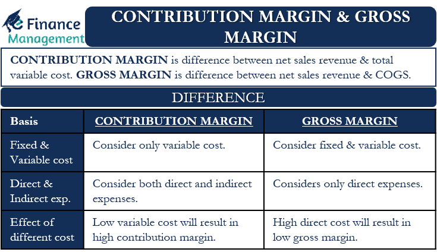

## Table of Contents

## What is Gross Margin?

Gross margin is a way to measure how much money a business makes from selling its products or services after paying for the costs to make or buy those products. It's like figuring out how much profit you have left after covering the basic expenses of what you're selling. To find the gross margin, you take the total sales revenue and subtract the cost of goods sold (COGS). The result is then divided by the total sales revenue and turned into a percentage. This percentage shows what portion of each dollar of revenue is profit before other business costs are taken out.

Understanding gross margin is important because it helps business owners see if they're pricing their products correctly and if they're managing their production costs well. If the gross margin is high, it means the business is doing a good job at making money from its sales. But if the gross margin is low, it might be a sign that the business needs to either increase prices or find ways to reduce the costs of making or buying their products. By keeping an eye on gross margin, a business can make better decisions to improve its overall profitability.

## What is Contribution Margin?

Contribution margin is a way to see how much money is left from sales after paying for the costs to make or buy the products you're selling. It's different from gross margin because it only looks at the variable costs, which are costs that change depending on how much you produce or sell. Things like materials and direct labor are variable costs. The contribution margin helps you understand how much each product contributes to covering the fixed costs, like rent and salaries, and then to profit.

To calculate the contribution margin, you take the sales revenue and subtract the variable costs. What you get is the contribution margin in dollars. If you want to know the contribution margin ratio, you divide the contribution margin by the sales revenue and turn it into a percentage. This percentage tells you what part of each sales dollar is left to cover fixed costs and profit. Knowing the contribution margin is useful for deciding on pricing, choosing which products to focus on, and figuring out how changes in sales volume affect your profits.

## How is Gross Margin calculated?

Gross margin is a number that shows how much money a business makes from selling its products or services after paying for the costs to make or buy those products. It's important because it helps business owners understand if they are making enough money from their sales to cover their costs and make a profit. To calculate the gross margin, you start with the total sales revenue, which is all the money you get from selling your products or services. Then, you subtract the cost of goods sold (COGS), which includes the costs directly related to making or buying the products you sell, like materials and direct labor.

After subtracting the COGS from the total sales revenue, you get the gross profit. To find the gross margin percentage, you divide the gross profit by the total sales revenue and then multiply by 100 to turn it into a percentage. This percentage tells you what part of each dollar of sales is left after paying for the costs of the products sold. A higher gross margin percentage means the business is doing well at making money from its sales before other costs are taken into account. By keeping track of the gross margin, business owners can make better decisions about pricing and managing costs to improve their overall profitability.

## How is Contribution Margin calculated?

Contribution margin is a way to see how much money is left from sales after paying for the costs to make or buy the products you're selling. It's different from gross margin because it only looks at the variable costs. These are costs that change depending on how much you produce or sell, like materials and direct labor. To calculate the contribution margin, you start with the sales revenue, which is all the money you get from selling your products. Then, you subtract the variable costs. What you get is the contribution margin in dollars. This number shows how much each product contributes to covering the fixed costs, like rent and salaries, and then to profit.

If you want to know the contribution margin ratio, you divide the contribution margin by the sales revenue and turn it into a percentage. This percentage tells you what part of each sales dollar is left to cover fixed costs and profit. Knowing the contribution margin is useful for deciding on pricing, choosing which products to focus on, and figuring out how changes in sales volume affect your profits. By keeping an eye on the contribution margin, business owners can make better decisions to improve their overall profitability.

## What are the key differences between Gross Margin and Contribution Margin?

Gross margin and contribution margin are both important ways to measure how much money a business makes, but they look at different things. Gross margin is what's left after you take away the cost of goods sold (COGS) from the total sales revenue. COGS includes the costs directly related to making or buying the products you sell, like materials and direct labor. The gross margin percentage shows what part of each dollar of sales is profit before you pay for other business costs like rent and salaries. It helps business owners see if they're pricing their products right and managing their production costs well.

Contribution margin, on the other hand, only looks at the variable costs, which are costs that change depending on how much you produce or sell. These costs include things like materials and direct labor. To find the contribution margin, you subtract the variable costs from the sales revenue. The contribution margin shows how much each product contributes to covering the fixed costs, like rent and salaries, and then to profit. The contribution margin ratio tells you what part of each sales dollar is left to cover fixed costs and profit. It's useful for deciding on pricing, choosing which products to focus on, and understanding how changes in sales volume affect profits.

In simple terms, gross margin gives you a broad view of profitability by considering all costs directly related to the products sold, while contribution margin focuses on the impact of variable costs and helps you understand how each sale contributes to covering fixed costs and making a profit. Both are important for making smart business decisions, but they serve different purposes and give you different insights into your business's financial health.

## Why is Gross Margin important for a business?

Gross margin is really important for a business because it shows how well the business is making money from selling its products or services. It's like figuring out how much profit is left after paying for the costs to make or buy those products. By looking at the gross margin, business owners can see if they are setting the right prices for their products. If the gross margin is high, it means the business is doing a good job at making money from its sales before other costs come into play. But if the gross margin is low, it might mean the business needs to either raise prices or find ways to make the products cheaper to produce.

Understanding gross margin also helps businesses keep an eye on their costs. If the cost of goods sold (COGS) goes up, the gross margin goes down unless the business can increase its prices. This can be a warning sign that something needs to change. By watching the gross margin, a business can make better decisions about how to manage costs and improve overall profitability. It's a key number that helps business owners see the health of their business and plan for the future.

## Why is Contribution Margin important for a business?

Contribution margin is important for a business because it shows how much money is left from sales after paying for the costs that change with how much you produce or sell. These costs, like materials and direct labor, are called variable costs. By looking at the contribution margin, business owners can see how much each product helps to pay for the costs that stay the same no matter how much you sell, like rent and salaries. These are called fixed costs. Knowing the contribution margin helps businesses decide if they are setting the right prices for their products and if they should focus on selling more of certain items.

Understanding the contribution margin also helps a business figure out how changes in sales can affect its profits. If the contribution margin is high, it means more money is left over to cover fixed costs and then go toward profit. This can be really helpful for making decisions about pricing, choosing which products to focus on, and planning for the future. By keeping an eye on the contribution margin, business owners can make smart choices to improve their overall profitability and ensure their business stays healthy.

## How do Gross Margin and Contribution Margin impact pricing strategies?

Gross margin helps businesses decide on pricing by showing how much money is left after paying for the costs to make or buy the products. If the gross margin is low, it might mean the business needs to raise prices to make more money or find ways to make the products cheaper. On the other hand, if the gross margin is high, the business might be able to lower prices a bit to sell more products without losing too much profit. By looking at the gross margin, business owners can see if their prices are right and make changes to keep their business healthy.

Contribution margin also helps with pricing decisions by showing how much money is left after paying for the costs that change with how much you produce or sell. This number helps businesses see how much each product helps to cover the costs that stay the same, like rent and salaries. If the contribution margin is high, a business might lower prices to sell more and still make enough money to cover those fixed costs. If it's low, the business might need to raise prices or focus on selling products with a higher contribution margin. By understanding the contribution margin, businesses can make smart choices about which products to focus on and how to price them to make more profit.

## Can you provide examples of how Gross Margin and Contribution Margin are used in different industries?

In the retail industry, gross margin is used to see how much money is left after paying for the products they sell. For example, a clothing store buys t-shirts for $10 each and sells them for $25. The cost of goods sold (COGS) is $10, and the sales revenue is $25. The gross profit is $25 - $10 = $15. The gross margin percentage is ($15 / $25) * 100 = 60%. This means for every dollar of sales, the store keeps 60 cents before other costs like rent and salaries. If the store's gross margin starts to drop, they might need to raise prices or find cheaper suppliers to keep making a profit.

In the manufacturing industry, contribution margin is important for deciding which products to focus on. For example, a company makes two types of gadgets: Gadget A and Gadget B. Gadget A sells for $100, and the variable costs to make it are $60, so the contribution margin is $100 - $60 = $40. Gadget B sells for $150, and the variable costs are $120, so the contribution margin is $150 - $120 = $30. Even though Gadget B sells for more, Gadget A has a higher contribution margin. The company might decide to focus on selling more of Gadget A because it contributes more to covering fixed costs like factory rent and then to profit.

In the restaurant industry, both gross margin and contribution margin are used to manage pricing and menu choices. For gross margin, a restaurant might look at the cost of ingredients for a dish versus its selling price. If a pizza costs $5 to make and sells for $15, the gross profit is $15 - $5 = $10, and the gross margin percentage is ($10 / $15) * 100 = 66.67%. For contribution margin, the restaurant considers variable costs like ingredients and direct labor. If a burger sells for $10 and the variable costs are $4, the contribution margin is $10 - $4 = $6. This helps the restaurant decide which menu items are more profitable and might influence pricing or menu changes to improve overall profitability.

## How do changes in variable costs affect Gross Margin and Contribution Margin?

Changes in variable costs can really affect both gross margin and contribution margin, but in different ways. Gross margin is the money left after paying for the costs to make or buy the products you sell. If the variable costs go up, like if the price of materials goes up, the cost of goods sold (COGS) goes up too. This means less money is left after paying for the products, so the gross margin goes down. If a business can't raise prices to cover the higher costs, they might need to find other ways to make the products cheaper or they could lose money.

Contribution margin looks only at the variable costs, so it's even more sensitive to changes in these costs. The contribution margin is the money left after paying for the costs that change with how much you produce or sell. If variable costs go up, the contribution margin goes down because less money is left to cover the fixed costs like rent and salaries. This can be a big problem because it means each product helps less to cover those costs and make a profit. Businesses might need to raise prices or find ways to lower variable costs to keep their contribution margin healthy.

## What role do fixed costs play in the calculation of Gross Margin versus Contribution Margin?

Fixed costs don't play a direct role in calculating gross margin. Gross margin is all about the money left after paying for the costs to make or buy the products you sell. These costs are called the cost of goods sold (COGS). Fixed costs, like rent and salaries, come into play after you figure out the gross margin. They are part of the other costs a business has to pay, but they don't change the gross margin number itself. So, when you're figuring out gross margin, you only look at the costs that go into making or buying the products, not the fixed costs.

On the other hand, fixed costs are really important when you're looking at contribution margin. Contribution margin is the money left after paying for the costs that change with how much you produce or sell, like materials and direct labor. These are called variable costs. The contribution margin shows how much each product helps to cover the fixed costs and then go toward profit. So, when you calculate the contribution margin, you're thinking about how the money left after variable costs can help pay for things like rent and salaries. This makes the contribution margin a key number for understanding how well a business can cover its fixed costs and make a profit.

## How can a company use Gross Margin and Contribution Margin to make strategic business decisions?

A company can use gross margin to see if they are making enough money from selling their products after paying for what it costs to make or buy them. If the gross margin is high, it means the company is doing well at making money from sales before other costs come into play. This can help the company decide if they can lower prices to sell more products or if they should keep prices the same to keep a high profit. If the gross margin is low, the company might need to raise prices or find cheaper ways to make their products. By keeping an eye on gross margin, the company can make smart choices about pricing and cost management to stay profitable.

Contribution margin helps a company see how much money is left from sales after paying for the costs that change with how much they produce or sell. This number shows how each product helps to cover the costs that stay the same, like rent and salaries, and then go toward profit. If the contribution margin is high, the company might decide to focus on selling more of those products or lower prices to sell more without losing too much profit. If it's low, the company might need to raise prices or focus on products with a higher contribution margin. By understanding the contribution margin, the company can make better decisions about which products to focus on and how to price them to improve overall profitability.

## What is Gross Margin and How is it Understood?

Gross margin, often referred to as the gross profit margin, is a fundamental metric in financial analysis that quantifies the proportion of revenue exceeding the cost of goods sold (COGS). It is expressed as a percentage and calculated using the formula:

$$
\text{Gross Margin (\%)} = \left( \frac{\text{Revenue} - \text{COGS}}{\text{Revenue}} \right) \times 100
$$

This metric serves as a vital indicator of a company's core operational efficiency by revealing the percentage of revenue that remains after accounting for the direct costs of producing goods or services. A high gross margin suggests that a company is managing its production processes efficiently, thereby retaining more of its sales revenue as profit. This efficiency can provide businesses with a substantial competitive advantage, as it implies better control over production costs and the ability to generate higher profits from sales.

Gross margin is not a static figure and can vary significantly across different industries. For instance, technology companies may experience higher gross margins due to lower variable costs associated with digital products, while manufacturing industries may have narrower margins due to higher production expenses. Therefore, benchmarking within specific sectors is crucial, as it enables companies to assess their performance relative to industry standards.

In summary, understanding and analyzing gross margin is essential for businesses aiming to optimize operational efficiency and identify areas for cost improvement. By benchmarking against industry peers, businesses can set realistic goals for enhancing their gross margins and ultimately strengthen their market position.

## What is Contribution Margin Explained?

The contribution margin represents the difference between sales revenue and the variable costs associated with producing additional units of a product. This metric can be expressed either as a percentage or in dollar terms. It serves as an essential indicator of the per-unit profitability once variable expenses have been covered. The formula to calculate the contribution margin in monetary terms is:

$$
\text{Contribution Margin} = \text{Sales Revenue} - \text{Variable Costs}
$$

To express the contribution margin as a percentage, the formula is:

$$
\text{Contribution Margin Ratio} = \left(\frac{\text{Sales Revenue} - \text{Variable Costs}}{\text{Sales Revenue}}\right) \times 100
$$

Unlike gross margin, the contribution margin specifically focuses on variable production costs, excluding fixed costs. This focus on variable costs makes it particularly useful for conducting a breakeven analysis, which determines the number of units that must be sold to cover all production costs. It is also instrumental in pricing decisions, as it helps assess how additional sales will affect profits.

By understanding the contribution margin, businesses can make informed decisions about pricing, cost control, and product line expansion. Analyzing this metric allows companies to identify low-margin products that may require price adjustments or cost reduction strategies to improve profitability.

## What are the key differences between Gross Margin and Contribution Margin?

Gross margin and contribution margin, while both essential financial metrics, serve distinct purposes and audiences by focusing on different aspects of a company's cost structure. 

Gross margin is calculated using the formula:

$$
\text{Gross Margin (\%)} = \left( \frac{\text{Revenue} - \text{Cost of Goods Sold (COGS)}}{\text{Revenue}} \right) \times 100
$$

This metric reflects the percentage of revenue that exceeds the cost of goods sold, encompassing both fixed and variable production costs. Gross margin is crucial for external reporting and provides a broad view of a company's overall profitability. Stakeholders such as investors and financial analysts often use it to evaluate a company's efficiency in managing production processes and to compare profitability across companies and industries.

On the other hand, contribution margin isolates variable costs from total revenue, providing insight into the profitability of individual products or units. It can be calculated using the formula:

$$
\text{Contribution Margin (\%)} = \left( \frac{\text{Sales Revenue} - \text{Variable Costs}}{\text{Sales Revenue}} \right) \times 100
$$

This measure focuses solely on variable costs and is vital for internal decision-making. It aids managers in conducting breakeven analysis, making pricing decisions, and evaluating the impact of fixed costs on profitability.

Understanding the scope and implementation of these metrics is critical for accurate financial analysis and strategic planning. While gross margin offers a macro-level perspective, contribution margin provides a micro-level approach, tailored to individual product lines. Together, they offer a comprehensive financial view, enabling more informed decision-making and strategy development.

## References & Further Reading

[1]: Bergstra, J., Bardenet, R., Bengio, Y., & Kégl, B. (2011). ["Algorithms for Hyper-Parameter Optimization."](https://papers.nips.cc/paper/4443-algorithms-for-hyper-parameter-optimization) Advances in Neural Information Processing Systems 24.

[2]: ["Advances in Financial Machine Learning"](https://www.amazon.com/Advances-Financial-Machine-Learning-Marcos/dp/1119482089) by Marcos Lopez de Prado

[3]: ["Evidence-Based Technical Analysis: Applying the Scientific Method and Statistical Inference to Trading Signals"](https://www.amazon.com/Evidence-Based-Technical-Analysis-Scientific-Statistical/dp/0470008741) by David Aronson

[4]: ["Machine Learning for Algorithmic Trading"](https://github.com/PacktPublishing/Machine-Learning-for-Algorithmic-Trading-Second-Edition) by Stefan Jansen

[5]: ["Quantitative Trading: How to Build Your Own Algorithmic Trading Business"](https://www.amazon.com/Quantitative-Trading-Build-Algorithmic-Business/dp/1119800064) by Ernest P. Chan