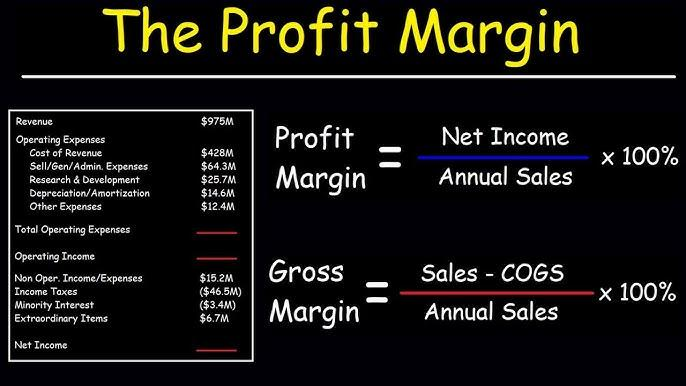

Algorithmic trading has emerged as a critical element in modern financial markets, significantly enhancing market efficiency and trading performance. The use of algorithms automates trading activities, allowing for faster execution and minimizing human intervention. This technological advancement has transformed the trading landscape, offering opportunities for traders to capitalize on speed and data analysis, thus optimizing their trading strategies.

Integral to the success of algorithmic trading is the comprehensive analysis of key financial metrics, particularly gross margin and profit margin. Gross margin, calculated as $\text{Gross Margin} = \frac{\text{Revenue} - \text{Cost of Goods Sold (COGS)}}{\text{Revenue}} \times 100$, provides insight into a company’s ability to manage its production costs relative to its sales. A high gross margin implies efficient cost management and competitive pricing, making it a focal point for traders assessing the viability of trading certain stocks.



Profit margin, typically the net profit margin, is another crucial metric that evaluates a company’s ability to convert revenue into actual profit after deducting all operational expenses. It is calculated as $\text{Profit Margin} = \frac{\text{Net Income}}{\text{Revenue}} \times 100$. This metric serves as an indicator of financial health and operational success, guiding traders in selecting investments that promise sustainable profitability.

This article explores how these financial metrics are integrated into algorithmic trading strategies to enhance decision-making processes. By leveraging data-driven insights from gross and profit margins, traders can tailor their algorithms to focus on both efficiency and profitability, ensuring robust performance in trading activities. Understanding the role of these metrics in financial analysis not only aids in refining trading strategies but also positions traders advantageously in the dynamic landscape of financial markets.

## Table of Contents

## Understanding Gross and Profit Margins

Gross margin and profit margin are two fundamental financial metrics that provide key insights into a company's operational efficiency and profitability. These metrics are crucial for traders and investors assessing the financial health and performance of a company.

**Gross Margin**

Gross margin is a measure of a company's operational efficiency, indicating the percentage of revenue that exceeds the cost of goods sold (COGS). It is calculated by subtracting COGS from total revenue and dividing the result by total revenue. The formula for gross margin is:

$$
\text{Gross Margin} = \left(\frac{\text{Revenue} - \text{COGS}}{\text{Revenue}}\right) \times 100
$$

This metric highlights how well a company manages its production and supply costs relative to its sales. A higher gross margin suggests that a company retains a larger portion of revenue as gross profit, which can be used to cover other operating expenses.

**Profit Margin**

Profit margin, often referred to as net profit margin, measures how effectively a company converts its revenue into net profit after accounting for all expenses, including operating expenses, interest, taxes, and other costs. The formula for calculating profit margin is:

$$
\text{Profit Margin} = \left(\frac{\text{Net Profit}}{\text{Revenue}}\right) \times 100
$$

Profit margin serves as a comprehensive indicator of a company's overall financial performance. A higher profit margin indicates a more profitable company, suggesting efficient management and strong financial health.

Both gross margin and profit margin are pivotal metrics in financial analysis as they provide distinct insights. Gross margin focuses on core operational efficiency, highlighting cost control in production and sales processes. On the other hand, profit margin provides a broader view of a company's profitability encompassing all financial activities.

These metrics are especially important for traders when evaluating a company's performance within its industry, comparing it with competitors, and assessing its potential in the financial markets. A comprehensive understanding of gross and profit margins enables traders to make informed decisions based on the operational and financial viability of targeted companies.

## The Role of Financial Metrics in Algo Trading

In [algorithmic trading](/wiki/algorithmic-trading), financial metrics like gross margin and profit margin are integral for enhancing trading strategies. By providing a framework for assessing cost structures and profit potential, these metrics help optimize trading algorithms towards maximizing efficiency and profitability.

Gross margin, defined as $(\text{Revenue} - \text{COGS}) / \text{Revenue}$, is a critical tool for evaluating the cost efficiency of trading strategies. By analyzing the gross margin, traders can assess how well a strategy converts sales into gross profit, which is indicative of its operational efficiency. In algo trading, gross margin analysis can help ensure strategies are not only executed rapidly but also run cost-effectively. This entails examining transaction costs and their impact on overall profitability, allowing traders to fine-tune strategies that minimize unnecessary expenditures while maximizing returns.

Profit margin, on the other hand, offers insights beyond sales figures, focusing on overall profitability after all costs are accounted for. The formula for profit margin is $(\text{Net Income} / \text{Revenue}) \times 100$. This metric allows traders to refine their trading strategies by prioritizing strategies that not only generate significant revenue but also convert a substantial portion of that revenue into net profit. Traders can use these insights to adjust their algorithmic models to balance revenue generation with cost management, ultimately striving for optimal profit outcomes.

Incorporating these financial metrics into algorithmic trading strategies enables traders to develop a more comprehensive understanding of their trading activities. By identifying and analyzing cost structures and profit capabilities, traders can optimize their algorithms, making informed, data-driven decisions that enhance financial performance. This symbiotic relationship between financial metrics and algorithmic trading ensures that traders remain competitive and effective in dynamic financial markets.

## Integrating Gross Margin into Algo Trading

Integrating gross margin into algorithmic trading strategies involves a thorough comprehension of production costs relative to revenue generation. Gross margin is defined as:

$$
\text{Gross Margin} = \frac{\text{Revenue} - \text{Cost of Goods Sold (COGS)}}{\text{Revenue}} \times 100
$$

This metric enables traders to assess the operational efficiency of a company and helps in identifying feasible trading opportunities. By setting specific margin targets, traders can automate decision-making processes in their strategies to align with desired financial goals.

To optimize algorithms for better margin management, traders can adjust for variable costs that may impact gross margins. For instance, a sudden increase in material costs can reduce margins, prompting the need for rapid strategy adjustments.

Python, along with other programming tools, plays a crucial role in this process. By automating financial data analysis, Python allows traders to integrate gross margin assessments efficiently into trading algorithms. Libraries such as Pandas and NumPy can be employed to manipulate financial data, while packages like SciPy offer statistical functions that assist in decision-making.

An example of how Python can be used to implement gross margin analysis is shown below:

```python
import pandas as pd
import numpy as np

# Example dataframe with revenue and COGS data
data = {
    'Company': ['A', 'B', 'C'],
    'Revenue': [1000, 1500, 1200],
    'COGS': [600, 900, 750]
}

df = pd.DataFrame(data)

# Calculating Gross Margin
df['Gross Margin'] = (df['Revenue'] - df['COGS']) / df['Revenue'] * 100

# Define margin targets and set an alert if the current margin falls below the target
margin_target = 30
df['Below Target'] = df['Gross Margin'] < margin_target

print(df)

# Output:
#   Company  Revenue  COGS  Gross Margin  Below Target
# 0       A     1000   600          40.0         False
# 1       B     1500   900          40.0         False
# 2       C     1200   750          37.5          True
```

In this example, the algorithm calculates the gross margin for each company and identifies those falling below a predefined target. Such automated analysis ensures that trading strategies remain responsive to changing financial metrics, maintaining profitability in various market conditions.

By leveraging technological tools to incorporate gross margin into trading algorithms, traders can systematically enhance the performance and sustainability of their strategies.

## Challenges and Considerations in Algo Trading

Algorithmic trading faces several challenges and considerations that traders must address to ensure effectiveness and profitability. One of the primary issues is overfitting. Overfitting occurs when a trading model is tailored too closely to historical data, capturing noise rather than the underlying trends. This typically leads to models that perform well in [backtesting](/wiki/backtesting) but fail in live market conditions. To mitigate overfitting, traders should implement cross-validation techniques and use out-of-sample testing to evaluate model robustness. Additionally, maintaining a balance between complexity and simplicity in model design helps avoid overfitting.

High transaction costs are another significant concern in algorithmic trading. These costs can substantially diminish theoretical profits, especially for high-frequency trading strategies where the [volume](/wiki/volume-trading-strategy) of trades is large. It's crucial to incorporate transaction cost analysis when developing trading strategies. Traders should focus on optimizing order execution to minimize slippage and utilizing algorithms that are cost-effective. 

Robust testing is essential for developing reliable algorithmic trading strategies. This involves comprehensive backtesting, including the use of walk-forward analysis to ensure that strategies hold up under various market conditions. Moreover, stress testing strategies against market shocks and anomalies can provide insights into potential vulnerabilities.

Adaptive algorithms offer a solution to the dynamic nature of markets. By continuously learning from new data and adjusting parameters accordingly, adaptive algorithms can better respond to market changes. Implementing [machine learning](/wiki/machine-learning) techniques, such as [reinforcement learning](/wiki/reinforcement-learning), can enhance the adaptability of these systems. Here’s a brief Python example showcasing a simple approach to adaptive trading:

```python
import numpy as np
from sklearn.model_selection import train_test_split
from sklearn.linear_model import LinearRegression

# Generate synthetic data as an example
np.random.seed(42)
X = np.random.rand(100, 1) * 100
y = 0.5 * X + np.random.normal(0, 10, (100, 1))

# Split data into train and test sets
X_train, X_test, y_train, y_test = train_test_split(X, y, test_size=0.2, random_state=42)

# Implement a simple regression model
model = LinearRegression()
model.fit(X_train, y_train)

# Evaluate the model
train_score = model.score(X_train, y_train)
test_score = model.score(X_test, y_test)

print(f"Training Score: {train_score}")
print(f"Test Score: {test_score}")

# Adaptive update placeholder (e.g., adjust strategy based on test performance)
if test_score < 0.8:
    # Strategy adjustment code or further model tuning can be performed here
    print("Adjusting strategy due to suboptimal performance")
```

In this example, a basic linear regression model is adapted based on its performance score, demonstrating a simple form of adaptability. The key takeaway is that algorithmic trading requires a thoughtful balance of robust strategy design, vigilant cost management, and adaptive techniques to thrive in the ever-changing financial markets.

## Conclusion

Gross and profit margins are vital metrics that provide substantial insights into the profitability and efficiency of trading strategies. These indicators allow traders to gauge the fiscal health of companies, enhancing the predictive accuracy of algorithmic models. By integrating these financial metrics into algorithmic trading, traders can develop more informed, data-driven decisions that bolster financial performance.

The gross margin, calculated as $(\text{Revenue} - \text{Cost of Goods Sold}) / \text{Revenue}$, serves as a measure of a company's operational efficiency. High gross margins indicate that a company is adept at converting a larger share of revenue into gross profit, which can be a signal to algorithmic traders about the company's potential cost advantages. Meanwhile, the profit margin, defined as $\text{Net Income} / \text{Revenue}$, reflects a company's ability to convert revenue into actual profit. This metric underscores the company's overall profitability after accounting for all expenses, providing a holistic measure of financial performance.

Integrating these metrics into trading algorithms involves not just their mechanical application but also a strategic interpretation of what these figures signify for a company's competitive position and market conditions. For instance, algorithms can be programmed in Python to automatically adjust trading strategies based on real-time changes in a company's gross and profit margins:

```python
def adjust_strategy(gross_margin, profit_margin, threshold=0.2):
    if gross_margin > threshold and profit_margin > threshold:
        # Implement a more aggressive trading strategy
        return "Aggressive Strategy"
    elif gross_margin < threshold and profit_margin < threshold:
        # Reassess and possibly halt trading
        return "Defensive Strategy"
    else:
        # Maintain current strategy
        return "Maintain Strategy"

# Example usage
current_strategy = adjust_strategy(0.25, 0.15)
```

Continuous refinement of these strategies is essential, as market conditions fluctuate and financial datasets evolve. Adaptive algorithms, capable of learning from past trading results and varying market dynamics, are crucial for navigating these changes. These algorithms must balance immediate profitability with long-term sustainability, addressing factors such as transaction costs and overfitting, to maintain robust trading performances in ever-changing financial markets.

In summary, the integration of gross and profit margins into algorithmic trading strategies promotes a deeper understanding of market dynamics and company performance, thereby enhancing the decision-making process and strengthening financial outcomes.

## References & Further Reading

Hull, J. C. (2012). "Options, Futures, and Other Derivatives" offers a comprehensive guide on derivative instruments, their pricing, and use in risk management and speculative strategies. This text is invaluable for understanding the mathematical models and frameworks that form the foundation of modern financial trading systems.

Wong, B. (2015). "Starting with a gridding approach to algorithmic trading" in the Journal of Trading explores the use of grid trading strategies in algorithmic trading environments. This work introduces a method for organizing trades in a predetermined grid of price levels, which can be critical for managing entry and [exit](/wiki/exit-strategy) points in trading algorithms.

Kant, G. (2012). "Trading Systems: A New Approach to System Development and Portfolio Optimisation" discusses methods for developing trading systems and the application of portfolio optimization techniques. This book provides insights into improving trading performance through systematic and quantitative approaches.

Sharpe, W. F. (1994). "The Sharpe Ratio" in the Journal of Portfolio Management presents the Sharpe Ratio, a widely used measure for assessing risk-adjusted returns on investment portfolios. Understanding this ratio is essential for traders and portfolio managers seeking to evaluate and enhance financial strategies based on reward-to-risk assessment.

Pardo, R. (2008). "The Evaluation and Optimization of Trading Strategies" focuses on the systematic evaluation and enhancement of trading systems. Pardo's work is crucial for traders aiming to refine their strategies through rigorous backtesting and optimization processes, ensuring robust performance in diverse market conditions.

