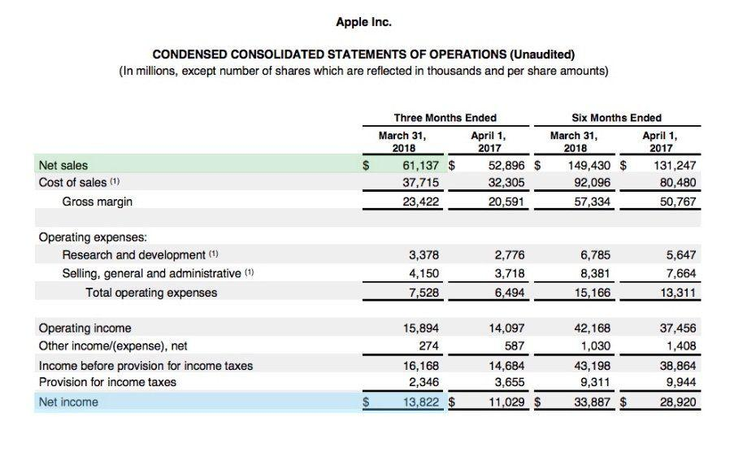

## Table of Contents

## What is gross profit margin?

Gross profit margin is a way to measure how well a business is doing by looking at the money it makes from selling things after paying for the cost of those things. It tells you what percentage of the money from sales is left after paying for the stuff that was sold. For example, if a store buys a toy for $10 and sells it for $15, the gross profit is $5. The gross profit margin would be the $5 divided by the $15, which is about 33%.

This number is important because it shows how efficiently a business is managing its costs and pricing its products. A higher gross profit margin means the business is doing a good job of keeping costs low or selling at a higher price, or both. If the margin is low, it might mean the business needs to look at ways to cut costs or raise prices. By keeping an eye on the gross profit margin, business owners can make better decisions to improve their profits.

## What is net profit margin?

Net profit margin is another way to see how well a business is doing, but it looks at all the money left after paying for everything, not just the cost of the things sold. It tells you what percentage of the money from sales is profit after paying for the cost of goods, running the business, taxes, and other expenses. If a business sells a product for $15, and after paying for the product, rent, salaries, and taxes, it has $2 left, the net profit is $2. The net profit margin would be the $2 divided by the $15, which is about 13%.

This number is important because it shows the overall profitability of a business. A higher net profit margin means the business is good at managing all its costs and making money. If the margin is low, it might mean the business needs to find ways to cut costs or increase sales. By watching the net profit margin, business owners can see if they are making enough money to keep the business going and growing.

## How do you calculate gross profit margin?

To calculate the gross profit margin, you need to know two things: the revenue from sales and the cost of goods sold. Revenue is the total money a business gets from selling its products or services. The cost of goods sold is the money spent to make or buy the products that were sold. To find the gross profit, subtract the cost of goods sold from the revenue. Then, to get the gross profit margin, divide the gross profit by the revenue and multiply by 100 to turn it into a percentage.

For example, if a business sells a product for $100 and it cost $60 to make or buy that product, the gross profit would be $100 minus $60, which is $40. To find the gross profit margin, you divide $40 by $100, which gives you 0.4. Multiply 0.4 by 100 to get a percentage, so the gross profit margin is 40%. This means for every dollar of revenue, the business keeps 40 cents as gross profit before other expenses are taken into account.

## How do you calculate net profit margin?

To calculate the net profit margin, you start with the revenue from sales, which is all the money a business gets from selling its products or services. Then, you subtract all the costs the business has. This includes the cost of goods sold, which is the money spent to make or buy the products, plus other expenses like rent, salaries, utilities, and taxes. The money left after subtracting all these costs is the net profit. To find the net profit margin, you divide the net profit by the revenue and then multiply by 100 to turn it into a percentage.

For example, if a business has revenue of $200 from sales and total costs of $150, the net profit would be $200 minus $150, which is $50. To find the net profit margin, you divide $50 by $200, which gives you 0.25. Multiply 0.25 by 100 to get a percentage, so the net profit margin is 25%. This means for every dollar of revenue, the business keeps 25 cents as net profit after all expenses are paid.

## Why are gross and net profit margins important for a business?

Gross and net profit margins are important for a business because they show how well the business is doing at making money. Gross profit margin tells you how much money is left after paying for the things you sell. This helps you see if you are pricing your products right and if you are keeping the cost of making or buying those products low. If your gross profit margin is high, it means you are doing a good job with these things. If it's low, you might need to look at ways to cut costs or raise prices.

Net profit margin is also important because it shows the overall health of your business. It tells you how much money is left after paying for everything, not just the cost of the things you sell. This includes things like rent, salaries, and taxes. A high net profit margin means your business is good at managing all its costs and making money. If your net profit margin is low, it might mean you need to find ways to cut costs or increase sales. By keeping an eye on both margins, you can make better decisions to keep your business strong and growing.

## What is the difference between gross profit margin and net profit margin?

Gross profit margin and net profit margin are both ways to see how much money a business is making, but they look at different things. Gross profit margin is the money left after paying for the things you sell. It shows how well you are doing at keeping the cost of making or buying your products low and setting the right price for them. If you sell a toy for $15 and it cost you $10 to buy it, your gross profit is $5. The gross profit margin would be $5 divided by $15, which is about 33%.

Net profit margin looks at all the money left after paying for everything, not just the cost of the things you sell. This includes costs like rent, salaries, and taxes. It shows the overall health of your business. If you sell the same toy for $15, and after paying for the toy, rent, salaries, and taxes, you have $2 left, your net profit is $2. The net profit margin would be $2 divided by $15, which is about 13%. Both margins are important because they help you see different parts of how well your business is doing.

## How do gross and net profit margins reflect a company's financial health?

Gross profit margin shows how well a company is doing at making money from selling its products. It tells you what percentage of the money from sales is left after paying for the things that were sold. A high gross profit margin means the company is good at keeping the cost of making or buying its products low and setting the right prices. If the gross profit margin is low, it might mean the company needs to find ways to cut costs or raise prices. By looking at the gross profit margin, a company can see if it is managing its main business activities well.

Net profit margin shows the overall health of a company by looking at all the money left after paying for everything. This includes the cost of the things sold, plus other costs like rent, salaries, and taxes. A high net profit margin means the company is good at managing all its costs and making money. If the net profit margin is low, it might mean the company needs to find ways to cut costs or increase sales. By looking at both the gross and net profit margins, a company can get a full picture of its financial health and make better decisions to keep the business strong and growing.

## What industries typically have higher gross profit margins?

Some industries have higher gross profit margins because they can sell their products or services for a lot more than it costs to make them. For example, software companies often have high gross profit margins. They might spend a lot of money to create a software program, but once it's made, it doesn't cost much to sell more copies. So, they can keep a big part of the money they get from sales as profit. Other industries with high gross profit margins include pharmaceuticals, where companies can charge a lot for medicines that cost less to make, and luxury goods, like expensive watches or jewelry, where people are willing to pay a lot more than the cost to make them.

Another industry with high gross profit margins is consulting. Consulting firms provide advice and services that don't cost much to deliver once the consultants are hired. They can charge high fees for their expertise, which leads to big profits. Similarly, the entertainment industry, including movies and music, can have high gross profit margins. Once a movie or a song is made, it can be sold or streamed many times without much additional cost, allowing companies to keep a large part of the money they make as profit.

## How can a company improve its gross profit margin?

A company can improve its gross profit margin by finding ways to lower the cost of the things it sells. This means looking at how much it costs to make or buy the products and trying to spend less. For example, the company could find cheaper materials or better deals from suppliers. It could also use technology to make things more efficiently or find ways to use less material. By spending less on the products, the company can keep more of the money it makes from selling them.

Another way to improve the gross profit margin is by raising the prices of the products. If customers are willing to pay more, the company can charge more and keep a bigger part of the money as profit. This works best if the company can show that its products are better or different from others. Sometimes, the company might need to find a balance between raising prices and keeping costs low to make sure customers still want to buy the products. By doing these things, the company can have a higher gross profit margin and make more money.

## How can a company improve its net profit margin?

A company can improve its net profit margin by finding ways to cut costs and increase sales. One way to cut costs is by looking at all the expenses, not just the cost of the things it sells. This means checking if there are cheaper ways to pay for things like rent, utilities, or salaries. For example, the company might move to a less expensive office or use energy-saving lights to lower utility bills. It could also look for ways to do things more efficiently, like using technology to save time and money. By spending less on these things, the company can keep more of the money it makes as profit.

Another way to improve the net profit margin is by increasing sales. The company can do this by finding new customers or selling more to the customers it already has. It might offer special deals or promotions to attract more people to buy its products. The company could also look at ways to make its products better or different from others, so people are willing to pay more for them. By selling more and keeping costs low, the company can have a higher net profit margin and make more money.

## What are common pitfalls in interpreting gross and net profit margins?

One common mistake when looking at gross and net profit margins is thinking that a high margin always means a business is doing well. A high margin might look good, but it doesn't tell the whole story. For example, a company might have a high gross profit margin because it sells very expensive products, but if it spends a lot on other things like rent or salaries, its net profit margin could be low. It's important to look at both margins together to get a full picture of how the business is doing.

Another pitfall is not understanding that different industries have different normal margins. What might be a good margin in one industry could be low in another. For example, grocery stores usually have low gross profit margins because they sell a lot of low-cost items, but they can still make a good net profit if they sell a lot. If someone only looks at the gross profit margin without knowing the industry, they might think the grocery store is not doing well, when it actually is. It's important to compare a company's margins to others in the same industry to see if they are doing well.

## How do gross and net profit margins vary across different economic cycles?

Gross and net profit margins can change a lot depending on what's happening in the economy. When the economy is doing well, people have more money to spend, so businesses can often sell more and might be able to raise their prices. This can lead to higher gross profit margins because they are making more money from sales. But, if the economy is not doing well, people might not want to spend as much, so businesses might have to lower their prices or sell less. This can make their gross profit margins go down because they are not making as much money from sales.

Net profit margins can also change with the economy. During good economic times, businesses might be able to cut some costs because they are selling more and can buy things in bigger amounts for less money. This can help their net profit margins go up. But in tough economic times, businesses might have to spend more on things like marketing to get people to buy their products, or they might have to pay more for loans if interest rates go up. This can make their net profit margins go down because they are spending more money on other things besides the cost of the products they sell.

## What is the understanding of Net Profit Margin?

Net profit margin is a key financial metric used to evaluate a company's profitability and its ability to manage expenses. It is calculated by dividing net income by total revenue and is expressed as a percentage:

$$
\text{Net Profit Margin} = \left( \frac{\text{Net Income}}{\text{Total Revenue}} \right) \times 100
$$

This metric offers valuable insights into how efficiently a company is converting its revenues into actual profit after accounting for all expenses, including operating, interest, and tax expenses. A higher net profit margin indicates that a company is effective at controlling its costs relative to its income, which can be an indicator of strong management performance and a competitive position within the market.

For traders, particularly those using [algorithmic trading](/wiki/algorithmic-trading), the net profit margin serves as a crucial indicator of a company's financial health. Companies with consistently high net profit margins are often perceived as having a robust business model capable of weathering economic fluctuations, thereby making them attractive investment opportunities. 

In algorithmic trading, understanding the nuances of net profit margin is vital for developing effective trading strategies. Algorithms can be designed to identify stocks or assets with favorable net profit margins and adjust trading decisions based on these financial conditions. For example, an algorithm might prioritize buying shares in companies exhibiting a trend of increasing net profit margins or might be programmed to flag those with declining margins as sell candidates.

Additionally, net profit margin can assist in setting parameter settings for automated trading systems. Algorithms can use thresholds for net profit margins to trigger buy or sell orders, depending on whether the margin crosses above or below a set value. This integration allows for more responsive and adaptive trading strategies that are rooted in quantitative financial analysis. By harnessing the insights provided by net profit margin, traders can optimize their trading decisions and potentially enhance their return on investment.

## What is the analysis of Gross Profit Margin?

The gross profit margin is an essential financial metric used to evaluate a company's production efficiency by analyzing the relationship between revenue and the cost of goods sold (COGS). Mathematically, it is expressed as:

$$
\text{Gross Profit Margin} = \left( \frac{\text{Revenue} - \text{COGS}}{\text{Revenue}} \right) \times 100
$$

This calculation produces a percentage that reflects how effectively a company is managing its production and distribution costs relative to its total sales revenue. A high gross profit margin generally indicates a robust pricing strategy and effective cost management, signifying that the company retains a large portion of revenue as gross profit after covering the costs associated with production.

For investors, the gross profit margin is a crucial indicator of a company's financial health and operational efficiency. A higher margin suggests that a company has more resources to cover other operational expenses, invest in growth opportunities, and withstand economic downturns. Consequently, it can be an attractive attribute for potential investors assessing the company's economic viability.

In algorithmic trading, the gross profit margin can be a valuable data point for optimizing trading strategies, particularly trade entry and [exit](/wiki/exit-strategy) points. Algorithms can be programmed to detect changes in the gross profit margin, leading to decisions that capitalize on a company's production efficiency or warning of potential inefficiencies. For instance, a declining gross profit margin might prompt an algorithm to exit a position if it indicates a downward trend in a company's operational performance.

Moreover, when gross profit margin data is analyzed alongside other financial metrics, such as the net profit margin or operating margin, it provides a more holistic view of a company's operational performance. This comprehensive analysis can help traders and investors pinpoint strengths and weaknesses, leading to more informed trading decisions.

Incorporating gross profit margin data into algorithmic trading not only helps in fine-tuning strategies but also aligns trading actions with a company's underlying economic activities. This ensures that trading strategies are not just reactive but also strategic, providing an edge in competitive financial markets.

## References & Further Reading

[1]: ["Advances in Financial Machine Learning"](https://www.amazon.com/Advances-Financial-Machine-Learning-Marcos/dp/1119482089) by Marcos Lopez de Prado

[2]: ["Evidence-Based Technical Analysis: Applying the Scientific Method and Statistical Inference to Trading Signals"](https://www.amazon.com/Evidence-Based-Technical-Analysis-Scientific-Statistical/dp/0470008741) by David Aronson

[3]: ["Machine Learning for Algorithmic Trading"](https://github.com/PacktPublishing/Machine-Learning-for-Algorithmic-Trading-Second-Edition) by Stefan Jansen

[4]: ["Quantitative Trading: How to Build Your Own Algorithmic Trading Business"](https://books.google.com/books/about/Quantitative_Trading.html?id=j70yEAAAQBAJ) by Ernest P. Chan

[5]: Bergstra, J., Bardenet, R., Bengio, Y., & Kégl, B. (2011). ["Algorithms for Hyper-Parameter Optimization."](https://proceedings.neurips.cc/paper/2011/file/86e8f7ab32cfd12577bc2619bc635690-Paper.pdf) Advances in Neural Information Processing Systems 24.