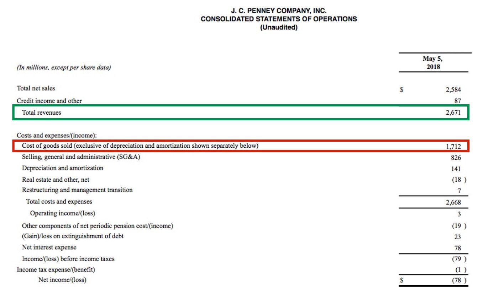

In the fast-paced world of finance, understanding key financial metrics is crucial for making informed decisions. Financial metrics serve as the backbone for analyzing a company's performance and viability, guiding both businesses and investors towards more strategic actions. Among these metrics, EBITDA, Gross Profit, and Algorithmic Trading frequently appear in discussions due to their critical roles in assessing operational performance and influencing trading strategies.

EBITDA, or Earnings Before Interest, Taxes, Depreciation, and Amortization, provides an analysis of a company's operational profitability by removing the effects of capital structure, tax, and non-cash accounting items. Gross Profit, the difference between revenue and the cost of goods sold, highlights the efficiency of a company in managing production costs and labor, thus revealing insights into the company's core business operations. Meanwhile, Algorithmic Trading represents a technological evolution in trading practices, automating trade decisions using pre-established criteria, often incorporating financial metrics like EBITDA and Gross Profit to enhance strategy execution.

The interplay between these metrics and algorithmic trading emphasizes the importance of precise and timely financial data for optimizing investment opportunities and enhancing decision-making processes. Understanding these concepts can significantly aid businesses and investors in evaluating performance and identifying avenues for growth. Whether you are a seasoned finance professional or a newcomer eager to expand your knowledge, this guide promises to boost your financial literacy and improve your decision-making capabilities in an ever-evolving market landscape.

## Table of Contents

## Understanding EBITDA

EBITDA stands for Earnings Before Interest, Taxes, Depreciation, and Amortization. It is a widely recognized measure of a company's overall financial performance and serves as an alternative to net income. Unlike net income, EBITDA provides a clearer picture of a company's operational profitability by excluding non-operating expenses, such as interest and taxes, as well as non-cash charges like depreciation and amortization. This focus on core operations makes EBITDA a valuable tool for investors and analysts who wish to compare the operational efficiency of companies within the same industry.

The formula for calculating EBITDA is as follows:

$$

\text{EBITDA} = \text{Net Income} + \text{Interest} + \text{Taxes} + \text{Depreciation} + \text{Amortization}
$$

One of the primary advantages of EBITDA is its ability to normalize earnings, allowing for a better comparison of companies that may have different capital structures and tax environments. By stripping out expenses that vary due to differences in debt levels and tax rates, EBITDA provides insights into the performance of a business's core operations independently of how it is financed.

However, while EBITDA is a useful metric, it is essential to recognize its limitations. One significant disadvantage is its omission of capital expenditure (CapEx), which is a crucial component of any company's cash flow and financial health. The exclusion of CapEx can sometimes present an overly optimistic view of a company's profitability and cash generation capacity. For companies with substantial capital investments, such as manufacturers or technology firms, examining additional metrics like Free Cash Flow (FCF) might provide a more comprehensive understanding of financial performance.

In summary, EBITDA is an instrumental metric for assessing operational profitability and comparing peer companies, but it should be used in conjunction with other financial metrics to gain a more holistic view of a company's financial health.

## Exploring Gross Profit

Gross profit represents the revenue a company earns after deducting the costs directly tied to the production and sale of its goods or services. This metric functions as a critical indicator of a company's operational efficiency, particularly in terms of labor and supply utilization. Essentially, gross profit assesses how well a business manages its core production resources while maintaining product quality and meeting market demand.

To calculate gross profit, one must subtract the cost of goods sold (COGS) from the total revenue. The formula is expressed as:

$$
\text{Gross Profit} = \text{Revenue} - \text{Cost of Goods Sold (COGS)}
$$

Here, revenue refers to the total income generated from sales, while COGS includes all direct costs associated with production, such as raw materials, labor, and manufacturing expenses.

Understanding gross profit enables businesses to effectively monitor and refine their cost management and pricing strategies. By providing clarity on production expenses relative to sales, this metric helps businesses identify areas where efficiency can be improved or costs can be reduced. It is particularly useful in competitive industries where tight margins necessitate vigilant cost control.

Unlike EBITDA, which accounts for earnings before interest, taxes, depreciation, and amortization, gross profit strictly evaluates production efficiency. It excludes overhead and other non-operational financial considerations, focusing solely on direct production costs. This distinction highlights the unique role of gross profit in analyzing a company's core manufacturing or service delivery efficiency.

Stakeholders can gain valuable insights from gross profit analysis by examining the gross profit margin, which is the ratio of gross profit to total revenue, expressed as a percentage. The formula for gross profit margin is:

$$
\text{Gross Profit Margin} = \left( \frac{\text{Gross Profit}}{\text{Revenue}} \right) \times 100
$$

By evaluating gross profit margins, businesses can uncover potential cost-saving opportunities and refine their pricing strategies to enhance profitability. High gross margins generally indicate effective cost management and a strong competitive position, while declining margins may signal rising production costs or pricing pressures.

Overall, gross profit serves as a foundational metric for evaluating a company's primary business activities and guiding financial strategy, making it an indispensable tool for investors, analysts, and business leaders striving for operational excellence.

 to Algorithmic Trading

Algorithmic trading, commonly referred to as algo trading, involves the use of computer algorithms to automate trading strategies within financial markets. These algorithms enable the processing and analysis of large volumes of data at exceptionally high speeds, thus facilitating rapid decision-making based on predefined criteria. This process leverages the significant advantages of computer speed and precision, elements that are crucial in contemporary markets where timing can significantly influence profitability.

At the core of [algorithmic trading](/wiki/algorithmic-trading) are algorithms, which can be defined as a series of instructions designed to perform a task. In trading, these instructions are employed to make buy and sell decisions based on data inputs such as market prices, volumes, and other financial indicators. For example, an algorithm might be programmed to buy a stock when its 50-day moving average exceeds its 200-day moving average—a classic [momentum](/wiki/momentum) trading strategy.

A key feature of algo trading is its ability to incorporate various financial metrics, such as Earnings Before Interest, Taxes, Depreciation, and Amortization (EBITDA) and gross profit, into its models. By using these metrics, algorithms can assess the financial health and operational performance of companies, and thus identify potentially profitable investment opportunities. This data-driven approach improves the accuracy of trading decisions and minimizes human biases.

Understanding and implementing algorithmic trading can enable investors to leverage modern technology to enhance their trading strategies. Python, for example, is a popular programming language for writing trading algorithms due to its simplicity and extensive library support for data analysis and financial computations. For instance, using Python's pandas library, a trader can easily manipulate time series data for stock prices and apply statistical operations to determine trading signals efficiently. 

The speed and efficiency offered by algorithmic trading have transformed the landscape of trading by not only automating decisions but also allowing strategies that are simply impossible for human traders due to their scale and complexity. Consequently, mastering the basics of algorithmic trading is essential for those looking to remain competitive in the ever-evolving financial markets.

## The Role of Financial Metrics in Algo Trading

Financial metrics such as Earnings Before Interest, Taxes, Depreciation, and Amortization (EBITDA) and Gross Profit are pivotal in shaping algorithmic trading strategies. Algorithms use these metrics to evaluate a company's financial health and identify potential investment opportunities, which are crucial in making informed trading decisions.

By incorporating financial data into algorithms, traders leverage automation to streamline decision-making processes. This capability enhances accuracy and minimizes emotional biases that can often lead to human error. Automated systems can analyze vast amounts of data at unprecedented speeds, allowing them to respond swiftly to market changes.

Advanced algorithms can monitor and analyze multiple financial indicators simultaneously. This multifaceted analysis generates insights that humans might not easily discern on their own, particularly with the complexity and speed required in today's financial markets. The ability to process vast datasets and conduct intricate analyses highlights the importance of financial metrics in algo trading strategies.

The integration of metrics like EBITDA and gross profit into algorithmic trading underscores the necessity for precise and current financial data. Accurate inputs are critical, as flawed or outdated data can lead to erroneous outputs and suboptimal trading decisions. Thus, ensuring data integrity is a cornerstone in the development and deployment of robust trading algorithms.

In summary, the effective use of financial metrics in algo trading not only facilitates superior decision-making but also fortifies a strategy's resilience against market [volatility](/wiki/volatility-trading-strategies). By harnessing these metrics, algorithms enhance trading efficiency, providing a substantial competitive edge in the financial landscape.

## Challenges and Considerations

Despite the advantages of algorithmic trading, several challenges and considerations must be addressed to ensure successful implementation and operation.

Firstly, ensuring data accuracy is paramount. Algorithms rely on large datasets to make trading decisions, and any inaccuracies can lead to erroneous outcomes. Managing data integrity involves rigorous data cleaning and validation processes. Traders must ensure that both historical and real-time data are continuously verified for accuracy to prevent flawed analyses.

Regulatory considerations are also critical, particularly for high-frequency trading ([HFT](/wiki/high-frequency-trading-strategies)) operations. Different jurisdictions have distinct regulations concerning algorithmic trading, such as the European Union's Markets in Financial Instruments Directive II (MiFID II) that imposes transparency and reporting requirements. Compliance with these regulations is necessary to mitigate legal risks and ensure ethical trading practices.

Market volatility presents another significant challenge. Algorithmic strategies can be sensitive to rapid market fluctuations, which may impact their performance. For instance, algorithms predicated on mean-reversion strategies may underperform in highly volatile markets. Implementing robust risk management protocols, such as setting stop-loss limits and diversifying trading strategies, is essential to adapt to varying market conditions.

Lastly, [backtesting](/wiki/backtesting) algorithms is crucial to assess their effectiveness under historical market conditions. Investors should conduct extensive backtesting to evaluate the performance of trading strategies across different market scenarios. This process involves feeding historical data into the algorithm and analyzing the outcomes. As market dynamics evolve, continuous testing and refinement of algorithms are necessary to maintain their efficacy.

By addressing these challenges, traders can enhance the reliability and effectiveness of their algorithmic trading strategies, paving the way for improved decision-making and profitability in financial markets.

## Conclusion

Understanding EBITDA, gross profit, and algorithmic trading equips financial professionals and investors with valuable tools. These metrics provide crucial insights into operational performance and investment potential, serving as the foundation for effective trading strategies. With their distinct focus on different aspects of a company's financial health, they help in assessing profitability and efficiency. For instance, EBITDA highlights operational profitability without the influence of financing and accounting decisions, while gross profit emphasizes cost management in production.

Algorithmic trading, empowered by these financial metrics, represents a powerful approach in modern financial markets. By leveraging data-driven strategies, traders can automate decision-making, enhance accuracy, and minimize emotional biases. This method allows for the simultaneous analysis of multiple financial indicators, generating comprehensive insights that surpass human capabilities.

While algorithmic trading presents numerous advantages, there are also challenges to consider. Ensuring data accuracy and adhering to regulatory requirements are critical to avoiding erroneous trading decisions and potential legal issues. The dynamic nature of financial markets demands robust risk management and continuous algorithm testing to sustain performance under varying conditions.

As the financial landscape continues to evolve, staying informed about these crucial metrics will be indispensable for success. Mastering their application and integrating them into trading strategies can lead to improved efficiency and profitability, underscoring their significance in the toolkit of any modern finance professional.

## References & Further Reading

[1]: ["EBITDA: The Good, the Bad, and the Ugly"](https://blog.truelytics.com/ebitda-the-good-the-bad-the-ugly) by Forbes

[2]: Damodaran, A. (2012). ["Investment Valuation: Tools and Techniques for Determining the Value of Any Asset"](https://books.google.com/books/about/Investment_Valuation.html?id=5SRHAAAAQBAJ) by Aswath Damodaran

[3]: ["Algorithmic and High-Frequency Trading"](https://www.amazon.com/Algorithmic-High-Frequency-Trading-Mathematics-Finance/dp/1107091144) by Álvaro Cartea, Sebastian Jaimungal, and Jose Penalva

[4]: Mauboussin, M. J., Callahan, D. (2014). ["Measuring the Moat: Assessing the Magnitude and Sustainability of Value Creation"](https://www.semanticscholar.org/paper/Measuring-the-Moat-Assessing-the-Magnitude-and-of-Mauboussin-Callahan/7e7fbcab5e571afb45dc1bf9f2bdc3374644126e) by Credit Suisse

[5]: ["The Handbook of Trading: Strategies for Navigating and Profiting from Currency, Bond, and Stock Markets"](https://www.amazon.com/Handbook-Trading-Strategies-Navigating-McGraw-Hill/dp/0071743537) by Greg N. Gregoriou