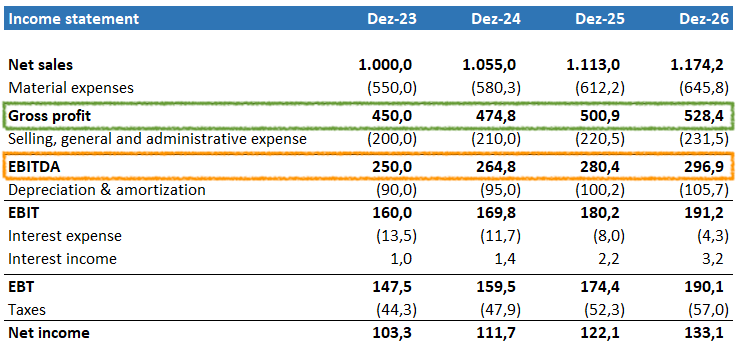

## Table of Contents

## What is Gross Profit?

Gross profit is the money a business makes after it subtracts the costs of making and selling its products or services. It's like if you baked cookies and sold them for $10, but it cost you $4 to make them, your gross profit would be $6. This number is important because it shows how well a business is doing at making money from what it sells before other costs like rent or salaries are taken out.

You can find the gross profit by taking the total revenue, which is all the money coming in from sales, and subtracting the cost of goods sold (COGS). COGS includes things like the materials and labor directly used to make the product. For example, if a company sells T-shirts, the COGS would include the fabric, the thread, and the wages of the people sewing the shirts. Gross profit helps business owners see if they are pricing their products correctly and if they are managing their production costs well.

## What is EBITDA?

EBITDA stands for Earnings Before Interest, Taxes, Depreciation, and Amortization. It's a way to measure how much money a business is making before taking away certain costs. Think of it like this: if you made $100 from selling lemonade but had to pay $10 for lemons and sugar, $5 for the stand, and $2 for a loan, EBITDA would be the $100 before you subtract those costs. It helps show how well the business is doing at its core, without the effects of how it's financed or how old its equipment is.

EBITDA is useful because it gives a clearer picture of a company's operating performance. It's like looking at a report card that only shows your grades in the main subjects, without considering things like homework or class participation. This can be helpful when comparing different companies, especially if they have different levels of debt or different types of assets. However, it's not perfect because it doesn't account for all expenses, so it should be used along with other financial measures to get a complete view of a company's health.

## How is Gross Profit calculated?

Gross profit is calculated by taking the total revenue a business makes from selling its products or services and subtracting the cost of goods sold (COGS). Total revenue is all the money that comes in from sales. COGS includes the direct costs of making the product, like materials and labor. For example, if a bakery sells cakes for $20 each and it costs $8 to make each cake, the gross profit per cake would be $12.

This calculation helps business owners understand how much money they are making from their main activities before other costs like rent, utilities, or salaries are taken out. It's a key number because it shows if the business is pricing its products correctly and managing its production costs well. If the gross profit is low, it might mean the business needs to find cheaper ways to make its products or charge more for them.

## How is EBITDA calculated?

EBITDA stands for Earnings Before Interest, Taxes, Depreciation, and Amortization. It's a way to see how much money a business makes before some big costs are taken out. To find EBITDA, you start with the company's earnings, which is the money left after paying for the things needed to make and sell the products. Then, you add back the money spent on interest, which is what the company pays for loans, and taxes, which are payments to the government. You also add back depreciation, which is the cost of the company's equipment getting older, and amortization, which is similar but for things like patents.

EBITDA helps show how well a business is doing at its core, without worrying about how it's financed or how old its stuff is. It's like looking at how much money you make from your lemonade stand before you think about the cost of the lemons, the stand, or any loans you took out to buy them. This can be useful when comparing different companies, but it's not perfect because it doesn't include all expenses. So, it's best to use EBITDA along with other financial measures to get a full picture of how a business is doing.

## Why are Gross Profit and EBITDA important financial metrics?

Gross Profit and EBITDA are important because they help business owners and investors understand how well a company is doing. Gross Profit shows the money a business makes after paying for the things it needs to make its products or services. It's like if you sell cookies for $10 and it costs $4 to make them, your Gross Profit is $6. This number is key because it tells you if you're pricing your products right and managing your production costs well. If the Gross Profit is low, it might mean you need to find cheaper ways to make your products or charge more for them.

EBITDA is another important number that shows how much money a business makes before taking away some big costs like interest, taxes, depreciation, and amortization. It's like looking at how much money you make from your lemonade stand before you think about the cost of the lemons, the stand, or any loans you took out to buy them. EBITDA helps show how well a business is doing at its core, without worrying about how it's financed or how old its equipment is. This can be useful when comparing different companies, but it's not perfect because it doesn't include all expenses. So, it's best to use EBITDA along with other financial measures to get a full picture of how a business is doing.

## What are the key differences between Gross Profit and EBITDA?

Gross Profit and EBITDA are both important numbers that help us understand how a business is doing, but they look at different parts of the business. Gross Profit is the money a business makes after paying for the things it needs to make its products or services. For example, if you sell cookies for $10 and it costs $4 to make them, your Gross Profit is $6. This number shows if you're pricing your products right and managing your production costs well. It's like looking at how much money you have left after buying the ingredients for your cookies.

EBITDA, on the other hand, is a bit different. It stands for Earnings Before Interest, Taxes, Depreciation, and Amortization. It's the money a business makes before taking away some big costs like interest on loans, taxes, and the cost of equipment getting older. If you run a lemonade stand and make $100, but you have to pay $10 for lemons, $5 for the stand, and $2 for a loan, EBITDA would be the $100 before you subtract those costs. This number helps show how well a business is doing at its core, without worrying about how it's financed or how old its equipment is. It's like looking at how much money you make from your lemonade stand before thinking about the cost of the lemons, the stand, or any loans.

## How do Gross Profit and EBITDA reflect a company's operational efficiency?

Gross Profit shows how well a company is doing at making money from what it sells. It's the money left after paying for the things needed to make the products, like materials and labor. If a company has a high Gross Profit, it means they are good at keeping their production costs low and pricing their products right. This is important because it shows if the company is efficient at turning what it makes into money. If the Gross Profit is low, it might mean the company needs to find cheaper ways to make its products or charge more for them.

EBITDA is another way to see how efficient a company is, but it looks at a bigger picture. It's the money the company makes before taking away costs like interest on loans, taxes, and the cost of equipment getting older. A high EBITDA means the company is good at making money from its main activities, even before these other costs come in. It helps show how well the company is doing at its core, without worrying about how it's financed or how old its equipment is. If the EBITDA is high, it suggests the company is doing well at running its business efficiently.

## Can Gross Profit and EBITDA be used to compare companies across different industries?

Gross Profit can be used to compare companies across different industries, but it's not always the best way. Gross Profit shows how much money a company makes after paying for the things it needs to make its products or services. This can help see if a company is good at keeping its production costs low and pricing its products right. But different industries have different costs and ways of making money, so comparing Gross Profit might not tell the whole story. For example, a tech company might have a high Gross Profit because it doesn't cost much to make software, while a car company might have a lower Gross Profit because it costs a lot to make cars.

EBITDA can also be used to compare companies across different industries, and it might be a bit better for this. EBITDA shows how much money a company makes before taking away costs like interest on loans, taxes, and the cost of equipment getting older. This can help see how well a company is doing at its core, without worrying about how it's financed or how old its equipment is. But even with EBITDA, it's important to remember that different industries have different ways of making money and different costs. So, while EBITDA can give a clearer picture than Gross Profit, it's still best to use it along with other financial measures to get a full understanding of how companies in different industries are doing.

## What are the limitations of using Gross Profit as a performance metric?

Gross Profit is a helpful number that tells us how much money a company makes after paying for the things it needs to make its products or services. But it has some problems when we use it to see how well a company is doing. One big problem is that Gross Profit doesn't include other important costs like rent, salaries, or advertising. These costs can be very different from one company to another, so looking at Gross Profit alone might not give us a full picture of how the company is doing. For example, two companies might have the same Gross Profit, but if one has to pay a lot more for rent, it might not be doing as well overall.

Another problem with Gross Profit is that it can be hard to compare companies in different industries. Different businesses have different costs to make their products. A tech company might have a high Gross Profit because it doesn't cost much to make software, but a car company might have a lower Gross Profit because it costs a lot to make cars. So, even if one company has a higher Gross Profit, it doesn't mean it's doing better than another company in a different industry. To really understand how a company is doing, we need to look at other numbers along with Gross Profit.

## What are the limitations of using EBITDA as a performance metric?

EBITDA is a helpful number that shows how much money a company makes before taking away costs like interest, taxes, depreciation, and amortization. But it has some problems when we use it to see how well a company is doing. One big problem is that EBITDA doesn't include all the costs a company has to pay. For example, it doesn't count things like the cost of new equipment or the money spent on paying back loans. So, a company might look like it's doing well based on EBITDA, but it might actually be spending a lot of money on these other costs.

Another problem with EBITDA is that it can be hard to compare companies in different industries. Different businesses have different ways of making money and different costs. For example, a tech company might have a high EBITDA because it doesn't need to spend much on equipment, but a manufacturing company might have a lower EBITDA because it has to pay a lot for machines. So, even if one company has a higher EBITDA, it doesn't mean it's doing better than another company in a different industry. To really understand how a company is doing, we need to look at other numbers along with EBITDA.

## How can adjustments to EBITDA provide a clearer picture of a company's performance?

Adjustments to EBITDA can help give a better idea of how a company is really doing. Sometimes, a company might have one-time costs or gains that don't happen every year. For example, if a company has to pay a big fine or sells a piece of land, these things can make EBITDA look different than it usually does. By taking out these one-time costs or gains, we can see what the company's normal earnings are. This helps us understand how well the company is doing at its core business, without these unusual events making things confusing.

These adjustments can also help when comparing different companies. If one company has a lot of debt and pays a lot in interest, its EBITDA might look lower than another company with less debt. But by adding back the interest payments, we can see how much money the company makes from its main activities, without the debt making it look worse. This way, we can compare companies more fairly and get a clearer picture of which ones are doing better at running their businesses.

## In what scenarios would an investor prefer to focus on Gross Profit over EBITDA, or vice versa?

An investor might prefer to focus on Gross Profit when they want to understand how well a company is doing at making and selling its products. Gross Profit shows the money left after paying for the things needed to make the product, like materials and labor. This can help an investor see if the company is good at keeping its production costs low and pricing its products right. If an investor is looking at companies in the same industry, Gross Profit can be a good way to compare how efficient they are at their core business. For example, if an investor is looking at two clothing companies, they might use Gross Profit to see which one is better at making clothes without spending too much money.

On the other hand, an investor might choose to focus on EBITDA when they want to see how much money a company makes before taking away costs like interest, taxes, and the cost of equipment getting older. EBITDA can give a clearer picture of how well a company is doing at its core business, without worrying about how it's financed or how old its equipment is. This can be helpful when comparing companies in different industries or when looking at a company's ability to generate cash from its operations. For example, if an investor is comparing a tech company with a manufacturing company, they might use EBITDA to see which one is better at making money from its main activities, without the differences in financing or equipment costs getting in the way.

## What is EBITDA and how can it be understood?

EBITDA stands for Earnings Before Interest, Taxes, Depreciation, and Amortization. It is a widely recognized measure of a company's overall financial performance and serves as an alternative to net income. Unlike net income, EBITDA provides a clearer picture of a company's operational profitability by excluding non-operating expenses, such as interest and taxes, as well as non-cash charges like depreciation and amortization. This focus on core operations makes EBITDA a valuable tool for investors and analysts who wish to compare the operational efficiency of companies within the same industry.

The formula for calculating EBITDA is as follows:

$$

\text{EBITDA} = \text{Net Income} + \text{Interest} + \text{Taxes} + \text{Depreciation} + \text{Amortization}
$$

One of the primary advantages of EBITDA is its ability to normalize earnings, allowing for a better comparison of companies that may have different capital structures and tax environments. By stripping out expenses that vary due to differences in debt levels and tax rates, EBITDA provides insights into the performance of a business's core operations independently of how it is financed.

However, while EBITDA is a useful metric, it is essential to recognize its limitations. One significant disadvantage is its omission of capital expenditure (CapEx), which is a crucial component of any company's cash flow and financial health. The exclusion of CapEx can sometimes present an overly optimistic view of a company's profitability and cash generation capacity. For companies with substantial capital investments, such as manufacturers or technology firms, examining additional metrics like Free Cash Flow (FCF) might provide a more comprehensive understanding of financial performance.

In summary, EBITDA is an instrumental metric for assessing operational profitability and comparing peer companies, but it should be used in conjunction with other financial metrics to gain a more holistic view of a company's financial health.

## What is Exploring Gross Profit?

Gross profit represents the revenue a company earns after deducting the costs directly tied to the production and sale of its goods or services. This metric functions as a critical indicator of a company's operational efficiency, particularly in terms of labor and supply utilization. Essentially, gross profit assesses how well a business manages its core production resources while maintaining product quality and meeting market demand.

To calculate gross profit, one must subtract the cost of goods sold (COGS) from the total revenue. The formula is expressed as:

$$
\text{Gross Profit} = \text{Revenue} - \text{Cost of Goods Sold (COGS)}
$$

Here, revenue refers to the total income generated from sales, while COGS includes all direct costs associated with production, such as raw materials, labor, and manufacturing expenses.

Understanding gross profit enables businesses to effectively monitor and refine their cost management and pricing strategies. By providing clarity on production expenses relative to sales, this metric helps businesses identify areas where efficiency can be improved or costs can be reduced. It is particularly useful in competitive industries where tight margins necessitate vigilant cost control.

Unlike EBITDA, which accounts for earnings before interest, taxes, depreciation, and amortization, gross profit strictly evaluates production efficiency. It excludes overhead and other non-operational financial considerations, focusing solely on direct production costs. This distinction highlights the unique role of gross profit in analyzing a company's core manufacturing or service delivery efficiency.

Stakeholders can gain valuable insights from gross profit analysis by examining the gross profit margin, which is the ratio of gross profit to total revenue, expressed as a percentage. The formula for gross profit margin is:

$$
\text{Gross Profit Margin} = \left( \frac{\text{Gross Profit}}{\text{Revenue}} \right) \times 100
$$

By evaluating gross profit margins, businesses can uncover potential cost-saving opportunities and refine their pricing strategies to enhance profitability. High gross margins generally indicate effective cost management and a strong competitive position, while declining margins may signal rising production costs or pricing pressures.

Overall, gross profit serves as a foundational metric for evaluating a company's primary business activities and guiding financial strategy, making it an indispensable tool for investors, analysts, and business leaders striving for operational excellence.

 to Algorithmic Trading

Algorithmic trading, commonly referred to as algo trading, involves the use of computer algorithms to automate trading strategies within financial markets. These algorithms enable the processing and analysis of large volumes of data at exceptionally high speeds, thus facilitating rapid decision-making based on predefined criteria. This process leverages the significant advantages of computer speed and precision, elements that are crucial in contemporary markets where timing can significantly influence profitability.

At the core of [algorithmic trading](/wiki/algorithmic-trading) are algorithms, which can be defined as a series of instructions designed to perform a task. In trading, these instructions are employed to make buy and sell decisions based on data inputs such as market prices, volumes, and other financial indicators. For example, an algorithm might be programmed to buy a stock when its 50-day moving average exceeds its 200-day moving average—a classic [momentum](/wiki/momentum) trading strategy.

A key feature of algo trading is its ability to incorporate various financial metrics, such as Earnings Before Interest, Taxes, Depreciation, and Amortization (EBITDA) and gross profit, into its models. By using these metrics, algorithms can assess the financial health and operational performance of companies, and thus identify potentially profitable investment opportunities. This data-driven approach improves the accuracy of trading decisions and minimizes human biases.

Understanding and implementing algorithmic trading can enable investors to leverage modern technology to enhance their trading strategies. Python, for example, is a popular programming language for writing trading algorithms due to its simplicity and extensive library support for data analysis and financial computations. For instance, using Python's pandas library, a trader can easily manipulate time series data for stock prices and apply statistical operations to determine trading signals efficiently. 

The speed and efficiency offered by algorithmic trading have transformed the landscape of trading by not only automating decisions but also allowing strategies that are simply impossible for human traders due to their scale and complexity. Consequently, mastering the basics of algorithmic trading is essential for those looking to remain competitive in the ever-evolving financial markets.

## References & Further Reading

[1]: ["EBITDA: The Good, the Bad, and the Ugly"](https://blog.truelytics.com/ebitda-the-good-the-bad-the-ugly) by Forbes

[2]: Damodaran, A. (2012). ["Investment Valuation: Tools and Techniques for Determining the Value of Any Asset"](https://books.google.com/books/about/Investment_Valuation.html?id=5SRHAAAAQBAJ) by Aswath Damodaran

[3]: ["Algorithmic and High-Frequency Trading"](https://www.amazon.com/Algorithmic-High-Frequency-Trading-Mathematics-Finance/dp/1107091144) by Álvaro Cartea, Sebastian Jaimungal, and Jose Penalva

[4]: Mauboussin, M. J., Callahan, D. (2014). ["Measuring the Moat: Assessing the Magnitude and Sustainability of Value Creation"](https://www.semanticscholar.org/paper/Measuring-the-Moat-Assessing-the-Magnitude-and-of-Mauboussin-Callahan/7e7fbcab5e571afb45dc1bf9f2bdc3374644126e) by Credit Suisse

[5]: ["The Handbook of Trading: Strategies for Navigating and Profiting from Currency, Bond, and Stock Markets"](https://www.amazon.com/Handbook-Trading-Strategies-Navigating-McGraw-Hill/dp/0071743537) by Greg N. Gregoriou