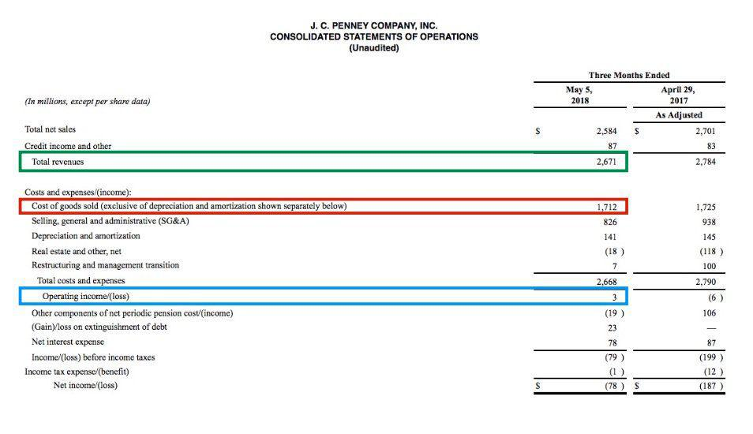

Understanding financial ratios is critical for analyzing a company's financial health. Among these ratios, gross profit margin and operating profit margin are pivotal in assessing profitability. Gross profit margin is calculated by determining the difference between revenue and the cost of goods sold (COGS), then dividing the result by revenue and multiplying by 100 to express it as a percentage. This ratio is essential for evaluating how effectively a company is producing its goods in comparison with its peers. Operating profit margin, on the other hand, considers both COGS and operating expenses like rent, utilities, and payroll. It is calculated by dividing operating income by revenue and multiplying by 100, offering insights into how well a company manages its overall operational costs relative to its revenue.

These financial metrics are indispensable tools for investors and analysts, providing insights into a company’s ability to generate profits before and after accounting for operational expenses. A higher gross profit margin indicates greater efficiency in production, while a higher operating profit margin signals effective management of operating costs. These distinctions are not just crucial for traditional investment analysis but are increasingly relevant as trading technologies advance.



With the rise of algorithmic trading (algo trading), understanding these financial metrics is becoming increasingly important for automated investment strategies. Algo trading uses sophisticated computer programs to execute trades at speeds unmatched by human traders, employing predefined strategies that frequently rely on fundamental analysis metrics, including profitability ratios. By integrating gross and operating profit margins into algorithmic frameworks, traders and investors can improve decision-making processes and enhance the profitability of their trading strategies. This article explores the intricacies of gross profit and operating profit margins while discussing their relevance in trading algorithms.

## Table of Contents

## What are Financial Ratios?

Financial ratios are quantitative tools employed by investors, analysts, and managers to assess a company's financial performance and overall health. These ratios serve as critical indicators, offering insights into different aspects of a company's operations and allowing stakeholders to evaluate how effectively a company generates profit, manages its assets, and fulfills its financial obligations.

Financial ratios are broadly categorized into various types, with each providing specific insights. Among these categories are profitability ratios, which are particularly significant for assessing a company's financial success. Profitability ratios, including gross profit margin and operating profit margin, are crucial in understanding a company's capability to earn profits relative to its revenues and expenses.

### Types of Financial Ratios

1. **Profitability Ratios**: These ratios measure a company's ability to generate income relative to its revenue, assets, equity, and costs. The gross profit margin and operating profit margin fall under this category, highlighting the efficiency of producing goods (gross profit margin) and overall operational efficiency (operating profit margin).

2. **Liquidity Ratios**: These ratios help evaluate a company's capacity to meet short-term obligations without raising external capital. Common liquidity ratios include the current ratio and the quick ratio.

3. **Leverage Ratios**: Also known as solvency ratios, leverage ratios gauge the degree to which a company is financing its operations through debt versus wholly owned funds. Examples are the debt-to-equity ratio and interest coverage ratio.

4. **Efficiency Ratios**: These ratios assess how well a company utilizes its assets and liabilities to generate sales and maximize profit. Inventory turnover and accounts receivable turnover are examples of efficiency ratios.

5. **Market Ratios**: With a focus on assessing the financial markets' perceptions, market ratios analyze a company’s share price against its earnings, dividends, and other financial metrics. Price-to-earnings (P/E) ratio and dividend yield are popular market ratios.

### Importance of Profitability Ratios

Among financial ratios, profitability ratios are pivotal in evaluating and comparing companies. The gross profit margin is calculated using the formula:

$$
\text{Gross Profit Margin} = \left( \frac{\text{Revenue} - \text{Cost of Goods Sold (COGS)}}{\text{Revenue}} \right) \times 100
$$

This metric indicates how efficiently a company produces its goods relative to its peers. Meanwhile, the operating profit margin accounts for additional operating expenses and is calculated as:

$$
\text{Operating Profit Margin} = \left( \frac{\text{Operating Income}}{\text{Revenue}} \right) \times 100
$$

Operating profit margin provides a broader view by considering how well a company manages its other operational expenses relative to revenue.

Overall, financial ratios offer indispensable tools for analyzing a company's financial statements and gaining insights into its health, performance, and potential, with profitability ratios being especially critical for assessing a company's capacity to generate profit efficiently.

## Understanding Gross Profit Margin

Gross profit margin is a key financial metric used to assess a company's efficiency in producing goods. It indicates the proportion of revenue that surpasses the cost of goods sold (COGS) and is expressed as a percentage. The formula for calculating gross profit margin is:

$$
\text{Gross Profit Margin} = \left(\frac{\text{Revenue} - \text{COGS}}{\text{Revenue}}\right) \times 100
$$

This calculation provides insights into how well a company converts sales into actual profit after accounting for the direct costs associated with producing goods or services. A higher gross profit margin suggests that the company is effective in managing production costs, thereby indicating better relative performance in manufacturing and selling its products or services compared to other firms in the industry. 

An elevated gross profit margin is often viewed as a sign of strong competitive positioning, as it can indicate the company’s ability to price its products above the cost needed to produce them. It also reflects managerial efficiency whereby costs are minimized while outputs are maximized. Therefore, monitoring this ratio can be instrumental for investors seeking to evaluate a firm's financial health and operational competence.

## Understanding Operating Profit Margin

Operating profit margin is a crucial financial metric that provides insights into how efficiently a company manages its core business operations. Unlike gross profit margin, which only considers the cost of goods sold (COGS), the operating profit margin takes a comprehensive view by also accounting for various operating expenses. These expenses include items such as rent, utilities, payroll, marketing, and administrative costs, which are essential for maintaining everyday business functions but are not directly tied to the production of goods or services.

The formula for calculating the operating profit margin is as follows:

$$
\text{Operating Profit Margin} = \left( \frac{\text{Operating Income}}{\text{Revenue}} \right) \times 100
$$

Where operating income is derived by subtracting both the cost of goods sold and operating expenses from total revenue. This calculation reflects the proportion of revenue left after covering both production and operating costs necessary to sustain business activities.

A key advantage of the operating profit margin is its ability to showcase a company's operational efficiency. A higher margin indicates that the company retains more of its revenue as operating profit after covering vital operating expenses. This is particularly useful for comparing companies within the same industry to assess which are better at converting sales into actual profits while efficiently managing operational overheads.

Investors and analysts often scrutinize the operating profit margin to evaluate a company’s capacity to sustain growth, withstand economic downturns, and deliver shareholder value. A stable or increasing margin over time is generally perceived as a sign of good management and effective cost control. Moreover, companies with higher operating margins are usually in a better position to invest in future growth opportunities or to weather economic challenges without jeopardizing their financial health.

## Comparing Gross and Operating Profit Margins

While both gross profit margin and operating profit margin provide valuable insights into a company's financial performance, they serve distinct purposes in evaluating different aspects of profitability.

Gross profit margin concentrates on production efficiency. It is determined by subtracting the cost of goods sold (COGS) from revenue and then dividing by total revenue, illustrated by the formula:

$$
\text{Gross Profit Margin (\%)} = \left( \frac{\text{Revenue} - \text{COGS}}{\text{Revenue}} \right) \times 100
$$

A higher gross profit margin indicates that a company is successful in managing its production costs relative to its revenue, reflecting effective pricing strategies and cost control in manufacturing or procurement processes.

Conversely, operating profit margin offers a broader perspective by evaluating overall operational efficiency. It considers both COGS and operating expenses—such as salaries, rent, utilities—before subtracting them from revenue. The formula for operating profit margin is:

$$
\text{Operating Profit Margin (\%)} = \left( \frac{\text{Operating Income}}{\text{Revenue}} \right) \times 100
$$

Operating profit margin provides insight into a company's ability to manage its non-production-related expenditures. A healthy operating profit margin suggests that a company can effectively control its costs across the entire spectrum of operations, from production to administrative functions.

For a comprehensive assessment of a company's profitability health, it is imperative to use both gross and operating profit margins in tandem. While the gross profit margin sheds light on how well a company is producing its goods relative to direct costs, the operating profit margin reveals the efficiency of the company's overall operations. By analyzing both metrics, investors and analysts gain a nuanced understanding of a company's ability to generate profit not just from sales, but also from its day-to-day operations.

## Algorithmic Trading and Financial Ratios

Algorithmic trading employs sophisticated computer algorithms to execute trades with precision and speed, often capitalizing on minute price discrepancies in the market. These programs operate based on predetermined criteria, which can include various financial indicators and ratios. Among the numerous financial metrics available, gross and operating profit margins stand out as pivotal inputs for evaluating company fundamentals within trading algorithms. 

The gross profit margin provides a snapshot of a company's efficiency in producing goods, calculated by the formula:

$$
\text{Gross Profit Margin (\%)} = \left( \frac{\text{Revenue} - \text{Cost of Goods Sold (COGS)}}{\text{Revenue}} \right) \times 100
$$

On the other hand, the operating profit margin offers insight into how effectively a company manages its operational expenses relative to its revenue, with the formula:

$$
\text{Operating Profit Margin (\%)} = \left( \frac{\text{Operating Income}}{\text{Revenue}} \right) \times 100
$$

By integrating these ratios into [algorithmic trading](/wiki/algorithmic-trading) strategies, traders can enhance their decision-making processes. This inclusion allows for a more refined analysis of a company's profitability, which can inform buy, hold, or sell decisions within the trading model. For instance, a trading algorithm might prioritize companies with higher gross and operating profit margins, indicating robust production efficiency and effective management of operational costs. 

Moreover, combining these ratios with other financial data can form a comprehensive set of criteria for the algorithms, potentially increasing the accuracy and profitability of trades. Python, being a versatile and widely used language in the finance industry, offers libraries such as pandas and numpy that facilitate the integration and processing of these ratios within trading algorithms. Here is a basic example of how one might use Python to calculate and incorporate these ratios into a trading algorithm:

```python
import pandas as pd

# Sample data
data = {'Revenue': [1000000, 1500000], 'COGS': [600000, 900000], 'Operating_Income': [250000, 300000]}
df = pd.DataFrame(data)

# Calculate Gross Profit Margin
df['Gross_Profit_Margin'] = ((df['Revenue'] - df['COGS']) / df['Revenue']) * 100

# Calculate Operating Profit Margin
df['Operating_Profit_Margin'] = (df['Operating_Income'] / df['Revenue']) * 100

# Integrating logic in a trading algorithm
def trading_decision(row):
    if row['Gross_Profit_Margin'] > 40 and row['Operating_Profit_Margin'] > 20:
        return 'Buy'
    elif row['Gross_Profit_Margin'] < 30 or row['Operating_Profit_Margin'] < 10:
        return 'Sell'
    else:
        return 'Hold'

# Apply the trading decision logic
df['Decision'] = df.apply(trading_decision, axis=1)

print(df)
```

Incorporating financial ratios such as gross and operating profit margins into algorithmic trading frameworks can potentially enhance both the accuracy and profitability of trading strategies, making them critical components in automated investment decision-making.

## Conclusion

Understanding gross and operating profit margins is fundamental for informed investment decisions, particularly within the evolving domain of algorithmic trading. These financial ratios provide critical insights into a company's ability to produce and manage its resources efficiently. Gross profit margin indicates the efficiency of production processes by showing the proportion of revenue left after covering the cost of goods sold. In contrast, operating profit margin takes a broader view, accounting for both COGS and operational expenditures, thus reflecting the overall operational efficiency of a company.

In the context of algorithmic trading, these metrics serve as essential inputs for constructing sophisticated trading algorithms. By analyzing a company's gross and operating profit margins, trading algorithms can better assess the strength of a company's core business activities. This paves the way for more accurate predictions of stock movements and thus, potentially, more profitable trades.

For instance, consider a simplified Python function that assesses these profitability ratios:

```python
def calculate_ratios(revenue, cogs, operating_income):
    gross_profit_margin = ((revenue - cogs) / revenue) * 100
    operating_profit_margin = (operating_income / revenue) * 100
    return gross_profit_margin, operating_profit_margin
```

By integrating such metrics into algorithmic models, traders can systematically analyze a corpus of financial data to identify under or over-performing stocks, thereby optimizing trading strategies. Consequently, leveraging gross and operating profit margins not only aids in assessing company health but also offers a quantitative foundation for refining automated trading systems. Investors and traders are encouraged to harness these metrics to enhance the precision and effectiveness of their trading strategies, ensuring a robust approach to market participation.

## References & Further Reading

[1]: ["Financial Statement Analysis and Security Valuation"](https://www.amazon.com/Financial-Statement-Analysis-Security-Valuation/dp/0073379662) by Stephen H. Penman.

[2]: ["Introduction to Algorithmic Trading Strategies"](https://onlinelibrary.wiley.com/doi/epdf/10.1002/9781119206033.fmatter) by Sebastien Donadio and Sourav Ghosh.

[3]: ["Valuation: Measuring and Managing the Value of Companies"](https://www.amazon.com/Valuation-Measuring-Managing-Companies-Finance/dp/1119610885) by McKinsey & Company Inc.

[4]: ["Python for Finance: Mastering Data-Driven Finance"](https://www.amazon.com/Python-Finance-Mastering-Data-Driven/dp/1492024333) by Yves Hilpisch.

[5]: Damodaran, Aswath. ["Valuation Approaches and Metrics: A Survey of the Theory and Evidence."](https://people.stern.nyu.edu/adamodar/pdfiles/papers/valuesurvey.pdf) Foundations and Trends in Finance, 2005.