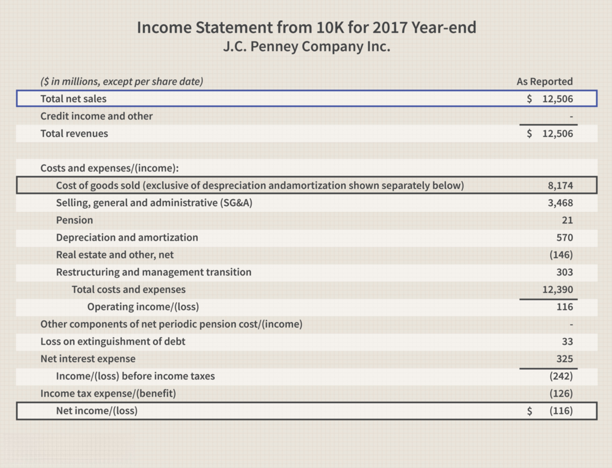

In financial analysis, differentiating between various types of profits—operating profit, net income, and gross profit—is essential for stakeholders such as investors, analysts, and companies. Operating profit is a measure of a company's core business profitability before accounting for interest and taxes. Net income, also known as the bottom line, includes all expenses, taxes, and interest, providing a comprehensive view of a company's financial health. Gross profit, derived from total revenue minus the cost of goods sold (COGS), reflects the efficiency of production and sales processes.

In the context of algorithmic trading, these financial metrics play a significant role. Algorithmic trading, commonly referred to as algo trading, involves using advanced algorithms to make trading decisions quickly and with minimal human oversight. This automation enables traders to execute orders at speeds and frequencies that would be impossible for a human trader.



Understanding financial metrics like operating profit, net income, and gross profit can significantly enhance algorithmic trading strategies. These metrics allow algorithms to assess a company's financial performance and make informed investment decisions. For instance, gross profit helps in identifying cost efficiency, while operating profit provides insight into operational profitability. Net income, on the other hand, gives a complete picture of a company's financial sustainability.

A thorough grasp of these metrics allows traders to optimize their trading strategies and seize market opportunities effectively. By incorporating these financial indicators into their algorithms, traders can improve their decision-making processes, align their strategies with financial objectives, and enhance their potential for returns. This integration is crucial for maintaining a competitive edge in the rapidly evolving landscape of algorithmic trading.

## Table of Contents

## Understanding Gross, Operating, and Net Profit

Gross profit, operating profit, and net income are essential financial metrics found on a company's income statement. These metrics provide stakeholders with valuable insights into different facets of a company's financial health and performance. 

Gross profit, the simplest of these metrics, is calculated by subtracting the cost of goods sold (COGS) from the total revenue. Mathematically, it is expressed as:

$$
\text{Gross Profit} = \text{Total Revenue} - \text{COGS}
$$

This metric highlights the efficiency of a company's production and sales processes by reflecting how well it manages the direct costs associated with producing goods or services. A higher gross profit indicates more effective cost management and product pricing strategies.

Operating profit goes a step further by incorporating operating expenses into the evaluation of profitability. It is also known as earnings before interest and taxes (EBIT). Operating profit is calculated by subtracting operating expenses from gross profit:

$$
\text{Operating Profit} = \text{Gross Profit} - \text{Operating Expenses}
$$

Operating profit offers an insight into the profitability of a company’s core business operations, excluding the effects of financing and tax structures. This metric is crucial for assessing how well a company can grow and sustain its business model.

Net income, often referred to as the bottom line, provides the most comprehensive view by considering all expenses, including operating expenses, taxes, and interest. It is calculated as:

$$
\text{Net Income} = \text{Operating Profit} - \text{Interest} - \text{Taxes}
$$

Net income reflects the total earnings available to shareholders and stakeholders after all expenses have been subtracted from total revenue. This metric is a critical indicator of overall company profitability and financial stability.

Each of these metrics — gross profit, operating profit, and net income — provides distinct but complementary insights into a company’s operational efficiency, cost management, and overall financial health. Understanding the implications of each can significantly aid investors, analysts, and company managers in making informed decisions and crafting strategic plans.

## The Importance of Profit Metrics in Algo Trading

In [algorithmic trading](/wiki/algorithmic-trading), financial metrics such as gross profit, operating profit, and net income are essential components in formulating and refining trading strategies. Each metric offers unique insights that can significantly enhance the decision-making process in algorithmic trading systems.

Gross profit, which is the difference between total revenue and the cost of goods sold (COGS), is a fundamental metric for assessing a company's production efficiency. By incorporating gross profit into trading algorithms, traders can identify companies that are effective in cost management and revenue generation, characteristics indicative of potential market leaders. This metric serves as a primary indicator of a company's operational effectiveness, which can be pivotal in designing strategies that target firms with robust production capabilities.

Operating profit, or earnings before interest and taxes (EBIT), provides a clear picture of the profitability derived from a company's core business activities, excluding non-operating income and expenses. In algorithmic trading, operating profit is crucial for evaluating a company’s sustainable [earning](/wiki/earning-announcement) power and its ability to generate profit from its primary business functions. By focusing on operating profit, algorithms can assess long-term viability, often signaling stable investment opportunities for systematic strategies.

Net income, commonly referred to as net profit or the bottom line, offers a comprehensive view of a company's financial health by accounting for all expenses, taxes, and interest. In an algorithmic trading context, net income is invaluable for understanding the overall profitability and stability of a company. Algorithms that utilize net income can evaluate broader financial stability, helping in filtering companies based on comprehensive profitability criteria and minimizing risk exposure.

Integrating these financial metrics into trading algorithms enhances the alignment of strategies with financial objectives. Algorithms can be programmed to automatically assess and rank companies based on these metrics, facilitating more informed trading decisions. By leveraging historical and real-time financial data, trading algorithms can apply these metrics to dynamically adapt strategies according to market conditions, optimizing returns and maintaining alignment with investment goals.

In conclusion, the integration of gross profit, operating profit, and net income within algorithmic trading frameworks plays an instrumental role in crafting robust trading strategies. These metrics not only offer detailed insights into various aspects of financial performance but also enhance the precision and effectiveness of algorithmic trading systems.

## Incorporating Profit Metrics into Trading Algorithms

Incorporating profit metrics into trading algorithms requires meticulous attention to data accuracy and real-time analysis. These metrics play an essential role in fine-tuning algorithmic trading strategies. By setting predefined thresholds for gross profit, operating profit, and net income, algorithms can automatically execute buy or sell orders, thereby improving trading efficiency. For instance, if a company's gross profit exceeds a certain threshold, signifying strong production efficiency, the algorithm might initiate a buy order.

Integrating risk management strategies is equally critical when using profit metrics. Diversification and stop-loss orders based on these metrics can help mitigate potential losses and stabilize returns. Diversification involves spreading investments across different assets to reduce exposure to any single asset's risk, while stop-loss orders automatically sell a security when it reaches a particular price, preventing further losses in volatile markets.

Maintaining the effectiveness of the algorithm requires continuous monitoring and adaptation to market trends. Algorithms must be updated to reflect changing economic conditions and company performance metrics, ensuring that trading strategies remain relevant and effective.

To illustrate the integration of profit metrics into trading decisions using Python, consider the following simplified example. Suppose we define a strategy where a company’s net income growth rate must surpass a defined threshold for the algorithm to execute a buy order. Here's a basic implementation:

```python
import pandas as pd

# Load historical data
data = pd.read_csv('company_financials.csv')

# Calculate net income growth rate
data['Net_Income_Growth_Rate'] = data['Net_Income'].pct_change()

# Set threshold for trading decision
threshold = 0.05  # 5% growth rate

# Function to decide buy or hold
def trading_decision(row):
    if row['Net_Income_Growth_Rate'] > threshold:
        return 'Buy'
    else:
        return 'Hold'

# Apply decision function
data['Decision'] = data.apply(trading_decision, axis=1)

print(data[['Date', 'Net_Income_Growth_Rate', 'Decision']])
```

In this example, the algorithm reads a CSV file containing historical net income data and calculates the growth rate. It then applies a trading decision function based on the predefined growth rate threshold, signaling whether to 'Buy' or 'Hold' based on current financial data.

By leveraging such algorithms, traders can systematically harness profit metrics, optimizing their decision-making processes and aligning with financial goals.

## Advantages and Disadvantages of Algorithmic Trading

Algorithmic trading, also known as algo trading, presents multiple advantages that have significantly impacted the financial markets. The major benefits include rapid order execution, high precision in trading activities, and the capability to analyze large volumes of data efficiently. These characteristics enable traders to execute orders at optimal prices, reducing market impact and improving profitability.

One of the most notable features of algorithmic trading is the ability to backtest trading strategies against historical data. This process allows traders to refine their strategies by testing them under past market conditions. By analyzing past performance, traders can optimize their algorithms for future market scenarios. Backtesting helps in identifying potential weaknesses in trading strategies, enabling the development of more robust and effective models.

However, algorithmic trading is not without its challenges. The initial setup requires a significant investment in technology, infrastructure, and skilled personnel. This includes the costs of acquiring sophisticated hardware and software systems necessary for efficient trading operations. Additionally, the reliance on technology introduces risks related to system failures, connectivity issues, and algorithmic errors, which can lead to significant financial losses.

Market [volatility](/wiki/volatility-trading-strategies) poses another challenge for algorithmic trading. In highly volatile markets, rapid price fluctuations can result in increased slippage and execution risk. Traders must continuously adapt and fine-tune their algorithms to account for such market dynamics, ensuring they remain effective and profitable.

The success of algorithmic trading strategies heavily depends on accurate and timely financial data. Inaccuracies or delays in data can lead to suboptimal trading decisions and potential losses. Therefore, it is crucial for traders to source high-quality data and maintain robust data management practices.

In conclusion, while the advantages of algorithmic trading, such as speed, precision, and efficiency, offer significant potential benefits, traders must carefully balance these against the inherent risks. The key to successful algorithmic trading lies in the continuous development and refinement of trading strategies, maintaining a stable technological infrastructure, and ensuring access to reliable financial data. By weighing the benefits against the associated risks, traders can make informed decisions about implementing algorithmic trading strategies.

## Conclusion

Understanding and effectively utilizing profit metrics such as gross, operating, and net profit is crucial for optimizing algorithmic trading strategies. These financial metrics are instrumental in providing insights into distinct facets of a company's economic standing. Gross profit informs traders about a company's basic productivity by indicating the difference between total revenue and the cost of goods sold (COGS). Operating profit further narrows down the focus to the core business operations by factoring in operating expenses, thus allowing for an evaluation of the company's operational efficacy. Net income, or the bottom line, encompasses all aspects of financial performance, including taxes and interest, and is indicative of the company's overall profitability.

The integration of these metrics within trading algorithms hinges on data accuracy and robust risk management practices. Accurate data ensures that trading decisions are based on reliable information, reducing the likelihood of errors and enhancing the precision of trading strategies. Risk management practices, such as diversification and the use of stop-loss orders, mitigate potential losses and protect against market volatility.

A comprehensive approach to algorithmic trading extends beyond mere reliance on these profit metrics. Incorporating supplementary analysis involving other financial indicators, such as cash flow, return on equity (ROE), and earnings per share (EPS), provides a holistic view of the company's financial health and supports more nuanced decision-making.

The evolution of technology in financial markets underscores an increasing dependency on precise financial metrics. As trading platforms become more sophisticated and data sources expand, the ability to gather, process, and analyze financial metrics accurately will shape the future of trading strategies, allowing for more refined and adaptive approaches in algorithmic trading. This progression emphasizes the imperative for traders to stay informed and technologically adept to leverage these metrics effectively in an ever-changing market landscape.

## References & Further Reading

Bergstra, J., et al. 'Algorithms for Hyper-Parameter Optimization.' This paper discusses methods for improving the efficiency of hyper-parameter tuning in [machine learning](/wiki/machine-learning) models, a crucial step for enhancing the performance of trading algorithms.

Lopez de Prado, Marcos. 'Advances in Financial Machine Learning.' This book provides an in-depth examination of the application of machine learning techniques in finance. It includes methodologies for designing efficient trading strategies and analyzing financial data.

Jansen, Stefan. 'Machine Learning for Algorithmic Trading.' A comprehensive resource detailing how machine learning can be applied to develop algorithmic trading systems. It offers practical insights and strategies for building and optimizing trading algorithms using Python.

Chan, Ernest P. 'Quantitative Trading: How to Build Your Own Algorithmic Trading Business.' This book serves as a guide to establishing and managing a [quantitative trading](/wiki/quantitative-trading) business, offering insights into different trading strategies and risk management techniques.

These resources provide foundational knowledge and practical strategies for utilizing machine learning and algorithmic trading in financial markets, helping traders develop robust and optimized trading systems.

