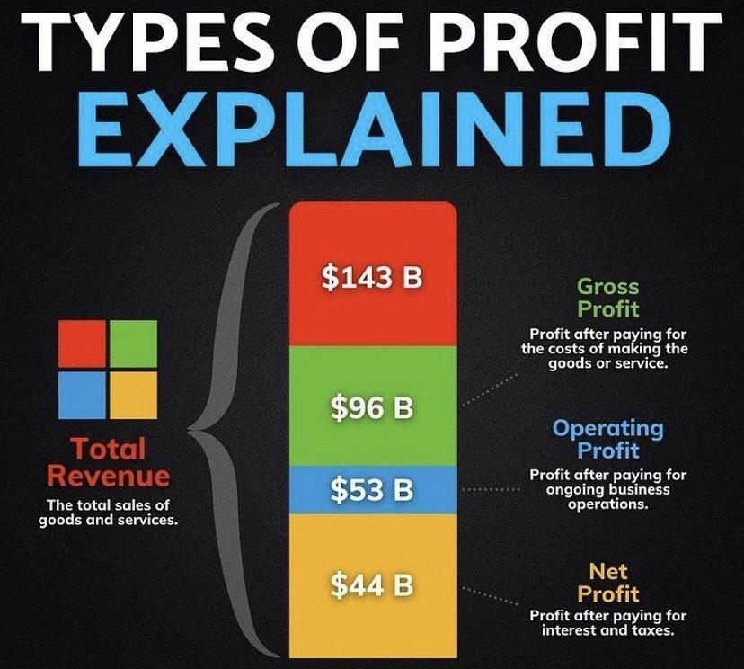

## Table of Contents

## What is gross profit and how is it calculated?

Gross profit is the money a business makes after it pays for the things it sells. It's like if you bought toys for $10 and sold them for $15, your gross profit would be $5. This number shows how well a business is doing at selling its products before it pays for other costs like rent or salaries.

To calculate gross profit, you take the total money you get from sales and subtract the cost of the things you sold. For example, if you sold $100 worth of goods and it cost you $60 to buy those goods, your gross profit would be $100 - $60 = $40. This simple calculation helps businesses see if they are making enough money from their sales to cover other expenses and make a profit.

## What is operating profit and how does it differ from gross profit?

Operating profit is the money a business makes after it pays for the things it sells and the costs to run the business, like rent, salaries, and utilities. It's different from gross profit because gross profit only looks at the money made from sales after subtracting the cost of the goods sold. Operating profit goes a step further by also subtracting the everyday costs of running the business.

To calculate operating profit, you start with the gross profit and then subtract all the operating expenses. For example, if your gross profit is $40 and your operating expenses like rent and salaries are $20, your operating profit would be $40 - $20 = $20. This number is important because it shows how much money the business is making from its main activities before paying taxes and interest on loans.

## What is net income and what expenses are subtracted to arrive at it?

Net income is the money a business has left after it pays for everything. It's like the final amount you get to keep after all the bills are paid. To find net income, you start with the operating profit and then subtract other costs like taxes and interest on loans.

These other costs can be tricky because they might change from year to year. For example, if a business has a big loan, the interest might be high, and that would lower the net income. Taxes can also change, depending on the laws and how much money the business makes. So, net income is important because it shows the real profit of the business after all expenses are taken out.

## How do gross profit, operating profit, and net income relate to each other on the income statement?

Gross profit, operating profit, and net income are all part of the income statement, which is like a report card for a business's money. They show how much money the business makes at different stages. Gross profit comes first on the income statement. It's the money left after the business pays for the things it sells. If you sell toys for $100 and it cost $60 to buy them, your gross profit is $40. This number is important because it shows if the business is good at selling its products.

Next on the income statement is operating profit. This is what's left after you take away the costs of running the business from the gross profit. These costs include things like rent, salaries, and utilities. If your gross profit is $40 and it costs $20 to run the business, your operating profit is $20. This number tells you if the business can make money from its main activities before paying other big costs.

Finally, net income is at the bottom of the income statement. It's the money left after you subtract taxes and interest on loans from the operating profit. If your operating profit is $20 and you pay $5 in taxes and $3 in interest, your net income is $12. This is the real profit of the business, the money it gets to keep after paying for everything. It's the most important number because it shows if the business is truly making money.

## Can you explain the significance of each profit metric for business analysis?

Gross profit is really important because it shows how well a business is doing at selling its products. If the gross profit is high, it means the business is good at buying things at a low price and selling them at a higher price. This number helps business owners see if their main business activity - selling stuff - is making money before they have to pay for other things like rent or salaries. If the gross profit is low, it might mean the business needs to find cheaper products to sell or try to sell their products for more money.

Operating profit is another key number because it tells you if the business can make money from its main activities after paying for everyday costs. This includes things like rent, salaries, and utilities. A high operating profit means the business is not only good at selling its products but also at managing its everyday expenses. If the operating profit is low, it might mean the business needs to cut costs or find ways to make more money from its main activities. This number is crucial for understanding the core health of the business.

Net income is the most important profit metric because it shows the real profit of the business after paying for everything, including taxes and interest on loans. This is the money the business gets to keep at the end of the day. A high net income means the business is doing well overall and is making money after all costs are covered. If the net income is low or negative, it's a warning sign that the business might be struggling to make enough money to cover all its expenses. This number is essential for business owners to see if they are truly profitable and to make big decisions about the future of the business.

## What are common factors that affect gross profit margins?

Gross profit margins can be affected by many things. One big thing is the cost of the products the business buys to sell. If the cost goes up because of higher prices from suppliers or because the business has to pay more to get the products, the gross profit margin can go down. Another thing is how much the business charges for its products. If the business can't charge enough to cover the cost and make a profit, the gross profit margin will be low. Also, if the business has to offer big discounts or deals to sell its products, that can lower the gross profit margin too.

Another [factor](/wiki/factor-investing) is how much the business can sell. If the business sells a lot of products, it might be able to buy them at a lower cost because it's buying in bulk. This can help increase the gross profit margin. But if the business doesn't sell enough, it might have to lower prices to get rid of the products, which can hurt the gross profit margin. Competition is also important. If there are a lot of other businesses selling similar products, the business might have to lower its prices to stay competitive, which can make the gross profit margin smaller.

## How can operating expenses impact the operating profit?

Operating expenses are the costs a business has to pay to keep running every day, like rent, salaries, and utilities. These costs can have a big effect on operating profit, which is the money left after paying for the things sold and these everyday costs. If operating expenses go up, like if rent or salaries increase, the operating profit will go down because there's less money left after paying for everything. For example, if a business has a gross profit of $40 and operating expenses go up from $20 to $25, the operating profit drops from $20 to $15.

On the other hand, if a business can keep its operating expenses low, it can have a higher operating profit. This means the business is good at managing its costs and can make more money from its main activities. For instance, if a business finds a way to lower its rent or reduce its utility bills, the operating profit will go up. If the same business with a gross profit of $40 can lower its operating expenses from $20 to $15, the operating profit will increase from $20 to $25. So, managing operating expenses well is really important for keeping the operating profit healthy.

## What are non-operating items and how do they affect net income?

Non-operating items are things that don't come from the main business activities. They can be things like interest on loans, money made from investments, or even one-time events like selling a piece of land. These items are important because they can change the net income, which is the final amount of money a business has after paying for everything.

Non-operating items can make the net income go up or down. For example, if a business gets a lot of interest from its investments, that can add to the net income and make it higher. But if the business has to pay a lot of interest on its loans, that can take away from the net income and make it lower. So, even though these items don't come from the main business activities, they still have a big effect on the final profit of the business.

## How do different industries typically compare in terms of gross profit, operating profit, and net income?

Different industries have different levels of gross profit, operating profit, and net income because they have different costs and ways of making money. For example, tech companies often have high gross profit margins because they can sell software or digital services at a high price without spending a lot on the things they sell. But their operating profit might be lower because they spend a lot on research and development to keep making new products. Retail businesses, like stores that sell clothes or toys, usually have lower gross profit margins because they have to buy a lot of products to sell, and the cost of those products can be high. Their operating profit can also be lower because they have to pay for things like rent for their stores and salaries for their workers.

Service industries, like restaurants or hair salons, have different profit levels too. Restaurants might have a good gross profit if they can charge a lot for their food, but their operating profit can be lower because they have to pay for things like rent, utilities, and staff salaries. Hair salons might have a high gross profit if they charge a lot for haircuts, but their operating profit can be affected by the cost of running the salon, like rent and supplies. In the end, net income for all these industries depends on how well they manage their costs and how much they can make from their main activities after paying for everything, including taxes and interest on loans.

## What are the limitations of using gross profit, operating profit, and net income as performance indicators?

Gross profit, operating profit, and net income are important numbers that help businesses see how they are doing, but they have some limits. One big limit is that these numbers can be affected by things that don't really show how well the business is doing. For example, if a business sells a big piece of equipment, it might make the net income look good, but it doesn't mean the business is doing better at its main activities. Also, these numbers can be different from one industry to another, so comparing them between different types of businesses might not be fair. A tech company might have a high gross profit but spend a lot on research, while a retail store might have a lower gross profit but lower costs for research.

Another limit is that these numbers don't show everything about a business's health. Gross profit only looks at the money made from sales after paying for the things sold, but it doesn't tell you about other important costs like rent or salaries. Operating profit is better because it includes those costs, but it still doesn't show the full picture because it doesn't include taxes and interest on loans. Net income is the most complete number, but even it can be affected by one-time events or changes in tax laws. So, while these numbers are helpful, they should be used with other information to really understand how a business is doing.

## How can a company improve its gross profit, operating profit, and net income?

A company can improve its gross profit by focusing on buying things at a lower cost and selling them for more money. This means finding good deals from suppliers or buying in bulk to get a better price. It also means setting the right prices for products so that customers will buy them but still leave enough room for profit. Sometimes, a company might need to change its products or find new ones that have a better profit margin. If a company can do these things well, it will have more money left after paying for the things it sells, which means a higher gross profit.

To improve operating profit, a company needs to manage its everyday costs better. This includes things like rent, salaries, and utilities. One way to do this is by finding cheaper places to rent or negotiating better deals with landlords. Another way is to make sure the business is running efficiently, so it doesn't waste money on things like extra staff or high energy bills. If a company can keep these costs down, it will have more money left after paying for the things it sells and the costs to run the business, which means a higher operating profit.

Finally, to improve net income, a company needs to look at everything, including taxes and interest on loans. One way to do this is by finding ways to lower taxes, like using tax breaks or planning better for tax time. Another way is to pay off loans faster or find loans with lower interest rates. If a company can do these things, it will have more money left after paying for everything, which means a higher net income. By focusing on all these areas, a company can improve its overall profitability and be in a better financial position.

## What advanced financial ratios can be derived from gross profit, operating profit, and net income to assess a company's financial health?

One important financial ratio that can be derived from gross profit is the gross profit margin. This ratio shows how much money a company makes from selling its products after paying for the cost of those products. To find the gross profit margin, you divide the gross profit by the total revenue and then multiply by 100 to get a percentage. A high gross profit margin means the company is good at buying things at a low price and selling them for more money. This ratio helps investors and business owners see if the company is making enough money from its sales to cover other costs.

Another useful ratio is the operating profit margin, which comes from the operating profit. This ratio shows how much money a company makes from its main activities after paying for everyday costs like rent and salaries. To calculate the operating profit margin, you divide the operating profit by the total revenue and multiply by 100. A high operating profit margin means the company is good at managing its costs and making money from its main activities. This ratio is important because it shows the core profitability of the business before other costs like taxes and interest.

The net profit margin is another key ratio that comes from net income. This ratio shows the final profit of the company after paying for everything, including taxes and interest on loans. To find the net profit margin, you divide the net income by the total revenue and multiply by 100. A high net profit margin means the company is making a lot of money after all costs are covered. This ratio is very important because it shows the true financial health of the company and how much money it gets to keep at the end of the day.

## What is the difference between Gross Profit, Operating Profit, and Net Profit?

Gross profit, operating profit, and net income are essential financial metrics found on a company's income statement. These metrics provide stakeholders with valuable insights into different facets of a company's financial health and performance. 

Gross profit, the simplest of these metrics, is calculated by subtracting the cost of goods sold (COGS) from the total revenue. Mathematically, it is expressed as:

$$
\text{Gross Profit} = \text{Total Revenue} - \text{COGS}
$$

This metric highlights the efficiency of a company's production and sales processes by reflecting how well it manages the direct costs associated with producing goods or services. A higher gross profit indicates more effective cost management and product pricing strategies.

Operating profit goes a step further by incorporating operating expenses into the evaluation of profitability. It is also known as earnings before interest and taxes (EBIT). Operating profit is calculated by subtracting operating expenses from gross profit:

$$
\text{Operating Profit} = \text{Gross Profit} - \text{Operating Expenses}
$$

Operating profit offers an insight into the profitability of a company’s core business operations, excluding the effects of financing and tax structures. This metric is crucial for assessing how well a company can grow and sustain its business model.

Net income, often referred to as the bottom line, provides the most comprehensive view by considering all expenses, including operating expenses, taxes, and interest. It is calculated as:

$$
\text{Net Income} = \text{Operating Profit} - \text{Interest} - \text{Taxes}
$$

Net income reflects the total earnings available to shareholders and stakeholders after all expenses have been subtracted from total revenue. This metric is a critical indicator of overall company profitability and financial stability.

Each of these metrics — gross profit, operating profit, and net income — provides distinct but complementary insights into a company’s operational efficiency, cost management, and overall financial health. Understanding the implications of each can significantly aid investors, analysts, and company managers in making informed decisions and crafting strategic plans.

## References & Further Reading

Bergstra, J., et al. 'Algorithms for Hyper-Parameter Optimization.' This paper discusses methods for improving the efficiency of hyper-parameter tuning in [machine learning](/wiki/machine-learning) models, a crucial step for enhancing the performance of trading algorithms.

Lopez de Prado, Marcos. 'Advances in Financial Machine Learning.' This book provides an in-depth examination of the application of machine learning techniques in finance. It includes methodologies for designing efficient trading strategies and analyzing financial data.

Jansen, Stefan. 'Machine Learning for Algorithmic Trading.' A comprehensive resource detailing how machine learning can be applied to develop [algorithmic trading](/wiki/algorithmic-trading) systems. It offers practical insights and strategies for building and optimizing trading algorithms using Python.

Chan, Ernest P. 'Quantitative Trading: How to Build Your Own Algorithmic Trading Business.' This book serves as a guide to establishing and managing a [quantitative trading](/wiki/quantitative-trading) business, offering insights into different trading strategies and risk management techniques.

These resources provide foundational knowledge and practical strategies for utilizing machine learning and algorithmic trading in financial markets, helping traders develop robust and optimized trading systems.

