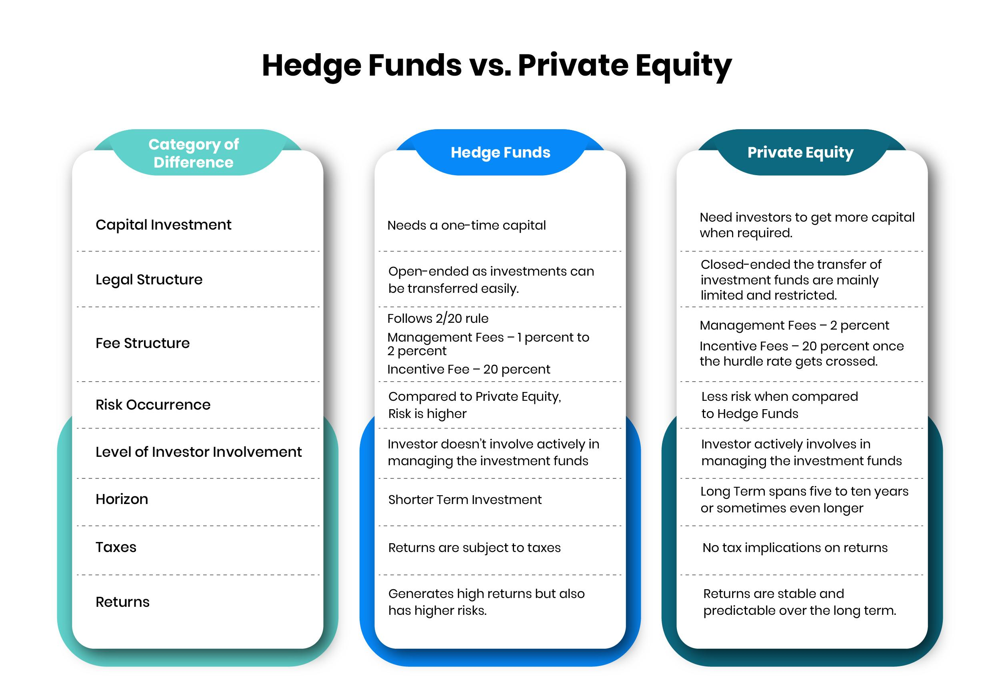

The world of finance offers a diverse array of investment vehicles, each characterized by unique attributes and potential rewards. Among these, private equity funds and hedge funds stand out as two of the most prominent and sophisticated investment options. Private equity funds typically involve direct investments in companies, often acquiring significant stakes or complete ownership with the objective of long-term value creation. These funds focus on enhancing management efficiency and optimizing operations, investing predominantly in private firms or aiming for controlling interests in public companies.

On the other hand, hedge funds are designed to achieve short-term profits through a wide range of financial strategies. They employ diverse asset classes, including stocks, derivatives, and currencies, characterized by their high-risk and high-reward nature, often attracting accredited investors. This article seeks to compare these two investment entities, drawing attention to their fundamental differences in approach, time horizon, and liquidity.



A significant innovation influencing these strategies is algorithmic trading, which deploys advanced algorithms to execute trades at high speed and efficiency. Particularly for hedge funds, algorithmic trading is essential in optimizing trade execution and managing volatility, offering competitive advantages in a rapidly evolving market landscape. As such, this article also explores how algorithmic trading enhances the strategies of private equity funds and hedge funds, providing a comprehensive comparison of these investment vehicles.

## Table of Contents

## Understanding Private Equity Funds

Private equity funds are specialized investment vehicles that engage directly with companies by acquiring substantial stakes or complete ownership. This strategy enables them to exert significant influence over the management and strategic direction of their portfolio companies. Private equity funds predominantly aim to generate long-term value. This is accomplished through various means, such as enhancing management efficiencies, streamlining operations, and implementing robust financial structures.

A key aspect of private equity investment is its focus on private firms, which are companies not listed on public stock exchanges. However, private equity funds are not averse to investing in public companies, especially when opportunities arise to acquire controlling interests. In such cases, the aim is often to reposition these companies for growth or to optimize their operations for increased profitability before eventually selling the stake, typically through a public offering or a sale to another entity.

Private equity firms plan their investments with an extended horizon, typically holding assets for several years. During this period, they implement strategic improvements aimed at increasing the firm’s value by the time of exit. These improvements could include refining business processes, optimizing supply chains, restructuring debt, or expanding market reach. This patient capital approach contrasts with strategies that prioritize immediate gains.

In summary, private equity funds play a critical role in fostering the growth and development of businesses by aligning their strategic objectives with long-term operational enhancements. By doing so, they not only seek to maximize returns on their investments but also contribute to the business ecosystem by nurturing sustainable and efficient companies.

## Understanding Hedge Funds

Hedge funds are investment vehicles designed to achieve short-term profits through the employment of a diverse set of financial strategies. Their flexibility in investment approaches sets them apart from traditional funds, allowing them to pursue absolute returns regardless of market conditions. Hedge funds typically cater to accredited investors due to their high-risk, high-reward nature.

These funds have the latitude to invest across a broad spectrum of asset classes, including stocks, derivatives, currencies, and commodities. The versatility in asset selection enables hedge funds to capitalize on various market inefficiencies. For instance, they might engage in short-selling to profit from anticipated declines in asset prices or utilize leverage to amplify potential returns.

Hedge funds employ a multitude of strategies that can be broadly categorized into directional and non-directional approaches. Directional strategies, such as [global macro](/wiki/global-macro-strategy) and long/short equity, bet on market trends and movements. Non-directional strategies, like market-neutral and [arbitrage](/wiki/arbitrage), seek to capitalize on pricing discrepancies between related securities to achieve profits independent of market direction.

A significant component of [hedge fund](/wiki/hedge-fund-trading-strategies) strategies involves the use of derivatives, such as options and futures contracts, to hedge risks and enhance returns. These financial instruments allow hedge funds to gain exposure to specific market segments or protect against adverse market movements without directly holding the underlying assets.

The high-risk profile of hedge funds stems from their use of leverage, complex instruments, and speculative techniques. This risk is accompanied by the potential for substantial financial rewards, making hedge funds appealing to investors with a higher risk tolerance who seek significant returns. However, these characteristics also necessitate rigorous risk management practices to mitigate potential losses and safeguard investor capital.

In summary, hedge funds leverage a variety of financial instruments and strategies to pursue aggressive profit targets, presenting both substantial opportunities and inherent risks to their investors.

## Key Differences Between Private Equity and Hedge Funds

Private equity funds and hedge funds are prominent financial vehicles, each characterized by distinct investment horizons, [liquidity](/wiki/liquidity-risk-premium) profiles, and structural setups.

### Time Horizon
Private equity funds typically engage in projects that yield results over an extended period, often spanning several years. The aim is to implement strategic enhancements in the companies they invest in, such as improving management efficiencies and operational optimizations, thereby creating long-term value. Conversely, hedge funds concentrate on short-term gains. They actively trade and execute strategies designed to exploit immediate market inefficiencies or fluctuations, seeking to quickly capitalize on potential profit opportunities.

### Liquidity
Liquidity is another distinguishing [factor](/wiki/factor-investing) between these two types of funds. Hedge funds generally offer more liquidity to their investors. They are structured to permit regular withdrawals, sometimes monthly or quarterly, depending on the fund's policies. This contrasts with private equity funds, known for their illiquid nature. Investors in private equity funds often endure lock-up periods that can last several years before they can realize their returns. This illiquidity is largely due to the extended time required for private equity investments to mature and generate significant returns.

### Investment Structure
The investment structure is another key area of divergence. Private equity funds are closed-ended, meaning they have a fixed lifespan and do not allow investors to enter or [exit](/wiki/exit-strategy) until the fund reaches its maturity, unless under specific conditions. This setup aligns with their long-term strategy, providing the stability necessary to enact substantial changes within portfolio companies. Hedge funds, on the other hand, are often open-ended, meaning they continuously accept new investments and allow investors to redeem their shares at regular intervals. This flexibility is advantageous for executing the diverse, dynamic strategies that hedge funds employ to achieve short-term profits.

Understanding these key differences is crucial for investors in aligning their financial goals, risk appetites, and preferred investment horizons with the appropriate investment vehicle.

## Role of Algorithmic Trading

Algorithmic trading, commonly referred to as algo trading, utilizes complex algorithms to execute trades with high speed and precision. These algorithms are designed to identify trading opportunities and automatically manage trades based on predefined criteria. One of the core advantages of [algorithmic trading](/wiki/algorithmic-trading) is its ability to handle large volumes of transactions swiftly, minimizing the costs associated with manual trading and reducing the latency between identifying a potential trade and executing it.

Hedge funds often capitalize on algorithmic trading to enhance their strategies, particularly by optimizing trade execution and uncovering new liquidity sources. The automation provided by these algorithms can systematically analyze vast datasets to identify patterns and correlations that might not be apparent to human traders. This capability is crucial in environments where speed and accuracy are essential for maintaining a competitive edge.

For example, a hedge fund might employ a [statistical arbitrage](/wiki/statistical-arbitrage) strategy using algorithmic trading. In this context, the algorithm would constantly monitor similar securities or financial instruments for price discrepancies, executing trades to profit from these short-lived arbitrage opportunities. Consider the Python snippet below which demonstrates a simplified approach to identifying arbitrage opportunities in a pair of securities:

```python
import numpy as np

def identify_arbitrage(price_series_A, price_series_B):
    """Identify arbitrage opportunities based on price discrepancies."""
    price_diff = np.array(price_series_A) - np.array(price_series_B)
    mean_diff = np.mean(price_diff)
    std_diff = np.std(price_diff)

    # Thresholds for identifying an opportunity
    upper_threshold = mean_diff + 2 * std_diff
    lower_threshold = mean_diff - 2 * std_diff

    # Identify overvalued or undervalued conditions
    return [(i, price_diff[i]) for i in range(len(price_diff)) if 
            price_diff[i] > upper_threshold or price_diff[i] < lower_threshold]

# Example price series
price_A = [100, 102, 101, 99, 98]
price_B = [101, 100, 102, 97, 95]
opportunities = identify_arbitrage(price_A, price_B)
print("Arbitrage Opportunities:", opportunities)
```
This script performs a simplified form of statistical arbitrage by calculating the mean and standard deviation of the price difference between two securities. When the price discrepancy exceeds certain thresholds, an arbitrage opportunity is identified.

Besides optimizing execution, algorithmic trading plays a vital role in managing [volatility](/wiki/volatility-trading-strategies) and risk in hedge fund portfolios. By setting algorithms to continuously adjust positions based on market conditions, funds can mitigate the risk of large losses due to sudden market changes. Algorithms are also employed to determine optimal trade sizes and timing, thus minimizing the market impact and slippage that can occur during large trades.

Overall, the deployment of algorithmic trading in hedge funds represents an essential technological advancement for managing risk, maintaining competitiveness, and enhancing overall trading performance. As financial markets continue to evolve, the significance of algorithmic strategies in supporting sophisticated investment approaches is likely to grow.

## Impact of Algorithmic Trading on Hedge Funds

Hedge funds increasingly utilize algorithmic trading to optimize their operations and enhance liquidity acquisition, particularly in stressed market conditions. Dark pool algorithms play a crucial role in this context, providing hedge funds with the ability to access hidden liquidity, thus minimizing the market impact of large trades. These algorithms execute trades within private exchanges not exposed to the broader market, reducing the risk of price fluctuations that can occur with large public trades.

The adoption of algorithmic trading technologies leads to increased trade efficiency and enhanced trader productivity. By employing sophisticated algorithms, hedge funds can automate and accelerate their decision-making processes, resulting in the rapid execution of trades. This increase in speed and precision reduces the cost of trading and limits slippage—when the final executed price of a trade differs from the intended execution price—ultimately contributing to more stable returns and reduced operational risk.

Trends indicate that hedge funds are progressively diversifying their use of algorithms to adapt to the ever-evolving market dynamics. This diversification is directed towards exploring new strategies and asset classes, including equities, fixed income, and commodities. The versatility of algorithmic trading enables hedge funds to better manage the complexities of global markets and swiftly respond to economic and geopolitical events. This adaptability is essential in maintaining a competitive edge in the complex financial ecosystem.

Moreover, advanced [machine learning](/wiki/machine-learning) techniques and [artificial intelligence](/wiki/ai-artificial-intelligence) are increasingly incorporated into trading algorithms, allowing hedge funds to refine their predictive models and identify market patterns with greater accuracy. Python, a preferred programming language in finance, is widely used for developing these advanced models due to its extensive libraries and ease of use. An example Python snippet for a basic [momentum](/wiki/momentum) trading algorithm is as follows:

```python
import pandas as pd

def calculate_momentum(data, window=14):
    return data.pct_change(window)

def generate_signals(momentum):
    buy_signals = momentum > 0.05
    sell_signals = momentum < -0.05
    return buy_signals.astype(int) - sell_signals.astype(int)

# Example usage
price_data = pd.Series([100, 102, 105, 103, 104, 108, 112, 111, 115, 117])
momentum = calculate_momentum(price_data)
signals = generate_signals(momentum)
print(signals)
```

In conclusion, algorithmic trading offers hedge funds tools for managing trading precision and efficiency, thus solidifying their strategic positions. The continuous innovation in trading algorithms, including machine learning and artificial intelligence, is expected to further expand the capabilities of hedge funds and redefine future trading landscapes.

## Conclusion

Both private equity and hedge funds hold significant positions within the contemporary investment framework, each addressing distinct financial objectives and utilizing unique structural methodologies. Private equity funds predominantly engage in acquiring substantial or full ownership of businesses, focusing on long-term growth and value creation by enhancing operational efficiencies. In contrast, hedge funds capitalize on short-term profit opportunities through a diverse range of financial strategies and asset types, offering potentially high rewards albeit with increased associated risks.

Among the various innovations within the finance sector, algorithmic trading has proven particularly transformative for hedge funds. This technology leverages sophisticated algorithms to execute trades with high speed and precision, effectively optimizing trade execution and discovering new liquidity sources. The agility provided by algorithmic trading allows hedge funds to adapt swiftly to market changes, manage volatility, and maintain competitive edges in rapidly shifting environments.

Prospective investors must carefully assess several factors when deciding between private equity and hedge funds. Key considerations include individual financial goals, risk tolerance levels, and targeted investment timelines. Private equity funds may be suited for those with a long-term horizon and a focus on substantial business influence and management, whilst hedge funds may appeal to those seeking the flexibility and potential high returns of short-term market opportunities.

It is crucial for investors to align their strategic objectives with the characteristics of these investment vehicles, understanding the inherent risks and the potential benefits each offers. Deploying capital thoughtfully within these sophisticated financial instruments can lead to significant value creation, catering to diverse investor needs and expanding the potential for profitable outcomes.

## References & Further Reading

[1]: Metrick, A., & Yasuda, A. (2010). ["The Economics of Private Equity Funds."](https://web.stanford.edu/~piazzesi/Reading/MetrickYasuda2010.pdf) Journal of Economic Perspectives, 23(3), 145-166.

[2]: Lopez de Prado, M. (2018). ["Advances in Financial Machine Learning."](https://www.amazon.com/Advances-Financial-Machine-Learning-Marcos/dp/1119482089) Wiley.

[3]: Sorensen, M., Wang, N., & Yang, J. (2014). ["Valuing Private Equity."](https://papers.ssrn.com/sol3/papers.cfm?abstract_id=2041715) Review of Financial Studies, 27(7), 1977-2023.

[4]: Fung, W., & Hsieh, D.A. (2001). ["The Risk in Hedge Fund Strategies: Theory and Evidence from Trend Followers."](https://www.jstor.org/stable/2696743) Review of Financial Studies, 14(2), 313-341.

[5]: Jorion, P. (2007). ["Value at Risk: The New Benchmark for Managing Financial Risk."](https://link.springer.com/article/10.1007/s11408-007-0057-3) McGraw-Hill.

[6]: Buchner, A., & Wagner, N. (2017). ["Hedge Fund Liquidity: Risk and Return."](https://www.semanticscholar.org/paper/Rewarding-risk-taking-or-skill-The-case-of-private-Buchner-Wagner/15309f395c67b8d8f345655afe6585f29c557aea) Journal of Asset Management, 18(1), 48-66.