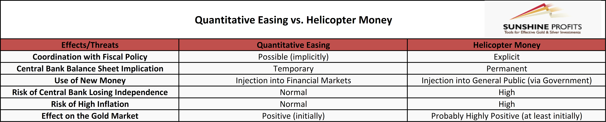

## Table of Contents

## What is helicopter money?

Helicopter money is a term used to describe a type of economic policy where money is given directly to people by the government or central bank. The idea is to boost spending and help the economy grow. The term comes from an example where money is imagined to be dropped from a helicopter, so everyone can pick it up and use it.

This idea was first talked about by an economist named Milton Friedman in the 1960s. He used it to explain how quickly giving money to people could affect the economy. In recent years, some countries have tried similar ideas, like giving money to citizens during tough economic times. The goal is to encourage people to spend more, which can help businesses and create jobs.

## What is quantitative easing?

Quantitative easing, often called QE, is a tool used by central banks to help the economy when interest rates are already very low. When a central bank does QE, it creates new money electronically and uses it to buy financial assets, like government bonds, from banks and other financial institutions. This action puts more money into the economy and makes borrowing cheaper, encouraging businesses and people to spend and invest more.

The goal of QE is to boost economic activity when traditional methods, like lowering interest rates, aren't working well. By buying these assets, the central bank increases the amount of money available in the financial system, which can lead to lower interest rates on loans. This can help businesses grow, create jobs, and keep the economy moving. QE has been used by many countries, including the United States, the United Kingdom, and Japan, during times of economic trouble.

## How does helicopter money work?

Helicopter money is a way for the government or central bank to give money straight to people. Imagine money falling from the sky like it's being dropped from a helicopter. That's why it's called helicopter money. The idea is to give people money so they can spend it on things they need or want. When people spend more, businesses sell more stuff, and this can help the economy grow.

The concept was first thought up by an economist named Milton Friedman. He used the helicopter money idea to show how quickly giving money to people could help the economy. In real life, governments might send checks or make direct bank transfers to people. This can be especially helpful during tough economic times, like a recession, when people might be struggling financially. By putting money directly into people's hands, the hope is that they'll spend it and help the economy get better.

## How does quantitative easing work?

Quantitative easing, or QE, is something central banks do to help the economy when normal methods aren't working. When a central bank does QE, it makes new money and uses it to buy things like government bonds from banks and other financial places. This puts more money into the economy, making it easier and cheaper for people and businesses to borrow money. When borrowing is cheaper, businesses might decide to grow and hire more people, and people might spend more money on things they need or want.

The main goal of QE is to get the economy moving when it's stuck. By buying these bonds, the central bank helps keep interest rates low. Low interest rates can encourage people to take out loans for things like houses or cars, and businesses to borrow money to expand. Countries like the United States, the United Kingdom, and Japan have used QE when they were facing big economic problems. It's like giving the economy a little push to help it get going again.

## What are the main goals of helicopter money?

The main goal of helicopter money is to help the economy grow by giving money directly to people. When people get this money, they can spend it on things they need or want. This spending can help businesses sell more stuff, which can lead to more jobs and a stronger economy. It's like giving the economy a quick boost when it needs it.

Another important goal is to help people during tough economic times. When the economy is struggling, like during a recession, people might have a hard time paying for things they need. Helicopter money can give them the extra cash they need to keep going. By helping people out, the government hopes to keep the economy from getting worse and help it recover faster.

## What are the main goals of quantitative easing?

The main goal of quantitative easing, or QE, is to help the economy when it's not doing well. When normal ways to help the economy, like lowering interest rates, don't work anymore, central banks use QE. They create new money and use it to buy things like government bonds from banks. This puts more money into the economy, making it easier and cheaper for people and businesses to borrow money. When borrowing is cheaper, businesses might decide to grow and hire more people, and people might spend more money on things they need or want.

Another goal of QE is to keep the economy from getting worse and help it start growing again. By buying these bonds, the central bank helps keep interest rates low. Low interest rates can encourage people to take out loans for things like houses or cars, and businesses to borrow money to expand. This can lead to more spending, more jobs, and a stronger economy. Countries like the United States, the United Kingdom, and Japan have used QE when they were facing big economic problems. It's like giving the economy a little push to help it get going again.

## Who benefits from helicopter money?

People who get helicopter money directly benefit from it because they get extra cash to spend on things they need or want. This can be especially helpful for people who are struggling financially, like during a recession. When people have more money to spend, they can buy things like food, clothes, or pay bills, which can make their lives easier.

Businesses also benefit from helicopter money because when people spend more, businesses sell more stuff. This can help businesses grow and hire more people, which is good for the economy. Overall, helicopter money can help both people and businesses during tough economic times by giving the economy a quick boost.

## Who benefits from quantitative easing?

Banks and financial institutions benefit from quantitative easing because when the central bank buys their bonds, it gives them more money to lend. This can help banks make more money from loans and keep the financial system stable. When banks have more money, they can offer lower interest rates on loans, making it easier for people and businesses to borrow.

People and businesses also benefit from quantitative easing because lower interest rates mean cheaper borrowing. Businesses can take out loans to grow and hire more people, which can help the economy. People might decide to buy homes or cars because loans are cheaper. This increased spending can lead to more jobs and a stronger economy, helping everyone in the long run.

## What are the potential risks of implementing helicopter money?

One big risk of helicopter money is that it might cause inflation. When everyone gets more money, they might start spending more, which can make prices go up. If too much money is given out, prices could rise a lot, making things more expensive for everyone. This could hurt people who are on a fixed income, like retirees, because their money won't go as far.

Another risk is that people might start expecting more money from the government in the future. If people think they'll get free money again, they might spend more now and save less, which could be bad for the economy in the long run. Also, if the government keeps giving out money, it might have to borrow more, which could lead to higher debts and problems down the road.

## What are the potential risks of implementing quantitative easing?

One risk of quantitative easing is that it might cause inflation. When the central bank puts more money into the economy, prices can go up. If too much money is added, prices could rise a lot, making things more expensive for everyone. This can be tough on people who are on a fixed income, like retirees, because their money won't go as far.

Another risk is that it might make people and businesses take on too much debt. When borrowing is cheap, people might borrow more than they can handle. This can lead to problems if they can't pay back their loans. Also, if the central bank keeps buying bonds, it might be hard to stop doing QE later without causing problems in the economy.

## How have helicopter money and quantitative easing been used historically?

Helicopter money has been talked about a lot but hasn't been used much in real life. The idea was first mentioned by economist Milton Friedman in the 1960s. He used it to show how quickly giving money to people could help the economy. In recent years, some places have tried things that are kind of like helicopter money. For example, during the COVID-19 pandemic, the U.S. government sent checks to people to help them through tough times. This was meant to get people to spend more and help the economy recover.

Quantitative easing, or QE, has been used more often by countries around the world. It was first used by Japan in the early 2000s when their economy was struggling. The Bank of Japan started buying government bonds to put more money into the economy and help it grow. Later, during the 2008 financial crisis, the United States, the United Kingdom, and other countries used QE to help their economies. They bought bonds to keep interest rates low and encourage people and businesses to borrow and spend more. Since then, QE has become a common tool for central banks to use when the economy needs a boost.

## What are the economic theories supporting helicopter money versus quantitative easing?

The economic theory behind helicopter money is based on the idea that giving money directly to people can quickly boost the economy. This idea was first talked about by economist Milton Friedman. He used the helicopter money example to show how quickly putting money into people's hands could get them to spend more. When people spend more, businesses sell more stuff, which can lead to more jobs and a stronger economy. The theory suggests that helicopter money can be especially helpful during tough economic times, like a recession, because it gives people the cash they need to keep spending and help the economy recover faster.

The economic theory supporting quantitative easing, or QE, focuses on how central banks can help the economy when interest rates are already very low. When a central bank does QE, it creates new money and uses it to buy things like government bonds from banks. This puts more money into the economy and makes borrowing cheaper. The theory is that lower interest rates will encourage businesses to borrow money to grow and hire more people, and people to spend more on things like houses and cars. By doing this, QE can help the economy start growing again when it's struggling.

## References & Further Reading

[1]: ["Helicopter Money: Views of Leading Economists."](https://cepr.org/voxeu/columns/helicopter-money-views-leading-economists) CNBC. 

[2]: Bernanke, B. S. (2002). ["Deflation: Making Sure 'It' Doesn't Happen Here."](https://www.federalreserve.gov/boarddocs/speeches/2002/20021121/default.htm) Speech given before the National Economists Club.

[3]: Friedman, M. (1969). ["The Optimum Quantity of Money and Other Essays."](https://archive.org/details/optimumquantityo0000frie) Aldine Publishing Company.

[4]: ["Quantitative Easing Explained."](https://www.investopedia.com/terms/q/quantitative-easing.asp) Investopedia.

[5]: Treanor, J. (2014). ["What is Quantitative Easing—and How is it Different from Plain Money Printing?"](https://www.thetimes.com/money-mentor/investing/what-is-quantitative-easing) The Guardian.

[6]: ["Algorithmic Trading: A Comprehensive Review."](https://ijsser.org/2023files/ijsser_08__167.pdf) Chan, N., & Shelton, C. (2011). Encyclopedia of Algorithms.

[7]: ["Python for Finance: Analyze Big Financial Data"](https://books.google.com/books/about/Python_for_Finance.html?id=E93SBQAAQBAJ) by Yves Hilpisch