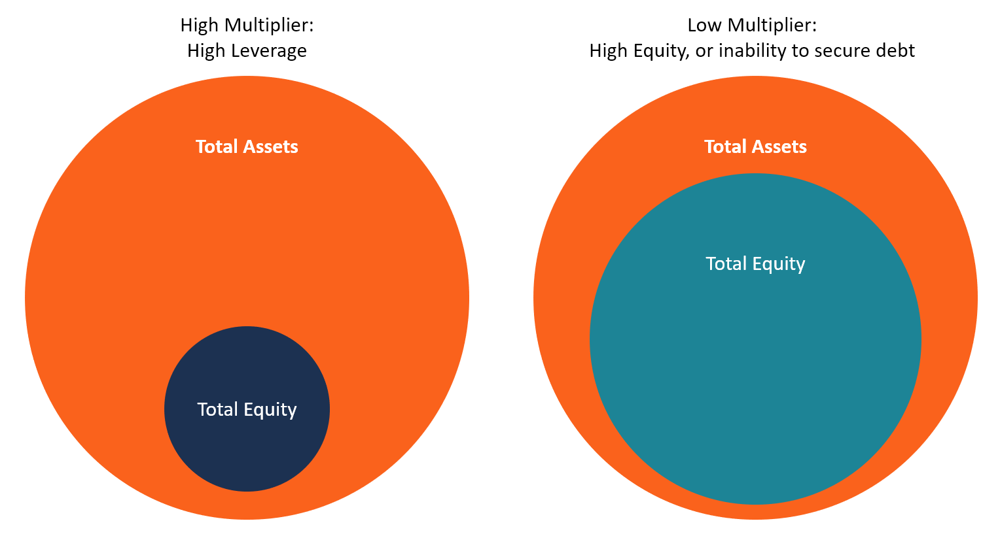

## Table of Contents

## What is an equity multiplier?

An equity multiplier is a financial ratio that shows how much a company uses debt to finance its assets. It tells us how many dollars of assets a company has for every dollar of equity. You can find the equity multiplier by dividing the total assets of a company by its total equity. A higher equity multiplier means the company is using more debt, which can be riskier but might also help the company grow faster.

This ratio is important because it helps investors and analysts understand a company's financial structure. If a company has a high equity multiplier, it might be taking on more risk because it's using more debt. On the other hand, a lower equity multiplier shows that the company is using less debt and more of its own money to buy assets. This can make the company safer but might also mean it grows more slowly.

## How is the equity multiplier calculated?

The equity multiplier is calculated by dividing a company's total assets by its total equity. This simple formula helps us see how much of the company's assets are financed by equity. If you want to know the equity multiplier, just take the number for total assets and divide it by the number for total equity.

For example, if a company has total assets worth $100,000 and total equity of $40,000, the equity multiplier would be $100,000 divided by $40,000, which equals 2.5. This means the company has $2.50 in assets for every $1 in equity. The equity multiplier is useful because it shows how much the company relies on debt to grow its assets.

## What does a high equity multiplier indicate about a company's financial structure?

A high equity multiplier means that a company is using a lot of debt to finance its assets. When a company has a high equity multiplier, it shows that it relies more on borrowed money than on its own money to buy things like buildings, equipment, or inventory. This can make the company seem riskier because if it can't pay back the debt, it could face big problems.

On the other hand, using a lot of debt can help a company grow faster. If the company can make more money from the assets it buys with borrowed money than it has to pay in interest, then using debt can be a smart move. But it's a balancing act because too much debt can be dangerous if things don't go as planned.

## What does a low equity multiplier indicate about a company's financial structure?

A low equity multiplier means that a company is using less debt and more of its own money to buy assets. This makes the company's financial structure safer because it doesn't have to worry as much about paying back large amounts of borrowed money. When a company uses more of its own money, it's seen as more stable and less risky to investors.

However, using less debt can also mean the company might grow more slowly. If a company doesn't borrow much, it might not be able to buy as many new things or expand as quickly as a company that uses more debt. So, while a low equity multiplier shows a safer financial structure, it might also mean the company is not taking full advantage of opportunities to grow.

## How do high and low equity multipliers affect a company's risk profile?

A high equity multiplier means a company uses a lot of debt to buy its assets. This makes the company riskier because if it can't pay back the debt, it could get into big trouble. But, if the company can make more money from the assets than it pays in interest, using debt can help it grow faster. So, a high equity multiplier shows a company that's willing to take on more risk to possibly grow quicker.

On the other hand, a low equity multiplier means a company uses less debt and more of its own money. This makes the company safer because it doesn't have to worry as much about paying back big loans. Investors see this as less risky. But, using less debt might mean the company grows more slowly because it can't buy as many new things or expand as quickly. So, a low equity multiplier shows a company that's playing it safe but might not be growing as fast.

## Can you provide examples of industries typically associated with high equity multipliers?

Industries like utilities and telecom companies often have high equity multipliers. These businesses need a lot of money to build things like power plants, phone lines, and internet cables. They usually borrow a lot of money to pay for these big projects because it takes a long time to start making money from them. So, they end up with a lot of debt compared to their equity, which makes their equity multiplier high.

Another industry with high equity multipliers is real estate. Companies that build and manage big properties, like shopping malls or apartment buildings, often use a lot of debt. They borrow money to buy land and build the properties, hoping to make money from renting or selling them later. Because they use so much debt, their equity multiplier is high, which means they are taking on more risk to grow their business.

## Can you provide examples of industries typically associated with low equity multipliers?

Industries like technology and software often have low equity multipliers. These companies usually don't need a lot of money to start up. They can grow their business using their own money because they don't have to buy big, expensive things like factories or heavy machinery. Instead, they focus on creating software or apps, which costs less to develop. So, they use less debt and have a lower equity multiplier, making them less risky.

Another industry with low equity multipliers is consumer goods, especially those that sell everyday items like food or clothes. These companies often have steady sales and don't need to borrow a lot of money to keep their business running. They can use their profits to grow slowly and steadily. Because they rely less on debt, their equity multiplier is lower, showing that they are financially safer and less risky.

## How do equity multipliers influence return on equity (ROE)?

Equity multipliers can have a big impact on a company's return on equity (ROE). ROE is a way to see how well a company is using the money its owners put into it. The formula for ROE is net income divided by total equity. But there's another way to think about ROE, called the DuPont formula, which shows that ROE is affected by three things: profit margin, asset turnover, and the equity multiplier. The equity multiplier part of this formula is total assets divided by total equity. So, if a company uses more debt (which makes the equity multiplier higher), it can make the ROE go up even if the company's profits don't change much.

But using a lot of debt to boost ROE can be risky. If a company has a high equity multiplier, it means it's borrowing a lot of money to buy its assets. This can make the company look more profitable on paper because the ROE is higher, but it also means the company has to pay back that debt. If the company can't make enough money to pay the interest on the debt, it could get into trouble. So, while a high equity multiplier can make ROE look good, it's important to remember that it also makes the company riskier.

## What are the implications of high versus low equity multipliers on a company's cost of capital?

A high equity multiplier means a company is using a lot of debt. This can lower the company's cost of capital because debt is usually cheaper than equity. When a company borrows money, it only has to pay interest on the loan, which is often less than what shareholders expect to earn from their investment. So, by using more debt, a company can lower the overall cost of the money it uses to run and grow its business. But, there's a catch. Using a lot of debt also makes the company riskier. If the company can't pay back the debt, it could face big problems. So, while a high equity multiplier can lower the cost of capital, it also increases the risk.

On the other hand, a low equity multiplier means a company is using less debt and more of its own money. This makes the company safer because it doesn't have to worry as much about paying back big loans. But, it can also mean a higher cost of capital. When a company uses more of its own money, it might have to pay higher returns to its shareholders because they expect more for their investment. So, a low equity multiplier can make the cost of capital higher because the company is relying more on equity, which is more expensive than debt. But, it also makes the company less risky because it's not borrowing as much money.

## How might changes in a company's equity multiplier affect its financial strategy?

If a company's equity multiplier goes up, it means they're using more debt to buy things. This can be part of a plan to grow the business faster. By borrowing money, the company can buy more assets like buildings or machines without using up all its own money. But, this also makes the company riskier because if they can't pay back the debt, they could get into trouble. So, when a company decides to increase its equity multiplier, it's usually because they think they can make more money from the new assets than they have to pay in interest on the debt. They need to be careful, though, and make sure they can handle the extra risk.

If a company's equity multiplier goes down, it means they're using less debt and more of their own money. This can be part of a plan to make the company safer and more stable. By relying less on borrowed money, the company doesn't have to worry as much about paying back big loans. This can make investors feel more confident because the company is less risky. But, using less debt might also mean the company grows more slowly because they can't buy as many new things or expand as quickly. So, when a company decides to lower its equity multiplier, it's usually because they want to be safer, even if it means growing more slowly.

## What are the potential benefits and drawbacks of maintaining a high equity multiplier?

A high equity multiplier means a company is using a lot of debt to buy its assets. This can help the company grow faster because they can buy more things without using up all their own money. If the company can make more money from these new assets than they have to pay in interest on the debt, it's a good deal. This can make the company look more profitable on paper and can help them take advantage of new opportunities to grow. So, a big benefit of a high equity multiplier is that it can help a company expand quickly and possibly make more money.

But, there are also some big risks with a high equity multiplier. Using a lot of debt makes the company riskier because if they can't pay back the loans, they could get into big trouble. If the company's profits go down or if interest rates go up, it might be hard for them to keep up with the debt payments. This could lead to financial problems or even bankruptcy. So, while a high equity multiplier can help a company grow, it also means they have to be very careful and make sure they can handle the extra risk that comes with borrowing a lot of money.

## What are the potential benefits and drawbacks of maintaining a low equity multiplier?

A low equity multiplier means a company is using less debt and more of its own money to buy things. This makes the company safer because they don't have to worry as much about paying back big loans. When a company uses less debt, it's easier for them to keep up with their bills and stay out of trouble. Investors like this because it means the company is less risky. So, a big benefit of a low equity multiplier is that it makes the company more stable and can make investors feel more confident.

But, there are also some downsides to having a low equity multiplier. Using less debt might mean the company grows more slowly. When a company doesn't borrow much money, they might not be able to buy as many new things or expand as quickly as they could if they used more debt. This can make it harder for them to take advantage of new opportunities to grow. So, while a low equity multiplier makes the company safer, it might also mean they miss out on chances to get bigger and make more money.

## What is the Understanding of Equity Multiplier?

The equity multiplier is a crucial financial leverage ratio that reflects the proportion of a company's assets financed by its shareholders' equity. It provides insights into how a company utilizes debt to finance its assets, thereby indicating the extent of financial leverage employed by the organization. Understanding the equity multiplier is essential for investors and analysts as it reveals the degree to which a company relies on debt versus equity financing.

The equity multiplier is calculated using the formula:

$$
\text{Equity Multiplier} = \frac{\text{Total Assets}}{\text{Shareholders' Equity}}
$$

This formula allows analysts to assess a company's financial structure quickly. A higher equity multiplier signifies that a larger portion of a company's assets is financed by debt, suggesting an aggressive financing strategy. Conversely, a lower equity multiplier indicates that the company relies more on equity, implying a conservative approach to asset financing.

Comparing companies based on their equity multipliers provides valuable insights for investors. Companies with a high equity multiplier often enjoy the benefits of leverage, such as increased returns on equity during periods of economic prosperity. However, this approach also comes with significant risks, especially in volatile market conditions, as high leverage can lead to increased financial distress and instability. 

In contrast, companies with low equity multipliers may sacrifice potential returns due to their conservative financing strategy. However, they are generally considered safer investment options, particularly during economic downturns. These companies are less susceptible to financial distress since they are less reliant on borrowed funds.

Investors need to consider industry norms and specific business models when interpreting the equity multiplier. For instance, industries such as utilities or real estate might naturally exhibit higher equity multipliers due to the capital-intensive nature of their operations. Therefore, while the equity multiplier is a powerful indicator, it should be analyzed in conjunction with other financial metrics and industry benchmarks to form a comprehensive view of a company's financial health and strategy.

## How can algorithmic trading be integrated with financial leverage?

Algorithmic trading, often referred to as algo trading, involves the use of computer algorithms to execute trading orders at high speed and [volume](/wiki/volume-trading-strategy), relying on predetermined criteria. This approach allows traders to optimize decision-making and exploit market opportunities that might be invisible to the human eye. As technology advances, algo trading becomes increasingly central to modern finance, providing competitive advantages in speed, efficiency, and precision.

### Leveraging Financial Ratios

One of the core strategies in [algorithmic trading](/wiki/algorithmic-trading) is the utilization of financial ratios, such as the equity multiplier, to fine-tune trading strategies. The equity multiplier, a financial leverage ratio, is given by the formula:

$$
\text{Equity Multiplier} = \frac{\text{Total Assets}}{\text{Shareholder's Equity}}
$$

This ratio offers insights into how a company finances its assets through debt versus equity. Algorithms can analyze this ratio to gauge the level of financial leverage a company employs, thereby assessing the associated risk and expected returns. By integrating this ratio into trading models, algorithms can optimize portfolio leverage, enhancing potential returns while maintaining an acceptable level of risk.

For instance, algorithms might prioritize investments in companies with higher equity multipliers if they align with a strategy focused on high leverage for growth potential. Conversely, they might avoid or short companies with excessively high multipliers indicative of unsustainable leverage levels.

### Case Studies on Algorithmic Trading Impact

Numerous case studies highlight the significant impact of algorithmic trading on managing financial leverage and enhancing market efficiency. A notable example is high-frequency trading ([HFT](/wiki/high-frequency-trading-strategies)) firms that use leverage ratios to inform their trading decisions. By rapidly responding to real-time financial data and adjusting positions accordingly, these firms contribute to pricing efficiency and [liquidity](/wiki/liquidity-risk-premium) in the markets.

Consider a scenario where an algorithm identifies a shift in the equity multiplier of a key company within a portfolio, suggesting a change in its financial structure. The algorithm can react almost instantaneously, adjusting positions to mitigate potential risks or capitalize on new opportunities. This ability to quickly adapt to financial leverage changes can safeguard investments from adverse events and capture new growth avenues.

Moreover, predictive algorithms that forecast market trends based on historical leverage data play a crucial role in risk management. By analyzing patterns in leverage ratios across sectors or specific markets, these algorithms can predict downturns or rallies, allowing traders to preemptively adjust their strategies.

In conclusion, the integration of algorithmic trading with financial leverage metrics like the equity multiplier offers traders sophisticated tools to enhance trading strategies and improve market performance. As technology continues to evolve, the intersection of these fields promises to drive further innovations and efficiencies in the financial markets.

## What is the interconnection between leverage, capital structure, and algo trading?

Algorithmic trading has revolutionized the way financial decisions are made by providing sophisticated tools that can analyze vast amounts of data. These tools have significant implications for leveraging and capital structure decisions in corporate finance. At the core, algorithmic trading employs quantitative techniques to process financial metrics, including leverage ratios, thereby optimizing trading strategies and influencing capital decisions.

When it comes to analyzing financial leverage, algorithmic trading systems can swiftly evaluate a company's equity multiplier, a key indicator of financial leverage. This is done by using the formula:

$$
\text{Equity Multiplier} = \frac{\text{Total Assets}}{\text{Shareholder's Equity}}
$$

Through real-time analysis of such ratios, trading algorithms can assess the financial health and leverage position of companies. For instance, algorithms can identify whether a company is operating with high leverage—which might entail higher risk and higher potential returns—or with low leverage, indicating a more conservative approach.

The integration of financial leverage with algorithmic trading offers several benefits. Algorithms can aid in managing leverage by promptly executing trades that hedge against downside risks, thus protecting portfolios from adverse market conditions. Moreover, algorithms can optimize the debt-to-equity mix, offering insights into when it might be beneficial to adjust capital structures in response to changing interest rates or market conditions. By aligning trading decisions with leverage metrics, firms can enhance returns while managing risk exposure more effectively.

A practical example of successful integration is the use of algorithmic trading to manage leveraged exchange-traded funds (ETFs). These funds aim to return a multiple of the performance of a specific index and often use derivatives and borrowing to achieve this goal. Algorithmic trading systems monitor leverage ratios continuously, adjusting positions in real-time to maintain desired exposure and mitigate risks associated with leverage [volatility](/wiki/volatility-trading-strategies). This dynamic management enhances the fund's performance and appeal to investors seeking amplified returns.

Nonetheless, the integration of leverage with algorithmic trading strategies presents several challenges. One of the critical challenges is ensuring that algorithms adapt to market volatility and do not exacerbate leverage risks during sudden downturns. Moreover, regulatory compliance poses a significant consideration as algorithms must operate within established financial guidelines to avoid systemic risks and breaches of trading protocols.

In conclusion, the integration of algorithmic trading with financial leverage and capital structure decisions demonstrates substantial potential for enhancing financial strategies. The ability of algorithms to analyze leverage and inform decision-making processes allows companies to better navigate the complexities of modern markets, ultimately strengthening their financial performance.

## References & Further Reading

1. Ross, S. A., Westerfield, R. W., & Jaffe, J. F. (2013). *Corporate Finance*. McGraw-Hill Education. This textbook provides a comprehensive overview of financial leverage and capital structure, essential for understanding the intricacies of financial ratios such as the equity multiplier.

2. Hull, J. C. (2012). *Options, Futures, and Other Derivatives*. Prentice Hall. This book offers insights into algorithmic trading, including the use of quantitative strategies that leverage financial ratios and capital structure dynamics.

3. DeMarzo, P., & Berk, J. (2019). *Corporate Finance*. Pearson Education. Useful for readers looking to explore the strategic implications of optimal capital structure and its effects on corporate valuation.

4. Fabozzi, F. J., & Markowitz, H. M. (2011). *The Theory and Practice of Investment Management*. Wiley. A valuable resource for understanding the integration of financial metrics into investment strategies, particularly with algorithmic trading approaches.

5. Brigham, E. F., & Ehrhardt, M. C. (2013). *Financial Management: Theory & Practice*. Cengage Learning. This work discusses the balance of risk and return in financial leverage, a crucial concept for anyone studying corporate finance.

6. Poon, S.-H., & Granger, C. W. J. (2003). *Forecasting Volatility in Financial Markets: A Review*. Journal of Economic Literature, 41(2), 478-539. This article reviews methods for volatility modeling, which is integral to managing risks associated with high financial leverage.

7. Avellaneda, M., & Stoikov, S. (2008). *High-frequency trading in a limit order book*. Quantitative Finance, 8(3), 217-224. This paper examines the role of algorithmic trading in modern financial markets, offering empirical data relevant to its intersection with leverage strategies.

8. Damodaran, A. (2012). *Investment Valuation: Tools and Techniques for Determining the Value of Any Asset*. Wiley. For further understanding of how capital structure influences corporate valuation, this text is highly recommended.

9. Cochrane, J. H. (2011). *Presidential Address: Discount Rates*. The Journal of Finance, 66(4), 1047-1108. Cochrane’s analysis of discount rates can enhance comprehension of how financial leverage affects investment evaluations.

10. Bodie, Z., Kane, A., & Marcus, A. J. (2013). *Investments*. McGraw-Hill Education. This textbook is a cornerstone for grasping the fundamentals of investing, including the strategic incorporation of algorithmic techniques in financial markets.

