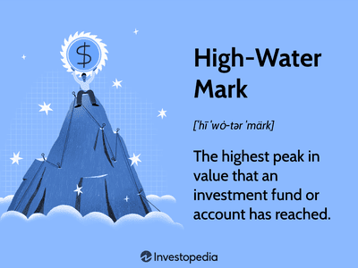

## Table of Contents

## What is a high-water mark?

A high-water mark is the highest level something has reached in the past. It's like a record or a peak. For example, in finance, it might be the highest value an investment fund has ever reached. People use high-water marks to compare current levels to the best performance in the past.

In other areas, like rivers or lakes, a high-water mark shows the highest point the water has reached on the shore. This can help people understand flood risks and plan for safety. It's a simple way to remember the highest level and be prepared for the future.

## What is a hurdle rate?

A hurdle rate is like a goal that a project or investment needs to reach to be considered good enough. It's the minimum return or profit that people expect before they decide to put their money into something. For example, if a company sets a hurdle rate of 10%, any project they look at must be expected to make at least 10% profit to be worth doing.

Hurdle rates help businesses and investors make smart choices. They use it to compare different projects and see which ones will give them the best return on their money. If a project doesn't meet the hurdle rate, it's usually not worth the risk. This way, people can focus on the opportunities that are most likely to succeed and grow their money.

## How do high-water mark and hurdle rate function in investment funds?

In investment funds, a high-water mark is like a record of the highest value the fund has ever reached. It's important because it helps make sure that fund managers only get paid performance fees when they do better than their past best. For example, if the fund's value goes up to $100, that becomes the high-water mark. If the value drops to $90 and then goes back up to $100, the manager doesn't get a performance fee until the fund's value goes above $100 again. This way, investors know that the manager is working to keep improving the fund's performance.

A hurdle rate in investment funds is like a minimum goal that the fund needs to reach before the manager can earn a performance fee. It's a way to make sure that the fund is doing well enough before anyone gets extra pay. For instance, if the hurdle rate is set at 5%, the fund's returns need to be at least 5% before the manager can start [earning](/wiki/earning-announcement) performance fees on any returns above that. This encourages the manager to aim for returns that are better than just the minimum, making sure that the fund is working hard to grow the investors' money.

## What are the primary differences between a high-water mark and a hurdle rate?

A high-water mark and a hurdle rate are two different tools used in investment funds, but they serve different purposes. A high-water mark is the highest value that an investment fund has ever reached. It's like a record that the fund manager needs to beat before they can earn performance fees. If the fund's value drops and then goes back up to the high-water mark, the manager doesn't get paid until the value goes above that mark again. This helps make sure that the manager is always working to improve the fund's performance and not just getting paid for bringing the value back to where it was before.

On the other hand, a hurdle rate is a minimum goal that the fund needs to reach before the manager can earn performance fees. It's like a starting line that the fund's returns need to cross before any extra pay is given. For example, if the hurdle rate is set at 5%, the fund needs to make at least a 5% return before the manager can start earning fees on any returns above that. This encourages the manager to aim for returns that are better than just the minimum, ensuring that the fund is working hard to grow the investors' money.

## Why are high-water marks important in hedge funds?

High-water marks are important in hedge funds because they help make sure that fund managers earn their performance fees fairly. When a [hedge fund](/wiki/hedge-fund-trading-strategies) reaches a new high value, that becomes the high-water mark. If the fund's value drops and then goes back up to that high-water mark, the manager doesn't get paid until the value goes above it again. This rule stops managers from getting paid for just bringing the fund back to where it was before. It makes sure they keep working hard to do better than their past best.

This is good for investors because it means they only pay performance fees when the fund is doing really well. It protects them from paying for the same gains twice. High-water marks encourage hedge fund managers to focus on growing the fund's value over time, rather than just trying to recover from losses. This helps build trust between investors and managers, making sure everyone is working towards the same goal of increasing the fund's value.

## How does a hurdle rate affect fund managers' compensation?

A hurdle rate is like a goal that a fund needs to reach before the manager can get extra pay. It's a minimum return that the fund has to make, like 5% or 10%. If the fund doesn't make at least that much, the manager doesn't get any performance fees. This means the manager has to work hard to make sure the fund does well enough to pass the hurdle rate.

Once the fund makes more than the hurdle rate, the manager can start earning performance fees on the extra returns. For example, if the hurdle rate is 5% and the fund makes 8%, the manager gets paid on the 3% above the hurdle. This encourages the manager to aim higher and keep working to make the fund grow, not just meet the minimum goal. It helps make sure the manager is always trying to do their best for the investors.

## Can you explain the calculation of a high-water mark?

A high-water mark is the highest value an investment fund has ever reached. To calculate it, you just need to keep track of the fund's value over time. Every time the fund's value goes up to a new high, that becomes the new high-water mark. For example, if the fund starts at $100, then goes up to $120, and then drops to $110, the high-water mark is $120. If the fund later goes up to $130, the high-water mark changes to $130.

When the fund's value drops below the high-water mark and then goes back up, the high-water mark doesn't change until the fund's value goes above the previous high-water mark. This means that if the fund drops to $110 after reaching $130, and then goes back up to $130, the high-water mark stays at $130. The fund needs to go above $130 before the high-water mark changes again. This way, the high-water mark always shows the best the fund has ever done.

## What are common methods to calculate a hurdle rate?

A hurdle rate is like a minimum goal that a project or investment needs to reach. To calculate it, people often look at what they could earn from other safe investments, like government bonds. They might use the [interest rate](/wiki/interest-rate-trading-strategies) from these bonds as a starting point. Then, they add extra percentages to account for the risk of the new project or investment. The riskier the project, the higher the hurdle rate they set.

Another way to calculate a hurdle rate is by using the company's cost of capital. This is the average rate a company pays to borrow money or use its own money for investments. To find the hurdle rate, they might add a bit more to the cost of capital to make sure the new project does better than just covering the costs. This method helps make sure the new project is worth the risk and will add value to the company.

## How do high-water marks and hurdle rates impact investor returns?

High-water marks and hurdle rates are important because they affect how much money investors get to keep. A high-water mark is like a record of the highest value a fund has reached. If the fund drops and then goes back up to that high value, the manager doesn't get paid until it goes even higher. This means investors only pay the manager when the fund does better than before, which helps protect their money. When the fund is doing really well, investors get to keep more of the returns because the manager only gets paid on the new gains above the high-water mark.

A hurdle rate is a minimum goal that a fund has to reach before the manager can get extra pay. It's like a starting line that the fund's returns need to cross. If the fund doesn't make at least that much, the manager doesn't get any performance fees. This means the manager has to work hard to make the fund do well enough to pass the hurdle rate. Once the fund makes more than the hurdle rate, the manager can start earning performance fees on the extra returns. This encourages the manager to aim higher, which can lead to better returns for investors.

## What are the potential drawbacks of using a high-water mark?

Using a high-water mark can be tricky because it might stop managers from getting paid for a long time if the fund's value drops a lot. Imagine the fund reaches a high point, then falls and stays below that point for years. The manager won't get any performance fees until the fund goes above the old high-water mark again. This can make it hard for the manager to keep going, especially if they need those fees to run the fund well.

Also, high-water marks can make managers take bigger risks to get the fund's value back up. They might try risky investments to quickly reach the high-water mark again, which can be bad for investors. If these risky moves don't work out, the fund could lose even more money. So, while high-water marks protect investors from paying twice for the same gains, they can also lead to problems if not managed carefully.

## How might a fund manager manipulate a hurdle rate?

A fund manager might try to manipulate a hurdle rate by setting it too low. If the hurdle rate is set at a very small percentage, like 1% or 2%, it's easy for the fund to reach it. This means the manager can start earning performance fees sooner, even if the fund isn't doing that well. By keeping the hurdle rate low, the manager can get paid more often, which might not be fair to investors who expect better returns.

Another way a manager might manipulate a hurdle rate is by changing it often. If the manager keeps lowering the hurdle rate when the fund is struggling, they can still earn performance fees even if the fund's performance is not great. This can make it seem like the fund is doing better than it really is. Investors need to watch out for these kinds of changes to make sure the hurdle rate stays fair and helps the fund grow over time.

## What advanced strategies can be used to optimize the use of high-water marks and hurdle rates in fund performance?

To make the best use of high-water marks, fund managers can use a strategy called "smoothing." This means they spread out the returns over time instead of having big ups and downs. By doing this, the fund's value doesn't drop as much, so it's easier to get back to the high-water mark. This helps managers earn performance fees more regularly without taking big risks. Another strategy is to use a "rolling high-water mark," where the high-water mark is reset every few years. This gives managers a fresh start and encourages them to keep growing the fund, even if it had a bad year before.

For hurdle rates, managers can use a "tiered hurdle rate" system. This means setting different hurdle rates for different levels of returns. For example, the first 5% return might have a lower hurdle rate, but returns above that could have a higher one. This encourages managers to aim for higher returns because they get paid more for doing better. Another smart strategy is to link the hurdle rate to a benchmark, like a stock market index. If the fund does better than the benchmark, the manager earns performance fees. This way, investors know the fund is doing well compared to the market, not just meeting a fixed number.

## What is the High-Water Mark Explained?

A high-water mark is an essential metric in the investment world, particularly within hedge funds and investment funds, as it determines the peak value that a fund or investment account has reached. This benchmark ensures that performance fees are only imposed once the fund exceeds its prior highest value. Consequently, this system prevents the imposition of redundant fees based on previously attained gains, safeguarding investors' financial interests.

The high-water mark operates as a safeguard for investors, providing a guarantee that payment for performance is exclusively determined by net gains surpassing prior peaks. For instance, if a fund initially reaches a value of $100 million, declines to $90 million, and subsequently rises to $95 million, the fund manager does not earn performance fees until the fund's value surpasses $100 million, the previous high. This mechanism ensures that investors are charged based on the genuine added value created by fund managers rather than fluctuations within prior gains.

$$
\text{Performance Fee} = \left\{
    \begin{array}{ll}
    \text{Fee Rate} \times (\text{Current Value} - \text{High-Water Mark}) & \text{if } \text{Current Value} > \text{High-Water Mark} \\
    0 & \text{otherwise}
    \end{array}
\right.
$$

This framework aligns with investors' interests by motivating fund managers to recover any losses before claiming performance fees. Such alignment encourages fund managers to focus on long-term growth and stability rather than short-term gains, fostering a cooperative dynamic between fund managers and investors. The goal is to assure investors that managers are working diligently towards recovering any prior dips in the fund's value before they can partake in performance-related rewards, thus promoting consistent fund management and robust performance over time.

## What is the Hurdle Rate and how can it be understood?

A hurdle rate is a critical benchmark in investment management, representing the minimum acceptable return that an investment fund must achieve before performance fees become applicable. Unlike flat fee structures, hurdle rates ensure that fund managers are only rewarded when their investment strategies exceed predefined expectations, protecting investors from unwarranted fees for subpar performance. This aligns the interests of fund managers with those of investors, promoting a focus on achieving superior results.

Hurdle rates serve as an additional safeguard by setting a baseline return requirement. This means only the portion of returns exceeding this rate is subject to performance-based fees, effectively filtering out compensation for merely meeting basic return levels. By doing so, they motivate fund managers not only to cover operational costs but also to achieve returns that significantly exceed these costs.

There are different methodologies for setting hurdle rates, which can be relative or absolute. A relative hurdle rate might be pegged to an established financial index, such as the S&P 500, implying that fund managers must outperform the index to earn performance fees. Alternatively, an absolute hurdle rate may be positioned as a fixed percentage above the fund's weighted average cost of capital (WACC). The WACC represents the average rate of return a company is expected to pay its security holders to finance its assets, calculated as follows:

$$
\text{WACC} = \frac{E}{V} \times Re + \frac{D}{V} \times Rd \times (1 - Tc)
$$

where:
- $E$ is the market value of equity,
- $V$ is the total market value of the company’s financing (equity plus debt),
- $Re$ is the cost of equity,
- $D$ is the market value of debt,
- $Rd$ is the cost of debt,
- $Tc$ is the corporate tax rate.

This variety in hurdle rate setting allows funds to tailor thresholds that reflect their specific strategic goals and risk environments, further incentivizing managers to seek gains well above basic investment thresholds. Such strategies bolster the protective measures for investors, ensuring that compensation structures are strictly tied to genuine value creation.

## References & Further Reading

[1]: [Sadka, R. (2010). "Liquidity Risk and the Cross-Section of Hedge-Fund Returns."](https://archive.fdic.gov/view/fdic/11978) Journal of Financial Economics.

[2]: ["Hedge Fund Operational Due Diligence: Understanding the Risks"](https://www.amazon.com/Hedge-Fund-Operational-Diligence-Understanding/dp/0470372346) by Jason Scharfman.

[3]: ["The Hedge Fund Mirage: The Illusion of Big Money and Why It’s Too Good to Be True"](https://www.amazon.com/Hedge-Fund-Mirage-Illusion-Money/dp/1118164318) by Simon Lack.

[4]: ["More Than You Know: Finding Financial Wisdom in Unconventional Places"](https://www.amazon.com/More-Than-You-Know-Unconventional/dp/0231143729) by Michael J. Mauboussin.

[5]: Agarwal, V., & Naik, N. Y. (2000). ["Performance Evaluation of Hedge Funds with Option-Based and Buy-and-Hold Strategies."](https://papers.ssrn.com/sol3/papers.cfm?abstract_id=238708) The Journal of Finance.