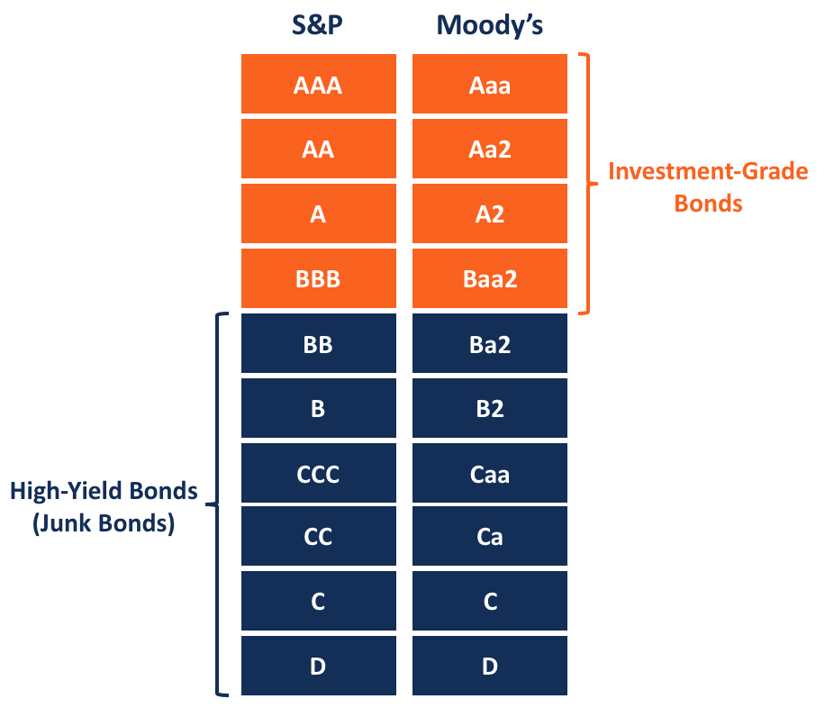

## Table of Contents

## What are high-yield bonds?

High-yield bonds are a type of bond that offers higher interest rates than other bonds. They are also called junk bonds. These bonds are issued by companies that might have more risk, so investors get paid more to take that risk. The higher interest rate is like a reward for the investor, because there's a bigger chance the company might not be able to pay back the money.

Even though high-yield bonds can be riskier, they can be a good choice for some investors. If you're willing to take on more risk, you might earn more money from the higher interest payments. But, it's important to understand that if the company runs into trouble, you could lose your investment. That's why it's a good idea to think carefully and maybe talk to a financial advisor before buying high-yield bonds.

## What are low-yield bonds?

Low-yield bonds are bonds that pay a smaller amount of interest compared to other bonds. They are also called investment-grade bonds. These bonds are usually issued by companies or governments that are seen as very safe and reliable. Because they are less risky, investors don't get paid as much interest. It's like choosing a safe path where you know you'll get your money back, but you won't earn as much along the way.

Even though low-yield bonds don't offer big rewards, they can be a good choice for people who want to keep their money safe. If you're someone who doesn't like taking big risks with your money, these bonds might be right for you. They can help you grow your savings slowly and steadily, without the worry that comes with riskier investments.

## How do high-yield bonds differ from low-yield bonds in terms of risk?

High-yield bonds and low-yield bonds have different levels of risk. High-yield bonds, also known as junk bonds, come with a higher chance that the company might not be able to pay back the money you lent them. This is because these bonds are usually issued by companies that might be struggling or have a lot of debt. So, if you invest in high-yield bonds, you might earn more interest, but there's also a bigger risk that you could lose your money if the company runs into trouble.

On the other hand, low-yield bonds, also called investment-grade bonds, are much safer. These bonds are issued by companies or governments that are seen as very reliable and less likely to run into financial problems. Because they are safer, the interest you earn from low-yield bonds is lower. If you choose low-yield bonds, you're [picking](/wiki/asset-class-picking) a safer path where you're more likely to get your money back, but you won't earn as much interest as you would with high-yield bonds.

## What are the typical returns one might expect from high-yield bonds?

High-yield bonds usually offer higher returns than other types of bonds. The typical return can vary, but you might expect to earn between 4% to 8% more in interest than what you'd get from safer, low-yield bonds. This higher return is what attracts many investors to high-yield bonds, even though they come with more risk.

However, these returns aren't guaranteed. The actual return you get depends on the specific bond, the health of the company that issued it, and what's happening in the economy. If the company does well, you might earn a good return. But if the company struggles, you could lose money, and your return could be much lower or even negative.

## What are the typical returns one might expect from low-yield bonds?

Low-yield bonds usually give you returns that are smaller than what you might get from high-yield bonds. You might expect to earn around 2% to 4% in interest. These bonds are safer, so they don't offer as much reward, but they're a good choice if you want to keep your money safe and still earn a little bit.

The actual return you get can change depending on the bond and who issued it. It also depends on what's happening in the economy. Even though the returns are lower, low-yield bonds are a steady way to grow your savings without taking big risks.

## Who are the typical investors in high-yield bonds?

People who invest in high-yield bonds are usually looking for a bigger reward and are okay with taking more risk. These investors might be big companies, like pension funds or insurance companies, that need to earn more money to pay for their future promises. They have experts who can study the bonds and pick the ones that seem like a good deal, even if they're a bit risky.

Individual investors can also buy high-yield bonds. These might be people who know a lot about investing and want to add some risk to their mix of investments. They understand that they might earn more money, but they also know they could lose some if things go wrong. These investors often have other safe investments too, so they can balance out the risk from the high-yield bonds.

## Who are the typical investors in low-yield bonds?

The typical investors in low-yield bonds are people and groups who want to keep their money safe. These might be older people who are retired and need a steady income without taking big risks. They want to make sure they can pay their bills and keep their savings safe. Families saving for their kids' education might also choose low-yield bonds because they want to grow their money slowly but surely.

Big organizations like banks, insurance companies, and pension funds also invest in low-yield bonds. They need to be careful with their money because they have to pay out to their customers or members over many years. Low-yield bonds help them earn a little bit of interest while keeping their money safe. These big groups often have experts who pick the best low-yield bonds for them.

## How does the credit rating of a bond affect its classification as high-yield or low-yield?

The credit rating of a bond is like a report card that tells you how likely it is that the company or government will pay you back. If a bond has a high credit rating, it means the issuer is seen as very reliable and safe. These bonds are called low-yield or investment-grade bonds because they offer lower interest rates. People trust that they will get their money back, so they don't need to be paid as much to take the risk.

On the other hand, if a bond has a low credit rating, it means there's a bigger chance the issuer might not pay you back. These bonds are called high-yield or junk bonds because they have to offer higher interest rates to attract investors. The higher interest is a way to reward people for taking on more risk. So, the credit rating helps decide if a bond is high-yield or low-yield, based on how safe or risky it is.

## What role do economic cycles play in the performance of high-yield versus low-yield bonds?

Economic cycles can really change how high-yield and low-yield bonds do. When the economy is doing well, high-yield bonds often do better. This is because companies that issue these bonds are making more money and are less likely to have trouble paying back their debts. So, investors feel safer and are happy to get the higher interest rates that come with high-yield bonds. But when the economy starts to slow down or go into a recession, high-yield bonds can get riskier. Companies might struggle more, and there's a bigger chance they won't be able to pay back what they owe. This can make the value of high-yield bonds drop.

On the other hand, low-yield bonds are usually more stable during different economic cycles. Because they are issued by safer companies or governments, they don't change as much when the economy goes up and down. In tough economic times, investors might move their money into low-yield bonds because they want to keep their money safe, even if it means [earning](/wiki/earning-announcement) less interest. So, low-yield bonds can be a good choice if you want to protect your money during economic downturns, while high-yield bonds might be better when the economy is strong and growing.

## How can diversification strategies be applied differently when investing in high-yield versus low-yield bonds?

When you invest in high-yield bonds, diversification is really important because these bonds can be risky. You want to spread your money across different companies and industries so that if one company runs into trouble, it won't hurt your whole investment. For example, you might buy high-yield bonds from companies in different sectors like technology, healthcare, and energy. This way, if the energy sector has a bad year, your investments in technology and healthcare might still do well. Also, you can look at bonds with different maturity dates, so you're not stuck if interest rates change a lot.

For low-yield bonds, diversification is still a good idea, but it's a bit different because these bonds are safer. You might focus on spreading your money across different types of issuers, like governments and big, stable companies. This helps you keep your money safe while still earning a little interest. You can also look at bonds from different countries or regions, so you're not just betting on one economy. This way, if one country's economy slows down, your bonds from other places might still be okay.

In both cases, the key is to not put all your eggs in one basket. By mixing up your investments in high-yield and low-yield bonds, you can balance the risks and rewards. This can help you feel more confident about your money, no matter what's happening in the economy.

## What are the tax implications of investing in high-yield bonds compared to low-yield bonds?

When you invest in high-yield bonds, the interest you earn is usually taxed as regular income. This means you'll pay taxes on that interest at the same rate as your salary or wages. Since high-yield bonds pay more interest, you might end up paying more in taxes compared to low-yield bonds. If you're in a high tax bracket, this can really cut into your returns. But, there's a way to lower your taxes: some high-yield bonds are issued by cities or states, and the interest from these bonds might be tax-free at the federal level, and sometimes at the state level too.

For low-yield bonds, the tax situation is similar. The interest you earn is also taxed as regular income. But since low-yield bonds pay less interest, your tax bill will usually be smaller than with high-yield bonds. If you're in a lower tax bracket, the difference might not be as big of a deal. Just like with high-yield bonds, some low-yield bonds issued by cities or states can offer tax-free interest, which can be a nice benefit if you're trying to keep more of your money.

## How do global market conditions influence the relative attractiveness of high-yield and low-yield bonds?

Global market conditions can really change how good high-yield and low-yield bonds look to investors. When the world economy is doing well, high-yield bonds can seem more attractive. This is because companies that issue these bonds are making more money and are less likely to have trouble paying back their debts. Investors feel safer and are happy to get the higher interest rates that come with high-yield bonds. But if the global economy starts to slow down or there's a lot of uncertainty, high-yield bonds can become riskier. Investors might worry that companies won't be able to pay back what they owe, so they might look for safer places to put their money.

On the other hand, low-yield bonds are usually more stable no matter what's happening around the world. Because they are issued by safer companies or governments, they don't change as much when the global economy goes up and down. In tough times, investors might move their money into low-yield bonds because they want to keep their money safe, even if it means earning less interest. So, when the world is facing economic challenges, low-yield bonds can seem more attractive because they offer a safer way to invest your money.

## What is the understanding of bond yields?

Bond yield serves as a critical measure of the expected return on a bond investment, reflecting the interest income generated relative to the price of the bond. This yield can be expressed in various forms, such as current yield, yield to maturity (YTM), and yield to call, each providing a different perspective on the bond's performance potential. 

Among these, the yield to maturity is often favored by investors as it accounts for all coupon payments, the redemption of the bond at its nominal value, and any gain or loss if the bond was purchased at a cost different from its face value. The formula for YTM is typically expressed as follows:

$$
YTM = \frac{C + \frac{(F - P)}{n}}{\frac{(F + P)}{2}}
$$

where:
- $C$ is the annual coupon payment,
- $F$ is the face or par value of the bond,
- $P$ is the price of the bond,
- $n$ is the number of years to maturity.

Bond yields are not static and can vary significantly due to several factors. Market conditions, including changes in interest rates, play a pivotal role. If interest rates rise, newly issued bonds tend to offer higher yields compared to existing bonds, causing the prices of existing bonds to fall and their yields to increase. Conversely, when interest rates fall, existing bonds with higher coupon rates become more valuable, pushing their prices up and their yields down.

The creditworthiness of the bond issuer is another crucial determinant. Bonds issued by highly rated entities generally offer lower yields due to their perceived lower risk, whereas those issued by lower-rated issuers—often categorized as high-yield or "junk" bonds—are accompanied by higher yields to attract investors despite their higher risk of default.

Furthermore, the bond's maturity period influences its yield. Long-term bonds typically offer higher yields than short-term bonds to compensate for the longer exposure to [interest rate](/wiki/interest-rate-trading-strategies) risk and inflation. This is encapsulated in the shape of the yield curve, which is normally upward sloping but can take different shapes depending on economic conditions.

For investors, grasping the nuances of bond yields is essential to making informed investment choices, aligning their bond portfolio with desired financial outcomes. Accurately assessing yields enables the contrast between the risk-return profiles of different bonds, guiding investors as they tailor their strategies to achieve specific financial objectives.

## What is the relationship between low-yield bonds, stability, and security?

Low-yield bonds, also known as investment-grade bonds, are often seen as a safer investment option compared to high-yield bonds. These bonds provide lower returns, but they [carry](/wiki/carry-trading) significantly less risk of default. This makes them an attractive choice for investors prioritizing capital preservation and a consistent income stream.

These types of bonds are typically issued by entities with strong credit ratings, such as governments and well-established corporations. The creditworthiness of these issuers is evaluated by rating agencies—such as Moody’s, Standard & Poor’s, and Fitch Ratings—which assign ratings that investors use to gauge the risk level. For instance, bonds rated 'AAA' or 'AA' are considered to have the highest degree of credit quality, while 'A' and 'BBB' ratings are also deemed investment-grade, though with slightly higher associated risks.

The primary advantage of low-yield bonds is their stability. Given their reliable nature, they tend to perform well even in turbulent economic periods, providing a hedge against market [volatility](/wiki/volatility-trading-strategies). This stability comes from the issuers' ability to meet their debt obligations consistently, thanks to strong financial health and substantial cash flows. As a result, these bonds are ideal for investors seeking predictability in returns, such as retirees or those approaching retirement, who may be less tolerant to risk.

Moreover, the returns from low-yield bonds, although modest, are typically more predictable. Investors can expect regular coupon payments, creating a steady income stream which is crucial for those needing regular cash flow. This feature makes these bonds a popular component of conservative investment portfolios or as a balancing asset within a diversified portfolio.

In terms of pricing, low-yield bonds often experience price stability, even in periods of interest rate fluctuations. This characteristic is related to their lower duration risk compared to high-yield bonds. Duration is a measure of the bond’s sensitivity to interest rate changes; lower duration implies less sensitivity, translating to more stable prices with interest rate variations. For example, using the Macaulay duration $D$, the price sensitivity $\Delta P$ of a bond to changes in interest rates can be expressed as: 

$$
\Delta P \approx -D \times \Delta y
$$

where $\Delta y$ represents the change in yield. For low-yield bonds, the change in price $\Delta P$ tends to be minimal, reinforcing their stability in an investment strategy.

In summary, low-yield bonds stand out for their stability and security, supported by the strong credit ratings of their issuers. They provide predictable returns with less price risk, making them an attractive choice for risk-averse investors or those seeking a reliable income.

## References & Further Reading

[1]: ["High-Yield Bonds"](https://www.investopedia.com/terms/h/high_yield_bond.asp) on Investopedia

[2]: ["Investment Grade Credit Rating"](https://www.investopedia.com/terms/i/investmentgrade.asp) on Fitch Ratings

[3]: Fabozzi, F. J. (2012). ["The Handbook of Fixed Income Securities"](https://www.amazon.com/Handbook-Fixed-Income-Securities-Ninth/dp/1260473899). McGraw-Hill Education.

[4]: ["Algorithmic Trading in the Bond Markets"](https://www.axios.com/2021/09/03/bond-market-trading-algorithms) by Albert J. Menkveld

[5]: ["Vanguard Intermediate-Term Investment-Grade Fund"](https://www.morningstar.com/funds/XNAS/VFIDX/quote) on Vanguard

[6]: ["Moody's Ratings Definitions"](https://ratings.moodys.com/api/rmc-documents/53954) on Moody's

[7]: Choudhary, A., & Garg, A. (2014). ["Role of Algorithmic Trading in the Financial Markets: An Empirical Investigation in India"](http://igidr.ac.in/pdf/publication/WP-2014-023.pdf) 

[8]: ["The Yield Curve and Predicted GDP Growth"](https://www.clevelandfed.org/indicators-and-data/yield-curve-and-predicted-gdp-growth) by the Federal Reserve

[9]: ["The Basics of Diversification"](https://www.webull.com/blog/198-The-Basics-of-Diversification) on Investopedia