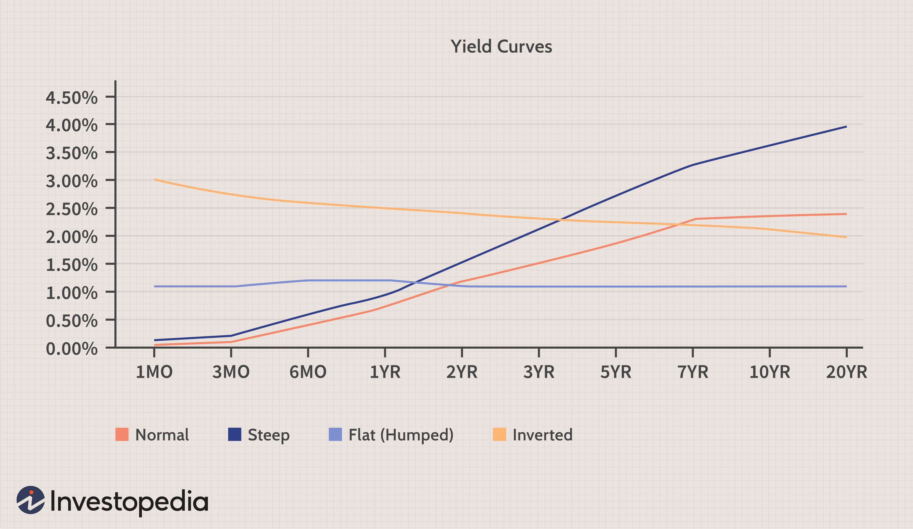

The bond market offers investors a myriad of opportunities, tailored to accommodate varying risk appetites and financial aspirations. A central dichotomy within this market is presented by high-yield and low-yield bonds, each possessing unique characteristics and catering to distinct investor profiles. 

High-yield bonds, often referred to as 'junk bonds,' promise the allure of elevated returns. However, this potential comes at the expense of increased risk, primarily due to the lesser creditworthiness of the issuers. These securities are typically issued by companies with lower credit ratings, signifying a heightened risk of default. Nevertheless, they attract those seeking substantial returns, particularly in environments characterized by low-interest rates, where traditional investment avenues might offer limited yields.



Conversely, low-yield bonds are generally perceived as safer investments. Frequently issued by governments or corporations with strong credit ratings, these bonds provide a more predictable income stream with significantly reduced risk of default. They appeal to investors prioritizing stability and reliability in their portfolios, offering assurance even as they yield lower returns compared to their high-yield counterparts.

This article will explore the defining features, benefits, and liabilities inherent in both high-yield and low-yield bonds. Additionally, it will investigate the role of algorithmic trading, a sophisticated tool increasingly used to manage bond investments. Algorithmic trading has the capability to analyze vast datasets, executing trades based on pre-set conditions to optimize returns and mitigate risks. Through such advanced strategies, investors can better align their bond portfolios with individual financial goals, balancing the trade-off between risk and reward effectively.

## Table of Contents

## Understanding Bond Yields

Bond yield serves as a critical measure of the expected return on a bond investment, reflecting the interest income generated relative to the price of the bond. This yield can be expressed in various forms, such as current yield, yield to maturity (YTM), and yield to call, each providing a different perspective on the bond's performance potential. 

Among these, the yield to maturity is often favored by investors as it accounts for all coupon payments, the redemption of the bond at its nominal value, and any gain or loss if the bond was purchased at a cost different from its face value. The formula for YTM is typically expressed as follows:

$$
YTM = \frac{C + \frac{(F - P)}{n}}{\frac{(F + P)}{2}}
$$

where:
- $C$ is the annual coupon payment,
- $F$ is the face or par value of the bond,
- $P$ is the price of the bond,
- $n$ is the number of years to maturity.

Bond yields are not static and can vary significantly due to several factors. Market conditions, including changes in interest rates, play a pivotal role. If interest rates rise, newly issued bonds tend to offer higher yields compared to existing bonds, causing the prices of existing bonds to fall and their yields to increase. Conversely, when interest rates fall, existing bonds with higher coupon rates become more valuable, pushing their prices up and their yields down.

The creditworthiness of the bond issuer is another crucial determinant. Bonds issued by highly rated entities generally offer lower yields due to their perceived lower risk, whereas those issued by lower-rated issuers—often categorized as high-yield or "junk" bonds—are accompanied by higher yields to attract investors despite their higher risk of default.

Furthermore, the bond's maturity period influences its yield. Long-term bonds typically offer higher yields than short-term bonds to compensate for the longer exposure to [interest rate](/wiki/interest-rate-trading-strategies) risk and inflation. This is encapsulated in the shape of the yield curve, which is normally upward sloping but can take different shapes depending on economic conditions.

For investors, grasping the nuances of bond yields is essential to making informed investment choices, aligning their bond portfolio with desired financial outcomes. Accurately assessing yields enables the contrast between the risk-return profiles of different bonds, guiding investors as they tailor their strategies to achieve specific financial objectives.

## High-Yield Bonds: Potential and Risks

High-yield bonds, frequently referred to as junk bonds, are a category of fixed-income securities characterized by offering higher interest rates to offset their heightened risk of default. These bonds are generally issued by corporations with lower credit ratings, typically below 'BBB' as assigned by rating agencies like Standard & Poor's, or 'Baa' by Moody's. Due to their lower creditworthiness, these issuers are obligated to provide more attractive yields to entice investors. 

Historically, high-yield bonds are more volatile than investment-grade bonds, reflecting the increased risk potential. The allure of substantial returns is particularly potent during periods of low interest rates when traditional investment-grade bonds offer minimal yields. In such economic environments, risk-tolerant investors may find high-yield bonds appealing, as they provide an opportunity for enhanced yields despite the accompanying risks.

The risks associated with high-yield bonds include the elevated probability of issuer default, driven by financial instability or adverse economic conditions. The default rate for these bonds tends to increase during economic downturns, which investors must weigh against the potential for high returns. Additionally, high-yield bonds are more sensitive to market fluctuations and tend to underperform in environments where interest rates rise, as their higher yields may not sufficiently compensate for the increased credit risk and market [volatility](/wiki/volatility-trading-strategies).

The potential returns of high-yield bonds can be considerable. Investors calculating the yield to maturity (YTM), which measures expected returns if the bond is held until it matures, often find that it significantly surpasses the yield on more secure debt instruments. However, achieving these returns requires active management and a keen understanding of the market dynamics affecting the bond issuer's credit status.

Ultimately, investing in high-yield bonds necessitates a careful assessment of one's risk tolerance and market conditions. While they can amplify portfolio returns, they also introduce increased risk, requiring a strategic approach to manage effectively.

## Low-Yield Bonds: Stability and Security

Low-yield bonds, also known as investment-grade bonds, are often seen as a safer investment option compared to high-yield bonds. These bonds provide lower returns, but they [carry](/wiki/carry-trading) significantly less risk of default. This makes them an attractive choice for investors prioritizing capital preservation and a consistent income stream.

These types of bonds are typically issued by entities with strong credit ratings, such as governments and well-established corporations. The creditworthiness of these issuers is evaluated by rating agencies—such as Moody’s, Standard & Poor’s, and Fitch Ratings—which assign ratings that investors use to gauge the risk level. For instance, bonds rated 'AAA' or 'AA' are considered to have the highest degree of credit quality, while 'A' and 'BBB' ratings are also deemed investment-grade, though with slightly higher associated risks.

The primary advantage of low-yield bonds is their stability. Given their reliable nature, they tend to perform well even in turbulent economic periods, providing a hedge against market volatility. This stability comes from the issuers' ability to meet their debt obligations consistently, thanks to strong financial health and substantial cash flows. As a result, these bonds are ideal for investors seeking predictability in returns, such as retirees or those approaching retirement, who may be less tolerant to risk.

Moreover, the returns from low-yield bonds, although modest, are typically more predictable. Investors can expect regular coupon payments, creating a steady income stream which is crucial for those needing regular cash flow. This feature makes these bonds a popular component of conservative investment portfolios or as a balancing asset within a diversified portfolio.

In terms of pricing, low-yield bonds often experience price stability, even in periods of interest rate fluctuations. This characteristic is related to their lower duration risk compared to high-yield bonds. Duration is a measure of the bond’s sensitivity to interest rate changes; lower duration implies less sensitivity, translating to more stable prices with interest rate variations. For example, using the Macaulay duration $D$, the price sensitivity $\Delta P$ of a bond to changes in interest rates can be expressed as: 

$$
\Delta P \approx -D \times \Delta y
$$

where $\Delta y$ represents the change in yield. For low-yield bonds, the change in price $\Delta P$ tends to be minimal, reinforcing their stability in an investment strategy.

In summary, low-yield bonds stand out for their stability and security, supported by the strong credit ratings of their issuers. They provide predictable returns with less price risk, making them an attractive choice for risk-averse investors or those seeking a reliable income.

## Comparing High-Yield and Low-Yield Bonds

When comparing high-yield and low-yield bonds, several key factors emerge as instrumental in guiding investor decisions. These factors include potential returns, risk tolerance, and overarching investment strategy. High-yield bonds, often referred to as "junk bonds," are enticing to investors who prioritize higher returns and possess a greater appetite for risk. These bonds typically offer elevated interest rates as compensation for their increased default risk, aligning well with investors who are willing to embrace volatility in pursuit of substantial gains.

Conversely, low-yield bonds are generally attractive to risk-averse investors who favor stability and security over higher returns. These bonds, often issued by governments or corporations with solid credit ratings, present a lower risk of default, thus providing a more predictable income stream. This predictability can prove crucial for individuals or institutions whose primary focus is preserving capital and maintaining a steady flow of income.

In assessing the suitability of either bond type, investors must evaluate their individual financial objectives, current market conditions, and the diversification strategy of their portfolio. For instance, high-yield bonds might serve as a fitting component for those seeking to augment portfolio returns in low-interest-rate environments. However, investors must remain cognizant of the potential for increased volatility and default risk associated with such investments.

In contrast, low-yield bonds may play a vital role in anchoring a portfolio, especially for those prioritizing capital preservation and minimal risk exposure. These bonds can act as a stabilizing force, potentially counterbalancing more volatile equity investments. Investors might strategically allocate a blend of high-yield and low-yield bonds, employing a diversification strategy to optimize risk-adjusted returns and cater to their specific financial goals and risk tolerance.

A nuanced evaluation of these factors enables a more precise alignment of bond investment decisions with long-term financial objectives, providing a balanced approach that capitalizes on the distinct strengths of both high-yield and low-yield bonds.

## Role of Algorithmic Trading in Bond Investments

Algorithmic trading has transformed the landscape of bond investments by leveraging advanced computational algorithms to execute trades based on pre-defined criteria. This method aims to optimize returns while mitigating risks. It’s particularly advantageous in managing both high-yield and low-yield bonds due to its ability to process and analyze significant volumes of financial data swiftly and efficiently.

### Algorithmic Trading Techniques

In bond investments, [algorithmic trading](/wiki/algorithmic-trading) employs various techniques to evaluate the market:

1. **Statistical Arbitrage**: This involves statistical methods to identify pricing inefficiencies between related bond indices or securities. Algorithms can track historical correlations and deviations to exploit arbitrage opportunities.

2. **Trend Following**: Algorithms can identify market trends by analyzing price movements and trading volumes, making buy or sell decisions based on these trends. This method benefits from the large data handling capacities and speed of algorithmic systems.

3. **Market Making**: In the bond market, where liquidity can sometimes be a concern, algorithmic trading systems can act as market makers. They offer to buy and sell across different bond issues, thus facilitating liquidity and making profits from bid-ask spreads.

### Machine Learning Applications

Machine learning has further enhanced the capabilities of algorithmic trading by introducing self-learning algorithms that refine their strategies based on new data inputs. Here are some ways [machine learning](/wiki/machine-learning) is utilized:

- **Predictive Modeling**: Machine learning models can predict future bond price movements based on historical data, economic indicators, and other variables, providing significant advantages in decision-making.

- **Risk Management**: Machine learning algorithms can also assess the risk profile of various bonds, offering recommendations based on the calculated levels of volatility and credit risks.

### Python Example: Simple Moving Average (SMA) Strategy

The implementation of SMA in Python can serve as a basic example of algorithmic trading strategy. The SMA strategy involves calculating the moving average of a bond's price over a certain period and using that average to identify buying or selling signals.

```python
import pandas as pd

# Example: Load bond price data
# Assume `bond_data` is a DataFrame with columns: 'Date' and 'Price'
bond_data = pd.read_csv('bond_prices.csv')

# Calculate Simple Moving Averages
short_window = 20  # short-term period
long_window = 50  # long-term period

bond_data['SMA_20'] = bond_data['Price'].rolling(window=short_window, min_periods=1).mean()
bond_data['SMA_50'] = bond_data['Price'].rolling(window=long_window, min_periods=1).mean()

# Determine Buy and Sell signals
bond_data['Signal'] = 0.0
bond_data['Signal'][short_window:] = np.where(
    bond_data['SMA_20'][short_window:] > bond_data['SMA_50'][short_window:], 1.0, 0.0
)

bond_data['Position'] = bond_data['Signal'].diff()

# Plotting the results
import matplotlib.pyplot as plt

plt.figure(figsize=(12, 8))
plt.plot(bond_data['Date'], bond_data['Price'], label='Bond Price', color='blue')
plt.plot(bond_data['Date'], bond_data['SMA_20'], label='20-Day SMA', color='red')
plt.plot(bond_data['Date'], bond_data['SMA_50'], label='50-Day SMA', color='green')
plt.plot(bond_data['Date'], bond_data['Signal'], '^', markersize=10, color='g', lw=0, label='Buy Signal', markevery=(bond_data['Position'] == 1))
plt.plot(bond_data['Date'], bond_data['Signal'], 'v', markersize=10, color='r', lw=0, label='Sell Signal', markevery=(bond_data['Position'] == -1))
plt.title('Bond Price with SMA')
plt.legend()
plt.show()
```

### Benefits of Algorithmic Trading in Bonds

Algorithmic trading enhances the ability to customize bond portfolios by aligning investment strategies precisely with an investor's financial goals. The speed and efficiency of algorithmic systems allow for rapid adaptation to changing market conditions, providing investors with a significant advantage in navigating both high-yield and low-yield bond markets. Additionally, algorithmic approaches significantly reduce transaction costs through automated execution of larger orders without affecting market prices. 

In conclusion, as algorithmic trading continues to evolve, its role in bond investments is likely to become even more pronounced, offering investors sophisticated tools to maximize their returns and manage financial risks effectively.

## Conclusion

Both high-yield and low-yield bonds provide unique advantages and risks that investors must consider when making investment decisions. High-yield bonds present the opportunity for substantial returns but come with an increased risk of default, typically issued by entities with lower credit ratings. On the other hand, low-yield bonds offer more stability and security, generally provided by issuers with strong credit standings such as governments and reputable corporations. The essential [factor](/wiki/factor-investing) for any investor is to align their choice of bond with their financial goals and risk tolerance.

Understanding the characteristics of these bond types is crucial. High-yield bonds may be favorable for those willing to accept higher risk for potentially greater returns, especially in a low-interest-rate environment. Conversely, low-yield bonds may better suit those who prioritize a steady income stream and security over potential high returns.

The integration of algorithmic trading within bond investments further enhances decision-making processes. By employing computer algorithms to evaluate extensive datasets and some pre-defined criteria, investors can identify optimal trading opportunities in high-yield and low-yield bond markets. This advanced method allows for the customization of bond portfolios to match individual financial objectives, potentially maximizing returns while minimizing associated risks.

Ultimately, the choice between high-yield and low-yield bonds—or a combination thereof—hinges on an investor's unique financial situation and long-term objectives. A comprehensive understanding of these investment vehicles, coupled with sophisticated strategies like algorithmic trading, empowers investors to navigate the bond market effectively.

## References & Further Reading

[1]: ["High-Yield Bonds"](https://www.investopedia.com/terms/h/high_yield_bond.asp) on Investopedia

[2]: ["Investment Grade Credit Rating"](https://www.investopedia.com/terms/i/investmentgrade.asp) on Fitch Ratings

[3]: Fabozzi, F. J. (2012). ["The Handbook of Fixed Income Securities"](https://www.amazon.com/Handbook-Fixed-Income-Securities-Ninth/dp/1260473899). McGraw-Hill Education.

[4]: ["Algorithmic Trading in the Bond Markets"](https://www.axios.com/2021/09/03/bond-market-trading-algorithms) by Albert J. Menkveld

[5]: ["Vanguard Intermediate-Term Investment-Grade Fund"](https://www.morningstar.com/funds/XNAS/VFIDX/quote) on Vanguard

[6]: ["Moody's Ratings Definitions"](https://ratings.moodys.com/api/rmc-documents/53954) on Moody's

[7]: Choudhary, A., & Garg, A. (2014). ["Role of Algorithmic Trading in the Financial Markets: An Empirical Investigation in India"](http://igidr.ac.in/pdf/publication/WP-2014-023.pdf) 

[8]: ["The Yield Curve and Predicted GDP Growth"](https://www.clevelandfed.org/indicators-and-data/yield-curve-and-predicted-gdp-growth) by the Federal Reserve

[9]: ["The Basics of Diversification"](https://www.webull.com/blog/198-The-Basics-of-Diversification) on Investopedia