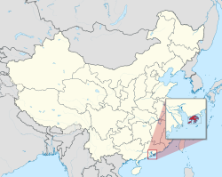

## Table of Contents

## What are the geographical differences between Hong Kong and Mainland China?

Hong Kong is a small city located on the southeastern coast of China. It is surrounded by the South China Sea on three sides and shares a border with Guangdong Province of Mainland China. The total area of Hong Kong is about 1,104 square kilometers, which is much smaller compared to the vast expanse of Mainland China. Mainland China, officially known as the People's Republic of China, covers an area of approximately 9.6 million square kilometers, making it the third or fourth largest country in the world by land area.

The geography of Hong Kong is diverse despite its small size. It includes urban areas with skyscrapers, as well as more rural regions with mountains, hills, and numerous islands. The highest point in Hong Kong is Tai Mo Shan, which stands at 957 meters. In contrast, Mainland China has a wide range of geographical features, including vast plains, high mountains, deserts, and long coastlines. The highest peak in China is Mount Everest, located on the border with Nepal, which reaches an elevation of 8,848 meters. Additionally, Mainland China has several major rivers like the Yangtze and the Yellow River, while Hong Kong has smaller rivers and reservoirs.

## How do the political systems of Hong Kong and Mainland China differ?

Hong Kong and Mainland China have different political systems. Hong Kong follows a system called "one country, two systems." This means that even though Hong Kong is part of China, it has its own government and laws that are different from those in Mainland China. Hong Kong has a high degree of autonomy, which means it can make many of its own decisions. It has a Chief Executive who is the head of the government, and there is a Legislative Council that makes laws. People in Hong Kong have more freedom to express their opinions and protest than people in Mainland China.

Mainland China, on the other hand, has a very different political system. It is ruled by the Communist Party of China, which has complete control over the government. The President of China is also the leader of the Communist Party. The National People's Congress makes the laws, but it is controlled by the Communist Party. In Mainland China, there is less freedom for people to express their opinions or protest against the government. The political system in Mainland China is much more centralized and controlled compared to the more open system in Hong Kong.

## What are the main cultural distinctions between Hong Kong and Mainland China?

Hong Kong and Mainland China have different cultures because of their histories and ways of life. Hong Kong was a British colony for many years, so it has been influenced by Western culture. People in Hong Kong often speak Cantonese and English, and they enjoy a mix of Eastern and Western food, fashion, and entertainment. Hong Kong is known for its busy city life, with tall buildings and lots of shopping and dining options. The people of Hong Kong value their freedom and have a strong sense of identity that is different from Mainland China.

In Mainland China, the culture is more traditional and influenced by the long history of the country. Mandarin Chinese is the main language spoken, and the food, customs, and festivals are deeply rooted in Chinese traditions. Life in Mainland China can vary a lot depending on whether you are in a big city like Beijing or Shanghai, or in a rural area. The government in Mainland China has a big role in people's lives and culture, and it promotes patriotism and unity among the people. While there are modern elements in Mainland China, the culture often focuses more on the country's history and traditions compared to the more international feel of Hong Kong.

## How do the educational systems in Hong Kong and Mainland China compare?

In Hong Kong, the education system follows a British-style model because of its history as a British colony. Students in Hong Kong go through six years of primary school and then six years of secondary school. After that, they can go to university. The language of instruction in many schools is English, although Cantonese is also used. Hong Kong's education system focuses a lot on exams, like the Hong Kong Diploma of Secondary Education (HKDSE), which students need to pass to go to university. The system encourages students to think critically and be creative, and there are many international schools that offer different curriculums.

In Mainland China, the education system is different and focuses more on national standards. Students go through six years of primary school, three years of junior high school, and then three years of senior high school. After high school, they can take the National College Entrance Exam, also known as the Gaokao, to go to university. The language of instruction is Mandarin Chinese, and the curriculum is set by the government. The education system in Mainland China is very competitive, and there is a lot of emphasis on memorizing facts and doing well on exams. It aims to prepare students for a career and to contribute to society, with less focus on creativity compared to Hong Kong.

## What are the differences in healthcare systems between Hong Kong and Mainland China?

In Hong Kong, the healthcare system is a mix of public and private services. People can go to public hospitals and clinics run by the government, which are cheaper but sometimes have long waiting times. Or they can go to private hospitals and clinics, which are more expensive but usually faster. Hong Kong has a good healthcare system, and people can buy health insurance to help pay for private care. The government in Hong Kong spends a lot of money on healthcare to make sure everyone can get the care they need.

In Mainland China, the healthcare system is also a mix of public and private services, but it works a bit differently. The government runs many hospitals and clinics, but these can be very busy and crowded. People often have to pay out of pocket for healthcare, though there are some insurance programs that help. The quality of healthcare can vary a lot depending on where you are in China. Big cities like Beijing and Shanghai have better hospitals, but in rural areas, healthcare might not be as good. The government is working to make healthcare better and more affordable for everyone.

## How do the economies of Hong Kong and Mainland China differ in terms of GDP and major industries?

Hong Kong and Mainland China have different economies when it comes to GDP and major industries. Hong Kong has a smaller economy than Mainland China, but it's very rich for its size. In 2022, Hong Kong's GDP was about $368 billion. Hong Kong is known for its services, like finance, trade, and tourism. Many big banks and businesses have offices in Hong Kong because it's easy to do business there. The city also has a busy port and airport, which help it trade with the rest of the world.

Mainland China, on the other hand, has a much bigger economy. In 2022, its GDP was about $17.7 trillion, making it one of the largest economies in the world. China's economy is strong in manufacturing, making things like electronics, cars, and clothes. It also has a growing service sector, including finance and tourism. Agriculture is important too, especially in rural areas. China's government plays a big role in the economy, helping to plan and control how things work.

## What are the variations in legal systems between Hong Kong and Mainland China?

Hong Kong has its own legal system that is different from Mainland China. It follows a common law system, which means its laws are based on old court decisions and rules set by judges. This system came from Hong Kong's time as a British colony. People in Hong Kong have more rights and freedoms under this system. For example, they can have a fair trial and speak freely. The laws in Hong Kong protect these rights, and the city has its own courts to make sure the laws are followed.

In Mainland China, the legal system is based on civil law, which means its laws come from written codes and statutes made by the government. The Communist Party of China has a lot of control over the legal system. The laws in Mainland China focus more on keeping order and following the government's rules. People in Mainland China have fewer rights and freedoms compared to Hong Kong. For example, the government can limit what people say or do if it thinks it's a threat. The courts in Mainland China work to make sure the government's laws are followed, but they have less power to challenge the government.

## How do the transportation infrastructures in Hong Kong and Mainland China compare?

Hong Kong has a very good transportation system. It is small, so it's easy to get around. The city has a big subway called the MTR, which goes all over Hong Kong and to the airport. There are also lots of buses, trams, and ferries. People in Hong Kong like to walk and use public transport because it's fast and easy. The roads are busy, but the traffic moves well. Hong Kong also has a big port and a busy airport that connect it to the rest of the world.

Mainland China has a huge transportation system because it's a very big country. It has the world's largest high-speed rail network, which lets people travel quickly between cities. There are also lots of regular trains, buses, and subways in big cities like Beijing and Shanghai. In rural areas, the transportation might not be as good, but the government is working to make it better. China has many airports and ports too, which help it trade with other countries. The roads can be very busy, especially in big cities, but the government is building more highways to help with traffic.

## What are the differences in media freedom and censorship between Hong Kong and Mainland China?

In Hong Kong, people have more freedom with the media. They can read newspapers, watch TV, and use the internet to see and share different ideas. Hong Kong has laws that protect this freedom, so people can talk about the government and other topics without being afraid. But, in recent years, the government has started to control the media more, especially with new laws like the National Security Law. Still, Hong Kong's media is more open than in Mainland China.

In Mainland China, the government controls the media a lot. They decide what people can see and read. The government blocks websites and social media that they don't like, and they can punish people for sharing ideas that go against the government. The media in Mainland China mostly shows what the government wants people to know. This means people have less freedom to learn about different views and ideas.

## How do the social welfare systems in Hong Kong and Mainland China differ?

Hong Kong has a good social welfare system that helps people who need it. The government gives money to people who are old, sick, or can't find a job. They also help families with young kids and people with disabilities. Hong Kong has a program called the Comprehensive Social Security Assistance (CSSA) that gives money to people who really need it. The government also builds homes for people who can't afford to buy their own. This system is meant to make sure everyone in Hong Kong can live a good life, even if they don't have a lot of money.

In Mainland China, the social welfare system is different. The government helps people too, but it's not as easy to get help. China has a program called the Minimum Livelihood Guarantee (Dibao) that gives money to very poor people. But not everyone who needs help can get it because the government doesn't have enough money for everyone. The government also tries to build homes for people, but there are still many people waiting for a place to live. China's social welfare system is growing and getting better, but it's not as strong as Hong Kong's yet.

## What are the key differences in foreign policy and international relations between Hong Kong and Mainland China?

Hong Kong has its own way of dealing with other countries, but it's still part of China. Hong Kong can make some of its own rules about trade and business with other countries. It's a big place for international business and has a lot of freedom to talk and work with other countries. But, Hong Kong has to follow China's big rules and can't make its own foreign policy. This means Hong Kong can't have its own army or make big decisions about war and peace.

Mainland China has its own foreign policy and makes all the big decisions about how to deal with other countries. China has a strong government that decides how to work with other countries, like making trade deals or deciding if they want to be friends or not. China's foreign policy is important for Hong Kong too, because Hong Kong has to follow what China decides. China wants to be a big leader in the world and works hard to make friends and do business with other countries.

## How do the approaches to environmental policies and sustainability differ between Hong Kong and Mainland China?

Hong Kong has its own way of taking care of the environment. The city tries to keep the air and water clean and has rules to help with this. People in Hong Kong recycle and use less plastic to help the environment. The government also works on making buildings and transport greener. But, Hong Kong is a busy city, so it can be hard to keep everything clean and green. Even so, Hong Kong tries to balance being a big city with taking care of the environment.

Mainland China also has rules to protect the environment, but it's a big country with many different areas. The government makes big plans to clean up the air and water, and to use less coal for power. China is working hard to use more clean energy like wind and solar power. But, because China is big and growing fast, it can be hard to make everything green right away. The government is trying to find a way to grow the economy while also taking care of the environment.

## References & Further Reading

[1]: Bergstra, J., Bardenet, R., Bengio, Y., & Kégl, B. (2011). ["Algorithms for Hyper-Parameter Optimization."](https://papers.nips.cc/paper/4443-algorithms-for-hyper-parameter-optimization) Advances in Neural Information Processing Systems 24.

[2]: ["Advances in Financial Machine Learning"](https://www.amazon.com/Advances-Financial-Machine-Learning-Marcos/dp/1119482089) by Marcos Lopez de Prado

[3]: ["Evidence-Based Technical Analysis: Applying the Scientific Method and Statistical Inference to Trading Signals"](https://www.amazon.com/Evidence-Based-Technical-Analysis-Scientific-Statistical/dp/0470008741) by David Aronson

[4]: ["Machine Learning for Algorithmic Trading"](https://github.com/stefan-jansen/machine-learning-for-trading) by Stefan Jansen

[5]: ["Quantitative Trading: How to Build Your Own Algorithmic Trading Business"](https://www.amazon.com/Quantitative-Trading-Build-Algorithmic-Business/dp/1119800064) by Ernest P. Chan