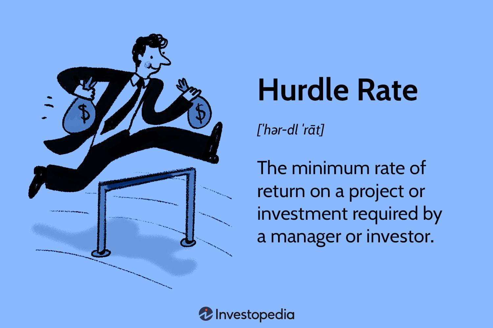

## Table of Contents

## What is a hurdle rate?

A hurdle rate is like a benchmark that companies use to decide if a project or investment is worth doing. It's the minimum rate of return that a project needs to achieve to be considered successful. Think of it as a goal that the project has to meet or beat. If a project's expected return is higher than the hurdle rate, the company will likely go ahead with it. But if it's lower, they might decide it's not worth the risk.

Hurdle rates are important because they help businesses make smart choices about where to put their money. They take into account things like the cost of borrowing money, the risk of the project, and how much profit the company wants to make. By setting a hurdle rate, a company can compare different projects and choose the ones that are most likely to help them grow and succeed.

## What is the internal rate of return (IRR)?

The internal rate of return (IRR) is a way to figure out how good an investment is. It's like a special percentage that shows the expected profit from a project over time. When you calculate the IRR, you're finding the rate at which the money you put into a project equals the money you get back from it. If the IRR is higher than the cost of the money you borrowed to invest, then the project is considered a good one.

Think of IRR as a tool that helps you compare different investments. If you have two projects, you can calculate their IRRs and choose the one with the higher rate because it means you'll get more profit. But remember, IRR has its limits. It assumes you can reinvest all the money you earn at the same rate, which isn't always possible. So, while IRR is helpful, it's best to use it along with other measures to make the best investment decisions.

## How are hurdle rates and IRR used in investment decisions?

Hurdle rates and IRR are important tools that help people make smart choices about where to put their money. A hurdle rate is like a minimum goal that an investment needs to meet. If a project's expected return is higher than the hurdle rate, it's worth considering. The hurdle rate helps investors decide if a project is good enough by comparing it to the cost of money and the risks involved. If the expected return is lower than the hurdle rate, it might be better to look for other opportunities.

The internal rate of return, or IRR, is another way to see if an investment is a good idea. It's a special percentage that shows how much profit you can expect from a project over time. When you calculate the IRR, you're finding out the rate at which the money you put in equals the money you get back. If the IRR is higher than the cost of the money you borrowed to invest, then the project looks promising. By comparing the IRR of different projects, you can pick the one that will give you the best return. Both hurdle rates and IRR are useful, but they work best when used together to get a full picture of an investment's potential.

## What is the basic difference between hurdle rate and IRR?

The basic difference between a hurdle rate and the internal rate of return (IRR) is that a hurdle rate is a minimum target that an investment needs to meet, while the IRR is a calculation that shows the expected profit from an investment. A hurdle rate is set by a company or investor as a benchmark. If a project's expected return is higher than this rate, it's considered worthwhile. It helps in deciding whether to go ahead with a project by comparing the expected return to the cost of money and the risks involved.

On the other hand, the IRR is a specific percentage that represents the rate at which the money put into a project equals the money earned back from it. It's a tool used to evaluate the attractiveness of an investment. If the IRR is higher than the cost of the money used to fund the project, it's seen as a good investment. While the hurdle rate is a pre-set standard, the IRR is calculated for each project, allowing for direct comparisons between different investment options.

## How do you calculate the hurdle rate?

Calculating the hurdle rate involves figuring out the minimum return an investment needs to make to be worth it. Companies often start by looking at their cost of capital, which is the cost of the money they use to fund projects. This can include the [interest rate](/wiki/interest-rate-trading-strategies) on loans or the expected return for shareholders. They might also add a risk premium, which is extra return they want because the project could fail or not go as planned. So, the hurdle rate is usually the cost of capital plus the risk premium.

To set a specific number, a company might look at how much they need to cover their costs and still make a profit. They might also consider what other similar companies are using as their hurdle rate. It's not a one-size-fits-all number; it can change based on the industry, the economy, and the specific project. The goal is to set a hurdle rate that is high enough to make sure the project will be worth the time and money but not so high that good projects get passed over.

## How do you calculate the IRR?

Calculating the internal rate of return (IRR) involves finding the rate at which the present value of all cash inflows from a project equals the present value of all cash outflows. You start by setting up an equation where the net present value (NPV) is zero. This means you're looking for the discount rate that makes the sum of all future cash flows, discounted back to today, equal to the initial investment. To find this rate, you can use trial and error or a financial calculator or software, like Excel, which has a built-in IRR function.

For example, if you invest $100 today and expect to get $110 back in a year, you would find the IRR by solving for the rate that makes the present value of $110 in a year equal to $100 today. This can be a bit tricky because it involves solving a complex equation, but tools like Excel make it easier. Once you find the IRR, you can compare it to your cost of capital or hurdle rate to see if the investment is worth it. If the IRR is higher than your cost of capital, the project is likely a good choice.

## Can the hurdle rate be higher than the IRR? What does it imply?

Yes, the hurdle rate can be higher than the IRR. When this happens, it means the project's expected return, which is the IRR, is not good enough to meet the company's minimum goal, which is the hurdle rate. If the IRR is lower than the hurdle rate, the company might decide not to go ahead with the project because it won't make enough money to cover the costs and risks involved.

This situation tells the company that the project might not be worth the investment. It's like setting a goal for a test score and then finding out your actual score is lower than what you needed. If the IRR is below the hurdle rate, the company will usually look for other projects that can meet or beat the hurdle rate, helping them make better use of their money and resources.

## What are the limitations of using hurdle rate and IRR for project evaluation?

Using a hurdle rate and IRR for project evaluation can be really helpful, but they do have some limits. One big problem is that both methods assume you can reinvest all the money you earn at the same rate, which isn't always possible. In real life, you might not be able to find other investments that give you the same return. Also, IRR can be tricky when a project has different cash flows over time, like when you get a lot of money back at different times. This can make it hard to figure out the right IRR, and sometimes you might even get more than one answer, which can be confusing.

Another issue is that the hurdle rate might not take into account all the risks of a project. It's usually set based on the cost of money and a bit extra for risk, but some projects might have other risks that aren't easy to measure. If the hurdle rate is too high, good projects might be passed over because they don't meet the target, even if they could still make money. On the other hand, if it's too low, the company might take on projects that aren't as good as they seem. So, while hurdle rates and IRR are useful tools, they need to be used carefully and with other ways to look at projects to make the best choices.

## How does the choice of hurdle rate affect the decision to accept or reject a project?

The hurdle rate is like a goal that a project has to meet for a company to say yes to it. If the hurdle rate is set high, it means the company is looking for projects that will make a lot of money or have a low risk. When a project's expected return, or IRR, is compared to the hurdle rate, a high hurdle rate can make it harder for projects to be accepted. If the IRR is lower than the hurdle rate, the company might say no to the project because it doesn't meet their goal. This can help the company avoid risky or less profitable projects, but it might also mean missing out on some good opportunities if the hurdle rate is too high.

On the other hand, if the hurdle rate is set low, it's easier for projects to be accepted. A low hurdle rate means the company is okay with projects that might not make as much money or have a bit more risk. If the IRR is higher than this lower hurdle rate, the company is more likely to say yes to the project. This can help the company take on more projects and grow, but it also means they might accept projects that don't make as much money as they could. So, choosing the right hurdle rate is important because it can really change which projects a company decides to go with.

## What are the common methods to adjust the hurdle rate in different economic conditions?

When the economy changes, companies might need to adjust their hurdle rate to make sure they're still making good decisions about where to put their money. In tough economic times, like during a recession, companies might raise their hurdle rate. This means they'll only say yes to projects that can make a lot of money, even if it's harder to find those projects. They do this because money is riskier to borrow and they want to be sure they'll get a good return. On the other hand, when the economy is doing well, companies might lower their hurdle rate. This lets them take on more projects because it's easier to make money and the risks are lower.

Sometimes, companies look at interest rates to decide if they should change their hurdle rate. If interest rates go up, it costs more to borrow money, so companies might raise their hurdle rate to make sure new projects can cover these higher costs. If interest rates go down, borrowing money is cheaper, so they might lower the hurdle rate to take advantage of the cheaper money and invest in more projects. By adjusting the hurdle rate based on the economy and interest rates, companies can make better choices about which projects to start and which ones to skip.

## How does the risk profile of a project influence the setting of the hurdle rate and the expected IRR?

The risk profile of a project plays a big role in setting the hurdle rate and figuring out the expected IRR. When a project is riskier, companies usually set a higher hurdle rate. This is because they want to make sure the project will make enough money to cover the extra risk. If a project has a lot of unknowns or could lose a lot of money, the company might want a higher return to feel comfortable investing in it. So, they'll set the hurdle rate higher to make sure only the best and safest projects get the green light.

The expected IRR also changes based on how risky the project is. If a project is risky, investors will expect a higher IRR because they want to be rewarded for taking on that risk. If the IRR is high enough to beat the higher hurdle rate set for risky projects, then the company might decide to go ahead with it. But if the IRR is too low compared to the hurdle rate, they might decide it's not worth the risk. By looking at the risk profile, companies can set the right hurdle rate and see if the expected IRR makes the project a good choice.

## In what scenarios might the use of IRR be misleading compared to other metrics like NPV, and how can the hurdle rate help in such cases?

Sometimes, using IRR can be misleading because it assumes you can reinvest all the money you earn at the same high rate, which is often not possible. For example, if a project has cash flows coming in at different times, IRR might give you more than one answer, making it hard to decide which one to use. Also, IRR doesn't tell you how much money you'll actually make; it just gives you a percentage. This can be a problem when comparing projects of different sizes because a small project with a high IRR might not make as much money overall as a larger project with a lower IRR.

In these cases, using the net present value (NPV) can be better because it tells you the actual dollar amount you can expect to make from a project, taking into account the time value of money. The hurdle rate can help here by giving you a clear benchmark to compare the IRR and NPV against. If a project's IRR is above the hurdle rate, but the NPV is low, it might mean the project isn't as good as it seems because it won't make much money. By looking at both the IRR and NPV and comparing them to the hurdle rate, you can get a fuller picture of whether a project is really worth doing.

## What is the Understanding of Internal Rate of Return (IRR)?

The Internal Rate of Return (IRR) is a crucial financial metric extensively used in the evaluation of investment opportunities. It is defined as the discount rate that equates the net present value (NPV) of all cash flows from a particular project or investment to zero. Essentially, IRR represents the percentage rate at which the expected annual growth of an investment occurs.

Mathematically, the IRR can be expressed by the equation:

$$

0 = \sum_{t=0}^{N} \dfrac{C_t}{(1 + \text{IRR})^t}
$$

where $C_t$ represents the net cash inflow-outflows during a period $t$, and $N$ is the total number of periods.

IRR proves to be highly useful when comparing multiple projects or investment options, enabling investors to assess which projects are likely to yield better returns over time. This is particularly valuable in cases involving capital budgeting, where businesses must choose projects that promise returns exceeding the cost of capital.

One of the key advantages of the IRR metric is its ability to [factor](/wiki/factor-investing) in the time value of money. This principle suggests that money available today is worth more than the same amount in the future due to its potential [earning](/wiki/earning-announcement) capacity. By discounting future cash flows to their present value, IRR provides a more accurate reflection of an investment's profitability over time.

Despite its utility, IRR is not devoid of limitations. One notable constraint is its insensitivity to external risks that might affect an investment. For instance, it does not automatically adjust for varying risk factors across different projects or economic fluctuations. Additionally, IRR assumes that interim cash flows are reinvested at the same rate as the IRR itself, which might not always be realistic.

Moreover, IRR can sometimes be misleading when dealing with projects of varied durations. For example, a project with a higher IRR might not always generate more substantial returns if compared with a longer-duration investment that has a slightly lower IRR. Therefore, while IRR is a powerful metric for evaluating potential investments, it must be employed with consideration of these inherent limitations. By integrating IRR alongside other financial metrics and analytical tools, investors can better manage their portfolios and optimize their decision-making processes.

## What is Exploring the Hurdle Rate?

The hurdle rate is a critical financial metric known as the Minimum Acceptable Rate of Return (MARR). It signifies the minimum return a project or investment must generate to be considered worthwhile. Typically, the hurdle rate is aligned with the company's cost of capital, integrating both the cost of equity and the cost of debt. This alignment ensures that any investment undertaken is at least able to repay the initial cost of capital.

In the context of project evaluation, companies employ the hurdle rate to discount future cash flows back to their present value. This ensures that the discounted cash flows surpass the initial investment costs, thus affirming the project’s potential for profitability. Mathematically, this can be expressed as:

$$
\text{NPV} = \sum_{t=1}^{n} \frac{C_t}{(1+r)^t} - C_0
$$

Where:
- $NPV$ is the Net Present Value.
- $C_t$ is the cash flow at time $t$.
- $r$ is the hurdle rate.
- $C_0$ is the initial investment cost.
- $n$ is the total number of periods.

The hurdle rate essentially serves as a benchmark for project approval. To greenlight a project, its Internal Rate of Return (IRR) must meet or exceed this predetermined rate. This requirement ensures that only projects promising sufficient returns, commensurate with the company’s overall risk profile, are undertaken.

However, reliance on the hurdle rate alone can limit investment in innovative or high-growth projects. This limitation arises because the hurdle rate focuses on minimum acceptable returns, potentially overshadowing projects that, while initially below the hurdle rate, may demonstrate substantial long-term growth and competitive advantage. Thus, while the hurdle rate is vital for maintaining financial prudence, a balanced approach considering both traditional metrics and potential growth prospects is recommended for comprehensive investment decision-making.

## References & Further Reading

[1]: Damodaran, A. (2010). ["Valuation: Theories and Practice."](https://people.stern.nyu.edu/adamodar/pdfiles/papers/valuesurvey.pdf) John Wiley & Sons.

[2]: Goetzmann, W. N., & Duesenberry, J. S. (2008). ["Finance and Investment Decisions."](https://scholar.google.com/citations?user=5-5LnscAAAAJ) Harvard University Press.

[3]: ["Advances in Financial Machine Learning"](https://www.amazon.com/Advances-Financial-Machine-Learning-Marcos/dp/1119482089) by Marcos Lopez de Prado

[4]: Bodie, Z., Kane, A., & Marcus, A. J. (2013). ["Investments."](https://www.amazon.com/Investments-10th-Zvi-Bodie/dp/0077861671) McGraw-Hill Education.

[5]: ["Quantitative Trading: How to Build Your Own Algorithmic Trading Business"](https://www.amazon.com/Quantitative-Trading-Build-Algorithmic-Business/dp/1119800064) by Ernest P. Chan