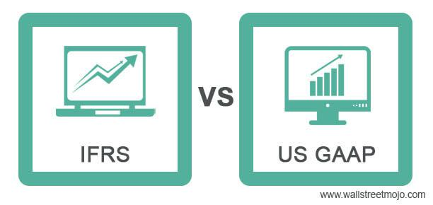

In an era dominated by technological advancement and globalization, understanding the interaction between accounting standards and algorithmic trading is vital. As financial markets become increasingly interconnected, the influence of accounting frameworks like International Financial Reporting Standards (IFRS) and Generally Accepted Accounting Principles (GAAP) on algorithmic trading strategies cannot be overstated. These frameworks, which provide the foundational principles for financial reporting, play a crucial role in determining the accuracy and transparency of the financial data used in high-frequency trading algorithms.

Algorithmic trading, characterized by the use of automated systems to execute trades at lightning speed, demands precise and real-time financial information. Discrepancies or variations stemming from differing accounting standards can lead to substantial impacts on trading decisions and outcomes. For instance, choices regarding inventory accounting methods and the treatment of asset write-downs under IFRS and GAAP can result in divergent financial metrics that influence both earnings reports and tax obligations.

This article examines the distinctions between IFRS and GAAP, emphasizing how they affect the world of algorithmic trading. It explores the integration of these accounting frameworks within modern trading systems to ensure heightened financial transparency and accuracy. By focusing on the key differences in these standards, the article highlights their influence on financial decision-making processes and strategic trading initiatives. The converging paths of accounting practices and algorithmic trading emphasize the need for advanced technological solutions to enhance decision-making and market integrity in an ever-evolving financial landscape.

## Table of Contents

## Overview of IFRS and GAAP

International Financial Reporting Standards (IFRS) and Generally Accepted Accounting Principles (GAAP) form the backbone of global financial reporting, each offering a unique approach tailored to its regional and conceptual environment. IFRS, developed by the International Accounting Standards Board (IASB), is a principles-based framework renowned for its emphasis on transparency and comparability across different countries. Its adaptable nature allows organizations to apply general principles to specific scenarios, promoting flexibility in diverse economic environments. This adaptability is crucial in integrating with various legal, cultural, and business practices worldwide.

GAAP, on the other hand, is the standard in the United States, established by the Financial Accounting Standards Board (FASB). It is characterized by a rules-based approach, providing thorough and specific guidelines to ensure consistency and reliability in financial reporting. The detailed nature of GAAP seeks to eliminate ambiguity and minimize risk, essentially providing a blueprint that businesses must follow to maintain uniformity in financial statements.

The difference between these two frameworks lies not only in their foundational philosophies but also in their practical applications. IFRS’s principles-based approach allows for more judgment and interpretation by financial professionals, which can result in greater variability in financial reports. However, this variability is balanced by the enhanced potential for cross-border company comparisons. Conversely, the rules-based GAAP diminishes the potential benefit of flexibility in favor of providing precise guidelines that facilitate detailed documentation and potentially more straightforward audit processes.

For businesses operating internationally or involved in cross-border stock exchange listings, understanding the distinctions and applications of IFRS and GAAP is crucial. The globalized business environment necessitates that stakeholders, including investors, regulators, and company managers, are adept in interpreting financial data formulated under different accounting frameworks. This understanding is essential for accurate financial analysis, streamlined decision-making, and strategic planning. As businesses expand globally, they frequently encounter the nuances of both IFRS and GAAP, underscoring the importance of expertise in both standards to harmonize financial reporting and maintain its integrity and clarity across various jurisdictions.

## Key Differences Between IFRS and GAAP

International Financial Reporting Standards (IFRS) and Generally Accepted Accounting Principles (GAAP) are distinct frameworks that influence financial reporting in different regions. A primary distinction lies in their treatment of inventory accounting methods. Under IFRS, the Last In, First Out (LIFO) method is prohibited. This restriction is based on the principle that LIFO does not represent actual physical inventory flows and can distort income statements during periods of rising prices. In contrast, GAAP allows the use of LIFO, providing flexibility for businesses, especially in the United States, where this method can offer tax benefits during inflationary periods by matching higher recent costs against revenues.

Inventory write-downs also reveal differences between IFRS and GAAP. IFRS mandates that inventory be recorded at the lower of cost or net realizable value. If circumstances change that increase the net realizable value, IFRS permits the reversal of previous write-downs, restoring the inventory value up to its original cost. This approach allows financial statements to reflect improved economic conditions accurately. Conversely, under GAAP, once inventory is written down, it cannot be reversed, even if the market value recovers, potentially leading to more conservative reporting.

These divergences in inventory accounting can have significant implications for financial statements. Under LIFO, companies may report lower earnings and reduced tax liabilities in inflationary economies, influencing investor perceptions and financial decision-making. The prohibition of LIFO under IFRS could lead to higher reported earnings, affecting a company’s perceived financial health differently than under GAAP.

Furthermore, the ability or inability to reverse inventory write-downs affects the balance sheet and income statement. The IFRS approach to reversals can result in less volatile financial results and provides more relevant information to investors when market conditions improve. On the other hand, the GAAP restriction against reversal could lead to more stable but potentially undervalued asset reporting, impacting stakeholder assessments.

In summary, these key differences in inventory accounting between IFRS and GAAP can lead to substantial variations in how companies report their financial performance, thus affecting earnings, tax implications, and investment strategies. A nuanced understanding of these discrepancies is crucial for stakeholders engaging in cross-border financial analysis and decision-making.

## Algorithmic Trading and Its Impact

Algorithmic trading relies heavily on high-speed computer algorithms to execute trades based on predefined criteria. These algorithms analyze vast amounts of financial data to identify trading opportunities and execute trades with precision and speed. The need for real-time and accurate financial data is paramount in [algorithmic trading](/wiki/algorithmic-trading), as slight inaccuracies or delays can lead to suboptimal trading decisions and financial losses.

The integration of accounting data into algorithmic trading systems presents unique challenges. Accounting standards, such as International Financial Reporting Standards (IFRS) and Generally Accepted Accounting Principles (GAAP), differ significantly in how they report and interpret financial data. These differences can lead to discrepancies in financial reports, which, when fed into trading algorithms, may affect decision-making.

For example, consider an algorithm that relies on inventory data to make trading decisions. Under GAAP, businesses in the U.S. can use the Last-In, First-Out (LIFO) method for inventory accounting, which can result in different cost valuations compared to the First-In, First-Out (FIFO) method mandated by IFRS. This discrepancy can affect the real-time financial metrics used by algorithms, leading to different trading outcomes.

Furthermore, algorithmic trading systems must consistently process and analyze financial reports, which may differ due to inventory write-down treatments. IFRS allows for the reversal of inventory write-downs if market conditions improve, while GAAP does not. These divergences can lead to variations in reported earnings and asset valuations, potentially influencing trading strategies and the perceived risk of an investment.

To address these challenges, algorithmic trading firms are evolving to incorporate advanced data normalization techniques and data integration platforms. Technologies such as [artificial intelligence](/wiki/ai-artificial-intelligence) and blockchain can enhance the consistency and reliability of accounting data used in algorithms. AI algorithms can be employed to detect and adjust for discrepancies in financial data, ensuring that trading decisions are based on uniform and comparable information.

Moreover, blockchain technology can provide a secure and transparent ledger for financial data, allowing for real-time verification and tracking of transactions and accounting entries. This continuous and transparent verification can help mitigate the impact of discrepancies in accounting standards on trading algorithms, thereby enhancing the accuracy of trading strategies. 

In summary, algorithmic trading's reliance on real-time and precise financial data underlines the importance of harmonizing accounting standards and ensuring that financial reports are integrated effectively into trading systems. This integration is essential for maintaining the accuracy and effectiveness of algorithmic trading in today's fast-paced financial markets.

## Integration Challenges and Solutions

Integrating accounting standards with algorithmic trading systems presents distinct challenges, particularly in achieving real-time data reporting and maintaining consistency across various platforms. One primary concern lies in the discrepancies that can arise due to the differing principles of International Financial Reporting Standards (IFRS) and Generally Accepted Accounting Principles (GAAP). These discrepancies can affect the algorithms used in trading by introducing variability in the financial data utilized, potentially leading to inaccurate trading decisions.

To address these challenges, the adoption of advanced technologies such as blockchain and artificial intelligence (AI) is proving beneficial. Blockchain technology can enhance data accuracy and security by ensuring that financial data is immutable, transparent, and traceable. Each transaction or financial record entered into a blockchain-based ledger is cryptographically secured, preventing unauthorized alterations. This level of security and transparency is crucial for algo trading systems that rely on precise and reliable data inputs.

AI, on the other hand, offers capabilities for real-time data processing and analytics, enabling swift adaptation to new financial data. Machine learning models can be trained to recognize patterns and anomalies in financial reports, allowing trading algorithms to respond dynamically to any variations arising from different accounting standards. AI can also facilitate predictive analysis, helping organizations anticipate market shifts and adjust their strategies accordingly.

Organizations are increasingly leveraging these technologies to harmonize their financial reporting systems with trading platforms. For instance, by using AI algorithms to automate the data extraction and reconciliation process, businesses can achieve greater consistency between financial reports prepared under different accounting standards. Moreover, employing [machine learning](/wiki/machine-learning) techniques can aid in dynamically adjusting for discrepancies between IFRS and GAAP, thereby enhancing the accuracy of trading algorithms.

The integration process also benefits from establishing standardized protocols for data sharing between financial and trading systems. By implementing Application Programming Interfaces (APIs), organizations can ensure seamless data flow, enabling real-time updates and synchronization. This integration fosters a more cohesive environment where accounting information accurately informs trading decisions, reducing the likelihood of errors due to data lags or mismatches.

In summary, overcoming the challenges of integrating accounting standards with algo trading systems requires a strategic approach that embraces advanced technologies. By adopting blockchain for data security and AI for analytical precision, alongside robust integration protocols, organizations can enhance the reliability and effectiveness of their trading operations. This alignment leads to more informed decision-making and improved market integrity, ultimately benefiting both financial institutions and their stakeholders.

## Future Trends and Convergence Efforts

Efforts to harmonize International Financial Reporting Standards (IFRS) and Generally Accepted Accounting Principles (GAAP) have gained [momentum](/wiki/momentum), aiming to enhance global financial reporting's consistency and reliability. A notable focus is on eliminating the Last In, First Out (LIFO) inventory valuation method permitted under GAAP but prohibited by IFRS. This removal is crucial because LIFO can result in lower tax liabilities and impacts financial reports in inflationary periods, creating disparities that complicate cross-border financial analysis.

Convergence also seeks to align definitions of key accounting concepts, such as Net Realizable Value (NRV). NRV is the estimated selling price of an asset in the ordinary [course](/wiki/best-algorithmic-trading-courses) of business, less the estimated costs of completion and the estimated costs necessary to make the sale. By harmonizing these definitions, financial statements prepared under either framework can become more comparable, enhancing investor and stakeholder confidence through increased transparency and reducing the costs associated with learning multiple accounting languages.

Technological advancements are pivotal in this convergence, particularly the push for real-time financial reporting. The integration of technologies such as big data analytics, artificial intelligence (AI), and blockchain into accounting practices supports this shift. For instance, AI can automate and optimize the reconciliation of varied reporting requirements between IFRS and GAAP, while blockchain's inherent transparency and immutability ensure that financial data used in algorithmic trading remains accurate and secure.

The need for real-time reporting is driven by algorithmic trading's demands, where decisions must be made in microseconds, relying heavily on up-to-date and precise financial data. Thus, technological solutions that enable rapid integration and reconciliation of accounting standards with trading systems are imperative.

Overall, these convergence efforts and technological integrations aim to not only simplify and harmonize financial reporting across borders but also to ensure that financial markets can respond swiftly and accurately to economic changes, thereby enhancing overall market efficiency.

## Conclusion

The intersection of accounting standards and algorithmic trading underscores the increasing necessity for harmonization and adaptation in the financial industry. As these two domains converge, organizations find themselves at a critical juncture where embracing technological solutions becomes paramount. This is essential not only for the enhancement of transparency and decision-making but also for maintaining market integrity in a rapidly evolving financial landscape.

Technological advancements such as blockchain and artificial intelligence present viable pathways for addressing challenges posed by diverse accounting standards like IFRS and GAAP. By adopting these technologies, organizations can streamline their data reporting processes, ensuring consistency and accuracy, which are crucial for effective algorithmic trading strategies. This approach not only facilitates better data management but also mitigates risks associated with discrepancies in financial data that could otherwise lead to misguided trading decisions.

Understanding the dynamics between accounting standards and algorithmic trading is crucial for stakeholders in the financial markets. It equips them with the knowledge to navigate complex global markets effectively. The ongoing convergence efforts, such as harmonizing key accounting methodologies, aim to reduce inconsistencies in financial reporting. These efforts, in conjunction with technological integration, are poised to significantly enhance the reliability of financial data used in trading algorithms, ultimately contributing to a more stable and transparent financial market environment.

In conclusion, as the financial world becomes increasingly interconnected and complex, the harmonization of accounting standards with advanced trading technologies will play a pivotal role in shaping the future landscape of global markets. Through strategic adaptation and the integration of cutting-edge technologies, organizations can achieve greater accountability, foster confidence among investors, and sustain the integrity of financial systems worldwide.

## References & Further Reading

- "Advances in Financial Machine Learning" by Marcos Lopez de Prado provides a comprehensive exploration of the intersection between financial machine learning and trading strategies, offering novel methodologies and insights that challenge traditional approaches. This book is a critical resource for understanding algorithmic trading in the context of evolving financial technologies and accounting practices. 

- Deloitte's publication "IFRS and US GAAP: A Pocket Guide" explains the differences and similarities between IFRS and GAAP. It serves as an essential reference for professionals dealing with international financial reporting standards and cross-border investment strategies.

- "Algorithmic Trading: Winning Strategies and Their Rationale" by Ernie Chan presents practical algorithms, focusing on backtesting and deployment, while also addressing financial accountability. It's useful for traders seeking to align their strategies with current accounting standards.

- "Financial Statement Analysis and Security Valuation" by Stephen H. Penman discusses the methodologies for analyzing financial statements within different accounting frameworks. This book is pertinent for understanding how these methodologies impact trading decisions and strategic planning.

- The Journal of Accounting and Public Policy regularly publishes articles examining the implications of various accounting standards on financial decision-making and algorithmic trading systems. These academic papers highlight recent research findings and case studies in the field.

- "Quantitative Trading: How to Build Your Own Algorithmic Trading Business" by Ernie Chan is a valuable read for those interested in building a trading business while factoring in financial reporting standards and regulatory considerations.

These resources provide varied perspectives on how accounting standards and algorithmic trading intersect and evolve, supporting professionals and academics in navigating the complexities of modern financial markets.

