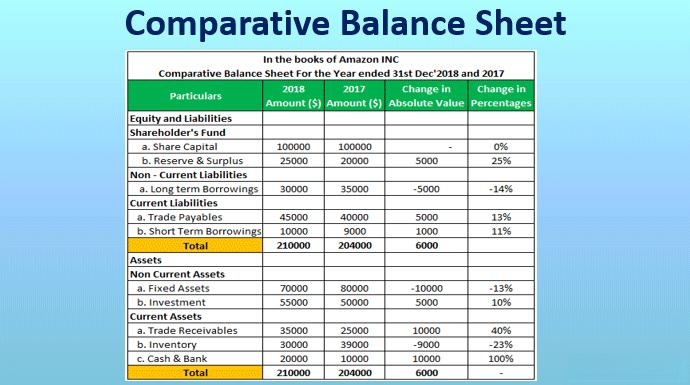

In today's dynamic business environment, the ability to scrutinize different company structures, such as service and merchandising companies, is essential for assessing financial performance. At the core of this analysis lies the income statement, a pivotal tool that offers crucial insights into a company's operating mechanisms and financial health. Income statements are tailored financial documents that highlight the revenues, expenses, and profits of a company over a specific period. These statements serve as an essential bridge connecting a company's economic activities with its financial outcomes. The structural nuances inherent in these statements shed light on the distinct operational frameworks of service and merchandising companies. 

Service companies, focusing on intangibles, generate revenue from providing expert services and concentrate their financial reporting on service revenue and operating expenses. In contrast, merchandising companies depend on the tangible flow of goods, with their income statements highlighting sales revenue and the cost of goods sold (COGS). It is this expense—the COGS—that underscores the fundamental difference in these two models, as it captures the direct costs associated with producing goods that are later sold.



Understanding the distinctions between these income statements is not only integral for business stakeholders but also holds profound relevance in the context of algorithmic trading. By comparing the financial structures of service companies versus merchandising enterprises, investors and algorithmic traders can enhance their predictive capabilities, gaining insights into operational efficiency and stability. This understanding allows for the design of tailored algorithmic models that analyze and forecast financial performance, potentially offering a strategic advantage in competitive markets.

## Table of Contents

## Understanding Income Statements

An income statement is a fundamental financial document that provides a snapshot of a company's operational performance over a designated period, such as a fiscal quarter or year. It is designed to provide insights into the revenues a company generates, the expenses it incurs, and the resulting profit or loss. This document is integral to financial analysis and decision-making and often scrutinized by stakeholders, including investors, management, and creditors, to assess a company's financial health.

The income statement stands as one of the "big three" financial statements, alongside the balance sheet and cash flow statement. Each of these financial documents serves a distinct purpose. While the balance sheet offers a view of what a company owns and owes at a specific point in time (assets, liabilities, and equity), the cash flow statement outlines how cash enters and exits the business. Together, these statements provide a comprehensive view of a company’s financial position.

The structure of an income statement typically includes several key components:

1. **Revenues (or Sales):** The total income generated from the sale of goods or services. This is often the starting figure and is critical for determining a company's ability to grow and sustain its operations.

2. **Expenses:** These are bifurcated into categories, such as cost of goods sold (COGS) for merchandising companies, and operating expenses, which may include selling, general and administrative expenses (SG&A), research and development (R&D), and other costs associated with running the business.

3. **Gross Profit:** Calculated as Revenues minus COGS, this metric assesses a company's efficiency in producing goods or services at a profit.

4. **Operating Income:** This figure is obtained by subtracting operating expenses from the gross profit. It reflects the profitability of the company's core business operations.

5. **Net Income:** Often referred to as the "bottom line," net income is the residual profit after accounting for all expenses, taxes, and interest. It serves as a key indicator of overall profitability.

The layout and focus of income statements can vary significantly across different types of businesses. Merchandising companies emphasize revenue from product sales and COGS, while service companies highlight fees from service delivery and do not typically include COGS due to the intangible nature of their offerings. This distinction in structure underscores the differing ways in which profitability is assessed, based on the nature of business operations. Understanding these variations is crucial for accurate financial analysis and strategic decision-making.

## Merchandising Companies Income Statements

Merchandising companies play a vital role in the economy by generating revenue through the purchase and resale of tangible goods. These companies' primary business model involves buying products from manufacturers or wholesalers and selling them directly to consumers or other businesses. The income statements of merchandising companies are designed to reflect this operational structure.

Key components of a merchandising company's income statement include revenue from sales, the cost of goods sold (COGS), and operating expenses. Revenue from sales, often referred to simply as "sales," accounts for the total income generated from the sale of goods during a specific period. This figure is a critical indicator of a company's top-line performance.

The cost of goods sold is a significant component of the income statement for merchandising companies. COGS represents the direct costs associated with the production or purchase of the goods that were sold during the period. It includes expenses like the purchase price of inventory, shipping costs, and any additional costs required to make the goods ready for sale. Understanding COGS is crucial as it directly impacts gross profit, calculated as revenue minus COGS:

$$
\text{Gross Profit} = \text{Sales Revenue} - \text{COGS}
$$

Gross profit is an essential metric that provides insights into a company's profitability before accounting for operating expenses.

Operating expenses, another critical section of the income statement, consist of costs incurred from the day-to-day functioning of the business that are not directly tied to the production of goods. These may include administrative expenses, salaries, utilities, rent, and marketing costs. These expenses are subtracted from gross profit to compute the operating profit, also known as operating income or EBIT (Earnings Before Interest and Taxes).

By defining these specific line items, the income statement of a merchandising company provides stakeholders with a detailed view of the financial outcomes of their business model focused on tangible goods sales. Analyzing these statements enables potential investors and analysts to assess the company's operational efficiency, pricing strategy, and overall financial health.

## Service Companies Income Statements

Service companies primarily generate income through the sale of services rather than physical products. As a result, the income statements of these companies reflect a distinct financial structure tailored to their operational focus. The primary difference in their income statement is the absence of the cost of goods sold (COGS), as service companies do not deal with inventory or tangible products.

Instead, service companies emphasize revenue generated from services provided. This category captures the total income from activities such as consulting, legal services, education, IT support, and other professional services. For instance, a consulting firm's income statement will prominently feature the fees charged for consulting services rendered during the accounting period.

The focus on service revenue impacts the expenses section of their income statements. These companies are often characterized by significant operating and overhead expenses, which include salaries, rent, utilities, marketing, and administrative costs. Such expenses are vital in the context of service delivery, where human capital and expertise are pivotal to operations. Additionally, depreciation on equipment used in service provision and amortization of intangible assets may appear as part of the operating expenses.

Given the nature of services, other expense categories may include research and development costs, particularly for tech-oriented service companies, and professional development expenses to maintain service quality and expertise. These entries reflect the investment in human resources and technology necessary for competitive service delivery.

The result from operations yields the operating income, which subtracts total operating expenses from service revenues. Operating income is an essential indicator of the company's core operational performance, especially critical for stakeholders assessing the efficiency and profitability of service companies.

This absence of inventory-related line items simplifies the income statement compared to merchandising companies. However, service companies might still report non-operating income or expenses, such as interest or tax expenses, which affect the net income. The impact and meaning of these items depend significantly on the specific industry and operational context of the service company.

To summarize, the income statements of service companies are distinguished by their emphasis on service revenues and operating costs, with an operational structure focused on efficiency in delivering services rather than managing physical goods.

## Key Differences in Income Statements

The primary difference between the income statements of merchandising and service companies is the presence of the Cost of Goods Sold (COGS) in merchandising companies' statements. COGS represents the direct costs associated with the production and acquisition of goods that a merchandising company sells during a specific period. This expense is crucial in determining the gross profit of merchandising companies. In contrast, service companies typically do not incur COGS since they do not sell physical products; instead, their income statements primarily focus on operating and overhead expenses related to service delivery. This distinction in line items underscores the different operational emphases between these types of companies.

Service companies tend to list fewer line items associated with inventory on their income statements because their operations do not generally involve the storage or sale of physical goods. Instead, their expenses are heavily influenced by human capital and service delivery costs--examples include wages, salaries, and administrative expenses. This streamlined approach reflects a focus on the provision of services rather than inventory management.

Both merchandising and service companies may report non-operating gains or losses that do not directly relate to core operations. These could arise from activities like investment income, interest expenses, or foreign exchange gains and losses. However, these non-operating items can vary significantly based on the industry's context or specific company circumstances. For example, a service company in the IT sector might have gains from software licensing deals, while a merchandising company might incur losses from inventory obsolescence. These financial elements, though secondary to core business operations, can influence overall profitability and are important for investors and analysts to consider when evaluating a company's financial health.

## Impact of Income Statement Differences on Algorithmic Trading

Understanding the distinctions between the income statements of service and merchandising companies can significantly impact [algorithmic trading](/wiki/algorithmic-trading) strategies, mainly through more informed predictions of stock performance. Income statements provide insights into a company's financial health, operational efficiency, and risk exposure, which are crucial for developing strategic trading algorithms.

Traders can use these insights to assess the operational efficiency of companies. For instance, the presence of "Cost of Goods Sold" (COGS) in merchandising companies offers a direct understanding of margin health and inventory management efficiency. Conversely, the absence of COGS in service companies focuses the analysis on operating expenses and human capital efficiency. These distinctions allow traders to better evaluate the resource allocation and profit generation efficiency across different sectors.

Algorithmic models benefit from these differences by incorporating diverse input features tailored to service or merchandising operations. For instance, an algorithm might weigh the operating expenses differently depending on whether a company is service-oriented or product-oriented. Here is an example of how an algorithm might be structured, using Python, to differentiate between these companies:

```python
def calculate_financial_efficiency(income_statement, company_type):
    if company_type == 'merchandising':
        efficiency_ratio = income_statement['gross_profit'] / income_statement['net_sales']
    elif company_type == 'service':
        efficiency_ratio = income_statement['operating_income'] / income_statement['total_revenue']
    else:
        raise ValueError("Invalid company type provided.")
    return efficiency_ratio

income_statement_example = {
    'gross_profit': 200000,
    'net_sales': 500000,
    'operating_income': 150000,
    'total_revenue': 500000
}

merchandising_efficiency = calculate_financial_efficiency(income_statement_example, 'merchandising')
service_efficiency = calculate_financial_efficiency(income_statement_example, 'service')

print('Merchandising Efficiency:', merchandising_efficiency)
print('Service Efficiency:', service_efficiency)
```

The above function `calculate_financial_efficiency` demonstrates how different financial metrics might be prioritized based on company type, emphasizing how algorithmic models can tailor analyses by accounting for these distinctions.

Furthermore, understanding these financial nuances aids in designing algorithms that predict financial stability and investment risks. Algorithms can be programmed to detect shifts in financial stability by monitoring key income statement indicators, thereby providing traders with an edge in volatile markets.

Lastly, categorizing financial data allows for cross-sectional analyses within and across industries, enabling algorithms to leverage industry-specific patterns and trends. For example, [machine learning](/wiki/machine-learning) models can be trained using historical income statement data to forecast future market trends or predict company-specific risk factors, adapting these forecasts to the company's operational type.

## Conclusion

Income statements play a crucial role in conveying a company's financial health and operational strategies. These documents serve as a vital source of information for analyzing and understanding a company's revenue streams, expenses, and profitability over time. The distinctions between the income statements of service and merchandising companies provide investors and traders with a clearer perspective on company operations and financial health.

Service companies, which primarily sell services, typically present income statements that emphasize service revenue without incorporating a cost of goods sold (COGS) section. In contrast, merchandising companies focus on the buying and selling of tangible goods, and their income statements include crucial financial elements such as sales revenue, COGS, and gross profit. Recognizing these differences allows for more precise evaluations of operational efficiency, enabling investors and traders to form well-rounded strategies in the financial markets.

When integrated into algorithmic trading systems, insights gleaned from income statements offer a robust advantage. Understanding the distinctive financial structures of service and merchandising companies enables traders to devise models that can predict stock performance based on company efficiency and financial stability. These algorithmic tools leverage income statement data to identify market trends, enhancing the potential for financial gains.

Overall, the ability to parse and interpret the variances in income statements of different company types equips traders, investors, and analysts with the knowledge to make informed decisions. As the complexity of market data grows, these insights become increasingly significant in developing competitive strategies for evaluating and predicting market behaviors.

## References & Further Reading

[1]: Bergstra, J., Bardenet, R., Bengio, Y., & Kégl, B. (2011). ["Algorithms for Hyper-Parameter Optimization."](https://dl.acm.org/doi/10.5555/2986459.2986743) Advances in Neural Information Processing Systems 24.

[2]: ["Advances in Financial Machine Learning"](https://www.amazon.com/Advances-Financial-Machine-Learning-Marcos/dp/1119482089) by Marcos Lopez de Prado

[3]: ["Evidence-Based Technical Analysis: Applying the Scientific Method and Statistical Inference to Trading Signals"](https://www.amazon.com/Evidence-Based-Technical-Analysis-Scientific-Statistical/dp/0470008741) by David Aronson

[4]: ["Machine Learning for Algorithmic Trading"](https://github.com/stefan-jansen/machine-learning-for-trading) by Stefan Jansen

[5]: ["Quantitative Trading: How to Build Your Own Algorithmic Trading Business"](https://www.amazon.com/Quantitative-Trading-Build-Algorithmic-Business/dp/1119800064) by Ernest P. Chan