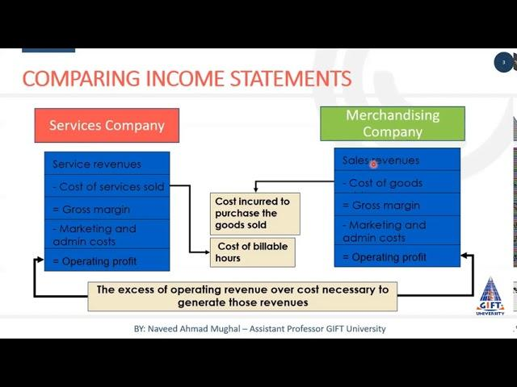

## Table of Contents

## What is an income statement?

An income statement is a financial document that shows how much money a company made and spent over a certain period, usually a year or a quarter. It tells you if the company made a profit or a loss by listing all the money coming in from sales and all the money going out for expenses. It's like a report card for the company's financial health.

The top part of the income statement shows the company's revenue, which is all the money it earned from selling its products or services. Then, it lists the costs of goods sold, which are the expenses directly related to making those products or services. After subtracting these costs from the revenue, you get the gross profit. The bottom part of the statement lists all other expenses, like rent, salaries, and utilities. When you subtract these from the gross profit, you get the net income, which tells you if the company made a profit or a loss.

## How do income statements differ between merchandising and service companies?

Income statements for merchandising and service companies are different mainly because of what they sell. Merchandising companies sell products, so their income statements show the cost of goods sold. This is the money they spend to buy or make the products they sell. After they sell these products, they subtract the cost of goods sold from their sales revenue to find out their gross profit. Then, they list other expenses like rent and salaries, and subtract these from the gross profit to get the net income.

Service companies, on the other hand, sell services, not products. So, their income statements don't have a cost of goods sold section. Instead, they list their revenue from providing services directly. Then, they list their operating expenses, like salaries for employees who provide the services, rent, and utilities. They subtract these expenses from their service revenue to find their net income. Because service companies don't deal with physical products, their income statements are simpler and focus more on the costs of running the business.

## What are the main components of an income statement for a merchandising company?

An income statement for a merchandising company shows how much money the company made and spent. It starts with the company's total sales, which is all the money they got from selling their products. Then, it lists the cost of goods sold, which is how much it cost the company to buy or make the products they sold. When you subtract the cost of goods sold from the total sales, you get the gross profit. This tells you how much money the company made from selling its products before other expenses.

The next part of the income statement lists other expenses the company had to pay, like rent, salaries, and utilities. These are called operating expenses. You subtract these operating expenses from the gross profit to find out the company's net income. The net income tells you if the company made a profit or a loss after all expenses are paid. So, the main parts of an income statement for a merchandising company are total sales, cost of goods sold, gross profit, operating expenses, and net income.

## What are the main components of an income statement for a service company?

An income statement for a service company shows how much money the company made and spent. It starts with the company's total revenue, which is all the money they got from providing services. Then, it lists the operating expenses, which are all the costs the company had to pay to run the business, like salaries for employees, rent, and utilities. You subtract these operating expenses from the total revenue to find out the company's net income. The net income tells you if the company made a profit or a loss after all expenses are paid.

Since service companies don't sell physical products, their income statements are simpler than those of merchandising companies. They don't have a section for the cost of goods sold because they don't have to buy or make products to sell. Instead, their focus is on the costs of providing services and running the business. This makes the income statement for a service company straightforward, showing just the revenue from services and the expenses needed to keep the business going.

## How is revenue recognized in merchandising versus service companies?

In merchandising companies, revenue is recognized when the company sells its products to customers. This means the company records the money it gets from sales as revenue at the time the products are sold, not when the company first buys or makes the products. For example, if a store sells a shirt, it counts the money from that sale as revenue right away, even if it bought the shirt from a supplier earlier.

In service companies, revenue is recognized when the service is provided to the customer. This means the company records the money it gets for its services as revenue at the time the service is completed, not when the company first starts working on the service. For example, if a cleaning company finishes cleaning a house, it counts the money from that job as revenue right away, even if it started the job earlier.

Both types of companies follow a rule called the revenue recognition principle, which says that revenue should be recorded when it's earned and can be reliably measured. This helps make sure the income statement shows a true picture of how much money the company made during a certain time.

## What role do cost of goods sold (COGS) play in the income statement of a merchandising company?

In a merchandising company, the cost of goods sold (COGS) is a big part of the income statement. It's the money the company spends to buy or make the products they sell. When a store sells a shirt, for example, COGS includes how much they paid to get that shirt from a supplier. This cost is important because it helps the company figure out how much profit they made from selling their products. They do this by subtracting COGS from the money they got from sales, which gives them the gross profit.

COGS is different from other expenses like rent or salaries, which are listed later in the income statement. These other expenses are not directly tied to the products sold, so they don't go into the COGS section. By showing COGS separately, the income statement helps the company and anyone looking at it understand how much it costs to sell the products and how much money is left over after those costs are covered. This is key for merchandising companies to know if they're making enough money from selling their products to cover all their expenses and make a profit.

## How are operating expenses reported differently in merchandising and service companies?

In merchandising companies, operating expenses are listed after the cost of goods sold and gross profit on the income statement. These expenses include things like rent, salaries, utilities, and advertising. They are the costs of running the business that aren't directly tied to the products sold. After the merchandising company figures out its gross profit by subtracting the cost of goods sold from its sales revenue, it then subtracts these operating expenses to find out its net income. This way, the income statement clearly shows how much money the company made from selling products and how much it spent to keep the business going.

In service companies, operating expenses are listed right after the revenue from services on the income statement. Since service companies don't sell products, they don't have a cost of goods sold section. Their operating expenses include things like salaries for employees who provide the services, rent, utilities, and other costs of running the business. They subtract these expenses directly from their service revenue to find out their net income. This makes the income statement simpler and focuses on how much it costs to provide services and keep the business running.

## Can you explain the gross profit calculation for a merchandising company?

Gross profit for a merchandising company is how much money the company makes from selling its products before other expenses are taken out. To find the gross profit, the company starts with its total sales. Total sales is all the money the company gets from selling its products. Then, the company subtracts the cost of goods sold from the total sales. The cost of goods sold is how much it cost the company to buy or make the products they sold. When you subtract the cost of goods sold from the total sales, what's left is the gross profit.

For example, if a store sells shirts and makes $1000 from selling them, that's their total sales. If it cost the store $600 to buy those shirts from a supplier, that's their cost of goods sold. When the store subtracts the $600 cost of goods sold from the $1000 total sales, they get a gross profit of $400. This $400 is the money the store made from selling the shirts before they pay for other things like rent and salaries.

## How does the absence of COGS affect the income statement of a service company?

In a service company, there's no cost of goods sold (COGS) because they don't sell physical products. Instead of COGS, their income statement shows just the revenue from the services they provide. This makes the income statement simpler because they don't have to subtract the cost of goods sold from their sales to find the gross profit. They can go straight to listing their operating expenses, like salaries, rent, and utilities, after showing their service revenue.

Because there's no COGS, the service company's income statement focuses more on how much it costs to run the business and provide services. They subtract their operating expenses directly from their service revenue to find their net income. This helps them see if they're making a profit or a loss after paying for all their expenses. Without the complexity of COGS, the income statement clearly shows how the company's services are doing financially.

## What advanced metrics should be considered when comparing income statements of merchandising and service companies?

When comparing income statements of merchandising and service companies, it's helpful to look at some advanced metrics like gross margin and operating margin. Gross margin is important for merchandising companies because it shows how much money they make from selling products after paying for them. You find the gross margin by dividing the gross profit by the total sales and then turning that into a percentage. For service companies, since they don't have a cost of goods sold, their gross margin is the same as their total revenue, making it less useful for comparison. Instead, looking at their operating margin, which is the net income divided by total revenue, gives a better idea of how well they're doing at making money after paying all their expenses.

Another useful metric is the net profit margin, which is good for comparing both types of companies. The net profit margin shows how much of every dollar in revenue turns into profit after all expenses are paid. You find it by dividing the net income by the total revenue and turning it into a percentage. This metric helps you see how efficient both merchandising and service companies are at turning their sales or services into profit. By looking at these margins, you can get a clearer picture of how well each type of company is doing financially, even though their income statements are set up differently.

## How do inventory valuation methods impact the income statement of a merchandising company?

Inventory valuation methods can change how much profit a merchandising company shows on its income statement. There are different ways to value inventory, like FIFO (First In, First Out), LIFO (Last In, First Out), and average cost. Each method can lead to different amounts for the cost of goods sold, which is how much it cost to buy or make the products sold. If the cost of goods sold changes, the gross profit also changes. For example, if prices are going up, using LIFO might show a higher cost of goods sold because it uses the newest, more expensive inventory first. This would mean a lower gross profit compared to using FIFO, which uses the older, cheaper inventory first.

These differences in inventory valuation methods can make it hard to compare income statements from different companies or even the same company over time if they switch methods. For example, if a company switches from FIFO to LIFO during a time when prices are rising, their cost of goods sold will go up, and their gross profit will go down. This might make it look like the company is doing worse than it really is. It's important for people looking at the income statement to know which method the company is using so they can understand the numbers better.

## What are the implications of different accounting standards on the income statements of merchandising and service companies globally?

Different accounting standards around the world can make it tricky to compare income statements of merchandising and service companies. For example, some countries use International Financial Reporting Standards (IFRS), while others use Generally Accepted Accounting Principles (GAAP) in the United States. These standards can affect how companies report their revenue, expenses, and profits. For a merchandising company, the way they value their inventory and calculate the cost of goods sold might be different under IFRS compared to GAAP. This can change how much profit they show on their income statement. For a service company, the timing of when they recognize revenue might be different, which can also affect their reported profits.

These differences in accounting standards can make it hard for investors and analysts to understand a company's true financial health, especially when comparing companies from different countries. If a merchandising company in one country uses a method that shows a lower cost of goods sold, it might look more profitable than a similar company in another country that uses a method showing a higher cost of goods sold. The same goes for service companies; if one recognizes revenue earlier than another, it might appear to be doing better financially. Because of this, it's important for people looking at income statements to know which accounting standards the companies are using and how those standards might affect the numbers they see.

## What are Merchandising Companies' Income Statements?

Merchandising companies play a vital role in the economy by generating revenue through the purchase and resale of tangible goods. These companies' primary business model involves buying products from manufacturers or wholesalers and selling them directly to consumers or other businesses. The income statements of merchandising companies are designed to reflect this operational structure.

Key components of a merchandising company's income statement include revenue from sales, the cost of goods sold (COGS), and operating expenses. Revenue from sales, often referred to simply as "sales," accounts for the total income generated from the sale of goods during a specific period. This figure is a critical indicator of a company's top-line performance.

The cost of goods sold is a significant component of the income statement for merchandising companies. COGS represents the direct costs associated with the production or purchase of the goods that were sold during the period. It includes expenses like the purchase price of inventory, shipping costs, and any additional costs required to make the goods ready for sale. Understanding COGS is crucial as it directly impacts gross profit, calculated as revenue minus COGS:

$$
\text{Gross Profit} = \text{Sales Revenue} - \text{COGS}
$$

Gross profit is an essential metric that provides insights into a company's profitability before accounting for operating expenses.

Operating expenses, another critical section of the income statement, consist of costs incurred from the day-to-day functioning of the business that are not directly tied to the production of goods. These may include administrative expenses, salaries, utilities, rent, and marketing costs. These expenses are subtracted from gross profit to compute the operating profit, also known as operating income or EBIT (Earnings Before Interest and Taxes).

By defining these specific line items, the income statement of a merchandising company provides stakeholders with a detailed view of the financial outcomes of their business model focused on tangible goods sales. Analyzing these statements enables potential investors and analysts to assess the company's operational efficiency, pricing strategy, and overall financial health.

## References & Further Reading

[1]: Bergstra, J., Bardenet, R., Bengio, Y., & Kégl, B. (2011). ["Algorithms for Hyper-Parameter Optimization."](https://dl.acm.org/doi/10.5555/2986459.2986743) Advances in Neural Information Processing Systems 24.

[2]: ["Advances in Financial Machine Learning"](https://www.amazon.com/Advances-Financial-Machine-Learning-Marcos/dp/1119482089) by Marcos Lopez de Prado

[3]: ["Evidence-Based Technical Analysis: Applying the Scientific Method and Statistical Inference to Trading Signals"](https://www.amazon.com/Evidence-Based-Technical-Analysis-Scientific-Statistical/dp/0470008741) by David Aronson

[4]: ["Machine Learning for Algorithmic Trading"](https://github.com/stefan-jansen/machine-learning-for-trading) by Stefan Jansen

[5]: ["Quantitative Trading: How to Build Your Own Algorithmic Trading Business"](https://www.amazon.com/Quantitative-Trading-Build-Algorithmic-Business/dp/1119800064) by Ernest P. Chan