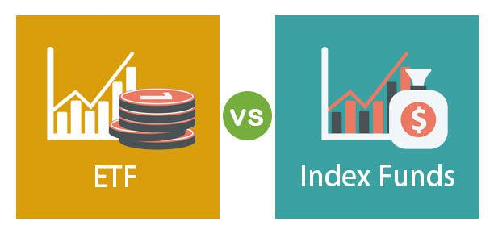

In the modern financial landscape, investors are confronted with a vast array of choices, each offering unique opportunities and challenges. Understanding these different investment avenues is crucial for both maximizing returns and managing risks effectively. Among the most popular strategies are index mutual funds, index exchange-traded funds (ETFs), and algorithmic trading. Each of these options presents distinct characteristics and benefits, catering to various investor preferences and objectives.

Index mutual funds are traditionally known for their simplicity and low-cost investment strategy, aiming to replicate the performance of a specific benchmark index. These funds are passively managed, reducing the need for frequent human intervention and generally incurring lower management fees. They offer broad market exposure and diversification, suitable for investors seeking steady, long-term growth with minimal involvement.



Index ETFs share similarities with index mutual funds, with the primary difference being how they are traded. Unlike mutual funds that trade at the end of the trading day, ETFs can be bought and sold throughout the trading session, much like stocks. This liquidity provides investors with flexibility and access to various trading strategies, such as short selling and margin trading. Additionally, ETFs often come with specific tax advantages that appeal to cost-conscious investors.

Algorithmic trading represents a more contemporary approach, leveraging sophisticated computer programs to execute trades at speeds and volumes beyond human capability. This method utilizes predefined criteria to facilitate quick and efficient trading decisions, minimizing human error and taking advantage of arbitrage opportunities. However, it requires a strong understanding of technology and risk management due to the complexities and potential pitfalls, such as technological dependence and market volatility.

Choosing the optimal investment strategy involves careful consideration of several factors, including risk tolerance, investment goals, time horizon, and desired level of engagement. This guide aims to equip both novice and experienced investors with the knowledge needed to navigate these options and make informed decisions tailored to their financial aspirations. Through a comprehensive comparison of index mutual funds, index ETFs, and algorithmic trading, investors can align their strategies with personal goals and preferences, ensuring a well-rounded investment approach.

## Table of Contents

## Understanding Index Mutual Funds

Index mutual funds are a type of investment vehicle designed to closely follow the performance of a specific stock market index, such as the S&P 500 or the NASDAQ-100. Unlike actively managed mutual funds, which require constant oversight and decision-making by portfolio managers, index mutual funds are passively managed. This essentially means that after the fund's inception, it requires minimal human intervention, which significantly reduces management fees associated with the fund. 

### Structure and Benefits

Index mutual funds offer significant diversification benefits as they hold a broad spectrum of securities within the benchmark index they are designed to follow. By investing in index mutual funds, investors can gain exposure to a wide array of market sectors and industries without the need to individually purchase each security. This comprehensive diversification helps to mitigate risks that are inherent in investing in single stocks or narrower segments of the market.

The cost structure of index mutual funds is one of their notable advantages. Due to the passive management strategy, these funds often boast lower expense ratios compared to actively managed funds. Expense ratios, which represent the cost of managing the fund as a percentage of total assets, are typically a key consideration for investors prioritizing cost efficiency. Lower fees mean that investors can retain a larger portion of their returns, making index funds an attractive long-term investment strategy.

### Long-term Strategy and Constraints

Index mutual funds fit seamlessly into a long-term investment strategy through their consistent and predictable performance that mirrors the overall market or specific sectors of the market. For investors with a long-term outlook, this method provides steady growth potential without the necessity of frequent market timing or stock [picking](/wiki/asset-class-picking). However, it’s important to note that because index funds are constructed to reflect an index's performance, they are inherently limited in flexibility. They cannot react to market conditions or economic forecasts like actively managed funds might. 

As a result of their passive nature, index mutual funds are unable to outperform the market benchmark they track. While they are likely to perform as well as the index, they cannot use managerial expertise to pursue additional returns above and beyond the index's performance. This characteristic appeals to investors who are seeking predictable growth rather than speculative or high-risk returns.

### Suitable Investors

Index mutual funds are ideally suited for investors who aim for steady capital appreciation over time without needing to engage actively in fund management. They are particularly beneficial for investors who prefer a hands-off approach, transferring the responsibility of stock selections and optimizations to the market itself. Moreover, individuals who want an easy avenue for entering the equity markets with a diversified portfolio often find index mutual funds to be a practical choice.

In conclusion, index mutual funds represent a foundational component of modern investment strategies, offering a blend of cost efficiency, diversification, and predictable growth aligned with the market. While they might not cater to those seeking market-beating returns, they remain a staple for investors valuing stability and long-term growth. Investors should consider their financial goals, risk tolerance, and investment horizon when choosing index mutual funds as part of their portfolio strategy.

## Examining Index ETFs

Exchange Traded Funds (ETFs) are investment products that, while sharing some similarities with index mutual funds, offer distinct advantages and considerations. Both ETFs and index mutual funds aim to track the performance of a specific market index, yet they differ significantly in their trading, [liquidity](/wiki/liquidity-risk-premium), tax implications, and strategic uses.

One of the primary advantages of ETFs is their liquidity. Unlike mutual funds that are typically traded at the end of the trading day at the net asset value (NAV), ETFs can be bought and sold throughout the trading day on stock exchanges, much like individual stocks. This feature enables investors to react quickly to market changes, offering greater flexibility and the potential for intraday profits or losses.

Moreover, ETFs are recognized for their cost efficiency. They generally have lower expense ratios than actively managed funds, making them attractive for cost-conscious investors. However, individuals need to be mindful of transaction costs associated with frequent trading. Brokerage fees incurred during each transaction can cumulatively impact returns, especially for investors who trade ETFs frequently.

Tax efficiency is another notable aspect of ETFs. They are structured in a way that often results in fewer capital gains distributions compared to mutual funds. This efficiency is largely due to the in-kind creation and redemption process distinctive to ETFs, which helps minimize taxable events. Consequently, investors may benefit from lower annual tax liabilities, enhancing their overall investment returns.

ETFs also allow investors to employ various trading strategies, such as short selling and margin trading. Short selling is a method where an investor borrows securities and sells them, with the intention of buying them back later at a lower price. Margin trading involves borrowing funds from a broker to purchase securities, allowing for greater exposure than what the investor's capital alone would permit. These strategies can provide considerable opportunities for gains, though they also introduce higher levels of risk.

For investors who value flexibility and seek to employ a wide range of investment strategies, index ETFs present an appealing option. They cater to varying investor preferences, from those who favor passive, long-term investment approaches to those who pursue active, short-term trading methodologies.

In summary, index ETFs provide a versatile investment vehicle, balancing low operational costs, tax efficiency, and a wide array of trading strategies. They stand out for their liquid, accessible nature, allowing investors to benefit from the potential of day-to-day market fluctuations. However, careful consideration of transaction costs and an understanding of the risks involved in advanced trading strategies are essential for leveraging the full potential of ETFs in an investment portfolio.

## The Rise of Algo Trading

Algorithmic trading, often referred to as algo trading, leverages sophisticated computer algorithms to automate and expedite trading decisions and executions. These algorithms can process large datasets and execute trades based on predefined criteria with unmatched speed and precision compared to human traders. As financial markets become more complex and data-driven, the use of [algorithmic trading](/wiki/algorithmic-trading) has surged, offering numerous advantages and posing certain risks that require careful consideration.

One of the primary benefits of algorithmic trading is the elimination of human error and emotion, which can lead to inconsistent trading decisions. Algorithms are designed to follow strict parameters, ensuring trades are executed precisely according to strategy, regardless of market [volatility](/wiki/volatility-trading-strategies) or emotional sway. This precision enables traders to back-test their strategies using historical data, optimizing algorithms to improve potential effectiveness before deploying them in live trading environments. This iterative testing process often uses mathematical models and statistical techniques to refine trading strategies.

Moreover, algorithmic trading enhances the ability to exploit [arbitrage](/wiki/arbitrage) opportunities by executing trades with rapidity and efficiency that are unattainable through manual trading. Arbitrage involves buying and selling assets simultaneously in different markets to capitalize on price discrepancies. Algorithms can react to such opportunities in microseconds, executing a series of complex trades across various platforms nearly instantaneously.

Despite these advantages, algorithmic trading is not without its challenges and risks. The dependence on technology makes algo trading susceptible to technical failures and network disruptions. "Flash crashes," for instance, are extreme examples where automated trading triggers a rapid market sell-off, resulting in a temporary, sharp decline in asset prices. Such incidents highlight the risk associated with automated trading systems, particularly when multiple algorithms simultaneously react to volatile market signals in unanticipated ways.

Furthermore, the complexity of designing and maintaining robust algorithms necessitates a high level of technical expertise. Traders must be adept not only in financial markets but also in programming and data analysis. Skills in languages such as Python or C++ are often essential, as algorithms are typically developed and tested using such programming environments. A basic Python structure for an algorithmic trading strategy may include libraries like NumPy for numerical computations and Pandas for data manipulation:

```python
import numpy as np
import pandas as pd

# Example of a simple moving average strategy
def generate_signals(price_data, short_window=40, long_window=100):
    signals = pd.DataFrame(index=price_data.index)
    signals['signal'] = 0.0

    signals['short_mavg'] = price_data['Close'].rolling(window=short_window, min_periods=1, center=False).mean()
    signals['long_mavg'] = price_data['Close'].rolling(window=long_window, min_periods=1, center=False).mean()

    signals['signal'][short_window:] = np.where(signals['short_mavg'][short_window:] 
                                                > signals['long_mavg'][short_window:], 1.0, 0.0)

    signals['positions'] = signals['signal'].diff()
    return signals
```

Investors interested in entering the world of algorithmic trading should have a solid understanding of both financial markets and the technological frameworks that support them. Additionally, meticulous risk management strategies are crucial to safeguard against the inherent risks associated with algorithmic operations. This dual proficiency ensures that traders can capitalize on the expansive capabilities of algorithmic trading while mitigating potential downsides effectively.

## Comparing Investment Strategies: Factors to Consider

When evaluating investment strategies, such as index mutual funds, index ETFs, and algo trading, several important factors come into play. Each of these strategies caters to different investor needs and preferences, and understanding them helps in making informed decisions.

Risk tolerance is paramount. Index mutual funds typically suit investors with a lower risk tolerance, offering a passive investment approach that mirrors the market's performance. This strategy focuses on long-term growth with lower volatility. Index ETFs also attract those who prefer passive investments but with added trading flexibility. They can provide daily liquidity and are suitable for investors comfortable with moderate risk due to potential market fluctuations when they trade throughout the day. Algo trading, meanwhile, often appeals to investors with a higher risk appetite and technological proficiency. Here, the risk factors stem from market volatility, the potential for rapid losses, and reliance on sophisticated algorithms.

Investment goals and time horizon are crucial in deciding the approach. Long-term investors seeking steady growth might lean towards index mutual funds for their simplicity and predictability. On the other hand, index ETFs could be favored by those who desire more control and flexibility in managing their portfolios, especially if they plan to make adjustments over a medium-term horizon. Algo trading might appeal to those with short-term profit objectives, ambitious return targets, and the ability to frequently monitor and adjust their strategies.

The level of engagement an investor wishes to maintain also influences the choice of strategy. Index mutual funds require minimal involvement and are ideal for investors preferring a hands-off approach. In contrast, index ETFs demand a moderate engagement level due to the necessity of trading decisions. Algo trading calls for a high engagement level, demanding constant monitoring and adjustments to algorithms, posing a challenge for those not tech-savvy or unable to devote the necessary time.

Cost implications are another significant consideration. Index mutual funds usually have lower management fees due to their passive nature. However, they can have higher minimum investment requirements. Index ETFs might involve transaction fees, especially with frequent trading, but they offer tax advantages due to their structure. Algo trading could incur substantial development and operational costs, demanding sophisticated technology and infrastructure, which can be costly initially and in ongoing maintenance.

Regulatory considerations and tax liabilities must also be examined. Index mutual funds and index ETFs are subject to regulations that ensure transparency and investor protection. They offer clarity in taxation, with mutual funds often distributing capital gains annually and ETFs providing tax efficiency through in-kind creation and redemption processes. Algo trading, while offering tax-efficient trading strategies, may face complex regulatory scrutiny and necessitates compliance with both market regulations and algorithmic trading rules.

Potential returns vary significantly across these strategies. Index mutual funds, by design, track market indices and thus reflect average market returns. Index ETFs aim to achieve similar returns with added flexibility. Algo trading, while potentially offering higher returns through sophisticated strategies, carries the risk of substantial losses due to the complexity and fast-paced nature of the approach.

Overall, investors should align their choice of investment strategy with their unique financial goals and personal preferences. Careful consideration of these factors will ensure that the chosen strategy supports the investor's objectives, risk tolerance, and lifestyle preferences.

## Conclusion

Choosing the right investment strategy is a personal decision that must consider individual circumstances and objectives. Among the options available, index mutual funds and ETFs offer opportunities for cost-effective, diversified investing over the long term. These instruments are designed for investors seeking stability and broad market exposure with minimal management involvement. Their passive nature, typically involving lower fees and predictable performance tied to market indices, makes them an attractive choice for those aiming for gradual appreciation.

Algo trading, on the other hand, presents a cutting-edge approach for investors who are keen to leverage technology for potential gains. This strategy allows for the execution of trades at speeds and efficiencies that are beyond human capabilities. It is well-suited for those who have a strong understanding of technology and risk management, and who are willing to engage in a more active investment approach to possibly capitalize on short-term market fluctuations.

For individuals trying to navigate these options, a proper understanding and alignment with one's financial goals and risk tolerance are critical. Each investment strategy carries its unique set of risks and rewards, and a comprehensive assessment of these factors should be integral to the decision-making process. It's important to weigh aspects such as risk tolerance, time horizon, and desired engagement level when selecting a strategy. This careful consideration ensures that the chosen investment approach harmonizes with personal financial objectives.

Consultation with financial advisors can also be beneficial, as they offer expert guidance in crafting a strategy that aligns with an individual’s aspirations and capabilities. Through a detailed analysis of one's financial landscape, advisors can help in tailoring a balanced portfolio that meets specific needs and adapts to changing circumstances. With professional insight, investors can confidently pursue a strategy that not only aligns with their goals but also optimizes their chances of achieving them.

## References & Further Reading

[1]: Ellis, C. D. (1975). ["The Loser's Game."](https://www.empirical.net/wp-content/uploads/2012/06/the_losers_game.pdf) Financial Analysts Journal, 31(4), 19-26. This classic article introduces the concept of passive investing strategies such as index funds.

[2]: Bogle, J. C. (1999). ["Common Sense on Mutual Funds: New Imperatives for the Intelligent Investor"](https://www.researchgate.net/publication/245704247_Common_Sense_on_Mutual_Funds_New_Imperatives_for_the_Intelligent_Investor). John Wiley & Sons. A comprehensive guide on mutual funds, authored by the founder of Vanguard Group.

[3]: Ferri, R. A. (2002). ["All About Index Funds"](https://archive.org/details/allaboutindexfun00rich). McGraw-Hill. An accessible introduction to the construction and benefits of index funds.

[4]: ["Algorithmic Trading: Winning Strategies and Their Rationale"](https://www.wiley.com/en-us/Algorithmic+Trading%3A+Winning+Strategies+and+Their+Rationale-p-9781118460146) by Ernest P. Chan. This book explores high-frequency trading strategies.

[5]: Agapova, A. (2011). ["Conventional Mutual Index Funds Versus Exchange-Traded Funds"](https://www.sciencedirect.com/science/article/pii/S138641811000042X). Financial Analysts Journal, 67(3), 68-97. An in-depth analysis comparing the structural and operational differences between mutual index funds and ETFs.

[6]: ["Trading ETFs: Gaining an Edge with Technical Analysis"](https://www.amazon.com/Trading-ETFs-Gaining-Technical-Analysis/dp/1118109139) by Deron Wagner. A practical guide to trading with ETFs using technical analysis.

[7]: Hasbrouck, J. (2003). ["Intraday price formation in U.S. equity markets"](https://onlinelibrary.wiley.com/doi/10.1046/j.1540-6261.2003.00609.x). The Journal of Finance, 58(6), 2375-2400. An academic paper discussing price formation and trading costs relevant to ETF trading.