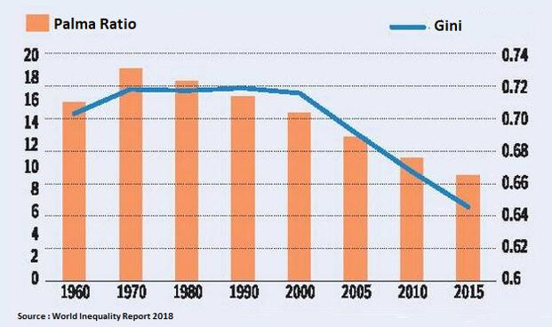

The increasing concern over economic inequality has led to the development and usage of various inequality measures utilized across different fields, including economics and finance. These measures provide key insights into the distribution of income and wealth within a society, enabling stakeholders to understand and address inequality effectively. Among the most commonly used measures are the Gini coefficient and the Palma ratio. 

The Gini coefficient, a legacy approach, condenses income or wealth distribution into a single number ranging from 0, indicating perfect equality, to 1, representing perfect inequality. This measure is extensively used due to its simplicity and the broad-spectrum perspective it provides on inequality. However, it is often critiqued for its inability to reflect changes at the extremities of the income distribution, which remain crucial for understanding the dynamics of wealth disparity.



In contrast, the Palma ratio offers a relatively new perspective, introduced by economists Alex Cobham and Andy Sumner. Unlike the Gini coefficient, the Palma ratio focuses on the disparity between the richest 10% and the poorest 40% of the population. This specific focus on income extremes grants the Palma ratio a unique advantage in capturing shifts in inequality that are often overlooked by other measures. It is considered more intuitive and readily understandable compared to its predecessors, offering insights particularly relevant to countries observing significant income variations at the distribution's tails.

In the financial sector, understanding and measuring economic inequality is crucial as it has direct implications on market stability and investment decisions. The metrics of inequality play a significant role in assessing market conditions, shaping economic policies, and driving strategic investments. Particularly in algorithmic trading—a technology-driven approach in finance—inequality measures like the Gini coefficient and Palma ratio are valuable. They assist in analyzing economic shifts, evaluating investment risks, and refining automated trading strategies to adapt to fast-evolving market scenarios.

This article explores these inequality measures, shedding light on their strengths and weaknesses and examining their implications in the financial domain, particularly concerning their relevance to algorithmic trading. We will explore how these measures can inform decisions in automated trading strategies, assisting traders and economists in devising more informed and robust financial models.

## Table of Contents

## Understanding the Gini Coefficient

The Gini coefficient is a statistical measure developed by the Italian statistician Corrado Gini in 1912. It is employed to quantify income or wealth distribution within a population, providing a single value that represents the level of inequality. The Gini coefficient ranges from 0 to 1, where 0 signifies perfect equality (everyone has the same income or wealth), and 1 denotes perfect inequality (one person has all the income or wealth, and everyone else has none).

### Calculation of the Gini Coefficient

To calculate the Gini coefficient, the Lorenz curve is a fundamental tool. The Lorenz curve is a graphical representation that depicts the cumulative distribution of income or wealth against the cumulative population percentage. If perfect equality existed, every individual would have an equal share of income, and the Lorenz curve would coincide with the line of equality, a 45-degree line on the graph. Deviations from this line represent inequality, with the curve bowing further below the line as inequality increases.

The Gini coefficient is calculated as the area between the line of equality and the Lorenz curve, divided by the total area under the line of equality. In formula terms, it can be expressed as:

$$
G = 1 - 2 \int_0^1 L(x) \, dx
$$

where $L(x)$ is the Lorenz curve.

In practical applications, the Gini coefficient can also be approximated using discrete data:

$$
G = \frac{\sum_{i=1}^{n} \sum_{j=1}^{n} |y_i - y_j|}{2n^2 \bar{y}}
$$

where $y_i$ and $y_j$ are income values for individuals $i$ and $j$, $n$ is the total number of individuals, and $\bar{y}$ is the mean income.

### Critiques of the Gini Coefficient

Despite its widespread use, the Gini coefficient faces several critiques. One significant limitation is its insensitivity to changes at the extremes of the income distribution. While it is effective at capturing overall inequality, it does not indicate whether inequality changes are occurring at the high or low end of the income spectrum. For instance, a redistribution of wealth among the middle class that leaves the poorest and wealthiest members of society untouched could alter the Gini coefficient minimally, despite significant distributional changes.

Another criticism is that the Gini coefficient does not capture differences in economic mobility or the broader context of inequality, such as access to education and healthcare. It measures only the outcome – the unequal distribution of income or wealth – without providing insight into the underlying causes or long-term trends.

Moreover, the Gini coefficient might be difficult to interpret for policy-making, as it does not identify which part of the income distribution contributes most to inequality or how policy measures might effectively target specific income groups. This limitation prompts some economists to use complementary measures, like the Palma ratio, to gain a fuller picture of inequality dynamics.

References:
- Gini, C. (1912). "Variability and Mutability." C. Cuppini, Bologna
- Atkinson, A. B. (1970). "On the Measurement of Inequality." Journal of Economic Theory

## The Palma Ratio: A New Perspective

The Palma ratio, named after economist Gabriel Palma, has emerged as an innovative approach in the study of income inequality. Developed further by economists Alex Cobham and Andy Sumner, this measure highlights the disparity between the top and bottom segments of the income distribution. Specifically, the Palma ratio is calculated by dividing the total income share of the richest 10% of the population by that of the poorest 40%. Mathematically, it can be expressed as:

$$
\text{Palma Ratio} = \frac{\text{Income Share of Top 10%}}{\text{Income Share of Bottom 40%}}
$$

This focus on the income extremes makes the Palma ratio a pertinent tool in assessing inequality more directly than traditional measures. While the Gini coefficient evaluates the entire income distribution, the Palma ratio draws attention to the polar ends, where shifts in income largely influence economic disparities.

The Palma ratio, therefore, is considered easier to interpret, particularly in the context of societies where income redistribution is a policy focus. It succinctly highlights the gap between affluence and poverty, offering an intuitive insight into how wealth is concentrated. This measure is particularly useful in countries with skewed income distributions, where changes among the middle-income groups might obscure the severity of income polarization when using conventional metrics.

An advantage of the Palma ratio over the Gini coefficient lies in its sensitivity to changes at the tails of the income distribution rather than the middle. This becomes crucial in economic analyses focusing on reducing the disparity between the wealthiest and the most impoverished populations. This specificity allows policymakers and analysts to tailor their strategies towards income equality with precision.

In conclusion, the Palma ratio's strength lies in its simplicity and focus on income extremes, providing a more direct interpretation of inequality in comparison to the Gini coefficient. By emphasizing the economic conditions at the tails of the income spectrum, it serves as a compelling instrument for evaluating and addressing inequality comprehensively.

## Comparative Analysis: Gini Coefficient vs. Palma Ratio

The Gini coefficient and the Palma ratio are both pivotal tools in measuring economic inequality, yet they serve different purposes and exhibit distinct strengths and limitations. Understanding these differences is crucial for applying these measures effectively in economic analysis and policy-making.

The Gini coefficient offers a broad view of inequality by summarizing income distribution across an entire population into a single value. Its range from 0 (indicative of perfect equality) to 1 (representing perfect inequality) makes it a straightforward metric for quick comparisons. However, a major limitation of the Gini coefficient is its sensitivity to changes in the middle of the income distribution rather than the extremes. This is because the Gini coefficient is derived from the Lorenz curve, which plots the cumulative share of income earned against the cumulative share of the population. As a result, the Gini coefficient can potentially overlook significant income shifts at the lower and upper ends of the spectrum, which are often critical in understanding true economic disparity.

In contrast, the Palma ratio emphasizes the disparity between the richest and poorest segments by comparing the income share of the top 10% to that of the bottom 40%. This makes the Palma ratio particularly effective at capturing changes affecting the extremes of wealth distribution. One of the distinct advantages of the Palma ratio is its intuitive interpretation; stakeholders can easily grasp the extent of inequality by considering the relative size of wealth concentration at both ends of the distribution. Moreover, the Palma ratio's focus on distribution extremes aligns well with trends in global inequality, where most changes have occurred.

When it comes to their applications in economic contexts and policy-making, the Gini coefficient is more suited to contexts requiring a broader, more general overview of inequality. It is frequently used in international comparisons and long-term studies of inequality trends. On the other hand, the Palma ratio is increasingly favored in contexts where policymakers need to address the growing rift between the very rich and the very poor and is particularly useful when detailed, simple narratives of inequality are necessary.

The choice between these measures can depend heavily on the analytic focus and data availability. The Gini coefficient requires comprehensive population data to accurately plot the Lorenz curve, while the Palma ratio can be derived from less detailed datasets, as it solely focuses on the extremes. This makes the Palma ratio particularly valuable in data-limited environments or when the primary concern is with extreme inequality rather than moderate shifts.

Both the Gini coefficient and Palma ratio offer crucial, but different, insights into economic inequality. Their comparative use can provide a more nuanced understanding of inequality dynamics and equip policymakers and economists with the necessary tools to tailor interventions and strategies aimed at addressing unwanted economic disparities.

## Implications for Algorithmic Trading

Economic inequality measures, like the Gini coefficient and the Palma ratio, serve as key indicators for comprehending the socio-economic landscape, and their integration into [algorithmic trading](/wiki/algorithmic-trading) offers innovative insights and strategies. With these metrics, traders can assess market conditions and risks more accurately.

### Assessing Market Conditions and Investment Risks

The Gini coefficient and Palma ratio can provide valuable information about the distribution of wealth or income within a market. A high Gini coefficient typically indicates greater inequality, which can signal potential economic disturbances or underlying vulnerabilities in a market. Traders can leverage this data to forecast market [volatility](/wiki/volatility-trading-strategies), adjusting their strategies accordingly. For instance, significant inequality might foreshadow political or social unrest, potentially impacting market stability.

Similarly, the Palma ratio's focus on income extremes enables traders to identify sectors or regions where spending power is concentrated. If the richest 10% hold a significant portion of income—indicated by a high Palma ratio—consumer demand might skew towards luxury goods and services, indicating specific investment opportunities or risks.

### Integrating Inequality Data into Trading Algorithms

Algorithmic trading systems are distinguished by their capacity to analyze vast datasets and detect patterns. By incorporating inequality measures, these systems can enhance predictive models of economic shifts. Here is a basic framework of how inequality data could be integrated using Python:

```python
import numpy as np
import pandas as pd

# Example data: Income distribution
income_data = pd.DataFrame({
    'population_segment': ['poorest_40%', 'middle_50%', 'richest_10%'],
    'income_share': [20, 50, 30]
})

# Calculate Gini coefficient
def gini_coefficient(income_share):
    sorted_shares = np.sort(income_share)
    n = len(sorted_shares)
    cumulative_shares = np.cumsum(sorted_shares) 
    relative_mean_diff = sum((2 * i - n - 1) * sorted_shares[i] for i in range(n))
    gini = relative_mean_diff / (n * cumulative_shares[-1])
    return gini

# Calculate Palma ratio
def palma_ratio(income_data):
    poorest_40_share = income_data[income_data['population_segment'] == 'poorest_40%']['income_share'].values[0]
    richest_10_share = income_data[income_data['population_segment'] == 'richest_10%']['income_share'].values[0]
    return richest_10_share / poorest_40_share

gini = gini_coefficient(income_data['income_share'])
palma = palma_ratio(income_data)

print(f"Gini Coefficient: {gini}")
print(f"Palma Ratio: {palma}")

# Use gini and palma values in trading decision model
```

The algorithm computes the Gini coefficient and Palma ratio from income data. These values might be used to diversify portfolios by favoring asset classes or sectors that historically benefit from observed inequality conditions.

### Predicting Economic Shifts and Adapting Investment Strategies

By continuously monitoring these inequality measures, trading algorithms can adapt to evolving economic climates. A rising Gini coefficient or Palma ratio may suggest investing in sectors traditionally resilient to economic inequality, such as essential goods or utilities, as they tend to maintain demand regardless of economic disparity.

Additionally, a significant analytic focus on these metrics can help algorithms anticipate macroeconomic policy shifts aimed at addressing inequality. For example, measures to curb inequality, such as progressive taxation or increased social spending, potentially influence market dynamics—you can position investments accordingly.

In conclusion, utilizing the Gini coefficient and Palma ratio in algorithmic trading permits a sophisticated analysis of economic disparity's impact on markets. This integration enhances modeling accuracy, offering a strategic advantage in dynamic economic environments.

## Conclusion

Both the Gini coefficient and the Palma ratio are essential tools for analyzing economic inequality, each providing unique insights that reflect different dimensions of disparity. The Gini coefficient, with its range from 0 to 1, offers a broad view of the entire income or wealth distribution, making it a versatile measure across numerous contexts. Its capacity to condense complex distribution patterns into a single figure is valuable for comprehensive assessments, although its sensitivity to changes in the middle of the distribution can be a limitation when extreme disparities are a primary concern.

Conversely, the Palma ratio presents a focused perspective by concentrating on the income share dynamics between the richest 10% and the poorest 40%. This emphasis on the distribution tails makes it particularly informative for examining the nature and magnitude of income inequality changes that might not be captured by the Gini coefficient. The interpretability of the Palma ratio is often deemed more straightforward, particularly in contexts where policy decisions target the income redistribution between these population segments.

The choice between the Gini coefficient and the Palma ratio largely hinges on the analytical goals and the specific aspects of inequality under investigation. For comprehensive and all-encompassing studies of inequality, the Gini coefficient remains a staple. However, for detailed analysis concerning the extremes of the income distribution, the Palma ratio can offer a clearer picture.

For professionals engaged in algorithmic trading, integrating these measures into trading strategies can provide a competitive edge. Recognizing inequality trends through these metrics can aid in assessing market conditions, identifying systemic risks, and predicting economic shifts. Incorporating insights from the Gini coefficient or Palma ratio into trading algorithms can enhance market analysis, leading to more informed and adaptive investment strategies. Understanding economic inequality not only enriches market analysis but can also drive innovative approaches in algorithmic trading, offering traders an extra layer of data-driven strategy development.

## References & Further Reading

[1]: Gini, Corrado. (1912). "Variability and Mutability." Reprinted in M. O'C. Walsh (Ed.), *Variability and Mutability* (1971). Bologna: C. Cuppini.

[2]: Atkinson, A. B. (1970). ["On the Measurement of Inequality."](https://www.sciencedirect.com/science/article/pii/0022053170900396)90039-6) *Journal of Economic Theory*, 2(3), 244-263.

[3]: Cobham, Alex, and Sumner, Andy. (2013). ["Putting the Gini Back in the Bottle? 'The Palma' as a Policy-Relevant Measure of Inequality."](https://www.scribd.com/document/589694059/10-1-1-365-4686). *King's College London, International Development Institute.*

[4]: ["Advances in Financial Machine Learning"](https://www.amazon.com/Advances-Financial-Machine-Learning-Marcos/dp/1119482089) by Marcos Lopez de Prado.

[5]: ["Machine Learning for Algorithmic Trading"](https://github.com/stefan-jansen/machine-learning-for-trading) by Stefan Jansen.

[6]: ["Quantitative Trading: How to Build Your Own Algorithmic Trading Business"](https://www.amazon.com/Quantitative-Trading-Build-Algorithmic-Business/dp/1119800064) by Ernest P. Chan.