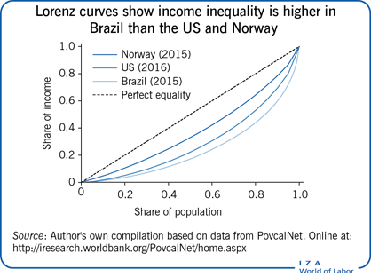

## Table of Contents

## What is inequality in economic terms?

Inequality in economic terms means that there is a big difference between what people have and earn. Some people have a lot of money, good jobs, and nice things, while others have very little. This gap can be seen in how much money people make, how much they own, and even in the opportunities they get. For example, someone might be born into a rich family and have better chances in life than someone born into a poor family.

This kind of inequality can cause problems. When the gap between the rich and the poor gets too big, it can make society unfair. People might feel angry or left out because they see others doing much better than them. This can lead to less trust in the government and more tension between different groups of people. Governments often try to fix this by making laws or programs to help those who are struggling, but it's a hard problem to solve.

## What is the Gini Coefficient and how is it calculated?

The Gini Coefficient is a number that shows how equal or unequal income or wealth is in a country. It's like a score that goes from 0 to 1. If the Gini Coefficient is 0, it means everyone has the same amount of money, so there's perfect equality. If it's 1, one person has all the money and everyone else has nothing, which is perfect inequality. Most countries fall somewhere in between.

To calculate the Gini Coefficient, you start by making a graph called the Lorenz Curve. This curve shows how income or wealth is spread out among the population. You plot the percentage of the population on one axis and the percentage of total income or wealth they have on the other. The Gini Coefficient is then found by measuring the area between the Lorenz Curve and a straight line that represents perfect equality. The formula for this is a bit complicated, but basically, it's the ratio of the area between the Lorenz Curve and the line of perfect equality to the entire area under the line of perfect equality.

## What is the Palma Ratio and how is it calculated?

The Palma Ratio is a way to measure how unequal income is in a country. It compares the income of the richest 10% of people to the income of the poorest 40%. The idea is that this ratio gives a good picture of how much of the total income is taken by the very rich compared to the bottom half of the population.

To calculate the Palma Ratio, you first find out how much money the richest 10% of people earn. Then, you find out how much money the poorest 40% of people earn. After that, you divide the income of the top 10% by the income of the bottom 40%. A higher Palma Ratio means there is more inequality, because it shows that the rich are getting a lot more money compared to the poor.

## What do the Gini Coefficient and Palma Ratio measure?

The Gini Coefficient is a number that tells us how equal or unequal income or wealth is in a country. It goes from 0 to 1. If it's 0, it means everyone has the same amount of money, so there's perfect equality. If it's 1, one person has all the money and everyone else has nothing, which means perfect inequality. Most countries have a Gini Coefficient somewhere in the middle. It's calculated using a graph called the Lorenz Curve, which shows how income or wealth is spread out among people.

The Palma Ratio is another way to measure income inequality, but it's simpler. It compares the income of the richest 10% of people to the income of the poorest 40%. You find out how much money the top 10% earn and then divide that by how much the bottom 40% earn. A high Palma Ratio means there's a lot of inequality, because it shows that the rich are getting a lot more money compared to the poor. This ratio helps us understand how much of the total income the very rich are taking compared to the bottom half of the population.

## How do the Gini Coefficient and Palma Ratio differ in their approach to measuring inequality?

The Gini Coefficient looks at how income or wealth is spread out among everyone in a country. It uses a special graph called the Lorenz Curve to see if the money is shared equally or not. If the Gini Coefficient is close to 0, it means everyone has about the same amount of money, which is perfect equality. If it's close to 1, it means one person has all the money and everyone else has nothing, which is perfect inequality. The Gini Coefficient is a good way to get a general idea of how unequal things are, but it can be a bit hard to understand because it involves math and graphs.

The Palma Ratio, on the other hand, is simpler and focuses on the difference between the very rich and the very poor. It compares the income of the richest 10% of people to the income of the poorest 40%. You just divide the income of the top 10% by the income of the bottom 40% to get the Palma Ratio. A high number means there's a big gap between the rich and the poor. This ratio is easier to understand and use because it doesn't need any special graphs or math, and it directly shows how much more the rich are getting compared to the poor.

## What are the advantages of using the Gini Coefficient over the Palma Ratio?

The Gini Coefficient is good because it looks at how money is spread out among everyone in a country. It gives a complete picture of inequality by using a special graph called the Lorenz Curve. This means it can show if the middle class is doing well or if there are big gaps between different groups of people. Because it considers everyone, it's really helpful for understanding the overall fairness in a society. Policymakers like it because it helps them see where they need to make changes to help more people.

Another advantage of the Gini Coefficient is that it's used all over the world. This makes it easy to compare how unequal different countries are. When you see the Gini Coefficient for different places, you can quickly tell which countries have bigger problems with inequality. It's also a standard way to measure inequality, so researchers and governments trust it more. This can make it easier to talk about and work on inequality on a global level.

## What are the advantages of using the Palma Ratio over the Gini Coefficient?

The Palma Ratio is easier to understand than the Gini Coefficient because it focuses on the difference between the richest and the poorest people. It compares the income of the top 10% to the bottom 40%. This makes it simple to see how big the gap is between the rich and the poor without needing to use complicated graphs or math. When you see a high Palma Ratio, you know right away that the rich are getting a lot more money compared to the poor. This can be really helpful for people who aren't experts in economics but still want to understand inequality.

Another advantage of the Palma Ratio is that it highlights the extremes of income distribution. By focusing on the top 10% and the bottom 40%, it shows how much of the total income the very rich are taking, which can be important for making policies that help the poorest people. The Palma Ratio can make it clear that even if the middle class is doing okay, the poor might still be struggling a lot. This can help governments decide where to focus their efforts to reduce inequality and make society fairer for everyone.

## How sensitive are the Gini Coefficient and Palma Ratio to changes in different parts of the income distribution?

The Gini Coefficient is sensitive to changes all across the income distribution. This means that if someone in the middle class gets a little more money, or if someone at the top or bottom changes their income, the Gini Coefficient will change a bit too. It looks at how money is spread out among everyone, so even small changes can make a difference. This can be good because it gives a full picture of how equal things are, but it can also make it hard to see big changes at the top or bottom because it's looking at everything at once.

The Palma Ratio is more sensitive to changes at the very top and the very bottom of the income distribution. It only looks at the income of the richest 10% and the poorest 40%, so if the rich get richer or the poor get poorer, the Palma Ratio will change a lot. This makes it really good at showing how big the gap is between the rich and the poor. But, it might not show changes in the middle class as well because it doesn't pay attention to them. So, the Palma Ratio is great for seeing big differences at the extremes but might miss what's happening in the middle.

## Can the Gini Coefficient and Palma Ratio be used to compare inequality across different countries or time periods?

Yes, both the Gini Coefficient and the Palma Ratio can be used to compare inequality across different countries or time periods. The Gini Coefficient is widely used all over the world, so it's easy to compare how unequal different countries are. If you see the Gini Coefficient for different places, you can quickly tell which countries have bigger problems with inequality. It's also good for comparing how inequality has changed over time in one country. If the Gini Coefficient goes up, it means inequality is getting worse, and if it goes down, inequality is getting better.

The Palma Ratio can also be used to compare inequality across countries and time periods, but it's a bit different. It focuses on the difference between the richest 10% and the poorest 40%, so it's really good at showing how big the gap is between the rich and the poor in different places. If you see a high Palma Ratio in one country compared to another, you know right away that the rich are getting a lot more money compared to the poor in that country. It's also useful for seeing if the gap between the rich and poor is getting bigger or smaller over time in one country.

## What are some limitations or criticisms of the Gini Coefficient?

The Gini Coefficient is a popular way to measure how equal or unequal income is in a country, but it has some problems. One big problem is that it can be hard to understand because it uses a special graph called the Lorenz Curve and some math to figure out the number. This makes it tough for people who aren't experts in economics to really get what the number means. Also, the Gini Coefficient looks at everyone's income, so small changes in the middle class can change the number a lot, even if the gap between the rich and the poor stays the same. This can make it hard to see big changes at the top or bottom of the income scale.

Another criticism of the Gini Coefficient is that it doesn't tell us why inequality is happening. It just shows that there is inequality, but it doesn't say if it's because of things like education, jobs, or government policies. This can make it hard for people trying to fix inequality because they don't know where to start. Also, the Gini Coefficient can be different depending on what kind of data is used. If you look at income before taxes, you might get a different number than if you look at income after taxes. This can make it tricky to compare the Gini Coefficient across different countries or over time if the data isn't the same.

## What are some limitations or criticisms of the Palma Ratio?

The Palma Ratio is a simple way to look at inequality, but it has some problems. It only looks at the income of the richest 10% and the poorest 40%, so it might miss what's happening in the middle class. If the middle class is doing better or worse, the Palma Ratio won't show that. This can be a problem because the middle class is a big part of society, and changes there can be important too. Also, the Palma Ratio doesn't tell us why the rich are getting richer or the poor are getting poorer. It just shows the gap, but it doesn't explain if it's because of things like education, jobs, or government policies.

Another criticism of the Palma Ratio is that it can be hard to compare across different countries or over time if the data isn't the same. If one country uses income before taxes and another uses income after taxes, the Palma Ratio might look different even if the real inequality is the same. This can make it tricky to use the Palma Ratio to understand how inequality is changing around the world or over time. Also, because the Palma Ratio is so focused on the extremes, it might not give a full picture of how money is spread out among everyone in a country.

## How do changes in policy or economic conditions affect the Gini Coefficient and Palma Ratio differently?

Changes in policy or economic conditions can affect the Gini Coefficient and the Palma Ratio in different ways. The Gini Coefficient looks at how money is spread out among everyone in a country. If a new policy helps the middle class get a bit more money, the Gini Coefficient will change because it pays attention to everyone. But if a policy only helps the very rich or the very poor, the Gini Coefficient might not change as much because it's looking at the whole picture. For example, if the government raises taxes on the rich and uses that money to help the poor, the Gini Coefficient might go down a little, but if the middle class doesn't see much change, the overall number might not show a big difference.

The Palma Ratio, on the other hand, is more focused on the gap between the rich and the poor. It only looks at the income of the top 10% and the bottom 40%. So, if a policy makes the rich richer or the poor poorer, the Palma Ratio will change a lot. For instance, if a new law gives big tax breaks to the wealthy, the Palma Ratio will go up because the rich are getting more money compared to the poor. But if a policy helps the poor a lot without changing the income of the rich, the Palma Ratio might go down. The Palma Ratio is good at showing big changes at the top and bottom, but it might miss what's happening in the middle class.

## What is the Gini Coefficient and how do we understand it?

The Gini coefficient is a statistical measure developed by the Italian statistician Corrado Gini in 1912. It is employed to quantify income or wealth distribution within a population, providing a single value that represents the level of inequality. The Gini coefficient ranges from 0 to 1, where 0 signifies perfect equality (everyone has the same income or wealth), and 1 denotes perfect inequality (one person has all the income or wealth, and everyone else has none).

### Calculation of the Gini Coefficient

To calculate the Gini coefficient, the Lorenz curve is a fundamental tool. The Lorenz curve is a graphical representation that depicts the cumulative distribution of income or wealth against the cumulative population percentage. If perfect equality existed, every individual would have an equal share of income, and the Lorenz curve would coincide with the line of equality, a 45-degree line on the graph. Deviations from this line represent inequality, with the curve bowing further below the line as inequality increases.

The Gini coefficient is calculated as the area between the line of equality and the Lorenz curve, divided by the total area under the line of equality. In formula terms, it can be expressed as:

$$
G = 1 - 2 \int_0^1 L(x) \, dx
$$

where $L(x)$ is the Lorenz curve.

In practical applications, the Gini coefficient can also be approximated using discrete data:

$$
G = \frac{\sum_{i=1}^{n} \sum_{j=1}^{n} |y_i - y_j|}{2n^2 \bar{y}}
$$

where $y_i$ and $y_j$ are income values for individuals $i$ and $j$, $n$ is the total number of individuals, and $\bar{y}$ is the mean income.

### Critiques of the Gini Coefficient

Despite its widespread use, the Gini coefficient faces several critiques. One significant limitation is its insensitivity to changes at the extremes of the income distribution. While it is effective at capturing overall inequality, it does not indicate whether inequality changes are occurring at the high or low end of the income spectrum. For instance, a redistribution of wealth among the middle class that leaves the poorest and wealthiest members of society untouched could alter the Gini coefficient minimally, despite significant distributional changes.

Another criticism is that the Gini coefficient does not capture differences in economic mobility or the broader context of inequality, such as access to education and healthcare. It measures only the outcome – the unequal distribution of income or wealth – without providing insight into the underlying causes or long-term trends.

Moreover, the Gini coefficient might be difficult to interpret for policy-making, as it does not identify which part of the income distribution contributes most to inequality or how policy measures might effectively target specific income groups. This limitation prompts some economists to use complementary measures, like the Palma ratio, to gain a fuller picture of inequality dynamics.

References:
- Gini, C. (1912). "Variability and Mutability." C. Cuppini, Bologna
- Atkinson, A. B. (1970). "On the Measurement of Inequality." Journal of Economic Theory

## What is the Palma Ratio: A New Perspective?

The Palma ratio, named after economist Gabriel Palma, has emerged as an innovative approach in the study of income inequality. Developed further by economists Alex Cobham and Andy Sumner, this measure highlights the disparity between the top and bottom segments of the income distribution. Specifically, the Palma ratio is calculated by dividing the total income share of the richest 10% of the population by that of the poorest 40%. Mathematically, it can be expressed as:

$$
\text{Palma Ratio} = \frac{\text{Income Share of Top 10%}}{\text{Income Share of Bottom 40%}}
$$

This focus on the income extremes makes the Palma ratio a pertinent tool in assessing inequality more directly than traditional measures. While the Gini coefficient evaluates the entire income distribution, the Palma ratio draws attention to the polar ends, where shifts in income largely influence economic disparities.

The Palma ratio, therefore, is considered easier to interpret, particularly in the context of societies where income redistribution is a policy focus. It succinctly highlights the gap between affluence and poverty, offering an intuitive insight into how wealth is concentrated. This measure is particularly useful in countries with skewed income distributions, where changes among the middle-income groups might obscure the severity of income polarization when using conventional metrics.

An advantage of the Palma ratio over the Gini coefficient lies in its sensitivity to changes at the tails of the income distribution rather than the middle. This becomes crucial in economic analyses focusing on reducing the disparity between the wealthiest and the most impoverished populations. This specificity allows policymakers and analysts to tailor their strategies towards income equality with precision.

In conclusion, the Palma ratio's strength lies in its simplicity and focus on income extremes, providing a more direct interpretation of inequality in comparison to the Gini coefficient. By emphasizing the economic conditions at the tails of the income spectrum, it serves as a compelling instrument for evaluating and addressing inequality comprehensively.

## References & Further Reading

[1]: Gini, Corrado. (1912). "Variability and Mutability." Reprinted in M. O'C. Walsh (Ed.), *Variability and Mutability* (1971). Bologna: C. Cuppini.

[2]: Atkinson, A. B. (1970). ["On the Measurement of Inequality."](https://www.sciencedirect.com/science/article/pii/0022053170900396)90039-6) *Journal of Economic Theory*, 2(3), 244-263.

[3]: Cobham, Alex, and Sumner, Andy. (2013). ["Putting the Gini Back in the Bottle? 'The Palma' as a Policy-Relevant Measure of Inequality."](https://www.scribd.com/document/589694059/10-1-1-365-4686). *King's College London, International Development Institute.*

[4]: ["Advances in Financial Machine Learning"](https://www.amazon.com/Advances-Financial-Machine-Learning-Marcos/dp/1119482089) by Marcos Lopez de Prado.

[5]: ["Machine Learning for Algorithmic Trading"](https://github.com/stefan-jansen/machine-learning-for-trading) by Stefan Jansen.

[6]: ["Quantitative Trading: How to Build Your Own Algorithmic Trading Business"](https://www.amazon.com/Quantitative-Trading-Build-Algorithmic-Business/dp/1119800064) by Ernest P. Chan.