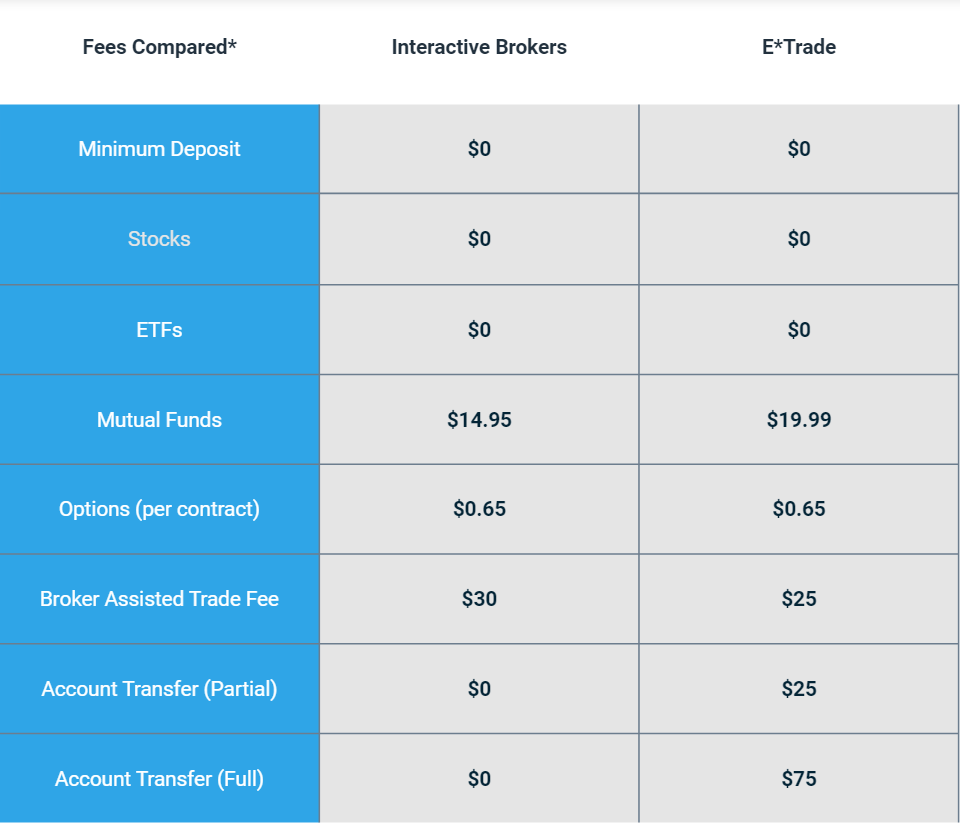

E*TRADE and Interactive Brokers are recognized as two of the leading platforms in the competitive landscape of online brokerage services, each distinguished by a range of capabilities and features tailored for different trading needs. This article seeks to present a detailed comparison between these two brokers, with a particular emphasis on their support for algorithmic trading—a domain that leverages complex algorithms and high-speed data processing to execute trades. As algorithmic trading continues to gain traction for its potential to efficiently manage trades and execute strategies at scale, the selection of a suitable broker becomes critical.

The forthcoming sections will cover various dimensions that are important to this decision-making process. Usability forms a foundational element, assessing how intuitive and accessible each platform is, especially for those setting up intricate trading algorithms. The range and sophistication of trading platforms and tools, including the support for APIs, custom scripts, and advanced charting features, offer insights into each broker’s technical capability to support algorithmic strategies effectively.



Additionally, we will review the opportunities these platforms provide through their access to various markets and trading instruments. A comprehensive range is essential for diversified algorithmic trading strategies. Complexity in order types and the efficiency of trading technology, such as routing and execution processes, are also compared to ascertain the depth and flexibility each platform provides for executing advanced trading strategies.

Further crucial considerations include the cost implications, given that fees can directly impact the profitability of algorithmic trading strategies. Factors such as tiered pricing structures and fees for executions hold significant weight. The availability of research resources and educational content also plays a role in evaluating each platform’s capability to support traders with varying levels of expertise in algorithmic trading.

Reliable customer support services, the security of the platforms, and diversity in account types offered are additional elements that contribute to the robustness of a trading environment. By systematically examining these aspects, traders will gain insights into how well E*TRADE and Interactive Brokers align with their algorithmic trading needs and help in making an informed choice based on their specific trading objectives and requirements.

## Table of Contents

## Usability

Usability is a crucial factor for traders, particularly in the field of algorithmic trading, where efficient navigation and functionality of trading platforms can significantly influence trading outcomes. Interactive Brokers (IB) and E*TRADE offer distinct platform experiences tailored to different user groups, reflecting their respective focuses within the trading community.

[Interactive Brokers](/wiki/interactive-brokers-api) provides a highly sophisticated trading environment through its Trader Workstation (TWS), which is designed for advanced traders who require a comprehensive suite of tools to execute complex trading strategies. TWS is known for its extensive array of features, including customizable dashboards, advanced charting, and a high level of detail in market data. Notably, TWS supports [algorithmic trading](/wiki/algorithmic-trading) by allowing users to design and implement custom trading strategies via its Application Programming Interface (API). This is particularly advantageous for those well-versed in programming and quantitative trading methods. However, the platform's complexity may present a learning curve for those unfamiliar with advanced trading functionalities.

On the other hand, E*TRADE prioritizes a more intuitive user experience with its interface, making it accessible to beginner and intermediate traders. The platform is designed to simplify the trading process, providing essential tools and features required for general trading activities. E*TRADE's platform is more approachable for users new to trading, with straightforward navigation and easy access to educational resources. While its algorithmic trading capabilities are not as robust as Interactive Brokers, E*TRADE offers basic tools that can be adapted for automated trading, albeit with some limitations.

Comparatively, when evaluating ease of use for algorithmic trading, Interactive Brokers holds an edge for traders who require depth in market analysis and the capability to execute intricate trading models. The breadth of functionality within TWS makes it possible to integrate advanced trading algorithms directly into the workflow. Conversely, E*TRADE's strength lies in its user-friendly design, catering to those who may not need extensive algorithmic tools but value ease and simplicity in regular trading activities.

Overall, the selection between these platforms concerning usability depends significantly on the trader's experience level and specific preferences for algorithmic trading capabilities. While Interactive Brokers caters to advanced users with its rich feature set, E*TRADE's straightforward interface appeals to less experienced traders seeking a seamless onboarding process.

## Trading Platforms and Tools

Interactive Brokers provides a wide array of tools tailored to support complex algorithmic trading strategies. Among its most notable offerings is the Trader Workstation (TWS), which is equipped with features that cater to advanced traders. TWS supports a comprehensive range of financial instruments and allows users to create intricate algorithmic strategies. The platform incorporates advanced capabilities such as algorithmic order types and a fully customizable trading interface, enabling traders to implement sophisticated trading logic.

A key advantage of Interactive Brokers is its robust API support, which allows traders to automate trading strategies using popular programming languages like Python. The Interactive Brokers API provides access to real-time market data, historical quotes, and account information, making it an ideal environment for developing and [backtesting](/wiki/backtesting) algorithmic trading models. Here is a simple example of using the Interactive Brokers Python API to fetch real-time data:

```python
from ib_insync import *

ib = IB()
ib.connect('127.0.0.1', 7497, clientId=1)

contract = Stock('AAPL', 'SMART', 'USD')
ib.qualifyContracts(contract)
bars = ib.reqHistoricalData(
    contract, endDateTime='', durationStr='1 D',
    barSizeSetting='5 mins', whatToShow='MIDPOINT', useRTH=True)

print(bars)
```

This script connects to Interactive Brokers' servers, retrieves data for Apple Inc. (AAPL), and displays historical price bars in increments of five minutes. Such flexibility is vital for traders who wish to build and execute custom algorithms.

E*TRADE, on the other hand, generally appeals more to traditional traders, but it does offer tools that can be configured for automated trading. E*TRADE provides its API interface which facilitates automated trading strategies, albeit with some limitations compared to Interactive Brokers. The platform enables users to access data and execute trades programmatically but is predominantly designed for those not requiring the extensive features necessary for sophisticated algorithmic trading.

E*TRADE also incorporates advanced charting tools, allowing traders to analyze market trends and patterns. These features, although useful for manual trading strategy formulation, lack the depth typical of platforms like TWS that cater to algorithmic precision.

In summary, Interactive Brokers stands out for traders seeking strong API integration and advanced trading platform capabilities. E*TRADE offers a more streamlined experience for those focusing on simpler algorithmic trading setups or who are transitioning from manual to automated trading. How traders adapt each platform's tools to their algorithmic requirements will largely depend on their trading style and technical expertise.

## Algorithmic Trading Opportunities

Algorithmic trading opportunities are significantly influenced by the breadth of markets and instruments that a brokerage platform can access. Interactive Brokers stands out for its comprehensive global reach, offering traders the chance to engage with over 135 markets across 33 countries. This expansive access is a crucial advantage for algorithmic traders who often seek diverse opportunities to execute their strategies effectively. The platform supports a plethora of asset classes including equities, options, futures, [forex](/wiki/forex-system), bonds, and more, which allows algorithmic traders to diversify their portfolios and hedge against risks.

Interactive Brokers' robust infrastructure supports trading across different time zones and markets, ensuring that traders can develop and implement global strategies without being confined to the limitations of a single market or asset class. This is particularly beneficial for algorithmic strategies that depend on asymmetric information or global macroeconomic trends. For instance, traders looking to capitalize on [arbitrage](/wiki/arbitrage) opportunities between New York and London markets can seamlessly execute their strategies using Interactive Brokers' platform.

In contrast, E*TRADE focuses primarily on the U.S. market, offering a more limited international scope. E*TRADE provides a range of financial products including stocks, options, ETFs, and futures within domestic borders. While this might suffice for traders focused on U.S.-centric strategies, it does impose restrictions on those looking to implement complex algorithmic strategies that require international market exposure. The limitation in geographic reach could hinder the exploration and exploitation of diverse market opportunities that are essential for sophisticated algorithmic models relying on global market diversity.

Therefore, when evaluating the two platforms, Interactive Brokers presents a more suitable environment for sophisticated algorithmic trading due to its vast market access and variety of instruments. This supports the development of advanced strategies that leverage global financial landscapes, offering a strategic edge to traders with an algorithmic focus.

## Order Types and Trading Technology

Interactive Brokers (IB) is renowned for its extensive range of order types, which are crucial for implementing complex algorithmic strategies. The platform's array of order types includes advanced options like market orders, limit orders, stop orders, stop-limit orders, trailing stop orders, and more sophisticated variants such as limit-if-touched, market-if-touched, and beyond. These order types enable algorithmic traders to execute intricate trading strategies with precision.

IB's SmartRouting technology further enhances its appeal to algorithmic traders by ensuring optimal order execution. SmartRouting automatically evaluates multiple market centers and dynamically routes orders to achieve the best execution by considering price, speed, and the likelihood of execution. This technology is especially beneficial in high-frequency trading environments, where optimal execution timing can significantly affect profitability.

Moreover, Interactive Brokers offers a robust suite of trading technologies, including its powerful application programming interfaces (APIs) that allow traders to design and deploy custom algorithmic strategies. The Trader Workstation (TWS) API supports multiple programming languages such as Python, Java, and C++, providing flexibility for traders to build tailored solutions. For example, using Python with the IB API, a trader could automate order submission based on specific conditions:

```python
from ibapi.client import EClient
from ibapi.contract import Contract
from ibapi.order import Order

class AlgoTrader(EClient):
    def __init__(self):
        EClient.__init__(self, self)

    def place_order(self):
        contract = Contract()
        contract.symbol = "AAPL"
        contract.secType = "STK"
        contract.exchange = "SMART"
        contract.currency = "USD"

        order = Order()
        order.action = "BUY"
        order.orderType = "LMT"
        order.totalQuantity = 100
        order.lmtPrice = 150.0

        self.placeOrder(self.nextOrderId(), contract, order)

def main():
    algo_trader = AlgoTrader()
    algo_trader.connect("127.0.0.1", 7496, clientId=1)
    algo_trader.run()

if __name__ == "__main__":
    main()
```

This flexibility ensures that Interactive Brokers is well-suited for traders seeking a comprehensive and adaptable trading platform for executing sophisticated algorithmic strategies.

In contrast, E*TRADE, while offering a variety of basic order types, does not provide the same depth of options necessary for intricate algorithmic trading. The platform supports fundamental order types such as market orders, limit orders, stop orders, and trailing stops, which are adequate for general trading applications but may not suffice for traders who require more advanced order types to execute complex strategies. Additionally, E*TRADE lacks advanced routing technology like SmartRouting, which means that it does not provide the same level of execution efficiency as Interactive Brokers.

In summary, while both platforms offer order types suited for general trading, Interactive Brokers stands out with its breadth of order options and advanced routing technology, making it a more favorable choice for algorithmic traders who depend on a wide range of order types and optimal order execution.

## Costs and Fees

Cost structures are a vital consideration for algorithmic trading, impacting profitability and strategy implementation. Interactive Brokers is frequently favored by active traders thanks to its competitive fee structures designed to accommodate high-frequency trading environments. This brokerage offers tiered pricing models, including a Fixed and a Tiered structure. 

The Fixed pricing plan charges a flat rate per share or per contract, which may be more predictable for certain trading strategies. On the other hand, the Tiered pricing plan, beneficial for high-[volume](/wiki/volume-trading-strategy) traders, bases its fees on trade volume. This means costs can decrease as the volume of trades increases, potentially leading to reduced expenses for traders executing numerous trades via algorithms.

Mathematically, the Tiered fee structure might be expressed as:

$$
\text{Total Cost} = \sum_{i=1}^{n} (P_i \times V_i)
$$

where $n$ is the number of trades, $P_i$ is the per-share price for the $i^{th}$ trade determined by the volume tier, and $V_i$ is the volume of shares in the $i^{th}$ trade. This model incentivizes higher trading volumes, aligning well with algorithmic strategies that rely on executing a large number of trades to capitalize on small price movements.

Conversely, E*TRADE's fee structure leans towards simplicity, offering straightforward commission rates that might appeal more to casual or less frequent traders. However, for algorithmic traders who engage in a large volume of transactions, these flat fees may not provide the cost advantage necessary for optimizing trading returns.

E*TRADE does provide zero-commission trades for online U.S. stock, [ETF](/wiki/etf-trading-strategies), and options trades, with a $0.65 fee per options contract, which might be more straightforward but less cost-efficient for traders executing extensive algorithmic trades compared to Interactive Brokers' volume-based discounts.

In summary, while Interactive Brokers' tiered pricing model can directly benefit high-frequency algorithmic traders through reduced costs as trading volume escalates, E*TRADE's more straightforward fee structure might not offer the same financial incentives for such trading strategies. For algorithmic traders focused on optimizing cost efficiency, particularly those engaging in vast numbers of trades, the nuanced pricing strategies of Interactive Brokers may provide a more compelling proposition.

## Research and Educational Resources

Access to quality research and educational resources is pivotal for the success of algorithmic traders. Interactive Brokers excels in providing extensive research tools and educational platforms that cater to professional traders. The firm offers an array of resources, including access to comprehensive market data and advanced analytics. One of the notable features is its Traders’ Academy, an online educational platform offering courses on algorithmic trading, among other financial topics. These courses are designed by experts and cover a breadth of material from basics to advanced trading strategies, making them suitable for professional traders seeking to enhance their skills and knowledge.

Interactive Brokers also supplies its users with in-depth research reports from leading financial analysts and a wide range of customizable reports and real-time analytics. These tools assist in performing sophisticated market analysis, which is crucial for the development and implementation of effective algorithmic trading strategies.

E*TRADE provides educational content that is robust but primarily targeted towards beginner and intermediate traders. Their education section includes webinars, articles, and basic trading tools that are adequate for those new to trading or looking to understand the fundamentals. While E*TRADE offers a comprehensive learning experience for less experienced users, advanced algorithmic trading modules are less prevalent. This gap can be a limitation for professional traders seeking in-depth education specific to complex algorithmic approaches.

Overall, while both platforms offer valuable research and educational resources, Interactive Brokers is notably more aligned with the needs of professional algorithmic traders due to its sophisticated offerings and educational depth. In contrast, E*TRADE is ideal for those at the beginning of their trading journey, laying a solid foundation but offering fewer resources for advanced algo trading.

## Customer Support and Service

Reliable customer support is a critical component for traders, particularly those engaged in algorithmic trading, where technical glitches can have significant financial repercussions. Interactive Brokers and E*TRADE both acknowledge the importance of providing strong customer support to assist their users effectively.

Interactive Brokers offers an extensive range of support options to accommodate traders' diverse needs. Customers can access support through multiple channels, including phone, email, and live chat. This array of communication methods ensures that users can receive timely assistance regardless of their preferred mode of contact. Additionally, Interactive Brokers has established a reputation for providing comprehensive support tailored to the specificities of algorithmic trading. Their support teams are well-versed in complex trading technologies and can assist with intricate issues such as API integration, scripting errors, or platform functionalities essential for algorithmic trading. Moreover, the firm provides a well-documented knowledge base and user guides, which can be invaluable resources for self-help, thereby reducing downtime and enhancing trading efficiency.

On the other hand, E*TRADE provides a robust level of customer service that meets the general needs of its user base. E*TRADE’s support is accessible via phone and email, ensuring that traders have avenues to seek assistance during trading hours. However, while E*TRADE’s support is praised for its quality and responsiveness, it may not offer the same depth of specialized assistance for algorithmic trading queries as Interactive Brokers. The focus tends to be on broader trading issues, and those seeking highly specialized support for advanced algorithmic configurations might find the resources limited compared to more tailored offerings. Nonetheless, E*TRADE's educational materials and tutorials do offer substantial guidance for novice and intermediate traders, potentially assisting those at the beginning stages of integrating algorithms into their trading strategies.

In conclusion, while both Interactive Brokers and E*TRADE provide reliable customer support services, the depth and specialization of assistance available for algorithmic traders distinguishes Interactive Brokers as the more equipped choice for traders who depend on complex systems.

## Security and Account Types

Both Interactive Brokers and E*TRADE prioritize high security standards, a critical aspect for safeguarding user accounts and protecting algorithmic trading systems. Security measures employed by these platforms include encryption protocols, two-[factor](/wiki/factor-investing) authentication (2FA), and rigorous monitoring systems to deter unauthorized access.

Interactive Brokers caters extensively to the needs of professional and institutional algorithmic traders by offering a broad spectrum of account types. These include individual accounts, joint accounts, trust accounts, and institutional accounts such as those for hedge funds, family offices, and proprietary trading groups. This variety provides an adaptable framework for managing diverse trading strategies and portfolios, ensuring traders can find an account type that suits their specific financial and operational requirements. Furthermore, Interactive Brokers facilitates sub-account creation, allowing professional traders to manage multiple strategies or clients efficiently under a unified structure.

E*TRADE, while providing a satisfactory range of account types, including individual and joint accounts, educational accounts, and retirement accounts, exhibits certain limitations when catering to professional algorithmic traders. The platform's primary focus lies in serving retail investors and less on tailored solutions for institutional-level services. Consequently, traders engaging in complex algorithmic strategies may find fewer options in terms of account customization and management when compared to Interactive Brokers.

In summary, both brokers maintain stringent security measures necessary for the protection of user accounts and algorithmic systems. However, Interactive Brokers surpasses E*TRADE in offering a diverse array of professional account types, thus accommodating the nuanced needs of institutional traders more effectively. E*TRADE remains a competent platform for general trading but may not meet all the specialized requirements of professional algorithmic trading entities.

## Conclusion

Both Interactive Brokers and E*TRADE offer distinct advantages for algorithmic trading, catering to different types of traders. Interactive Brokers stands out as a preferred option for advanced algorithmic traders, primarily due to its extensive market access, advanced trading tools, and its robust Trader Workstation (TWS). The platform supports complex algorithmic strategies through a wide range of order types and smart routing technology that ensures optimal execution. Its competitive cost structure also benefits high-frequency trading strategies, making it an attractive choice for professional traders seeking a comprehensive and sophisticated trading environment. Furthermore, Interactive Brokers provides a rich array of research tools and educational resources tailored for experienced traders, helping them refine and optimize their algorithmic trading strategies.

On the other hand, E*TRADE, with its user-friendly interface, caters to beginner and intermediate traders who value simplicity and ease of use. While its platform is robust enough for traditional trading, it might fall short for professional algo traders due to its limited support for advanced order types and less extensive international market access. E*TRADE's straightforward fee structure is suitable for general trading but may not offer the same cost efficiencies for traders executing a large volume of algorithmic trades.

Ultimately, the choice between Interactive Brokers and E*TRADE will largely depend on the individual requirements and goals of the trader. Traders seeking advanced tools, broad market access, and who are comfortable navigating a more complex platform may find Interactive Brokers to be a better fit. In contrast, those who prioritize ease of use and are in the early stages of exploring algorithmic trading might prefer E*TRADE. Each platform has its strengths, and the decision should align with the trader's specific needs, experience level, and strategic objectives.

## References & Further Reading

[1]: Bergstra, J., Bardenet, R., Bengio, Y., & Kégl, B. (2011). ["Algorithms for Hyper-Parameter Optimization."](https://papers.nips.cc/paper/4443-algorithms-for-hyper-parameter-optimization) Advances in Neural Information Processing Systems 24.

[2]: ["Advances in Financial Machine Learning"](https://www.amazon.com/Advances-Financial-Machine-Learning-Marcos/dp/1119482089) by Marcos Lopez de Prado

[3]: ["Evidence-Based Technical Analysis: Applying the Scientific Method and Statistical Inference to Trading Signals"](https://www.amazon.com/Evidence-Based-Technical-Analysis-Scientific-Statistical/dp/0470008741) by David Aronson

[4]: ["Machine Learning for Algorithmic Trading"](https://github.com/stefan-jansen/machine-learning-for-trading) by Stefan Jansen

[5]: ["Quantitative Trading: How to Build Your Own Algorithmic Trading Business"](https://www.amazon.com/Quantitative-Trading-Build-Algorithmic-Business/dp/1119800064) by Ernest P. Chan