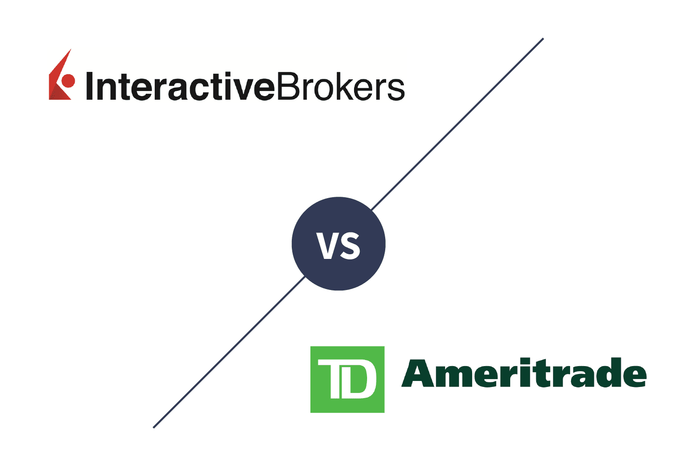

The landscape of online brokerage has undergone notable changes, with Interactive Brokers (IB) and TD Ameritrade (TDA) emerging as prominent figures. This article aims to present a comprehensive comparison of Interactive Brokers and TD Ameritrade, specifically focusing on algorithmic trading in 2024. Algorithmic trading represents a crucial component for many investors, offering the potential to maximize returns by utilizing automated trading strategies based on pre-defined criteria. Understanding these strategies is essential for investors striving to optimize their brokerage potential.

In addition to exploring the strengths and specific characteristics of each broker, this article will aid potential investors in making well-informed decisions. The analysis extends to a detailed assessment of their trading platforms, fee structures, customer service, and educational resources. These elements are vital for investors evaluating their options, as they provide insight into the user experience and potential cost benefits associated with each broker. Through this examination, investors can align their brokerage choice with their individual trading preferences and strategic objectives.



## Table of Contents

## Overview of Interactive Brokers

Interactive Brokers, established in 1978, is a prominent entity in the financial services industry, widely recognized for its cutting-edge trading technology and extensive global reach. The company prides itself on being at the forefront of providing a broad array of trading tools with competitive pricing structures. This positions Interactive Brokers as a top-tier choice for both novice and seasoned investors looking for a versatile trading platform.

One of the standout features of Interactive Brokers is its Trader Workstation (TWS), a sophisticated platform renowned for facilitating algorithmic trading. TWS is equipped with a variety of advanced features that allow users to conduct complex trades efficiently. The platform supports a broad spectrum of algorithmic trading strategies, offering traders the flexibility to design and execute customized algorithms. This is particularly beneficial for those who wish to streamline their trading processes and mitigate human error.

Furthermore, Interactive Brokers offers its clientele access to international markets, providing an opportunity to trade a diverse range of asset classes. The platform supports trading in stocks, options, futures, forex, bonds, and funds across over 150 markets worldwide. This global access enables investors to diversify their portfolios and capitalize on opportunities outside of their domestic markets.

Interactive Brokers also places a heavy emphasis on cost-effectiveness. Their pricing model is designed to provide low-cost trades that are competitive within the industry. With features like IBKR Lite, which offers commission-free trading on US stocks and ETFs, the broker strives to make trading accessible to a wider audience without compromising on quality or breadth of service.

In conclusion, [Interactive Brokers](/wiki/interactive-brokers-api) stands out as a leader in the financial brokerage industry due to its advanced technology, diverse market access, and cost-effective pricing. It presents an appealing option for investors aiming to harness [algorithmic trading](/wiki/algorithmic-trading)'s potential while accessing a comprehensive suite of trading tools and global markets.

## Overview of TD Ameritrade

TD Ameritrade, established in 1975, has built a reputation as a prominent brokerage firm in the United States. Following its acquisition by Charles Schwab in 2020, it continues to stand as a strong entity within the industry. The brokerage is particularly recognized for its comprehensive educational resources, which serve as a significant draw for new and intermediate traders seeking to enhance their market understanding and trading skills.

The thinkorswim platform, a standout offering from TD Ameritrade, is integral to its success. This platform provides a thorough suite of tools designed for technical analysis and strategy testing. It is equipped with advanced charting capabilities, real-time data, and a wide array of indicators. As a result, thinkorswim is frequently praised for empowering traders to develop, test, and refine complex trading strategies effectively.

While TD Ameritrade's primary focus remains on the U.S. market, it still affords clients access to a variety of investment opportunities, ranging from stocks and ETFs to options, futures, and [forex](/wiki/forex-system). This diversity ensures that traders can create well-rounded portfolios tailored to their individual investment goals.

TD Ameritrade is also lauded for its exceptional customer service. The firm provides users with numerous contact options, ensuring assistance is readily available. Coupled with an easy-to-navigate platform interface, these services contribute to a seamless user experience, enhancing both novice and seasoned traders' engagement with the tools provided.

Through these attributes, TD Ameritrade effectively positions itself as a robust choice for traders at various stages of their investment journey, underlining its continuing significance in the brokerage landscape.

## Trading Platforms

Interactive Brokers' Trader Workstation (TWS) offers a robust platform designed for serious traders, particularly those interested in algorithmic trading. TWS provides a highly customizable interface, accommodating various trading styles and preferences. One of the critical strengths of TWS is its comprehensive Application Programming Interface (API), which supports multiple programming languages, including Python, Java, and C++. This feature empowers traders to develop and implement custom trading algorithms, offering extensive flexibility to meet specific trading strategies.

The TWS platform is particularly beneficial for traders who need access to a wide array of global markets. Its international reach makes it a preferred choice for users looking for a broad spectrum of trading opportunities. Furthermore, TWS's paper trading feature is invaluable, allowing traders to test and refine their algorithms or strategies in a risk-free environment. This capability supports users in gaining confidence and honing their skills before engaging in live trading.

On the other hand, TD Ameritrade's thinkorswim is renowned for its user-friendly interface, making it especially appealing to beginners. Despite its simplicity, thinkorswim doesn't compromise on offering advanced features, particularly for options and futures trading. It provides a comprehensive suite of tools designed for technical analysis and strategy testing, making it a versatile platform for traders at different experience levels.

Thinkorswim also facilitates paper trading, offering traders the chance to experiment with strategies and assess potential outcomes without the pressure of financial loss. This feature is crucial for those new to trading or looking to explore new strategies in a safe environment. While thinkorswim is particularly favored by beginners due to its intuitive design, it is also robust enough to satisfy the needs of more experienced traders looking for detailed analysis tools.

In summary, both Interactive Brokers' TWS and TD Ameritrade's thinkorswim platforms offer vital functionalities to support algorithmic trading. TWS excels in offering a customizable and technically advanced environment suited to international traders and those developing proprietary algorithms. Thinkorswim provides a more approachable interface with strong capabilities in options and futures, appealing to beginners and skilled traders alike. Both platforms' support for paper trading underscores their commitment to fostering traders' development in a safe and dynamic space.

## Fees and Commissions

Interactive Brokers offers three distinct pricing tiers, which cater to different types of investors and trading activities. The IBKR Lite plan provides zero-commission trading on U.S. stocks and ETFs, making it attractive for retail investors looking to minimize transaction costs. In contrast, the IBKR Pro plan offers a tiered or fixed pricing structure that can lead to significant savings for high-[volume](/wiki/volume-trading-strategy) traders. The tiered pricing system provides lower rates based on trading volume, while the fixed pricing offers predictability with a set per-share rate, which can be calculated using straightforward math formulas or programming to determine potential savings based on anticipated trading volumes.

TD Ameritrade also offers commission-free trading on U.S. stocks and ETFs, aligning with industry trends toward no-fee transactions that benefit everyday investors. However, in the options trading space, TD Ameritrade charges a flat fee per contract, impacting the overall cost for frequent options traders. This cost structure needs to be factored in when developing trading strategies that involve options. 

Both Interactive Brokers and TD Ameritrade provide competitive margin rates for those engaging in leveraged trading, but Interactive Brokers generally offers lower rates, which can translate into significant cost savings for those who maintain margin accounts over time. This pricing advantage can be a decisive [factor](/wiki/factor-investing) for margin traders, notably those engaging in frequent or large-margin transactions.

To illustrate, consider a high-volume trader evaluating the cost benefits between IBKR Pro's tiered pricing and TD Ameritrade's flat-fee structure for a specific trading volume, which could be calculated via Python:

```python
def calculate_ibkr_savings(volume, tiered_rate, fixed_rate):
    tiered_cost = volume * tiered_rate
    fixed_cost = volume * fixed_rate
    savings = fixed_cost - tiered_cost
    return savings

volume = 10000  # example volume of shares
tiered_rate = 0.0035  # hypothetical tiered rate per share
fixed_rate = 0.005  # hypothetical fixed rate per share

savings = calculate_ibkr_savings(volume, tiered_rate, fixed_rate)
print(f"Potential Savings with IBKR Tiered Pricing: ${savings}")
```

This example demonstrates how traders can leverage cost calculations to evaluate Interactive Brokers’ pricing advantages in large-scale operations, reinforcing its appeal to high-volume market participants.

## Research and Education

Interactive Brokers provides a wide array of research tools and educational resources tailored to both novice and seasoned traders. Central to these offerings is its online university, which encompasses webinars covering diverse trading topics. These educational resources are designed to build foundational knowledge for beginners while also addressing complex trading strategies that interest experienced investors. The broker's extensive research tools provide significant value, helping users make informed decisions through detailed market analysis, robust financial models, and expert insights.

On the other hand, TD Ameritrade is renowned for its comprehensive investor education system, which accommodates traders at all experience levels. The platform offers an impressive range of dedicated courses and live events that cover an exhaustive list of trading and investing topics. Important to its educational offerings is the use of real-world scenarios and practical trading exercises, which facilitate learning. The thinkorswim platform further enhances this educational experience. Through its paper trading feature, users can practice and refine their trading strategies without financial risk. This feature allows for effective back-testing strategies in a simulated environment, giving investors the confidence to implement these strategies in real market conditions.

Overall, both brokers offer robust educational resources, though Interactive Brokers focuses on self-paced learning through webinars and online courses, while TD Ameritrade provides a more interactive approach with live events and practical exercises.

## Customer Support and Security

Both Interactive Brokers and TD Ameritrade offer 24/7 customer support, recognizing the importance of accessibility for their clients. However, TD Ameritrade tends to have quicker response times, a feature that has gained appreciation from customers who prioritize speed in assistance. This is supported by their vast network of support centers and a focus on providing direct human interaction, whether through phone or online chat.

Interactive Brokers has made strides in enhancing its customer service with the integration of AI-driven support. This system is particularly proficient in handling preliminary inquiries, efficiently addressing basic questions and identifying the need for human intervention when complex issues arise. This approach allows for a more streamlined customer service experience, often leading to faster resolution times for simple queries.

When it comes to security, both brokers adhere to industry standards, ensuring client accounts are well-protected. A key component of their security measures is two-factor authentication (2FA), which adds an additional layer of verification to safeguard accounts against unauthorized access. This practice is instrumental in maintaining high security, particularly with the increasing prevalence of cyber threats.

TD Ameritrade stands out with more comprehensive account protection limits compared to Interactive Brokers. This includes insurance coverage beyond the standard levels typically offered, providing clients with added peace of mind. Such protection limits serve as a significant consideration for investors, especially those managing substantial portfolios, as they ensure a higher level of asset security in the event of unforeseen incidents. 

Overall, both Interactive Brokers and TD Ameritrade deliver robust customer support and secure trading environments, yet their nuances in customer service speed and account protection may sway investors based on their individual priorities.

## Conclusion

Interactive Brokers and TD Ameritrade offer distinct advantages tailored to various trading needs and preferences. Interactive Brokers stands out with its sophisticated tools designed for advanced users and international traders. Their attractive pricing models, including tiered pricing for high-volume trades, make them a preferred choice for those looking to engage in complex trading strategies across global markets. 

On the other hand, TD Ameritrade is particularly appealing to beginners and investors prioritizing comprehensive educational resources. With its robust investor education system, including dedicated courses, webinars, and live events, TD Ameritrade ensures that traders at all experience levels have the resources necessary to succeed. Its user-friendly thinkorswim platform provides an intuitive interface for newcomers, making it an excellent entry point for those new to trading.

Deciding between Interactive Brokers and TD Ameritrade largely hinges on individual priorities. The desired trading experience, the level of educational support required, and cost considerations are critical factors to weigh. While Interactive Brokers may suit those who prioritize advanced tools and international market access, TD Ameritrade is ideal for those who value educational resources and an easier on-ramp to trading.

Ultimately, investors should align their choice with their trading preferences and strategic goals. By contemplating their specific needs and objectives—whether they are sophisticated trading strategies, educational development, or cost-efficiency—investors can make informed decisions that best align with their financial aspirations.

## References & Further Reading

[1]: Bergstra, J., Bardenet, R., Bengio, Y., & Kégl, B. (2011). ["Algorithms for Hyper-Parameter Optimization."](https://papers.nips.cc/paper/4443-algorithms-for-hyper-parameter-optimization) Advances in Neural Information Processing Systems 24.

[2]: ["Advances in Financial Machine Learning"](https://www.amazon.com/Advances-Financial-Machine-Learning-Marcos/dp/1119482089) by Marcos Lopez de Prado

[3]: ["Evidence-Based Technical Analysis: Applying the Scientific Method and Statistical Inference to Trading Signals"](https://www.amazon.com/Evidence-Based-Technical-Analysis-Scientific-Statistical/dp/0470008741) by David Aronson

[4]: ["Machine Learning for Algorithmic Trading"](https://github.com/stefan-jansen/machine-learning-for-trading) by Stefan Jansen

[5]: ["Quantitative Trading: How to Build Your Own Algorithmic Trading Business"](https://www.amazon.com/Quantitative-Trading-Build-Algorithmic-Business/dp/1119800064) by Ernest P. Chan