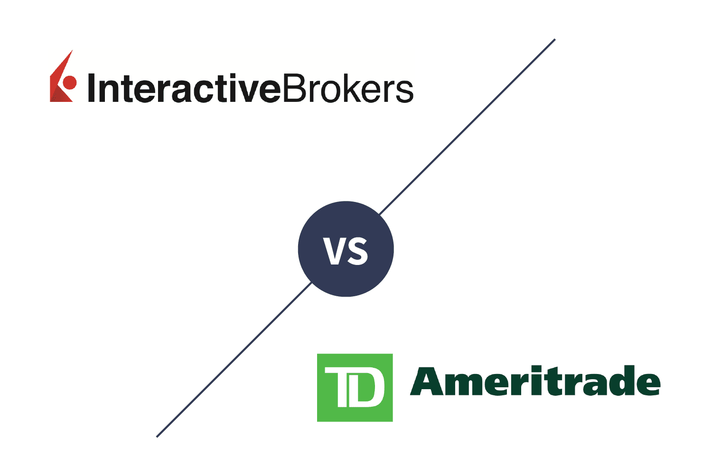

## Table of Contents

## What are Interactive Brokers and TD Ameritrade?

Interactive Brokers is a brokerage firm that lets people buy and sell stocks, options, futures, and other investments. It's known for its low fees and powerful trading tools. Many active traders and professional investors use it because it offers a lot of features and can trade in many different markets around the world. 

TD Ameritrade is another brokerage firm that helps people invest in stocks, options, ETFs, and more. It's popular because it has user-friendly tools and good customer support. TD Ameritrade is often recommended for beginners because it offers a lot of educational resources and easy-to-use platforms. It also has low fees, making it a good choice for people just starting to invest.

## What are the account minimums for Interactive Brokers and TD Ameritrade in 2024?

For Interactive Brokers in 2024, the account minimum depends on the type of account you open. If you open a standard individual or joint account, there is no minimum amount required to open the account. However, if you want to use their more advanced trading features, like margin trading, you'll need to deposit at least $2,000. For accounts meant for professional traders, like their "Pro" account, the minimum is higher at $10,000.

For TD Ameritrade in 2024, there is no minimum amount needed to open a standard brokerage account. This makes it easy for anyone to start investing, even if you only have a small amount of money. However, if you want to open certain types of specialized accounts, like a robo-advisor account, you might need to meet a higher minimum, but for the basic accounts, there's no minimum requirement.

## How do the fee structures compare between Interactive Brokers and TD Ameritrade?

Interactive Brokers has a fee structure that can be good for people who trade a lot. They charge a small fee for each trade, usually around $0.005 per share for stocks, with a minimum of $1 per trade. This means if you buy 100 shares, you'll pay $1, no matter the price of the shares. For options, they charge $0.65 per contract. They also have monthly fees if your account balance is low, but they waive this fee if you do enough trading each month.

TD Ameritrade, on the other hand, is easier to understand because they have a flat fee for many types of trades. They don't charge anything for buying or selling stocks and ETFs. For options, they charge $0.65 per contract, just like Interactive Brokers. There are no monthly fees with TD Ameritrade, so it might be better if you don't trade very often or if you have a smaller account balance.

## What types of investment products can you access through Interactive Brokers and TD Ameritrade?

Interactive Brokers lets you invest in many different things. You can buy and sell stocks, options, and exchange-traded funds (ETFs). They also let you trade futures, forex, and bonds. If you want to invest in other countries, Interactive Brokers is good because they let you trade in markets all over the world. They even have mutual funds and some types of cryptocurrencies you can invest in.

TD Ameritrade also offers a lot of choices for investing. You can buy stocks, options, and ETFs just like with Interactive Brokers. They also have mutual funds, bonds, and futures. TD Ameritrade lets you trade forex too, but not as many types as Interactive Brokers. They don't offer direct trading in cryptocurrencies, but you can invest in crypto through some of their mutual funds or ETFs.

## How user-friendly are the trading platforms of Interactive Brokers and TD Ameritrade for beginners?

Interactive Brokers can be a bit hard for beginners to use. Their main trading platform, called Trader Workstation (TWS), has a lot of tools and options that might be confusing if you're just starting out. It's made more for people who trade a lot and know a lot about investing. They do have a simpler version called Client Portal, but even that might take some time to get used to. If you're new to investing, you might find it takes a while to feel comfortable using Interactive Brokers.

TD Ameritrade is much easier for beginners. Their main platform, thinkorswim, is powerful but also has a user-friendly interface that's easy to learn. They also have another platform called TD Ameritrade Mobile, which is simple and great for people who are just starting to invest. TD Ameritrade also offers a lot of educational resources and guides to help you understand how to use their platforms and start investing. So, if you're new to investing, TD Ameritrade is likely to be more comfortable and easier to use.

## What advanced trading tools does Interactive Brokers offer compared to TD Ameritrade?

Interactive Brokers has a lot of advanced tools that are great for people who trade a lot and know what they're doing. Their main platform, Trader Workstation (TWS), has things like real-time data, lots of different order types, and the ability to trade in many markets around the world. You can also use their tools to make your own trading strategies and set up alerts to help you make smart trading choices. They even have a feature called "Algo Trading" where you can use computer programs to trade automatically based on rules you set.

TD Ameritrade also has advanced tools, but they might not be as detailed as what Interactive Brokers offers. Their main platform, thinkorswim, has good tools for charting and analyzing the market, and it lets you use different order types too. You can set up custom scans to find trading opportunities and use their paper trading feature to practice without risking real money. While thinkorswim is powerful, it's often seen as a bit easier to use than Interactive Brokers' TWS, which might be better for people who are getting more advanced but aren't experts yet.

## How do the mobile trading apps of Interactive Brokers and TD Ameritrade compare in terms of functionality and user experience?

Interactive Brokers' mobile app, called IBKR Mobile, is good for people who trade a lot and want to do it on the go. The app lets you trade stocks, options, and other things from anywhere. It has a lot of the same tools as their main platform, like real-time data and different order types. But, it can be a bit hard to use because there are so many options and features. If you're new to trading, you might find it takes some time to get used to. But if you know what you're doing, you can do a lot with this app.

TD Ameritrade's mobile app, called thinkorswim Mobile, is easier to use and might be better for beginners. It has a simple design that's easy to understand, and you can do things like trade stocks and options, check your account, and get news and research. The app also has good tools for charting and analyzing the market, but they're not as complicated as Interactive Brokers'. If you're just starting to trade or want an app that's easy to use, thinkorswim Mobile is a good choice. It's not as packed with features as IBKR Mobile, but it's simpler and more friendly for people who are still learning.

## What are the margin rates and borrowing costs at Interactive Brokers and TD Ameritrade?

At Interactive Brokers, the margin rates and borrowing costs change depending on how much money you have in your account. If you have a smaller account, you might pay more to borrow money. For example, if you have less than $100,000, you might pay around 6% to 7% interest. But if you have more money, like over $1 million, the rate can be as low as 4% or even less. They also have different rates for different types of investments, like stocks or options, so it's good to check their website for the exact numbers.

At TD Ameritrade, the margin rates are a bit easier to understand because they use a set of fixed rates based on the size of your account. If you have less than $10,000, you might pay around 12.5% interest. But if you have more money, the rate goes down. For example, if you have between $25,000 and $49,999, the rate is around 11.5%. And if you have over $1 million, it can be as low as 7.5%. Just like Interactive Brokers, the rates can be different for different types of investments, so it's a good idea to look at their website for the details.

## How do the research and analysis tools provided by Interactive Brokers and TD Ameritrade differ?

Interactive Brokers has a lot of research and analysis tools that are really helpful for people who know a lot about trading. They have things like real-time market data, advanced charting tools, and the ability to look at different markets around the world. You can also use their tools to do your own research and analysis, like making custom screens to find trading opportunities. But because there are so many tools, it might be hard for beginners to understand everything right away. If you're an advanced trader, you'll like how much information and control you get with Interactive Brokers.

TD Ameritrade also has good research and analysis tools, but they're often easier to use and understand. Their platform, thinkorswim, has tools for charting and analyzing the market that are powerful but not too complicated. They also give you a lot of educational resources, like videos and guides, to help you learn how to use their tools and make smart trading decisions. If you're new to trading or just want something that's easy to use, TD Ameritrade's tools will be more comfortable for you. They might not have as many advanced options as Interactive Brokers, but they're great for people who are still learning.

## What customer support options are available at Interactive Brokers and TD Ameritrade?

Interactive Brokers offers customer support through phone, email, and live chat. You can call them during their business hours, which are different depending on where you live. They also have an online help center with a lot of information and answers to common questions. But, some people say it can be hard to get quick help from Interactive Brokers because they have so many customers. If you have a simple question, you might be able to find the answer online, but for more complicated problems, you might need to wait a bit.

TD Ameritrade has good customer support that's easy to use. You can call them, send an email, or use live chat to get help. They also have a lot of educational resources like videos and guides to help you learn about investing. People say that TD Ameritrade's customer support is friendly and helpful, and you usually don't have to wait too long to get an answer. If you're new to investing, you might like how easy it is to get help from TD Ameritrade.

## How do the educational resources and investor tools compare between Interactive Brokers and TD Ameritrade?

Interactive Brokers has a lot of educational resources, but they might be a bit hard for beginners to understand. They have things like webinars, trading guides, and a learning center where you can read about different types of investments. But because Interactive Brokers is made more for people who know a lot about trading, their educational stuff can be pretty detailed. If you're new to investing, you might find it takes some time to get through all the information. They also have tools like paper trading, where you can practice trading without using real money, which can be helpful for learning.

TD Ameritrade is really good for people who are just starting to invest because they have a lot of easy-to-understand educational resources. They have videos, articles, and even live events where you can learn about investing. Their platform, thinkorswim, comes with a lot of tools that are easy to use, like simple charts and guides that help you make trading decisions. TD Ameritrade also has a paper trading feature, which is great for beginners to practice without risking real money. If you're new to investing, you'll probably find TD Ameritrade's educational resources and tools easier to use and more helpful.

## What are the regulatory and security measures in place at Interactive Brokers and TD Ameritrade in 2024?

In 2024, Interactive Brokers follows strict rules to keep your money safe. They are regulated by the SEC and FINRA in the U.S., and they also follow rules in other countries where they work. They use strong security measures like two-factor authentication to make sure only you can get into your account. They also keep your money in separate accounts from their own money, so if something bad happens to the company, your money is still safe. They have insurance from the SIPC, which can protect up to $500,000 of your money if the company goes bankrupt.

TD Ameritrade also has strong rules and security measures in place. They are regulated by the SEC and FINRA too, and they follow all the rules to keep your investments safe. They use things like two-factor authentication and encryption to protect your account. Like Interactive Brokers, they keep your money in separate accounts, so it's safe even if something happens to the company. They also have SIPC insurance, which can cover up to $500,000 if something goes wrong. Both companies take a lot of steps to make sure your money and personal information are secure.

## References & Further Reading

[1]: Bergstra, J., Bardenet, R., Bengio, Y., & Kégl, B. (2011). ["Algorithms for Hyper-Parameter Optimization."](https://papers.nips.cc/paper/4443-algorithms-for-hyper-parameter-optimization) Advances in Neural Information Processing Systems 24.

[2]: ["Advances in Financial Machine Learning"](https://www.amazon.com/Advances-Financial-Machine-Learning-Marcos/dp/1119482089) by Marcos Lopez de Prado

[3]: ["Evidence-Based Technical Analysis: Applying the Scientific Method and Statistical Inference to Trading Signals"](https://www.amazon.com/Evidence-Based-Technical-Analysis-Scientific-Statistical/dp/0470008741) by David Aronson

[4]: ["Machine Learning for Algorithmic Trading"](https://github.com/stefan-jansen/machine-learning-for-trading) by Stefan Jansen

[5]: ["Quantitative Trading: How to Build Your Own Algorithmic Trading Business"](https://www.amazon.com/Quantitative-Trading-Build-Algorithmic-Business/dp/1119800064) by Ernest P. Chan