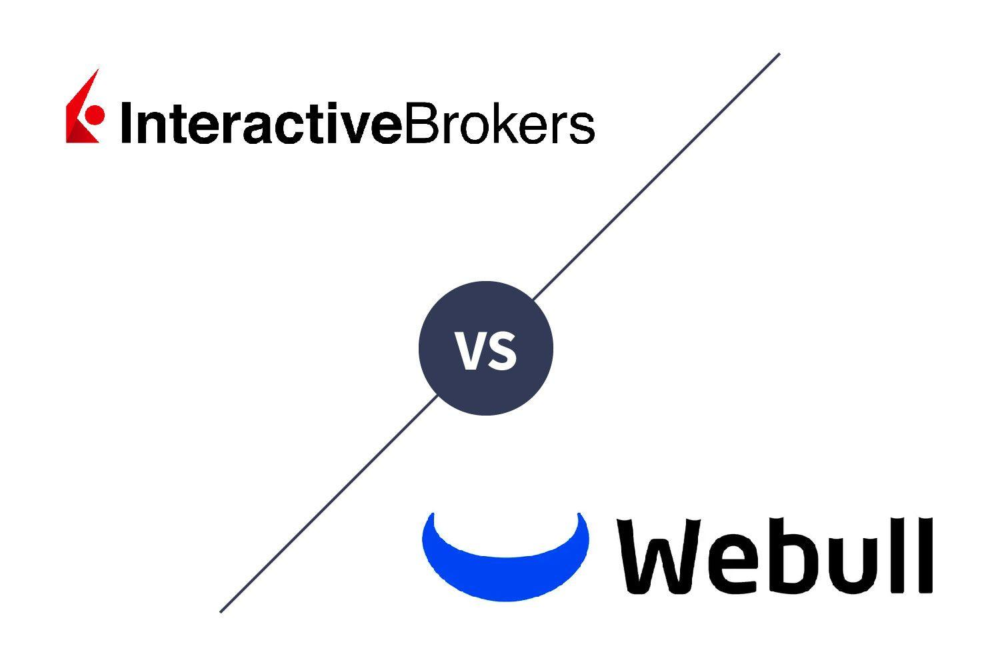

The online brokerage landscape in 2024 is characterized by significant advancements in technology and a wider adoption of algorithmic trading among individual investors. As trading technology becomes more sophisticated, individual investors now have access to tools and strategies that were once exclusive to institutional traders. Algorithmic trading, which involves using pre-programmed sequences to execute trades at optimal conditions, has become increasingly important. This is due to its potential for improving trading efficiency and profitability by capitalizing on market opportunities with speed and precision.

Interactive Brokers and Webull stand out as two prominent trading platforms that cater to both casual and professional traders. Interactive Brokers, with its long-standing reputation in the industry, offers a comprehensive range of trading services and is known for its robust technological infrastructure. It targets sophisticated traders with its extensive range of trading tools and competitive pricing. Webull, on the other hand, has gained popularity among younger generations for its user-friendly interface and commission-free trading options, appealing to a broader audience, including newcomers to the trading scene.



This article aims to provide a detailed comparison between Interactive Brokers and Webull specifically in the context of algorithmic trading. This comparison will cover several key aspects such as the algorithmic trading features provided by each platform, the associated fees and cost structures, security and reliability measures, integration capabilities including API access, and user feedback. By examining these factors, traders can better understand which platform may suit their trading strategies and preferences. Through this comparative analysis, the article intends to assist both novice and experienced traders in making informed decisions regarding the suitability of Interactive Brokers or Webull for their algorithmic trading endeavors.

## Table of Contents

## Overview of Interactive Brokers

Interactive Brokers, founded in 1978 by Thomas Peterffy, has established itself as a leading entity in the brokerage industry. Based in Greenwich, Connecticut, Interactive Brokers (IBKR) is renowned for its extensive range of trading services and technological innovations, serving both institutional and individual investors globally. The firm has consistently received accolades for its competitive fee structures and comprehensive platform offerings, making it a preferred choice among seasoned traders and financial professionals.

Interactive Brokers offers a multitude of features and services that cater to the diverse needs of traders. These include access to over 135 markets in 33 countries, the ability to trade stocks, options, futures, forex, bonds, and funds worldwide from a single integrated account, and competitive pricing with low commissions starting at $0 for US-listed stocks and ETF trades. The platform also provides extensive research and analysis tools, which are invaluable for informed decision-making in trading activities.

The technological infrastructure of Interactive Brokers is robust and efficient, designed to support high-frequency trading and large trading volumes. Its flagship platform, Trader Workstation (TWS), is equipped with advanced trading tools, including customizable dashboards, real-time monitoring, and sophisticated charting options. TWS supports algorithmic trading through its Algo Trading feature, allowing traders to automate strategies using the platform’s proprietary scripting language, Interactive Brokers API, which supports programming languages such as Python, Java, and C++. This enables traders to execute complex strategies with minimal manual intervention, optimizing trading performance and minimizing errors.

For algorithmic traders, [Interactive Brokers](/wiki/interactive-brokers-api) offers a powerful suite of tools. Users can create, test, and deploy algorithms using the Python API, which provides extensive documentation and support for traders to develop their own custom strategies. The platform also offers [backtesting](/wiki/backtesting) capabilities, allowing users to simulate the performance of their algorithms against historical market data to validate the efficacy of their trading approaches before committing capital.

User experience on the Interactive Brokers platform is generally positive, with the software designed to accommodate both novice and experienced traders. The firm provides 24/7 customer support through various channels, including phone, email, and chat, ensuring that users can obtain assistance whenever needed. Additionally, Interactive Brokers supports a comprehensive online knowledge base and educational resources, assisting traders in maximizing the platform's features and refining their trading skills.

## Overview of Webull

Webull is a prominent financial services company that has gained substantial traction among individual investors since its inception. Originally founded in 2017, Webull has established itself as a significant player in the financial markets, particularly appealing to new investors and traders due to its user-friendly approach and zero-commission trading structure. The platform's rapid growth and adoption can be attributed to its focus on mobile app usability and the provision of extensive tools and features tailored to retail investors.

One of Webull’s key selling points is its cost-effective trading model. Unlike many traditional brokerage firms, Webull offers commission-free trading on stocks, exchange-traded funds (ETFs), and options. This model has been instrumental in attracting a younger demographic seeking to minimize their trading costs while accessing sophisticated trading tools. In addition to equities and options, Webull provides trading opportunities in cryptocurrencies, further expanding its appeal to tech-savvy traders interested in digital assets.

Technologically, Webull is built on an advanced platform that offers a wide array of tools intended to enhance the trading experience. These include comprehensive charting capabilities with a multitude of technical indicators, customizable watchlists, and access to real-time market data. The platform supports extended trading hours which allows users to capitalize on pre-market and after-hours trading opportunities. Webull’s mobile application is particularly noted for its intuitive design, making complex trading tools accessible to users without a steep learning curve.

Webull has also begun expanding into [algorithmic trading](/wiki/algorithmic-trading) capabilities, although this feature remains more nascent compared to established players like Interactive Brokers. The platform offers basic tools for traders interested in building automated trading strategies, though it does not yet match the breadth of integrated algorithmic services seen on more specialized platforms. Webull's ventures into algo trading are likely to evolve, potentially positioning it more competitively in this space in the coming years.

User experience on Webull is generally favorable, with many users praising the platform for its ease of use and extensive educational resources. The community aspect is bolstered by an active user base that shares insights and strategies through Webull’s built-in social features. Customer feedback highlights Webull’s efficient interface and the accessibility of its mobile application as strong advantages, although some advanced traders may find the platform lacks the depth of features present in more traditional, desktop-first trading environments.

Overall, Webull has carved out a notable position in the online brokerage market by combining zero-commission trading with a robust set of tools accessible via a streamlined mobile experience. Its commitment to expanding tools for algorithmic trading suggests a strategic focus on capturing a more diverse segment of traders as the platform continues to grow.

## Algorithmic Trading Features Comparison

Interactive Brokers and Webull both offer distinct sets of features for algorithmic trading, each catering to different types of traders. This section investigates into a detailed comparison of their capabilities.

Interactive Brokers provides a more advanced suite of algorithmic trading tools and customization options. Their platform supports a wide range of algorithms, including execution algorithms, direct market access, and the ability to develop proprietary strategies using the Trader Workstation (TWS) API. This flexibility is particularly beneficial for experienced traders who wish to adjust parameters to fit specific trading strategies. Users can code in multiple languages, including Python, Java, and C++, which provides further customizability. For instance, using Python, traders can leverage libraries like `pandas` and `numpy` to develop and test trading algorithms efficiently. An example of a simple moving average crossover strategy can be implemented using Python as follows:

```python
import pandas as pd

# Load historical market data
data = pd.read_csv('historical_data.csv')

# Calculate moving averages
data['SMA_50'] = data['Close'].rolling(window=50).mean()
data['SMA_200'] = data['Close'].rolling(window=200).mean()

# Generate signals
data['Signal'] = 0
data.loc[data['SMA_50'] > data['SMA_200'], 'Signal'] = 1
data.loc[data['SMA_50'] < data['SMA_200'], 'Signal'] = -1

# Display signals
print(data[['Date', 'Signal']].dropna())
```

Webull, on the other hand, is more suitable for newer algo traders, given its user-friendly interface and intuitive design. While it doesn’t match the vast customization options of Interactive Brokers, Webull offers essential algorithmic trading functionalities like conditional orders and simple automated strategies. The platform supports basic scripting through its API, with Python also being a primary language for integration. However, the learning curve is notably less steep compared to Interactive Brokers, making it easier for novice traders to start developing and executing simple strategies.

When it comes to trading strategy examples, Interactive Brokers supports a wider array of complex strategies such as pairs trading, [market making](/wiki/market-making), and statistical [arbitrage](/wiki/arbitrage). Webull primarily focuses on more straightforward strategies, like stop-loss or limit orders, that cater to less seasoned traders needing fewer technicalities.

Both platforms offer backtesting and simulation tools, but here Interactive Brokers has a clear advantage. With its Paper Trading account, Interactive Brokers allows users to simulate trades using real market conditions without risking actual capital. This feature is critical for refining strategies before live deployment. Moreover, Interactive Brokers excels with its built-in backtesting capabilities supported by historical data analysis, providing traders with a robust environment for evaluating the performance of their algorithms over different market conditions.

Webull also offers paper trading but with a more limited scope in terms of historical data and simulation depth. The backtesting tools are basic, focusing on essential use cases, which may not suffice for complex strategy validation but are adequate for entry-level traders testing simple ideas.

Overall, while Interactive Brokers offers superior customization and a rich set of tools ideal for experienced algorithmic traders, Webull presents a more accessible path for beginners who wish to explore algorithmic trading with less technical complexity. This distinction is pivotal when choosing a platform based on individual trader profiles and needs.

## Fees and Cost Structures

In comparing the fee structures of Interactive Brokers and Webull, it's essential to look into various components such as commission rates, additional costs for algorithmic trading, and the overall impact of these charges on profitability. Interactive Brokers has long been known for its competitive pricing, catering to both institutional and retail traders. They offer tiered and fixed pricing models, which include a tiered structure where commissions decrease with higher trading [volume](/wiki/volume-trading-strategy). For example, in the U.S. market, the tiered structure may start at $0.0035 per share, with reductions as volume increases, while the fixed rate might be $0.005 per share. These rates provide flexibility to traders based on their trading volume and frequency, making it a favorable choice for algorithmic traders who often engage in high-frequency trading.

Webull, on the other hand, is popular for its zero-commission trading model. Although there are no direct commissions for trading stocks and ETFs, traders should be mindful of the indirect costs involved. These could include fees related to the spread, regulatory fees, and any margin interest incurred. Webull's approach allows new traders, or those with less capital, to start without worrying about commissions eating into their profits, although the lack of direct costs does not necessarily translate to lower overall costs in all cases.

Algorithmic trading often involves additional costs, such as data feed subscriptions, platform fees, or enhanced technological infrastructure. Both Interactive Brokers and Webull offer algorithmic trading services, potentially incurring additional charges. Interactive Brokers provides a variety of platform subscriptions, with costs depending on the specific data feeds and analytics tools used. While Webull’s costs are less direct, traders must account for any premium services that might enhance algo trading capabilities, such as more advanced analytical tools that could incur fees.

The impact of these fees on profitability can be significant for algorithmic traders. Since algorithmic trading strategies often rely on small margin gains across a large number of trades, even minor fee differences can affect overall profitability. This highlights the importance of understanding and optimizing fee structures within one's trading strategy. The transparency of these structures is crucial, as it allows traders to predict and calculate their potential costs effectively.

Both platforms have made strides towards transparency. Interactive Brokers provides detailed breakdowns of fees, which can be accessed through their platform, while Webull, with its zero-commission facade, still requires awareness of possible indirect costs. Flexibility in fee structures can also be seen in Interactive Brokers’ tier options, which accommodate different trading styles and volumes.

In 2024, both platforms are expected to offer special promotions and discounts to attract new users and retain existing ones. Such offers can include reduced margin rates, free premium feature access, or rebates for high-volume traders. These incentives can offer substantial cost savings, especially for traders who strategically align their trading activities to take advantage of these offers.

## Security and Reliability

Interactive Brokers and Webull, as prominent online trading platforms, prioritize security and reliability, with distinct approaches to ensuring traders' confidence and the protection of their assets.

Interactive Brokers is known for its robust security framework. It utilizes two-[factor](/wiki/factor-investing) authentication (2FA) to enhance account protection, requiring users to verify their identity via a secondary device. Additionally, Interactive Brokers leverages advanced encryption protocols to secure data transmissions and storage. The platform’s reputation for reliability is bolstered by consistently favorable user reviews and expert opinions highlighting its stability and uptime. Interactive Brokers reports uptime [statistics](/wiki/bayesian-statistics) that reflect a commitment to maintaining uninterrupted service—a critical factor for algorithmic trading where delays or outages can significantly impact trading strategies.

In terms of data protection, Interactive Brokers adheres to stringent privacy policies, ensuring that client data is not misused or improperly accessed. The company's dedication to cybersecurity is further exhibited through regular audits and compliance with financial regulations, establishing trust among its client base.

Webull also places a high priority on user security. It implements 2FA and encryption to safeguard user accounts and personal data. Webull's reliability is well-regarded, with numerous user reviews and expert evaluations praising its steady performance and rare service interruptions. The platform's uptime statistics underscore its reliability, an essential consideration for traders deploying algorithms that require continuous market access.

Webull addresses data protection and privacy by employing comprehensive security protocols and adhering to relevant data privacy regulations. The platform’s transparent privacy policy and commitment to client security bolster its reputation among traders.

Both Interactive Brokers and Webull maintain their standing in the trading community by prioritizing client trust and security. They invest in robust security measures and reliable infrastructures, crucial for supporting the demands of algorithmic trading in 2024 and beyond.

## Integration and API Access

Interactive Brokers and Webull both offer API access, crucial for algorithmic traders seeking to customize their trading strategies and connect with various data sources or software tools. Here's a detailed examination of how both platforms cater to these needs:

**Availability of API Access:**

Interactive Brokers provides robust API access through the Interactive Brokers API, supporting multiple programming languages such as Python, Java, C++, and .NET. This flexibility allows traders to design and implement complex trading algorithms and tailor their trading operations extensively. The Trader Workstation (TWS) API by Interactive Brokers is highly regarded for its comprehensive documentation and support for diverse trading functionalities.

Webull, on the other hand, offers limited API capabilities compared to Interactive Brokers. Webull's APIs primarily cater to basic functionalities, focusing on providing real-time market data and trade execution. This makes it more suitable for traders with less complex needs or those beginning their journey into algorithmic trading.

**Ease of Integration with Third-Party Software and Services:**

Interactive Brokers stands out in terms of integration capabilities. The platform supports seamless integration with popular third-party trading and data analysis software like NinjaTrader, MetaTrader, and MATLAB, among others. This compatibility enhances the trading experience by allowing traders to leverage additional analytics, charting options, and automated strategy testing environments.

Webull's integration capabilities are more limited, focusing on partnerships that support essential trading functions. While direct access to third-party trading tools is not as extensive, Webull provides basic integration options that cater to everyday trading requirements.

**Supported Programming Languages for Algo Development:**

Interactive Brokers supports a broad range of programming languages, including Python, Java, C++, and .NET, making it highly accessible for traders with varying coding expertise. Python is particularly popular among traders due to its readability and the extensive libraries available for data analysis and algorithm development.

Webull's API offerings are less focused on diverse programming language support, primarily catering to basic Python scripts for their available API functions. This is adequate for traders new to programming or those with simple automation needs.

**Examples of Integrations that Enhance Trading Performance:**

Interactive Brokers features numerous integrations that enhance trading performance through advanced analytical and execution tools. For example, integration with NinjaTrader provides sophisticated charting and backtesting capabilities, while connectivity with MATLAB enables complex quantitative analyses and model development.

Webull, focusing more on accessible and streamlined trading, offers fewer integration examples but supports essential integrations that allow traders to access real-time data and execute trades efficiently.

**User Community and Support for API-related Queries:**

Interactive Brokers boasts an active user community, including official forums and third-party platforms where traders exchange ideas, troubleshoot issues, and share code snippets. This community, alongside comprehensive official documentation, provides valuable support for API-related queries, assisting both novice and experienced algo traders.

Webull also maintains a responsive support system with its user community, albeit smaller in scale. While the depth of discussions may be less technical, it remains a helpful resource for traders navigating Webull’s API functionalities and seeking peer advice on simpler trading automation tasks.

Overall, the choice between Interactive Brokers and Webull for algorithmic trading largely depends on the complexity of the trader's needs and their programming proficiency. Interactive Brokers offers a more versatile and comprehensive environment for advanced traders, while Webull caters to those looking for simplicity and ease of use in basic algorithmic trading tasks.

## User Feedback and Community Support

User feedback and community support are critical components when evaluating trading platforms like Interactive Brokers and Webull, especially for algorithmic traders. These platforms cater to a diverse range of traders, from beginners exploring algorithmic trading to seasoned professionals seeking fine-tuned, efficient trading strategies.

Interactive Brokers has established itself with a robust community of dedicated traders who frequently engage in forums and discussions across various platforms, such as Reddit, the Interactive Brokers forums, and external trading communities. Many users appreciate the platform's comprehensive suite of tools and its powerful Trader Workstation (TWS), which supports sophisticated algorithmic trading. Users often note the extensive customization options and the platform's reliability in executing complex trading strategies. However, some feedback points to the steep learning curve associated with mastering its advanced features, which can be daunting for less experienced traders. Interactive Brokers supports a variety of programming languages like Python, catering to algorithmic traders who wish to implement customized trading solutions. This fosters a rich community exchange of scripts and strategies, aiding in refining and tailoring approaches to the market.

Webull, meanwhile, is praised for its user-friendly interface and innovative features geared towards younger traders and those relatively new to algorithmic trading. Community forums such as StockTwits and Discord frequently host discussions about Webull, where users share tips, scripts, and trading algorithms. The platform's clean, intuitive design and commission-free trading appeal to users who prefer simplicity and ease of access to financial markets. However, peer reviews also highlight its limited customization options compared to more sophisticated platforms like Interactive Brokers. For traders focused on algorithmic strategies, this can be a hindrance, as the depth of algorithmic capabilities and integrations remains relatively basic.

Industry experts often suggest choosing between these two platforms based on a trader's experience level and specific trading needs. Interactive Brokers is typically recommended for those who have a solid understanding of algorithmic trading and seek a platform with robust, customizable tools and extensive market access. On the other hand, Webull is often suggested for beginners or those who favor ease of use and fewer fees over highly customizable options.

The importance of community support in refining algorithmic trading strategies cannot be overstated. Active forums and collaborative community channels allow traders to share experiences, adapt strategies, and stay updated on the latest developments in algorithmic trading technologies. For both Interactive Brokers and Webull, these communities provide invaluable resources for exploring new trading ideas, debugging scripts, and improving trading performance through shared knowledge and support.

## Conclusion

In the comparative analysis of Interactive Brokers and Webull for algorithmic trading, both platforms exhibit distinct strengths and limitations that cater to various trader profiles. Interactive Brokers stands out with its comprehensive suite of algorithmic trading tools and extensive market access. Its robust technological infrastructure supports a wide array of trading strategies, making it an attractive choice for experienced traders who require sophisticated tools and significant customization capabilities. However, this depth may present a steep learning curve for beginners, coupled with a fee structure that might impact profitability unless managed efficiently.

Webull, on the other hand, appeals to newer traders with its user-friendly interface and zero-commission trading model. While its algorithmic trading features are not as extensive as those of Interactive Brokers, Webull provides a more accessible entry point for novice algo traders. The platform is well-suited for those who prioritize ease of use over deep customization and are comfortable with more basic trading strategies that do not demand high-level computational tools.

Final recommendations suggest that experienced traders with complex strategies might find Interactive Brokers more aligned with their needs, given its broad array of features and trading tools. Conversely, Webull is recommended for beginners or those with simpler algorithmic strategies, due to its intuitive design and lower cost barrier.

Looking forward, the landscape of algorithmic trading in 2024 is poised for growth, driven by advancements in [artificial intelligence](/wiki/ai-artificial-intelligence) and [machine learning](/wiki/machine-learning). Both platforms are expected to evolve by integrating more innovative technologies, enhancing their offerings to meet the increasing demand from algorithmic traders.

Traders are encouraged to explore both platforms thoroughly, taking advantage of their trial periods or demo accounts to assess which aligns best with their trading style and objectives. As the industry continues to innovate, staying informed and adaptive will be crucial for success in algorithmic trading.

## References & Further Reading

[1]: Bergstra, J., Bardenet, R., Bengio, Y., & Kégl, B. (2011). ["Algorithms for Hyper-Parameter Optimization."](https://dl.acm.org/doi/10.5555/2986459.2986743) Advances in Neural Information Processing Systems 24.

[2]: ["Advances in Financial Machine Learning"](https://www.amazon.com/Advances-Financial-Machine-Learning-Marcos/dp/1119482089) by Marcos Lopez de Prado

[3]: ["Evidence-Based Technical Analysis: Applying the Scientific Method and Statistical Inference to Trading Signals"](https://www.amazon.com/Evidence-Based-Technical-Analysis-Scientific-Statistical/dp/0470008741) by David Aronson

[4]: ["Machine Learning for Algorithmic Trading"](https://github.com/PacktPublishing/Machine-Learning-for-Algorithmic-Trading-Second-Edition) by Stefan Jansen

[5]: ["Quantitative Trading: How to Build Your Own Algorithmic Trading Business"](https://books.google.com/books/about/Quantitative_Trading.html?id=j70yEAAAQBAJ) by Ernest P. Chan

[6]: ["Python for Finance: Mastering Data-Driven Finance"](https://books.google.com/books/about/Python_for_Finance.html?id=2qd9DwAAQBAJ) by Yves Hilpisch