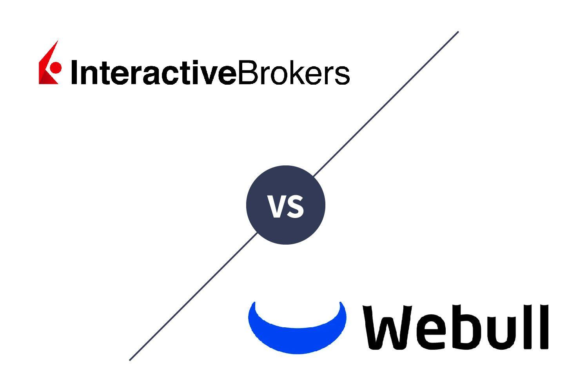

## Table of Contents

## What are Interactive Brokers and Webull, and what services do they offer?

Interactive Brokers is a brokerage firm that lets people trade stocks, options, futures, forex, and other financial products. They have a platform that is good for people who trade a lot because it has many tools and low fees. They also offer things like margin accounts, which let you borrow money to trade, and they have services for people all over the world.

Webull is another brokerage firm that focuses on making trading easy and free. They offer trading in stocks, options, and ETFs without charging a commission. Their app is user-friendly and has tools to help you learn about investing. Webull is good for beginners who want to start trading without spending a lot of money on fees.

## How do the account opening processes differ between Interactive Brokers and Webull?

To open an account with Interactive Brokers, you first need to go to their website and choose the type of account you want, like individual, joint, or retirement account. After selecting your account type, you'll need to fill out an application form with your personal information, including your name, address, and social security number. You'll also need to provide details about your employment and financial situation. Once you submit the form, Interactive Brokers will review your application, which might take a few days. If everything is okay, they'll ask you to fund your account before you can start trading. The process can be a bit more detailed because Interactive Brokers serves clients globally and needs to comply with different regulations.

Opening an account with Webull is simpler and quicker. You start by downloading their app or visiting their website. You'll then choose the type of account you want, usually an individual or retirement account. Next, you fill out a short form with your basic information like your name, address, and social security number. Webull might ask for a quick verification of your identity, often through a photo of your ID. After you submit your application, it's usually approved within minutes to a few hours. Once approved, you can fund your account and start trading right away. Webull's process is designed to be user-friendly and fast, making it easy for beginners to get started.

## What are the fee structures for trading stocks, options, and other securities on Interactive Brokers and Webull?

Interactive Brokers has a fee structure that depends on the type of trade and how much you trade. For stocks and ETFs, they charge a minimum of $0.005 per share with a $1 minimum per trade. For options, the fee is $0.65 per contract. If you trade a lot, you can get lower fees through their tiered pricing, which means the more you trade, the less you pay per trade. They also have different fees for futures, forex, and other products. There's a monthly activity fee of $10 if your commission from trades is less than $10, but you can avoid this fee if your account balance is over $100,000 or if you make a certain amount of trades each month.

Webull offers free trading for stocks and ETFs, which means you don't pay any commission when you buy or sell them. For options, Webull charges $0.55 per contract. They don't charge any fees for account maintenance or inactivity, so you won't have to worry about extra costs if you're not trading often. Webull's simple fee structure makes it easy for beginners to start trading without worrying about high costs.

## How do the user interfaces and trading platforms of Interactive Brokers and Webull compare?

Interactive Brokers has a trading platform called Trader Workstation (TWS) that is packed with tools and features. It can be a bit overwhelming at first because there are so many options and charts. But if you trade a lot and need lots of information, TWS is great. They also have a simpler version called Client Portal, which is easier to use but still has many of the same tools. Both platforms are mainly for computers, but Interactive Brokers also has a mobile app that lets you trade on the go, though it's not as powerful as the computer versions.

Webull's platform is much simpler and easier to use, especially for beginners. Their app is clean and easy to navigate, with big buttons and clear charts. It's designed to make trading easy and quick, with all the basic tools you need right at your fingertips. Webull also has a desktop version that looks a lot like the app, so it's easy to switch between the two. Overall, Webull's interface is more user-friendly and less complicated than Interactive Brokers, making it a good choice if you're just starting out or don't need a lot of advanced features.

## What types of accounts can be opened with Interactive Brokers and Webull?

With Interactive Brokers, you can open different types of accounts. They offer individual accounts for one person, joint accounts for two people, and retirement accounts like IRAs for saving for the future. They also have accounts for businesses, trusts, and even accounts for people in other countries. This makes Interactive Brokers a good choice if you need a special kind of account or if you live outside the United States.

Webull also offers several types of accounts, but it's simpler. You can open an individual account if you're trading by yourself, or a joint account if you want to trade with someone else. They also have retirement accounts like Traditional IRAs and Roth IRAs to help you save for retirement. Webull doesn't have as many options as Interactive Brokers, but it's easy to use and good for most people who want to start trading.

## How do the margin rates and margin trading capabilities differ between Interactive Brokers and Webull?

Interactive Brokers offers margin trading with competitive rates that change based on how much you borrow. The more you borrow, the lower the rate you pay. For example, if you borrow up to $100,000, you might pay around 6.83%, but if you borrow over $1 million, the rate could be as low as 5.83%. They also have different margin requirements depending on what you're trading, like stocks or options. This makes Interactive Brokers a good choice if you trade a lot and need to borrow money to do so.

Webull also lets you trade on margin, but their rates are simpler and a bit higher. They charge a flat rate of 6.99% for margin loans, no matter how much you borrow. This can be easier to understand but might cost more if you're borrowing a lot of money. Webull's margin requirements are also straightforward, making it easier for beginners to start trading on margin. If you're new to trading and want a simpler way to borrow money for your trades, Webull could be a better fit.

## What are the research and analysis tools available on Interactive Brokers and Webull?

Interactive Brokers has a lot of research and analysis tools that can help you make better trading decisions. They have something called the "Trader's Dashboard" which shows you important information about the markets, like news and charts. You can also use their "OptionTrader" to look at different options strategies and see how they might work out. They even have a tool called "Risk Navigator" that helps you see how much risk you're taking with your trades. If you like to do a lot of research before you trade, Interactive Brokers has a lot of tools that can help you.

Webull also has research and analysis tools, but they are simpler and easier to use. They have a "News" section where you can read about what's happening in the markets, and they have "Charts" that you can use to look at stock prices and patterns. Webull also has a "Paper Trading" feature, which lets you practice trading without using real money. This can be really helpful if you're new to trading and want to learn more before you start using real money. Webull's tools are good for beginners who want to start learning about the markets.

## How do the customer service options and quality differ between Interactive Brokers and Webull?

Interactive Brokers has customer service that you can reach through phone, email, and live chat. They also have a lot of help articles and videos on their website to answer common questions. People who trade a lot like that Interactive Brokers has good customer service because they can get help quickly if they need it. But some people say it can be hard to get help right away because Interactive Brokers has customers all over the world.

Webull's customer service is also available through phone, email, and live chat. They try to make it easy for you to get help, especially if you're new to trading. Webull's customer service is usually quick to answer and friendly, which is good for beginners. But some people say that the answers can be simple and might not help with more complicated questions. Overall, Webull's customer service is good for easy questions, but might not be as helpful for harder ones.

## What are the mobile trading app features and performance like on Interactive Brokers and Webull?

Interactive Brokers' mobile app is called IBKR Mobile. It lets you trade stocks, options, and other things from your phone or tablet. The app has a lot of the same tools as their computer version, like charts and news, but it can be a bit hard to use because there's so much information. If you trade a lot, you might like the app because it has everything you need. But if you're new to trading, it might be too much to figure out at first. The app works well and is fast, but it's not as simple as some other apps.

Webull's mobile app is easy to use and good for beginners. It has a clean look with big buttons and clear charts, so you can see what's going on in the markets easily. You can trade stocks, options, and ETFs without paying any fees, which is nice. The app also has tools to help you learn about trading, like paper trading where you can practice without using real money. Webull's app is quick and works well, making it a good choice if you want to start trading on your phone without it being too hard.

## How do the available investment products and asset classes compare between Interactive Brokers and Webull?

Interactive Brokers offers a wide range of investment products and asset classes. You can trade stocks, options, futures, forex, bonds, mutual funds, and even cryptocurrencies. They also let you trade in markets all over the world, not just in the United States. This makes Interactive Brokers a good choice if you want to invest in many different things and in different countries.

Webull has fewer investment options compared to Interactive Brokers. You can trade stocks, options, and ETFs, and they also offer some cryptocurrencies. But they don't have futures, forex, or bonds like Interactive Brokers does. Webull's options are good for beginners who want to start with the basics and don't need to trade in markets outside the United States.

## What advanced trading features and order types are supported by Interactive Brokers and Webull?

Interactive Brokers has a lot of advanced trading features and order types. You can use different kinds of orders like limit orders, stop orders, and even more complicated ones like trailing stops and algorithmic orders. They also let you trade with things like margin, which means borrowing money to trade, and you can use options strategies like spreads and straddles. If you like to trade a lot and need special tools to do it, Interactive Brokers has what you need.

Webull also has some advanced features, but they are simpler than Interactive Brokers. You can use limit orders and stop orders, which are good for basic trading. They also let you trade on margin, but it's easier to understand than Interactive Brokers. Webull doesn't have as many fancy order types or options strategies, but it's good enough for most people who want to start trading without getting too complicated.

## How do the regulatory compliance and security measures of Interactive Brokers and Webull compare?

Interactive Brokers follows a lot of rules to keep your money safe. They are watched by groups like the SEC and FINRA in the United States, and they have to follow rules in other countries too because they work all over the world. They use strong security like two-factor authentication to make sure only you can get into your account. They also keep your money in separate accounts from their own money, so if something bad happens to the company, your money is still safe.

Webull also follows the rules set by the SEC and FINRA, but they only work in the United States, so they don't have to follow as many different rules as Interactive Brokers. They use security measures like two-factor authentication too, to keep your account safe. Like Interactive Brokers, they keep your money in separate accounts, so it's protected if something goes wrong with the company. But because Webull is simpler and works in fewer places, their security might not be as detailed as Interactive Brokers.

## References & Further Reading

[1]: Bergstra, J., Bardenet, R., Bengio, Y., & Kégl, B. (2011). ["Algorithms for Hyper-Parameter Optimization."](https://dl.acm.org/doi/10.5555/2986459.2986743) Advances in Neural Information Processing Systems 24.

[2]: ["Advances in Financial Machine Learning"](https://www.amazon.com/Advances-Financial-Machine-Learning-Marcos/dp/1119482089) by Marcos Lopez de Prado

[3]: ["Evidence-Based Technical Analysis: Applying the Scientific Method and Statistical Inference to Trading Signals"](https://www.amazon.com/Evidence-Based-Technical-Analysis-Scientific-Statistical/dp/0470008741) by David Aronson

[4]: ["Machine Learning for Algorithmic Trading"](https://github.com/PacktPublishing/Machine-Learning-for-Algorithmic-Trading-Second-Edition) by Stefan Jansen

[5]: ["Quantitative Trading: How to Build Your Own Algorithmic Trading Business"](https://books.google.com/books/about/Quantitative_Trading.html?id=j70yEAAAQBAJ) by Ernest P. Chan

[6]: ["Python for Finance: Mastering Data-Driven Finance"](https://books.google.com/books/about/Python_for_Finance.html?id=2qd9DwAAQBAJ) by Yves Hilpisch