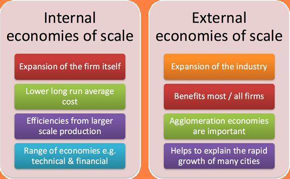

## Table of Contents

## What are economies of scale?

Economies of scale happen when a company grows bigger and can produce things more cheaply. As a company makes more of a product, the cost to make each item goes down. This happens because the company can buy materials in larger amounts for less money, use machines more efficiently, and spread out fixed costs like rent and salaries over more items.

For example, imagine a bakery. When it's small, it might buy flour in small bags at a higher price. But if it grows and buys flour in big sacks, the price per pound drops. Also, the bakery can use its ovens more often, making more bread without spending more on electricity or rent. This way, the cost to make each loaf of bread goes down as the bakery gets bigger.

## What is the difference between internal and external economies of scale?

Internal economies of scale are cost savings that happen inside a single company as it grows bigger. When a company gets larger, it can do things more efficiently. For example, it can buy materials in bulk for cheaper prices, use its machines better, and spread out costs like rent and salaries over more products. This makes the cost of making each item go down. So, a bigger company can often make things cheaper than a smaller one.

External economies of scale are cost savings that happen outside of a single company, in the whole industry or area. These savings come from things that many companies in the same place can use. For example, if a lot of car makers are in one city, they can all use the same good roads to move their cars, and they might have many skilled workers to choose from. This makes it cheaper for all the companies in that area, not just one company getting bigger.

## Can you give examples of internal economies of scale?

When a company gets bigger, it can save money in many ways. One way is by buying things in bulk. For example, a big factory might buy steel in huge amounts, which costs less per pound than buying smaller amounts. This means the factory can make cars cheaper because the steel is cheaper. Another way is by using machines better. A big factory can keep its machines running all the time, making more cars without needing more machines or spending more on electricity.

Another example is spreading out fixed costs. A big company might have a big building that costs the same amount of money to rent no matter how many products it makes. So, if the company makes more products, the rent cost for each product goes down. Also, a big company can hire experts like engineers or managers who can help make things run smoother and cheaper. This means the company can make things at a lower cost as it grows bigger.

## Can you give examples of external economies of scale?

When many companies in the same industry are in one place, they can all save money. For example, if a lot of tech companies are in Silicon Valley, they can use the same good roads and internet services. This makes it cheaper for all the companies because they don't have to build their own roads or internet. Also, there are many skilled workers in Silicon Valley, so companies can find the people they need without spending a lot of time and money looking for them.

Another example is when many car factories are in Detroit. They can all use the same suppliers for parts, which makes the parts cheaper for everyone. Also, because there are so many car factories, they can share ideas and learn from each other, which helps them make cars better and cheaper. So, being in a place with a lot of other companies in the same industry can help a company save money and do better.

## How do internal economies of scale benefit a company?

When a company grows bigger, it can save money in many ways, which is called internal economies of scale. One way is by buying things in bulk. For example, a big factory might buy steel in huge amounts, which costs less per pound than buying smaller amounts. This means the factory can make cars cheaper because the steel is cheaper. Another way is by using machines better. A big factory can keep its machines running all the time, making more cars without needing more machines or spending more on electricity. This helps the company save money and make things more cheaply.

Another way a company can benefit from internal economies of scale is by spreading out fixed costs. A big company might have a big building that costs the same amount of money to rent no matter how many products it makes. So, if the company makes more products, the rent cost for each product goes down. Also, a big company can hire experts like engineers or managers who can help make things run smoother and cheaper. This means the company can make things at a lower cost as it grows bigger, which helps it make more profit and compete better in the market.

## How do external economies of scale benefit an industry or region?

When a lot of companies in the same industry are in one place, it helps the whole area save money and grow. For example, if many tech companies are in Silicon Valley, they can all use the same good roads and internet services. This makes things cheaper for all the companies because they don't have to build their own roads or internet. Also, there are many skilled workers in Silicon Valley, so companies can find the people they need without spending a lot of time and money looking for them. This means the companies can focus on making their products better and cheaper.

Another way external economies of scale help an industry or region is by making it easier for companies to get what they need. For example, if many car factories are in Detroit, they can all use the same suppliers for parts, which makes the parts cheaper for everyone. Also, because there are so many car factories, they can share ideas and learn from each other, which helps them make cars better and cheaper. So, being in a place with a lot of other companies in the same industry can help the whole area do better and grow.

## What are the limitations or disadvantages of internal economies of scale?

While internal economies of scale can help a company save money, they also have some downsides. One problem is that when a company gets too big, it can be hard to manage. It's like trying to take care of a huge garden instead of a small one. The company might need more managers and more complicated systems, which can make things slower and more confusing. This can make it harder for the company to make quick decisions or change direction when it needs to.

Another issue is that as a company grows, it might start to face diseconomies of scale. This means that instead of saving money, the company might start spending more. For example, a big company might have to deal with more rules and regulations, which can cost a lot of money. Also, if the company is too big, it might not be able to take care of its workers as well, which can make them unhappy and less productive. So, while getting bigger can help a company save money, it can also bring new problems that can make things harder.

## What are the limitations or disadvantages of external economies of scale?

When many companies in the same industry are in one place, it can help them save money, but there are also some problems. One big problem is that if too many companies are in the same place, it can get too crowded. This can make it hard to find space to grow or build new things. Also, if everyone is using the same roads and services, these can get too busy and not work as well. This can slow down the companies and make it harder for them to do their work.

Another problem is that when a lot of companies rely on the same suppliers or workers, it can make them less flexible. If something goes wrong with a supplier, like a factory that makes parts, it can affect all the companies in the area. Also, if there are too many companies wanting the same skilled workers, it can make wages go up a lot. This can make it more expensive for companies to hire the people they need. So, while being in a place with a lot of other companies can help, it can also bring new challenges.

## How can a company achieve internal economies of scale?

A company can achieve internal economies of scale by growing bigger and making more of its products. When a company makes more things, it can buy materials in larger amounts, which often costs less per item. For example, a big car factory can buy steel in huge amounts, which is cheaper than buying smaller amounts. The company can also use its machines more efficiently by keeping them running all the time, making more products without spending more on electricity or other costs. This way, the cost to make each item goes down as the company gets bigger.

Another way a company can achieve internal economies of scale is by spreading out fixed costs over more products. Fixed costs are things like rent and salaries that stay the same no matter how many products the company makes. If a company makes more products, the cost of rent or salaries for each product goes down. Also, a bigger company can hire experts like engineers or managers who can help make things run smoother and cheaper. By doing these things, a company can make things at a lower cost as it grows, which helps it make more profit and compete better in the market.

## How can an industry or region foster external economies of scale?

An industry or region can help create external economies of scale by bringing together many companies in the same field. When a lot of companies are in one place, they can share things like good roads, fast internet, and other services. This makes it cheaper for all the companies because they don't have to build their own roads or internet. Also, having many companies in one place means there will be a lot of skilled workers around. This makes it easier for companies to find the people they need without spending a lot of time and money looking for them.

Another way to foster external economies of scale is by making it easier for companies to work together and share ideas. When companies are close to each other, they can learn from each other and find new ways to make things better and cheaper. Also, having many companies in the same place can attract suppliers who can provide materials at lower costs because they are selling to many customers. This helps all the companies in the area save money and grow together.

## What role do technological advancements play in achieving internal economies of scale?

Technological advancements can help a company grow bigger and make things cheaper, which is called internal economies of scale. When a company uses new technology, it can make more products faster and with fewer people. For example, a factory might use robots to build cars. Robots can work all the time without getting tired, so the factory can make more cars without hiring more workers. This makes the cost of making each car go down because the factory can spread out the cost of the robots over more cars.

Also, new technology can help a company use its materials better. For example, a company might use a new computer program to plan how to cut fabric for clothes. The program can find the best way to cut the fabric so there is less waste. This means the company can make more clothes with the same amount of fabric, which makes each piece of clothing cheaper to make. By using new technology, a company can save money and make things more efficiently as it grows bigger.

## How do government policies influence the development of external economies of scale?

Government policies can help bring more companies to one place, which can lead to external economies of scale. When the government builds good roads, fast internet, and other services in an area, it makes it easier for companies to work there. This can attract many companies in the same industry to that place. For example, if the government makes it easy to start a tech company in a certain city, many tech companies might move there. This helps them all save money because they can use the same good services and find skilled workers more easily.

Also, the government can help companies work together and share ideas. They can do this by giving money for research or setting up places where companies can meet and learn from each other. When companies share ideas, they can find new ways to make things better and cheaper. This helps the whole industry in that area grow and save money. So, by making it easier for companies to be in one place and work together, the government can help create external economies of scale.

## References & Further Reading

[1]: Bergstra, J., Bardenet, R., Bengio, Y., & Kégl, B. (2011). ["Algorithms for Hyper-Parameter Optimization."](https://dl.acm.org/doi/10.5555/2986459.2986743) Advances in Neural Information Processing Systems 24.

[2]: ["Advances in Financial Machine Learning"](https://www.amazon.com/Advances-Financial-Machine-Learning-Marcos/dp/1119482089) by Marcos Lopez de Prado

[3]: ["Evidence-Based Technical Analysis: Applying the Scientific Method and Statistical Inference to Trading Signals"](https://www.amazon.com/Evidence-Based-Technical-Analysis-Scientific-Statistical/dp/0470008741) by David Aronson

[4]: ["Machine Learning for Algorithmic Trading"](https://github.com/stefan-jansen/machine-learning-for-trading) by Stefan Jansen

[5]: ["Quantitative Trading: How to Build Your Own Algorithmic Trading Business"](https://www.amazon.com/Quantitative-Trading-Build-Algorithmic-Business/dp/1119800064) by Ernest P. Chan