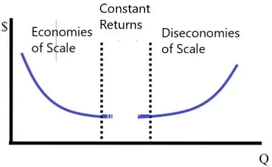

Understanding economies of scale is pivotal in both economics and business management. At its core, economies of scale refer to the cost advantages that enterprises obtain due to their scale of operation, with cost per unit of output generally decreasing with increasing scale. These advantages are crucial as firms endeavor to enhance efficiency, thereby enabling them to lower costs and bolster output. The concept bifurcates into internal and external economies of scale, each playing an essential role in how firms strategically position themselves in the competitive market landscape.

Internal economies of scale are achieved when firms optimize their internal processes, resources, and structures. By enhancing managerial practices, adopting advanced technologies, or securing favorable financial terms due to a larger operational scale, companies can significantly reduce their average costs. This internal efficiency is a product of deliberate strategic management and is particularly pertinent in industries where technological leverage is pronounced.

External economies of scale, on the other hand, are realized when entire industries benefit from factors beyond individual company control. Infrastructure developments, industry-specific governmental policies, or advancements in related sectors can lead to cost benefits for all firms operating within a particular market environment. Such advantages often emerge from a broader ecosystem development that facilitates enhanced operational conditions and efficiencies across the board.

The application of these economic concepts extends to algorithmic trading, a rapidly evolving domain where speed, efficiency, and scalability are critical. In algorithmic trading, the ability to efficiently scale operational capacities can lead to substantial competitive advantages, such as reduced transaction costs and improved strategic agility. Both internal and external economies play crucial roles in shaping how algorithmic trading firms structure their operations, influence their cost frameworks, and develop their market strategies.

This article investigates these dynamics, emphasizing how economies of scale influence algorithmic trading strategies, cost structures, and market performance outcomes. It will further address key considerations specific to the trading industry, including potential challenges and strategies for sustainable scalability. Understanding and leveraging economies of scale are vital for firms seeking to navigate the complexities of modern markets, ensuring enduring growth and competitive relevance.

## Table of Contents

## Understanding Internal Economies of Scale

Internal economies of scale refer to the cost advantages that a company can realize due to its internal management, resources, and operational strategies. These efficiencies arise from various factors, including technical, managerial, and financial aspects of the organization, and are integral to enhancing a company’s cost structure. By optimizing these internal factors, businesses can significantly reduce their average costs and boost productivity, which is especially crucial in competitive industries like algorithmic trading.

### Types of Internal Economies of Scale

1. **Technical Economies**: These occur when a firm invests in advanced technology and equipment to improve efficiency and productivity. In algorithmic trading, technical economies are achieved through the development and deployment of sophisticated trading platforms that can process and analyze vast amounts of data in real-time. Advanced algorithms and high-performance computing systems enable trading firms to execute trades at optimal speeds, thereby reducing transaction costs and enhancing profitability.

   For example, trading firms often employ high-frequency trading ([HFT](/wiki/high-frequency-trading-strategies)), which requires significant computational power to make rapid decisions based on market fluctuations. The ability to process large datasets quickly can result in substantial cost savings and strategic advantages.

2. **Managerial Economies**: These arise from the efficient organization and management of a company’s resources. Effective talent management and organizational structure are fundamental to achieving managerial economies. In algorithmic trading firms, specialized teams of data scientists, quantitative analysts, and IT professionals work collaboratively to develop and refine trading algorithms. 

   Streamlined management practices allow these firms to exploit the full potential of their workforce, resulting in reduced overhead costs and improved productivity. By fostering a culture of innovation and continuous learning, trading firms can maintain a competitive edge in the fast-paced financial markets.

3. **Financial Economies**: These economies occur when a firm can access capital at lower costs due to its size and reputation. Larger trading firms often benefit from better credit terms and access to more diverse funding sources, which enables them to invest in cutting-edge technologies and recruit top-tier talent. This financial flexibility is crucial in sustaining long-term growth and competitiveness in the algorithmic trading space.

### Leveraging Internal Economies in Algorithmic Trading

Algorithmic trading firms leverage internal economies of scale by focusing on key areas such as technological innovation and talent management. The development of proprietary trading platforms and algorithmic models allows firms to automate trading processes, reducing the need for manual intervention and decreasing the likelihood of human error. These platforms are built to handle large-scale data processing, enabling traders to make informed decisions based on comprehensive market insights.

Moreover, by investing in human capital, trading firms can enhance their research and development capabilities. Encouraging collaboration between quants, engineers, and analysts ensures the continuous improvement of trading strategies, aligning with market trends and emerging technologies.

In summary, internal economies of scale provide substantial benefits to [algorithmic trading](/wiki/algorithmic-trading) firms by optimizing their technical, managerial, and financial operations. By strategically investing in technology and human resources, these firms can achieve cost efficiencies that drive competitive advantage and long-term success in the financial markets.

## Exploring External Economies of Scale

External economies of scale arise when multiple firms within a particular industry experience lowered costs due to external factors. These factors are not controlled by any single organization but benefit the entire industry. Such economies often occur due to industry growth, improvements in infrastructure, or regulatory changes that enable firms to reduce operational expenses and boost efficiency.

In the trading market, particularly algorithmic trading, external economies of scale can significantly influence industry dynamics. These economies enable trading firms to benefit from collective advancements, contributing to reduced costs and improved performance across the board.

**Industry Growth and Collaborative Platforms**

As industries expand, the increased level of activities can lead to shared benefits among firms. In trading, as more companies adopt algorithmic strategies, demand for sophisticated trading platforms increases. This elevates the quality and availability of these platforms, often leading to more innovative solutions and cost-sharing opportunities. Collaborative platforms enable firms to pool resources, share data, and access cutting-edge technologies at a reduced individual cost. These platforms can facilitate information exchange about market trends, risk management strategies, and regulatory compliance, leading to enhanced operational efficiency.

**Advancements in Telecommunications and Regulatory Technology**

External economies in algorithmic trading can also arise from improvements in telecommunications and regulatory technologies. High-speed internet and robust telecommunications networks reduce latencies in trade execution, lowering transaction costs and enhancing market access for all firms within the industry. This widespread enhancement in infrastructure allows even smaller firms to compete with larger ones, contributing to a more efficient and dynamic trading environment.

Similarly, advancements in regulatory technology (RegTech) facilitate compliance with financial regulations by automating monitoring and reporting processes. This not only reduces the compliance burden on individual firms but also streamlines industry-wide operations. Automated compliance systems reduce errors, improve transparency, and can lower the costs associated with regulatory breaches, benefiting the industry collectively.

**Industry Synergies and Shared Resources**

Industries often witness synergies arising from firms sharing resources such as data centers, trading platforms, or analytical tools. These shared resources lower operational costs by distributing expenses across multiple entities. In algorithmic trading, this could involve the use of cloud computing services, which provide scalable resources for data processing and storage, optimizing peak demand periods without necessitating significant infrastructure investments from individual firms.

Moreover, collaboration among industry players can lead to the development of shared standards and protocols, enhancing interoperability and efficiency. For example, consensual protocols for data exchange improve the flow and accuracy of information, facilitating better trading decisions and minimizing the likelihood of errors or miscommunications.

In conclusion, external economies of scale in the trading industry arise from collective advancements and industry growth, enabling firms to operate more efficiently and cost-effectively. By leveraging improvements in infrastructure, technologies, and collaborative efforts, algorithmic trading firms can enhance their market performance and strategic capabilities. As these factors continue to evolve, they represent critical elements influencing the competitive landscape of algorithmic trading.

## Algorithmic Trading and Economies of Scale

Algorithmic trading is significantly impacted by economies of scale, given its reliance on rapid data processing and strategic decision-making. These scales can be categorized into internal and external, both of which offer distinct advantages to firms engaged in this technologically driven market.

Internally, algorithmic trading firms optimize computational resources to handle vast amounts of data, execute trades swiftly, and minimize latency. High-frequency trading (HFT) exemplifies this, where milliseconds can make a substantial difference in profitability. Firms often invest heavily in advanced computing infrastructure, enabling them to process complex algorithms and market signals almost instantaneously. Thus, the cost per transaction decreases as the firm scales up its operations, given that the infrastructure is already in place to handle increased load.

For example, consider an algorithm that executes trades based on real-time analysis of stock prices and news sentiment. A firm might start with basic hardware and software capable of processing data from a single exchange. As the firm scales, it can deploy more sophisticated hardware, such as FPGAs (Field Programmable Gate Arrays) or GPUs (Graphics Processing Units), which offer parallel processing capabilities. This parallelism reduces the time required to execute trades, allowing the firm to handle more transactions without a proportional increase in costs.

In terms of external economies, algorithmic trading firms benefit from industry-wide advancements such as improved telecommunications infrastructure. Enhanced bandwidth and reduced latency contribute to faster data retrieval and distribution across trading platforms, allowing firms to execute trades more efficiently. Additionally, collective developments in financial technologies and open-source software provide firms with access to cutting-edge tools and methodologies without significant individual investment, thereby reducing costs.

Moreover, the effects of shared research and regulatory technology advancements can lead to standardized protocols and compliance measures, minimizing the complexity and cost of regulatory adherence. As a result, multiple firms can achieve cost reductions simultaneously, enhancing their competitive positioning.

The competitive edge realized through these economies is evident in the tailored strategies employed by various firms. For instance, an HFT firm might leverage its internally developed algorithms combined with high-quality data from external providers to predict market trends more accurately, thus executing trades that are not only faster but also better informed.

In summary, the convergence of internal optimizations and external advancements positions algorithmic trading firms to achieve considerable economies of scale. These efficiencies, when effectively harnessed, empower firms to maintain a competitive advantage through lower operational costs and enhanced decision-making capabilities. As the industry continues to evolve, these economies will remain fundamental to sustaining growth and innovation in algorithmic trading.

## Special Considerations

While economies of scale offer substantial benefits by reducing average costs and increasing operational efficiency, algorithmic trading faces unique challenges when scaling. One significant [factor](/wiki/factor-investing) to consider is diseconomies of scale, a situation where expanding operations leads to increased per-unit costs. This often occurs when the complexity of management and coordination grows with scale, making large, intricate systems more difficult to oversee efficiently. For algorithmic trading firms, this means that larger data volumes, more intricate trading algorithms, and increased operational demands can result in inefficiencies rather than the intended cost reductions.

Scaling trading operations can also introduce risks related to market impact and [liquidity](/wiki/liquidity-risk-premium) challenges. Market impact refers to the effect that executing large orders can have on the market price of an asset. As trading [volume](/wiki/volume-trading-strategy) increases, the likelihood of impacting market prices grows, potentially leading to adverse execution prices, known as slippage. Similarly, liquidity challenges arise when scaling strategies that depend on the quick execution of trades in sufficient volume. Insufficient market liquidity can hinder the ability to efficiently enter or [exit](/wiki/exit-strategy) positions, increasing the cost and risk of executing trades.

Sustainable growth and scalability in algorithmic trading require careful management of these risks. Key considerations include maintaining optimal algorithmic complexity, ensuring that systems remain manageable as operations expand, and strategically planning trade execution to minimize market impact. Effective use of technology and data analytics is crucial, helping to identify and mitigate inefficiencies or risks that arise with increased scale. Developing robust risk management frameworks and continuously monitoring market conditions are also essential for adapting trading strategies to sustain scalability without compromising performance or incurring unnecessary costs.

In summary, while economies of scale can enhance trading efficiency, algorithmic trading firms must navigate the potential pitfalls of diseconomies of scale and operational risks. Success hinges on judicious management of complexity, market interactions, and sustained infrastructure investment to uphold the advantages of scaling while fostering sustainable growth.

## Conclusion

Economies of scale are pivotal in significantly boosting efficiency and providing a competitive edge for businesses, particularly those involved in algorithmic trading. By leveraging both internal and external economies of scale, firms are able to optimize costs, enhance productivity, and bolster their strategic capabilities. Internal economies of scale result from factors within the company, such as improved managerial efficiencies, enhanced technological processes, and optimized resource allocation. In contrast, external economies often stem from industry-wide developments, such as regulatory advancements and infrastructure improvements, which collectively benefit the industry participants.

As the trading landscape continues to evolve with rapid technological advancements and increasingly complex markets, effectively utilizing these economic principles becomes crucial for achieving sustainable success. Algorithmic trading firms, by harnessing economies of scale, can refine their operational efficiencies, employ sophisticated data analytics, and effectively manage massive datasets to react swiftly to market changes. This capability not only allows them to reduce transaction costs but also equips them to develop more resilient trading strategies that can withstand the exigencies of a dynamic market environment.

Moreover, understanding and applying economies of scale help trading entities to better navigate complexities inherent in modern financial markets, thereby driving sustainable growth. However, these firms must remain vigilant of the associated challenges, such as potential diseconomies of scale, which can introduce inefficiencies if operations become overly complex or if increased volume does not equate to proportional cost savings.

In summary, for algorithmic trading operations, economies of scale are not merely about expanding size but also about strategic optimization and alignment with industry growth trends. This strategic mindfulness fosters a robust foundation for ongoing innovation and market adaptability, ensuring long-term viability and prosperity.

## References & Further Reading

[1]: Bergstra, J., Bardenet, R., Bengio, Y., & Kégl, B. (2011). ["Algorithms for Hyper-Parameter Optimization."](https://dl.acm.org/doi/10.5555/2986459.2986743) Advances in Neural Information Processing Systems 24.

[2]: ["Advances in Financial Machine Learning"](https://www.amazon.com/Advances-Financial-Machine-Learning-Marcos/dp/1119482089) by Marcos Lopez de Prado

[3]: ["Evidence-Based Technical Analysis: Applying the Scientific Method and Statistical Inference to Trading Signals"](https://www.amazon.com/Evidence-Based-Technical-Analysis-Scientific-Statistical/dp/0470008741) by David Aronson

[4]: ["Machine Learning for Algorithmic Trading"](https://github.com/stefan-jansen/machine-learning-for-trading) by Stefan Jansen

[5]: ["Quantitative Trading: How to Build Your Own Algorithmic Trading Business"](https://www.amazon.com/Quantitative-Trading-Build-Algorithmic-Business/dp/1119800064) by Ernest P. Chan