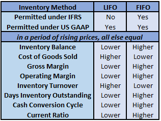

## Table of Contents

## What is inventory accounting?

Inventory accounting is the way businesses keep track of the goods they have for sale. It involves counting and recording how many items are in stock, how much they cost, and how much they are worth. This helps businesses know what they have, plan what to buy next, and make sure they are making money.

There are different methods to do inventory accounting, like FIFO (First In, First Out) and LIFO (Last In, First Out). These methods affect how the cost of goods sold and the value of the inventory are calculated. Choosing the right method can impact a business's financial statements and tax obligations. It's important for businesses to pick a method that fits their needs and follow it consistently.

## What are GAAP and IFRS?

GAAP stands for Generally Accepted Accounting Principles. It is a set of rules that companies in the United States follow when they do their accounting. These rules make sure that everyone's financial statements are clear and easy to understand. GAAP helps investors and others see how a company is doing financially. It covers things like how to record income, expenses, and assets.

IFRS stands for International Financial Reporting Standards. It is used by many countries around the world, except the United States. IFRS is a bit like GAAP but is used internationally to make sure financial statements are consistent across different countries. This helps people compare companies from different places more easily. IFRS also has rules about how to report income, expenses, and assets, but some of the details might be different from GAAP.

Both GAAP and IFRS aim to make financial information trustworthy and useful. While GAAP is more detailed and specific, IFRS tends to be more principles-based, giving companies a bit more flexibility in how they report their finances.

## How does GAAP define inventory?

GAAP, or Generally Accepted Accounting Principles, defines inventory as goods that a business has for sale in the normal [course](/wiki/best-algorithmic-trading-courses) of its operations. This includes raw materials that a company will use to make products, items that are in the process of being made, and finished goods that are ready to be sold. Inventory is important because it helps businesses keep track of what they have and plan what they need to buy or make next.

Under GAAP, inventory is recorded on the balance sheet at its cost, which is the amount a business paid to get the inventory. This cost includes not just the price of the goods themselves, but also other costs like shipping and handling. GAAP also has rules about how to figure out the cost of goods sold, which is the cost of the inventory that a business sold during a certain period. This helps businesses know how much it cost them to make or buy the things they sold, which is important for figuring out their profits.

## How does IFRS define inventory?

IFRS, or International Financial Reporting Standards, defines inventory as the goods a business has for sale in its normal operations. This includes raw materials needed to make products, items that are being made, and finished goods ready to be sold. Inventory helps businesses know what they have and plan what they need to buy or make next.

Under IFRS, inventory is recorded on the balance sheet at its cost, which is what the business paid to get the inventory. This cost includes the price of the goods and other costs like shipping and handling. IFRS also has rules about how to figure out the cost of goods sold, which is the cost of the inventory that a business sold during a certain period. This helps businesses understand how much it cost them to make or buy the things they sold, which is important for figuring out their profits.

## What are the main differences in inventory valuation between GAAP and IFRS?

The main difference in inventory valuation between GAAP and IFRS is how they handle the method called LIFO, which stands for Last In, First Out. GAAP allows businesses to use LIFO, which means they can treat the most recent inventory costs as the cost of goods sold. This can be useful for tax purposes because it might lower a company's taxable income. On the other hand, IFRS does not allow the use of LIFO. Instead, IFRS requires businesses to use methods like FIFO (First In, First Out) or the weighted average cost method. This means that under IFRS, the cost of goods sold is based on older inventory costs or an average of all costs.

Another difference is how GAAP and IFRS handle inventory write-downs. Under GAAP, if the value of inventory goes down because it's damaged, outdated, or for other reasons, a company can write down the value of that inventory. But if the value goes back up later, GAAP does not allow the company to write the value back up. IFRS, however, is more flexible. If the value of inventory goes down and a company writes it down, but then the value goes back up, IFRS allows the company to write the value back up to the new, higher value. This means that under IFRS, the inventory value on the balance sheet can change more over time than it can under GAAP.

## How do GAAP and IFRS treat the cost of inventory?

Both GAAP and IFRS treat the cost of inventory in similar ways. They say that inventory should be recorded on the balance sheet at its cost, which includes the price the business paid for the goods plus other costs like shipping and handling. This helps businesses know how much they spent on the things they have for sale. Both GAAP and IFRS also have rules about how to figure out the cost of goods sold, which is the cost of the inventory that a business sold during a certain period. This is important for figuring out how much profit a business made.

The main difference between GAAP and IFRS is about a method called LIFO, which stands for Last In, First Out. GAAP allows businesses to use LIFO, which means they can treat the most recent inventory costs as the cost of goods sold. This can help lower a company's taxable income. But IFRS does not allow LIFO. Instead, IFRS requires businesses to use methods like FIFO (First In, First Out) or the weighted average cost method. This means that under IFRS, the cost of goods sold is based on older inventory costs or an average of all costs.

## Can you explain the LIFO method and why it is allowed under GAAP but not IFRS?

The LIFO method, which stands for Last In, First Out, is a way businesses can value their inventory. It means that the most recent costs of inventory are used first when figuring out the cost of goods sold. So if a business buys new inventory at a higher price, those higher costs are used to figure out how much it cost to sell the goods. This can be good for businesses because it can lower their taxable income, especially if prices are going up. Under GAAP, which is used in the United States, businesses are allowed to use the LIFO method if they want to.

IFRS, which is used in many countries around the world except the United States, does not allow businesses to use the LIFO method. Instead, IFRS says businesses have to use other methods like FIFO (First In, First Out) or the weighted average cost method. These methods use older costs or an average of all costs to figure out the cost of goods sold. The reason IFRS doesn't allow LIFO is because they want financial statements to be consistent and easy to compare across different countries. Using LIFO can make it hard to compare one business to another if they are using different methods to value their inventory.

## How do GAAP and IFRS handle inventory write-downs and reversals?

Under GAAP, if the value of inventory goes down because it's damaged, outdated, or for other reasons, a business can write down the value of that inventory. This means they lower the recorded value on their balance sheet to reflect the new, lower value. However, if the value of the inventory goes back up later, GAAP does not allow the business to write the value back up. So, once the value is written down, it stays down even if the inventory becomes worth more again.

IFRS is more flexible when it comes to inventory write-downs and reversals. Like GAAP, if the value of inventory goes down, a business can write down the value. But if the value goes back up later, IFRS allows the business to write the value back up to the new, higher value. This means that under IFRS, the value of inventory on the balance sheet can change more over time than it can under GAAP. This flexibility helps businesses show a more accurate picture of their inventory's value as it changes.

## What are the implications of choosing FIFO versus weighted average cost under both GAAP and IFRS?

Choosing between FIFO (First In, First Out) and the weighted average cost method can affect a business's financial statements in important ways under both GAAP and IFRS. With FIFO, a business treats the oldest costs of inventory as the cost of goods sold. This means if prices are going up, the cost of goods sold will be lower than if newer, higher costs were used. This can make profits look higher because the cost of goods sold is lower. On the other hand, the weighted average cost method takes all the costs of inventory and averages them out. This means the cost of goods sold is based on an average cost, which can smooth out the effect of price changes over time. This method can make profits look more stable, but it might not show the exact impact of price changes.

Under both GAAP and IFRS, businesses can choose to use either FIFO or the weighted average cost method, but they have to stick with their choice consistently. The choice between these methods can affect how a business reports its profits and how much it pays in taxes. For example, if prices are going up, using FIFO can lead to higher reported profits and possibly higher taxes. Using the weighted average cost method might lead to lower reported profits and lower taxes, but it can also make the business's financial performance look more consistent over time. So, the choice depends on what the business wants to show in its financial statements and how it wants to manage its tax situation.

## How do GAAP and IFRS differ in the disclosure requirements for inventory?

GAAP and IFRS have different rules about what businesses need to tell people about their inventory. Under GAAP, businesses have to give a lot of details about their inventory. They need to say how much inventory they have, how they figured out the cost of their inventory, and if they used any special methods like LIFO. They also have to explain any big changes in the value of their inventory and why those changes happened. This helps people who look at the financial statements understand exactly how the business is doing with its inventory.

IFRS also wants businesses to tell people about their inventory, but the rules are a bit different. Under IFRS, businesses need to say how much inventory they have and how they figured out the cost, but they can't use LIFO. They also have to explain any write-downs of inventory and if those write-downs were reversed later. IFRS focuses more on giving a general picture of the inventory and how its value changed, rather than going into as much detail as GAAP. This means that under IFRS, the information about inventory might be easier to understand but less detailed than under GAAP.

## What impact do these differences have on financial reporting and decision-making?

The differences between GAAP and IFRS in how they treat inventory can affect how a business's financial health looks on paper. Under GAAP, businesses can use the LIFO method, which can lower the cost of goods sold and increase reported profits when prices are going up. This might make a business look more profitable than it really is. On the other hand, IFRS doesn't allow LIFO, so businesses have to use FIFO or the weighted average cost method. This can lead to different numbers for profits and inventory values, making it harder to compare businesses that use different standards. Also, GAAP requires more detailed information about inventory, which can help investors and others understand the business better, but it can also make financial statements more complicated.

These differences can also affect how businesses make decisions. If a business is using GAAP and chooses LIFO, it might pay less in taxes because its taxable income is lower. But if it switches to IFRS, it can't use LIFO anymore, and its taxes might go up. This can change how a business plans its finances and what strategies it uses. Also, because IFRS is used in many countries, a business that wants to expand internationally might choose IFRS to make it easier to compare its financials with other businesses around the world. So, the choice between GAAP and IFRS can have big effects on how a business reports its finances and makes its decisions.

## How can a company transition from GAAP to IFRS in terms of inventory accounting?

When a company wants to switch from GAAP to IFRS for inventory accounting, it needs to make some important changes. First, it has to stop using the LIFO method because IFRS doesn't allow it. Instead, the company must switch to using FIFO or the weighted average cost method. This change can affect how much the company reports as its cost of goods sold and its profits. If prices have been going up, using FIFO or the weighted average cost method might make the cost of goods sold higher and profits lower compared to LIFO. The company also needs to adjust its inventory values on the balance sheet to match the new method.

Another thing the company needs to do is change how it handles inventory write-downs and reversals. Under GAAP, once inventory is written down, it can't be written back up even if its value goes up later. But under IFRS, if the value of inventory goes up after a write-down, the company can write it back up. This means the company has to keep track of any changes in inventory value and be ready to adjust its records accordingly. The company also needs to update its financial statements to meet IFRS disclosure requirements, which are different from GAAP. IFRS requires less detailed information about inventory, so the company might need to simplify how it reports its inventory to meet these new rules.

## What is Understanding Inventory Accounting?

Inventory accounting plays a crucial role in determining the cost of goods sold (COGS) and the gross profit margin, both key indicators of a company’s financial health. The methodologies employed for inventory valuation directly affect the financial statements and can influence managerial decisions, investor confidence, and broader financial performance assessments.

Both the Generally Accepted Accounting Principles (GAAP) and International Financial Reporting Standards (IFRS) provide frameworks for inventory accounting, though they differ in methodology. Common inventory valuation methods include First In, First Out (FIFO); Last In, First Out (LIFO); and Weighted Average Cost.

**FIFO (First In, First Out):** This method assumes that the oldest inventory items are used up or sold before newer inventory. Under FIFO, ending inventory is based on the cost of the most recent purchases, while the cost of goods sold reflects the cost of older inventory. This can lead to lower COGS and higher profits during times of rising prices, as older, cheaper costs are an expense first.

**LIFO (Last In, First Out):** Under this approach, the latest inventory purchases are considered sold first. As a consequence, during inflationary periods, LIFO typically results in higher COGS and lower ending inventory values. This can be favorable for tax considerations in some jurisdictions as it may reduce taxable income. However, IFRS prohibits LIFO due to concerns over representational faithfulness, arguing that it does not accurately reflect the actual flow of inventory. GAAP, however, allows the use of all three methods, providing flexibility to U.S.-based companies.

**Weighted Average Cost:** This method averages out the cost of all inventory items available for sale during a period and assigns this average cost to both ending inventory and COGS. The formula for the weighted average cost per unit is:

$$
\text{Weighted Average Cost per Unit} = \frac{\text{Total Cost of Goods Available for Sale}}{\text{Total Units Available for Sale}}
$$

This approach smooths out price fluctuations over the accounting period and can provide a middle ground between FIFO and LIFO effects on financial statements.

The choice of inventory accounting method can influence financial ratios, reported earnings, and investment decision-making. Firms must thoroughly understand both GAAP and IFRS standards to effectively manage and report their inventory, taking into consideration the legal framework within their operating jurisdiction.

## References & Further Reading

[1]: Lambert, B., & Leuz, C. (2006). ["International differences in accounting standards and profitability measurements"](https://www.jstor.org/stable/pdf/4622036.pdf) Management Science, 52(9), 1311-1326.

[2]: Park, C., & Park, J. (2002). ["The Stock-Bond Correlation and Its Implications on the Cost of Capital"](https://journals.sagepub.com/doi/10.1509/jmkg.74.6.1) Financial Review, 37(4), 473-492.

[3]: Nobes, C., & Parker, R. (2008). ["Comparative International Accounting"](https://www.semanticscholar.org/paper/Comparative-International-Accounting-Nobes-Parker/67772ac27f4072f4888bffd3895a59b17b2fe286) Pearson Education.

[4]: ["International Financial Statement Analysis"](https://www.wiley.com/en-us/International+Financial+Statement+Analysis%2C+4th+Edition-p-9781119628057) by Thomas R. Robinson, Elaine Henry, Wendy L. Pirie, & Michael A. Broihahn

[5]: ["Accounting for Non-Accountants: The Fast and Easy Way to Learn the Basics"](https://archive.org/details/accountingfornon0000labe) by Wayne Label