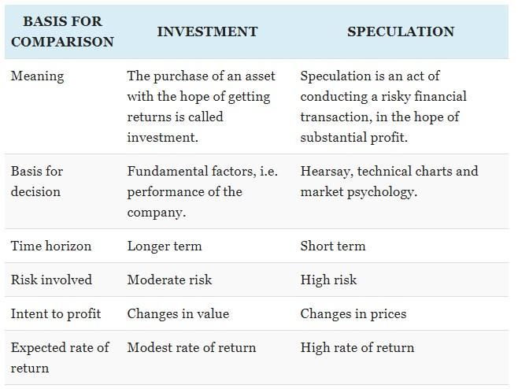

In the dynamic world of finance, distinguishing between investing, speculating, and algorithmic trading is essential for developing a coherent financial strategy. While these activities may seem similar due to their involvement in financial markets, they represent fundamentally different approaches with distinct objectives, methodologies, and risk profiles.

Investing is primarily about committing capital with the expectation of achieving long-term wealth growth or income. This approach involves careful analysis of company fundamentals, market trends, and economic indicators. Investors typically focus on minimizing risk through diversification and maintaining a long-term perspective to mitigate market volatility, aiming for steady returns over extended periods.



Contrastingly, speculating involves taking on higher risks with the potential for significant short-term gains. Speculators prioritize market price fluctuations and often capitalize on short-term market opportunities. This method frequently relies on market timing, technical analysis, and momentum trades. While the allure of substantial rewards exists, the high level of risk means that speculators can also face considerable losses.

Algorithmic trading, or "algo trading," harnesses technology and mathematical models to execute trades at high speeds and volumes. This method seeks to capitalize on market inefficiencies using various strategies, such as arbitrage and trend following. Although it provides advantages like precision and rapid execution, algorithmic trading is generally more accessible to institutional investors and technologically savvy traders due to the complexity and cost of development.

Each of these strategies—investing, speculating, and algo trading—carries its own set of potential risks and rewards. By understanding these differences, individuals and organizations can make more informed financial decisions that align with their goals and risk tolerance. Incorporating these strategies into a comprehensive portfolio can enhance financial performance, offering a balanced approach to managing market exposure and capital growth.

## Table of Contents

## Understanding Investing

Investing involves the allocation of capital with an expectation of deriving long-term growth or income, primarily focusing on wealth accumulation over extended periods. This financial strategy often encompasses a systematic analysis of company fundamentals, overarching market trends, and various economic indicators to enable informed decision-making. Such diligent evaluation seeks to identify viable investment opportunities that promise consistent returns while managing potential risks effectively.

Central to investing are a variety of financial instruments, including stocks, bonds, mutual funds, exchange-traded funds (ETFs), and real estate. Stocks represent ownership in a company and the potential for capital appreciation, driven by corporate earnings and market sentiment. Bonds, on the other hand, are debt securities offering fixed interest payments, thus providing a relatively stable income stream. Mutual funds and ETFs allow investors to pool resources, diversifying across various assets to mitigate risk. Real estate investments can provide both rental income and long-term property value appreciation.

A key objective in investing is to secure steady returns while minimizing exposure to risk, largely achieved through diversification. Diversification involves spreading investments across different asset classes, industries, and geographic regions, effectively reducing the impact of an adverse movement in any single investment. The principle is based on the adage, "Don't put all your eggs in one basket," and is crucial for preserving capital during market [volatility](/wiki/volatility-trading-strategies).

Patience and a long-term perspective are invaluable attributes for investors, helping to navigate the inevitable fluctuations in the financial markets. Such a stance mitigates the temptation to react hastily to short-term market aberrations, which can lead to suboptimal investment decisions. By remaining steady, investors can allow their investments the necessary time to recover from downturns and realize their full growth potential over time.

In essence, successful investing requires a disciplined approach, balancing the pursuit of returns with risk management. Through informed analysis, diversification, and a commitment to a long-term investment horizon, investors can enhance their potential for financial success while reducing the adverse impacts of market volatility.

## Defining Speculating

Speculating involves taking on higher levels of risk with the aim of achieving potentially significant returns over a short period. Unlike investing, which prioritizes long-term growth and income, speculation primarily focuses on market price fluctuations and the exploitation of short-term market inefficiencies. This approach often involves making bets on the future direction of prices, and speculators commonly use tools like market timing and technical analysis.

Market timing is an attempt to predict the future movements of asset prices and enter or [exit](/wiki/exit-strategy) positions accordingly. Technical analysis involves using historical price data and statistical indicators to identify patterns and signals for potential trades. These methods are integral to speculation and help traders make decisions based on short-term market behavior rather than long-term fundamentals.

Common instruments used in speculation include options, futures, foreign exchange ([forex](/wiki/forex-system)), and cryptocurrencies. Options provide the right, but not the obligation, to buy or sell an asset at a predetermined price within a specific timeframe. This allows speculators to capitalize on expected short-term price movements. Futures are standardized contracts to buy or sell an asset at a future date, at an agreed-upon price. Both options and futures provide leverage, meaning traders can control a large position with a relatively small amount of capital, increasing both the potential gains and risks.

Forex trading involves the buying and selling of currency pairs, with speculators aiming to profit from fluctuations in foreign exchange rates. Cryptocurrency speculation takes advantage of the high volatility and rapid price changes common in digital currencies, offering high potential returns but also considerable risk.

While speculation can result in substantial gains, it inherently carries a significant risk of loss. The leveraged nature of many speculative instruments means that while profits can be multiplied quickly, losses can also be exacerbated. As such, it requires a thorough understanding of the market, a clear strategy, and strict risk management practices. Overall, successful speculation hinges on the ability to make informed, quick decisions in the face of unpredictable market movements.

## The Rise of Algorithmic Trading

Algorithmic trading, often known as 'algo trading,' refers to the deployment of automated systems engineered to execute trades with remarkable speed and [volume](/wiki/volume-trading-strategy) efficiency. This modern trading strategy leverages advanced mathematical models and high-frequency trading ([HFT](/wiki/high-frequency-trading-strategies)) techniques to identify and capitalize on market inefficiencies, creating opportunities for profit that would be inaccessible within the constraints of human speed and calculation.

At the core of [algorithmic trading](/wiki/algorithmic-trading) is the utilization of algorithms—sets of rules or instructions designed to perform tasks, in this case, the execution of trade orders. These algorithms analyze a variety of parameters such as price, timing, and volume, enabling trades to be executed at optimal moments. For instance, a simple algorithm might use moving averages to determine when to buy or sell a security.

The landscape of algo trading includes several strategic approaches:

1. **Arbitrage**: This strategy exploits price differentials of identical or similar financial instruments across different markets or in different forms. The principle behind arbitrage is simple: buy low, sell high—simultaneously. An algorithm could automatically detect discrepancies and execute trades across multiple platforms to secure a profit.

2. **Market Making**: This involves quoting both buy and sell prices in a fast-moving market, expecting to make a profit on the spread between the two compensating for holding securities across short durations. Market makers provide liquidity to the markets and stabilize prices while generating profit from the bid-ask spread.

3. **Trend Following**: Algorithms programmed to identify trends in stock prices can execute buy orders when a particular upward trend is identified or sell orders when a downtrend is evident. These strategies do not require predictions or forecasts; rather, they respond automatically to real-time price movements.

4. **Statistical Arbitrage**: Utilizes mean reversion models that assume stock prices will revert to their historical mean over time. Traders often employ statistical and econometric methods to identify and exploit price differentials, which are indicative of future upward or downward movements.

Harnessing these strategies at scale requires not only a profound understanding of financial markets but also a robust infrastructure capable of processing large datasets and performing rapid calculations. Tools like Python, with libraries such as NumPy and pandas for data analysis, and frameworks like PyAlgoTrade or Backtrader, provide ideal environments for developing and testing trading algorithms. Here's an example of a simple moving average crossover strategy using Python:

```python
import pandas as pd

def moving_average_crossover_strategy(prices, short_window=40, long_window=100):
    signals = pd.DataFrame(index=prices.index)
    signals['price'] = prices
    signals['short_mavg'] = prices.rolling(window=short_window, min_periods=1, center=False).mean()
    signals['long_mavg'] = prices.rolling(window=long_window, min_periods=1, center=False).mean()
    signals['signal'] = 0.0

    signals['signal'][short_window:] = np.where(
        signals['short_mavg'][short_window:] > signals['long_mavg'][short_window:], 1.0, 0.0
    )

    signals['positions'] = signals['signal'].diff()
    return signals
```

While algo trading provides undeniable advantages like speed and precision, it's predominantly accessible to institutional investors or tech-savvy individual traders due to its complexity and the significant setup costs involved. Fundamental challenges include the need for constant algorithm refinement, comprehensive [backtesting](/wiki/backtesting), and ensuring legal compliance across various trading jurisdictions.

In conclusion, algorithmic trading represents a significant evolution in how trades are executed, offering speed and efficiency unmatched by manual trading methods. However, it necessitates a deep understanding of market dynamics and technological infrastructures, making it a domain primarily for those with the resources and expertise to harness its full potential.

## Comparing Investing, Speculating, and Algo Trading

Investing, speculating, and algorithmic trading each embody distinct methodologies, characterized by varying approaches, risk levels, and payoff timelines. Understanding these differences is crucial for selecting the strategy that best aligns with an individual's financial goals, risk tolerance, and market expertise.

**Investing** is characterized by a focus on long-term growth, stability, and capital preservation. Investors allocate their resources with the expectation of accruing incremental wealth over an extended period. This approach involves in-depth analysis of a company's fundamentals, trends in the market, and economic indicators. A diversified portfolio comprising stocks, bonds, mutual funds, exchange-traded funds (ETFs), and real estate is commonly employed to mitigate risk. The essence of investing lies in patience and a long-term perspective, which cushion against the volatility of markets. 

**Speculating**, in contrast, seeks rapid profits by exploiting short-term market fluctuations. This strategy entails higher risks as speculators aim to capitalize on price movements within condensed time frames. Tools such as market timing, technical analysis, and momentum trading are heavily relied upon. Typical speculative instruments include options, futures, foreign exchange (forex), and cryptocurrencies. While the potential for substantial returns is alluring, the risks are equally significant, with the possibility of incurring considerable losses.

**Algorithmic trading**, or algo trading, employs advanced technology to execute trades with high speed and volume. By utilizing mathematical models and high-frequency trading techniques, traders can identify and exploit market inefficiencies swiftly. This strategy can accommodate various trading tactics, including arbitrage, market making, trend following, and statistical arbitrage. Algo trading primarily benefits institutional investors and technologically adept individuals due to its complexity and substantial initial setup costs. While offering advantages in precision and speed, this approach necessitates a comprehensive understanding of financial algorithms and programming proficiency.

When deciding between these strategies, several factors must be considered: 

- **Financial Goals**: Long-term financial stability suggests an investing approach, whereas quick financial gains might favor speculating or algo trading.
- **Risk Tolerance**: Those with a higher tolerance for risk may gravitate towards speculating or algo trading, while risk-averse individuals might prefer investing.
- **Market Expertise**: Profound market understanding and technical skills are prerequisites for successful algo trading, whereas foundational knowledge may suffice for investing.

Ultimately, selecting an appropriate strategy involves aligning these considerations with personal financial objectives to optimize portfolio performance.

## Incorporating Strategies into Your Financial Plan

Incorporating investing, speculating, and algorithmic trading strategies into your financial plan requires careful consideration of your financial goals and risk tolerance. Each strategy offers unique potential benefits and risks, and understanding how to integrate them effectively is crucial for achieving a balanced portfolio.

First, it is essential to clearly define your financial objectives. Are you focused on long-term wealth accumulation, short-term gains, or enhancing trading efficiency through technology? Your goals will guide your strategic choices and help determine the right mix of strategies.

Diversification plays a pivotal role in managing risk and optimizing returns. By integrating a combination of investing, speculating, and algo trading strategies, you can balance the inherent risks and rewards of each approach. For instance, long-term investments in stocks or bonds can provide stable returns, while speculative trades in cryptocurrencies or options may offer higher potential gains but at increased risk. Algorithmic trading, with its emphasis on speed and precision, can complement both by exploiting market inefficiencies.

Staying informed and educated about each strategy is vital. Engaging with financial news, market analyses, and continuing education can keep you updated on relevant developments. Participation in courses or webinars, particularly those focusing on algo trading technologies, can enhance your understanding of complex mathematical models and data analytics used in this field.

Consulting with a financial advisor can provide personalized insights aligning your strategy with your financial objectives. Advisors can offer valuable perspectives, helping you navigate complexities and tailor a diversified approach that optimally balances risk and reward.

Continuous assessment and adjustment of your strategy are imperative as market conditions and personal circumstances evolve. Regularly reviewing your portfolio allows for timely rebalancing, ensuring that your strategic allocation continues to reflect your objectives and market realities. For technical strategies like algorithmic trading, this might involve refining algorithms or adjusting parameters to maintain efficacy in changing environments.

In summary, carefully integrating and managing investing, speculating, and algorithmic trading within your financial plan requires ongoing education, strategic diversification, professional advice, and adaptive management. These elements together can empower you to achieve your financial goals effectively.

## Conclusion

Investing, speculating, and algorithmic trading are distinct strategies within the financial markets, each providing unique opportunities for portfolio enhancement. Understanding these differences is crucial for making informed decisions that can optimize portfolio performance. 

Investing focuses on long-term growth with a priority on stability and capital preservation. This strategy requires patience and a thorough understanding of market fundamentals, potentially minimizing the impact of market volatility over time. By contrast, speculating aims for short-term profits through higher-risk maneuvers, demanding keen market timing and a tolerance for volatility. This approach may yield rapid returns but involves the risk of significant losses. 

Algorithmic trading, or algo trading, leverages technology to execute trades with high precision and speed, exploiting market inefficiencies across various strategies. While offering efficiency and speed advantages, algo trading necessitates a sophisticated understanding of both the market and the underlying technology, alongside notable setup costs.

Each of these approaches can fit into a comprehensive financial plan, provided that the associated risks are well-understood and managed. By aligning your chosen strategy with your financial goals and risk tolerance, you can confidently navigate the complexities of the financial markets. Employing appropriate knowledge and tools can facilitate a dynamic approach, adapting to the evolving nature of financial landscapes.

Continuous education and a proactive stance are essential. Maintaining alignment with your financial objectives and being adaptable to changing market conditions will further empower your financial strategy, ensuring that it remains robust and impactful over time.

## References & Further Reading

[1]: Bergstra, J., Bardenet, R., Bengio, Y., & Kégl, B. (2011). ["Algorithms for Hyper-Parameter Optimization."](https://papers.nips.cc/paper/4443-algorithms-for-hyper-parameter-optimization) Advances in Neural Information Processing Systems 24.

[2]: ["Advances in Financial Machine Learning"](https://www.amazon.com/Advances-Financial-Machine-Learning-Marcos/dp/1119482089) by Marcos Lopez de Prado

[3]: ["Evidence-Based Technical Analysis: Applying the Scientific Method and Statistical Inference to Trading Signals"](https://www.amazon.com/Evidence-Based-Technical-Analysis-Scientific-Statistical/dp/0470008741) by David Aronson

[4]: ["Machine Learning for Algorithmic Trading"](https://github.com/stefan-jansen/machine-learning-for-trading) by Stefan Jansen

[5]: ["Quantitative Trading: How to Build Your Own Algorithmic Trading Business"](https://github.com/LucindaYa/quant-resources/blob/master/Quantitative%20Trading%20How%20to%20Build%20Your%20Own%20Algorithmic%20Trading%20Business.pdf) by Ernest P. Chan