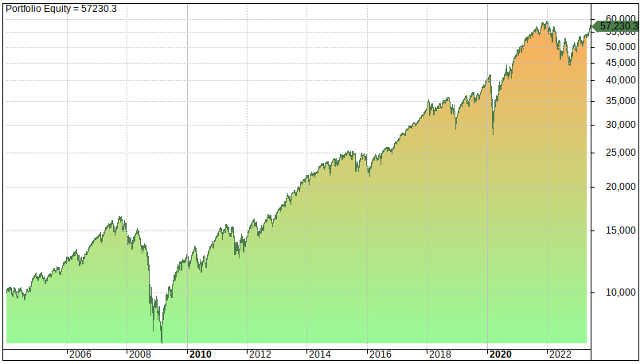

## Table of Contents

## What are small-cap and large-cap companies?

Small-cap companies are businesses that have a relatively small market capitalization, usually between $300 million and $2 billion. These companies are often younger and more focused on growth. Because they are smaller, they can be riskier investments, but they also have the potential for higher returns. Small-cap stocks can be more volatile and less liquid than larger companies, meaning their stock prices can change a lot and they might be harder to buy or sell quickly.

Large-cap companies, on the other hand, have a market capitalization of $10 billion or more. These are typically well-established companies that are leaders in their industries. They are often seen as more stable and less risky investments because they have a proven track record and more resources. Large-cap stocks tend to be more liquid, making them easier to buy and sell. While they might not offer the same high growth potential as small-cap companies, they can provide steady returns and are often included in major stock indexes.

## How is the market capitalization of a company determined?

Market capitalization, or market cap, is how much a company is worth on the stock market. It is calculated by taking the total number of a company's shares and multiplying that by the current price of one share. For example, if a company has 1 million shares and each share costs $50, the market cap would be $50 million.

This number changes all the time because the stock price can go up or down. If more people want to buy the stock, the price might go up, making the market cap bigger. If fewer people want to buy it, the price might go down, making the market cap smaller. Market cap is important because it gives investors an idea of the company's size and how it compares to other companies.

## What are the general risk levels associated with small-cap and large-cap companies?

Small-cap companies are generally seen as riskier investments. They are usually smaller and newer, so they might not have as much money or as many resources as bigger companies. This means they can have a harder time dealing with problems like economic downturns or changes in their industry. Because they are smaller, their stock prices can go up and down a lot, which makes them more volatile. But, because they are riskier, they also have the chance to grow a lot and give investors bigger returns if things go well.

Large-cap companies are usually seen as less risky. These companies are bigger and have been around for a long time, so they are more stable. They have more money and resources, which helps them handle problems better. Their stock prices don't usually change as much as small-cap companies, so they are less volatile. While they might not grow as fast as small-cap companies, they can still give steady returns over time. This makes them a safer choice for many investors.

## How does the volatility of stock prices differ between small-cap and large-cap companies?

Small-cap companies usually have stock prices that go up and down a lot more than large-cap companies. This is because they are smaller and newer, so they don't have as much money or as many resources. When things happen in the economy or their industry, it can affect them a lot more. Also, because fewer people trade their stocks, any buying or selling can make the price change a lot. This makes small-cap stocks more volatile, which means their prices can be riskier and harder to predict.

Large-cap companies, on the other hand, have stock prices that don't change as much. They are bigger and have been around longer, so they are more stable. They have more money and resources to handle problems, so their stock prices don't swing as wildly. Because more people trade their stocks, the buying and selling doesn't affect the price as much. This makes large-cap stocks less volatile, which means they are generally safer and more predictable for investors.

## What are the potential returns from investing in small-cap versus large-cap companies?

Investing in small-cap companies can offer the chance for bigger returns. Because these companies are smaller and newer, they have more room to grow. If they do well, their stock prices can go up a lot, giving investors high returns. But, because they are riskier, there's also a bigger chance that things might not go well, and investors could lose money. So, while the potential for high returns is there, it comes with more risk.

On the other hand, large-cap companies usually offer more steady but smaller returns. These companies are bigger and have been around for a long time, so they are more stable. Their stock prices don't go up as much as small-cap companies, but they also don't go down as much. This means that while the returns might not be as exciting, they are more predictable and safer. Large-cap companies are often a good choice for investors who want to grow their money slowly and steadily over time.

## How does the liquidity of small-cap stocks compare to large-cap stocks?

Small-cap stocks usually have less [liquidity](/wiki/liquidity-risk-premium) than large-cap stocks. This means it can be harder to buy or sell small-cap stocks quickly. Because fewer people trade these stocks, it might take longer to find someone to buy or sell them to. This can be a problem if you need to get your money out of the stock fast. Also, when you do trade small-cap stocks, the price can change a lot because there are fewer trades happening.

Large-cap stocks, on the other hand, have more liquidity. This means it's easier to buy or sell them quickly. Because more people trade these stocks, you can usually find someone to trade with right away. This makes it easier to get your money out of the stock if you need to. Also, because there are so many trades, the price doesn't change as much when you buy or sell.

## What role do small-cap and large-cap companies play in diversifying an investment portfolio?

Small-cap companies can help make your investment portfolio more diverse. When you add small-cap stocks, you're putting some of your money into smaller, newer companies that might grow a lot. This can balance out the more stable but slower-growing large-cap stocks in your portfolio. Because small-cap stocks can be riskier and their prices can go up and down a lot, they add a different kind of risk and reward to your investments. This can help protect your money if other parts of your portfolio aren't doing well.

Large-cap companies also play a big role in diversifying your portfolio. These big, well-known companies are usually more stable and less risky than small-cap companies. When you invest in large-cap stocks, you're putting your money into companies that have been around for a long time and are leaders in their industries. This can help steady your portfolio because their stock prices don't change as much. Having a mix of both small-cap and large-cap stocks can help you spread out your risk and possibly get better returns over time.

## How do economic cycles affect the performance of small-cap and large-cap companies differently?

Economic cycles can affect small-cap and large-cap companies in different ways. Small-cap companies are usually more sensitive to changes in the economy. When the economy is doing well and growing, small-cap companies can do really well because they have more room to grow. But when the economy is not doing well, like during a recession, small-cap companies can have a harder time. They might not have as much money or resources to handle problems, so their stock prices can go down a lot.

Large-cap companies are usually less affected by economic cycles. Because they are bigger and have been around longer, they can handle tough times better. They have more money and resources to deal with problems, so their stock prices don't change as much during economic ups and downs. When the economy is doing well, large-cap companies might not grow as fast as small-cap companies, but they can still do well and give steady returns.

## What are the key financial metrics to consider when comparing the investment risk of small-cap and large-cap companies?

When comparing the investment risk of small-cap and large-cap companies, one key financial metric to consider is the debt-to-equity ratio. This ratio tells you how much a company is using borrowed money compared to its own money. Small-cap companies often have higher debt-to-equity ratios because they might need to borrow more to grow. This can make them riskier because if they can't pay back their debts, especially during tough economic times, their stock prices can drop a lot. Large-cap companies usually have lower debt-to-equity ratios because they have more of their own money and can handle their debts better, making them less risky.

Another important metric is the price-to-earnings (P/E) ratio, which shows how much investors are willing to pay for a company's earnings. Small-cap companies often have higher P/E ratios because investors are betting on their future growth, which can make them riskier. If the growth doesn't happen, the stock price can fall sharply. Large-cap companies usually have lower P/E ratios because they are more established and their earnings are more predictable. This makes them less risky because investors know what to expect. 

Lastly, consider the [volatility](/wiki/volatility-trading-strategies) of earnings. Small-cap companies can have more ups and downs in their earnings because they are smaller and more affected by changes in the economy. This makes them riskier because their future earnings are harder to predict. Large-cap companies, on the other hand, usually have more stable earnings because they are bigger and can handle economic changes better. This makes them less risky because their future earnings are easier to predict.

## How does the regulatory environment impact the risk profile of small-cap versus large-cap companies?

The regulatory environment can affect small-cap and large-cap companies differently. Small-cap companies often have a harder time dealing with regulations because they don't have as much money or as many people to handle them. New rules or changes in laws can be a big problem for small-cap companies because they might not have the resources to quickly adapt. This can make them riskier investments because if they can't follow the rules, they might get in trouble or have to spend a lot of money to fix things, which can hurt their stock prices.

Large-cap companies usually handle the regulatory environment better. They have more money and people to deal with new rules and changes in laws. This means they can adapt more easily and are less likely to get in big trouble for not following the rules. Because they can handle regulations better, large-cap companies are often seen as less risky investments. Their stock prices don't usually drop as much because of regulatory issues, making them a safer choice for many investors.

## What are the historical performance trends of small-cap and large-cap stocks during different market conditions?

Small-cap stocks have often done really well when the economy is growing. Because they are smaller and newer, they can grow a lot faster than big companies when things are going well. This means their stock prices can go up a lot during good economic times. But, small-cap stocks can also do really badly when the economy is not doing well. During a recession or when the market is down, small-cap stocks can lose a lot of value because they don't have as much money or resources to handle tough times.

Large-cap stocks, on the other hand, usually do better during tough economic times. Because they are bigger and have been around longer, they can handle problems better. Their stock prices don't go up as much as small-cap stocks during good times, but they also don't go down as much during bad times. This makes them a safer choice for many investors who want to keep their money safe during different market conditions. Over the long term, large-cap stocks can give steady returns, even if they don't have the big ups and downs of small-cap stocks.

## How can advanced risk management strategies be applied differently to small-cap and large-cap investments?

When it comes to small-cap investments, advanced risk management strategies often focus on spreading out the risk because these stocks can go up and down a lot. One way to do this is by using stop-loss orders, which automatically sell the stock if it drops to a certain price. This can help limit how much money you might lose if the stock price falls a lot. Another strategy is to not put all your money in one small-cap stock but to spread it out over many different small-cap stocks. This way, if one stock does badly, it won't hurt your whole investment as much. Also, keeping a close eye on the news and the economy can help you make quick decisions to sell or buy more based on how things are going.

For large-cap investments, risk management strategies are usually about keeping things steady because these stocks don't change as much. One strategy is to use diversification, which means not just investing in large-cap stocks but also in other types of investments like bonds or real estate. This can help balance out any losses from the stocks. Another way is to use dollar-cost averaging, where you invest a set amount of money at regular times, no matter what the stock price is. This can help you buy more shares when prices are low and fewer when prices are high, smoothing out the ups and downs. Keeping a long-term view is also important because large-cap stocks tend to grow slowly but steadily over time.

## References & Further Reading

[1]: Ibbotson Associates. "Stocks, Bonds, Bills, and Inflation Yearbook." 

[2]: ["Advances in Financial Machine Learning"](https://www.amazon.com/Advances-Financial-Machine-Learning-Marcos/dp/1119482089) by Marcos Lopez de Prado

[3]: ["Evidence-Based Technical Analysis: Applying the Scientific Method and Statistical Inference to Trading Signals"](https://www.amazon.com/Evidence-Based-Technical-Analysis-Scientific-Statistical/dp/0470008741) by David Aronson

[4]: ["Machine Learning for Algorithmic Trading"](https://github.com/stefan-jansen/machine-learning-for-trading) by Stefan Jansen

[5]: ["Quantitative Trading: How to Build Your Own Algorithmic Trading Business"](https://github.com/LucindaYa/quant-resources/blob/master/Quantitative%20Trading%20How%20to%20Build%20Your%20Own%20Algorithmic%20Trading%20Business.pdf) by Ernest P. Chan