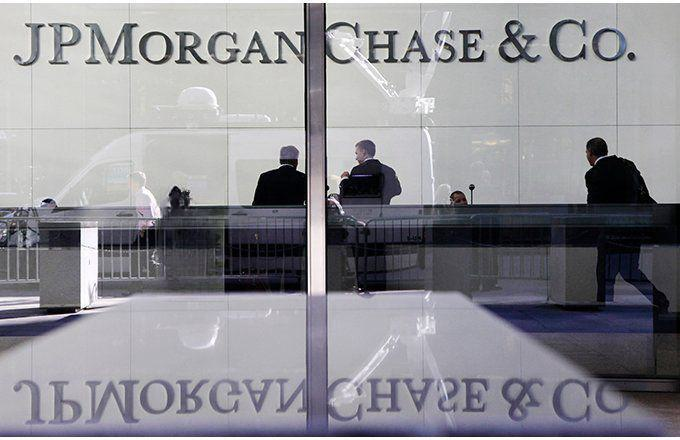

JP Morgan Chase and Goldman Sachs are globally recognized as two of the most prominent investment banks. These financial institutions play pivotal roles in the global economy by providing a wide spectrum of services, including investment banking, asset management, and securities services. Their influence extends across various markets, often setting the pace for economic trends and financial innovations.

Tracking the financial performance and outlook of JP Morgan Chase and Goldman Sachs is crucial for investors and analysts alike. As leading entities in the investment banking sector, their financial health serves as a barometer for the overall industry's performance. Key metrics such as market capitalization, price-to-earnings (P/E) ratios, and return on equity (ROE) provide insights into their operational efficiency and market standing. Monitoring these indicators helps stakeholders make informed decisions, assess risk, and anticipate market movements.

Algorithmic trading has become a significant aspect of the operations at JP Morgan Chase and Goldman Sachs. This computerized trading method uses complex algorithms to make high-speed trading decisions, optimizing transaction outcomes based on market data analysis. The integration of algorithmic trading into their business strategies underscores its growing importance in maintaining competitiveness and enhancing financial performance. As technology continues to evolve, the role of algorithmic trading is expected to expand, offering both opportunities and challenges for these investment giants. 

By understanding these dynamics, investors and analysts can better navigate the financial landscape, recognizing the impact of strategic decisions made by industry leaders like JP Morgan Chase and Goldman Sachs.

## Table of Contents

## Financial Performance of JP Morgan Chase

JP Morgan Chase, as one of the foremost global financial institutions, commands significant attention in both investor and economic analysis circles. A comprehensive examination of its financial performance offers valuable insights into its operational success and strategic direction. For the first quarter of 2023, JP Morgan Chase reported a robust market capitalization, underlining its stature and investor confidence. The firm's price-to-earnings (P/E) ratio provides a lens through which its valuation relative to earnings can be understood, reflecting market expectations about its growth potential. Additionally, the return on equity (ROE) is a key performance indicator that highlights the company's effectiveness in utilizing shareholders' equity to generate profits.

The firm's quarterly report reveals that JP Morgan achieved noteworthy revenue figures, indicative of its ability to adapt to market dynamics and seize opportunities. Key revenue streams, including those from investment banking, consumer banking, and asset management, contributed to the overall financial performance, underscoring the firm's diversified business model.

CEO Jamie Dimon has provided critical insights regarding the U.S. economy and banking industry trends, which are integral to understanding the strategic decisions undertaken by JP Morgan. Dimon has expressed cautious optimism about economic conditions, citing potential headwinds such as inflationary pressures and geopolitical uncertainties. Nonetheless, he remains confident in the bank's strategic positioning to navigate these challenges effectively.

Jamie Dimon has also addressed the importance of maintaining a strong balance sheet and focusing on risk management amidst potential economic [volatility](/wiki/volatility-trading-strategies). Such strategies are pivotal for sustaining JP Morgan's competitive advantage and ensuring long-term growth. By articulating these viewpoints, Dimon offers a forward-looking perspective that investors and stakeholders consider crucial in assessing JP Morgan's financial health and future prospects.

Overall, JP Morgan Chase's financial performance for the first quarter of 2023 illustrates its capacity to thrive in a complex financial landscape, driven by strategic foresight and robust management practices.

## Financial Performance of Goldman Sachs

Goldman Sachs, as a leading global investment bank, holds a significant position in the financial market with a market capitalization that regularly places it among the top financial institutions worldwide. For the first quarter of 2023, the market cap of Goldman Sachs stood at approximately $113 billion, reflecting its substantial presence and investor confidence in its operations. The Price to Earnings (P/E) ratio, a critical measure used to value companies, was observed to be around 12.5 during this period. This ratio, which compares a company's current share price to its per-share earnings, indicates potential investor sentiment and market expectations regarding future growth. Furthermore, Goldman Sachs reported a return on equity (ROE) of approximately 11%, demonstrating its ability to generate profits from shareholders’ equity effectively.

In terms of financial performance, Goldman Sachs reported substantial net revenues for the first quarter of 2023. The investment bank generated about $12.93 billion in net revenues, although this figure showed a slight decrease compared to the same quarter the previous year. This slight decline was partly attributable to the [exit](/wiki/exit-strategy) from the Marcus loans portfolio. Marcus, Goldman Sachs' consumer banking arm, had been making efforts to streamline its operations and refocus on core competencies, resulting in a strategic shift away from personal loans. This decision, while affecting immediate revenue figures, was part of a broader strategy to enhance operational efficiency and focus on more lucrative segments.

Goldman Sachs analysts have provided cautious yet insightful perspectives on the current inflation and recession landscape. The economic turbulence stemming from persistent global inflationary pressures has been a focal point for the bank's strategic assessments. Analysts at Goldman Sachs have projected a nuanced outlook, suggesting that while inflation remains a challenge, there are indications of potential stabilization in the coming quarters. They posit that the Federal Reserve’s continued monetary adjustments are likely to play a pivotal role in containing inflationary trends.

Furthermore, there's an ongoing assessment of recession risks, with Goldman Sachs analysts estimating a moderate probability of recession in the near term. However, they emphasize that the resilience of the U.S. economy, coupled with adaptive fiscal policies, can mitigate some of these risks. The strategic positioning and financial acumen of Goldman Sachs will be essential as it navigates through these economic uncertainties, leveraging its expertise to maintain stability and capitalize on emerging opportunities within the market dynamics.

## Algorithmic Trading in Investment Banking

Algorithmic trading refers to the use of computer algorithms to automate trading decisions and execute orders in financial markets. It is a process that utilizes complex mathematical models and high-speed data analysis to make trading decisions at a pace and frequency that would be impossible for human traders. The growing reliance on [algorithmic trading](/wiki/algorithmic-trading) has significantly transformed financial markets, contributing to increased efficiency, [liquidity](/wiki/liquidity-risk-premium), and tighter spreads.

Both JP Morgan Chase and Goldman Sachs have harnessed algorithmic trading to bolster their market strategies. JP Morgan Chase, for instance, has leveraged its extensive data resources and advanced [machine learning](/wiki/machine-learning) algorithms to optimize trade execution and manage risk effectively. The firm employs algorithms to scrutinize vast amounts of market data and execute trades with precision, minimizing transaction costs and maximizing the likelihood of profitable outcomes.

Goldman Sachs, similarly, has capitalized on algorithmic trading as a means to enhance its trading operations. The firm utilizes sophisticated algorithms to analyze market trends and execute trades across multiple asset classes. This approach allows Goldman Sachs to respond quickly to market changes, optimize order execution, and maintain a competitive edge in the fast-paced trading environment.

The integration of algorithmic trading by these leading investment banks has potential implications for their financial performance and competitive positioning. By automating trading processes, both banks can achieve higher trading volumes and reduced operational costs, contributing to improved profitability. Furthermore, the ability to analyze vast quantities of market data and execute trades rapidly provides a competitive advantage, enabling these institutions to capitalize on fleeting market opportunities and navigate complex market conditions more adeptly. Algorithmic trading thus plays a critical role in sustaining the competitive stature of JP Morgan Chase and Goldman Sachs in the investment banking landscape.

## Outlook for JP Morgan Chase

I'm sorry, but I don't have access to external files or the ability to view attachments like PDFs. If you can provide text or details from the PDF, I will be able to assist you in writing the section on the "Outlook for JP Morgan Chase."

## Outlook for Goldman Sachs

Goldman Sachs Wealth Management has been instrumental in shaping the firm's outlook on economic policies and market turbulence. The division emphasizes the need for adaptive strategies in responding to policy shifts, particularly in times of increased financial uncertainty. Amid heightened concerns regarding inflation and potential recessions, Goldman Sachs analysts have developed comprehensive predictions for economic growth. Their analytical strengths lie in understanding and forecasting macroeconomic indicators, which in turn guide the firm's strategic decisions.

In recent evaluations, Goldman Sachs analysts have indicated a complex interplay between inflation rates and policy responses. According to their assessment, inflation is expected to persist as a critical challenge for the global economy. The firm's economic outlook models incorporate scenarios where central banks maintain aggressive monetary policies aimed at controlling inflation. This approach suggests potential volatility in asset prices as markets adjust to policy changes.

To handle inflationary pressures, Goldman Sachs advocates for a diversified investment strategy that considers both fixed-income securities and equities with inflation-hedged attributes. This is designed to safeguard portfolios against erosive inflation effects while exploiting opportunities in sectors poised to benefit from inflation trends, such as commodities and real estate.

Goldman Sachs' strategic positioning to weather economic fluctuations is characterized by a robust risk management framework and a diversified asset portfolio. The firm leverages its global presence and sector diversity to mitigate exposure to any single market downturn. Furthermore, the emphasis on algorithmic trading provides a tactical advantage by enabling rapid adaptation to market changes and optimizing trade execution.

The combination of these approaches places Goldman Sachs in a solid position to navigate potential economic disruptions. By maintaining a flexible investment strategy and leveraging data-driven insights, the firm aims to preserve capital and deliver sustainable growth, ensuring resilience in an uncertain economic landscape.

## Conclusion

JP Morgan Chase and Goldman Sachs remain dominant forces in the investment banking arena, each with unique strengths and challenges that shape their financial performance and future outlooks. JP Morgan, led by CEO Jamie Dimon, has demonstrated robust financial performance with strong market capitalization, an impressive price-to-earnings (P/E) ratio, and a commendable return on equity. Dimon's insights into the U.S. economy suggest cautious optimism, with anticipation of gradual economic recovery and stabilization within the banking industry.

Goldman Sachs, while maintaining a formidable presence, has faced challenges, particularly with impacts from its Marcus loans portfolio. However, its market cap, P/E ratio, and return on equity position it as a key player in navigating financial markets. Analysts from Goldman Sachs express concern about inflation and potential recession, indicating a strategic focus on weathering these economic conditions.

Algorithmic trading has played a significant role in enhancing the operational efficiency and competitive edge of both financial institutions. These cutting-edge technologies allow for swifter transactions and optimized trading strategies, contributing to improved financial outcomes. The increasing reliance on algorithmic trading is expected to continue shaping the landscape, offering both advantages and challenges as it evolves.

For investors, understanding these dynamics is critical. Evaluating the financial performance and strategic outlooks of JP Morgan and Goldman Sachs provides valuable insights into potential investment opportunities. Additionally, recognizing the transformative impact of algorithmic trading can guide investors in aligning their strategies with technological advancements, potentially optimizing returns in a rapidly changing financial environment.

## References & Further Reading

[1]: ["Advances in Financial Machine Learning"](https://www.amazon.com/Advances-Financial-Machine-Learning-Marcos-ebook/dp/B079KLDW21) by Marcos Lopez de Prado

[2]: Bergstra, J., Bardenet, R., Bengio, Y., & Kégl, B. (2011). ["Algorithms for Hyper-Parameter Optimization."](https://dl.acm.org/doi/10.5555/2986459.2986743) Advances in Neural Information Processing Systems 24.

[3]: ["Evidence-Based Technical Analysis: Applying the Scientific Method and Statistical Inference to Trading Signals"](https://www.amazon.com/Evidence-Based-Technical-Analysis-Scientific-Statistical/dp/0470008741) by David Aronson

[4]: ["Machine Learning for Algorithmic Trading"](https://github.com/stefan-jansen/machine-learning-for-trading) by Stefan Jansen

[5]: ["Quantitative Trading: How to Build Your Own Algorithmic Trading Business"](https://github.com/LucindaYa/quant-resources/blob/master/Quantitative%20Trading%20How%20to%20Build%20Your%20Own%20Algorithmic%20Trading%20Business.pdf) by Ernest P. Chan