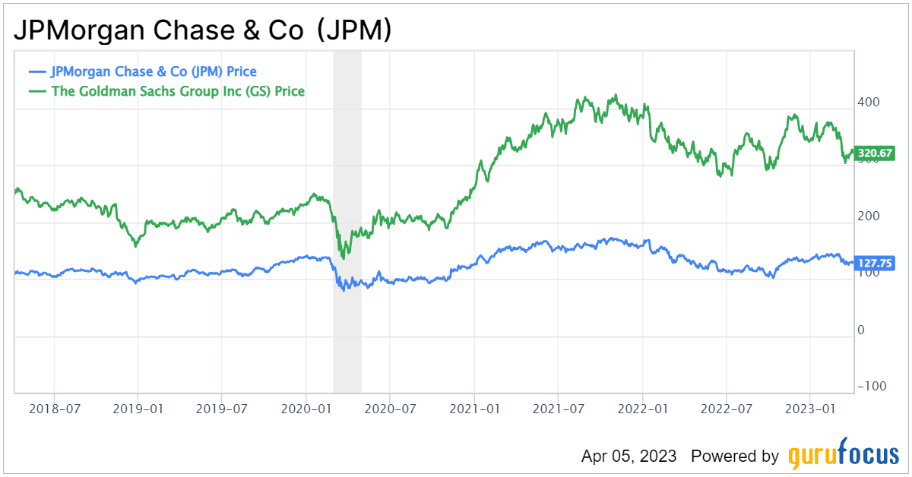

## Table of Contents

## What are JP Morgan and Goldman Sachs?

JP Morgan and Goldman Sachs are two big banks in the United States. JP Morgan is known for helping people and businesses with their money. They offer services like checking accounts, loans, and investment advice. They also help big companies when they need to borrow money or want to grow their business. JP Morgan is very old and has been around since the 1800s.

Goldman Sachs is another big bank, but it focuses more on helping big companies and rich people with their money. They are famous for giving advice on big business deals, like when one company wants to buy another. They also help companies raise money by selling stocks and bonds. Goldman Sachs started in the late 1800s and is known for being very smart about money and investments.

## How do JP Morgan and Goldman Sachs generate their revenue?

JP Morgan makes money in different ways. They earn money from the fees they charge for services like checking accounts and credit cards. They also make money from the interest they get when they lend money to people and businesses. Another big way JP Morgan makes money is by investing in stocks, bonds, and other financial products. They buy and sell these things to make a profit. They also help big companies raise money by selling stocks and bonds, and they get paid for this service.

Goldman Sachs also makes money in several ways. A lot of their money comes from helping big companies with their business deals. They get paid for giving advice on things like mergers and acquisitions, where one company buys another. They also make money by trading stocks, bonds, and other financial products. Like JP Morgan, they help companies raise money by selling stocks and bonds, and they earn fees for this. Goldman Sachs also manages money for rich people and big organizations, and they get paid for managing these investments well.

## What are the key financial metrics used to compare the performance of JP Morgan and Goldman Sachs?

To compare the performance of JP Morgan and Goldman Sachs, people often look at key financial metrics like revenue, net income, and return on equity (ROE). Revenue shows how much money the banks make from their services and investments. Net income is what's left after they pay all their expenses, and it shows how profitable they are. Return on equity tells us how well the banks are using the money their shareholders have invested to make a profit. These metrics help investors see which bank is doing better financially.

Another important metric is the efficiency ratio, which shows how well the banks manage their costs. A lower efficiency ratio means the bank is spending less money to make each dollar of revenue, which is good. People also look at the banks' asset quality, which is measured by things like the non-performing loan ratio. This tells us how many loans the banks have given out that people aren't paying back. A lower non-performing loan ratio means the bank's loans are healthier. By comparing these metrics, investors can get a clear picture of how JP Morgan and Goldman Sachs are doing and which one might be a better investment.

## How have JP Morgan and Goldman Sachs performed financially over the past five years?

Over the past five years, JP Morgan has shown strong financial performance. Their revenue has grown steadily, reaching over $128 billion in 2022 from about $115 billion in 2018. Their net income has also increased, going from around $32 billion in 2018 to over $37 billion in 2022. JP Morgan's return on equity (ROE) has been solid, staying around 15-17% during this period. Their efficiency ratio has been around 55-60%, showing they manage their costs well. JP Morgan's asset quality has remained strong, with a low non-performing loan ratio, which means most of their loans are being paid back on time.

Goldman Sachs has also performed well financially over the past five years, though their business model is different from JP Morgan's. Their revenue has fluctuated a bit but was around $47 billion in 2022, down from a peak of about $53 billion in 2021 but up from $36 billion in 2018. Their net income has varied, reaching over $21 billion in 2021 but dropping to around $11 billion in 2022. Goldman Sachs' return on equity has been higher than JP Morgan's, often around 17-20%. Their efficiency ratio has been higher, around 65-70%, indicating higher costs relative to revenue. Goldman Sachs' asset quality has been good, though their focus on investment banking and trading can lead to more [volatility](/wiki/volatility-trading-strategies) in their financial results.

## What are the main differences in the business models of JP Morgan and Goldman Sachs?

JP Morgan has a business model that focuses on a wide range of financial services for both everyday people and big businesses. They offer things like checking and savings accounts, credit cards, and loans to regular people. For big companies, they provide services like helping them borrow money or grow their business. JP Morgan also invests in stocks, bonds, and other financial products to make money. This wide range of services helps JP Morgan earn money in many different ways, making their income more stable.

Goldman Sachs, on the other hand, has a business model that focuses more on helping big companies and rich people with their money. They are well-known for giving advice on big business deals, like when one company wants to buy another. They also help companies raise money by selling stocks and bonds. Goldman Sachs makes a lot of money from trading stocks, bonds, and other financial products. Their focus on big deals and investments can make their income more up and down, but it can also lead to big profits when things go well.

## How do JP Morgan and Goldman Sachs approach risk management differently?

JP Morgan takes a careful approach to managing risk. They have a lot of different businesses, like banking for regular people and big companies, so they spread their risk around. This means if one part of their business does not do well, the other parts can help keep things stable. JP Morgan also uses a lot of rules and checks to make sure they are not taking too much risk. They look at things like how likely people are to pay back their loans and try to keep their risks low and under control.

Goldman Sachs, on the other hand, is known for taking bigger risks, especially in their trading and investment banking businesses. They often deal with big, complicated financial products that can make a lot of money but can also lose a lot. Goldman Sachs uses fancy computer models and smart people to try to manage these risks. They are always trying to balance the chance of making big profits with the chance of big losses, which makes their approach to risk management more exciting and sometimes more dangerous than JP Morgan's.

## What are the recent strategic initiatives taken by JP Morgan and Goldman Sachs?

JP Morgan has been focusing on growing its digital services to make banking easier for people. They've put a lot of money into their online and mobile banking apps, so people can do their banking from their phones anytime. They also want to help more small businesses, so they've started new programs and loans to support them. JP Morgan is also working on getting bigger in other countries, especially in places like Asia and Europe, to make more money from different parts of the world.

Goldman Sachs has been trying to make more money from regular people, not just big companies and rich people. They started a new bank called Marcus that offers savings accounts and loans to everyday people. They're also using new technology, like [artificial intelligence](/wiki/ai-artificial-intelligence), to make their trading and investment services better. Goldman Sachs wants to keep being a leader in big business deals and investments, so they're always looking for new ways to help companies grow and make money.

## How do JP Morgan and Goldman Sachs compare in terms of market share in their key sectors?

JP Morgan is a big player in the banking world, especially in the United States. They have a large share of the market when it comes to regular banking services like checking accounts, credit cards, and loans for people and small businesses. They also do well in investment banking, helping big companies borrow money or sell stocks and bonds. In the U.S., JP Morgan is often one of the top banks in these areas, with a strong presence that many people and businesses trust.

Goldman Sachs, on the other hand, is known for its strong position in investment banking and trading. They have a big share of the market when it comes to helping big companies with their business deals, like mergers and acquisitions. They also do a lot of trading in stocks, bonds, and other financial products, where they are considered leaders. While Goldman Sachs is trying to grow in regular banking services through their Marcus brand, their market share in this area is still smaller compared to JP Morgan.

## What are the future growth prospects for JP Morgan and Goldman Sachs based on current market trends?

JP Morgan has good chances to grow in the future because they are working on making their digital services better. More and more people want to do their banking on their phones, so JP Morgan's focus on improving their online and mobile apps can help them get more customers. They also want to help more small businesses, which can be a big part of their growth. Plus, they are looking to grow in other countries, especially in Asia and Europe, which can bring in more money from different parts of the world. All these things together can help JP Morgan keep getting bigger and making more money.

Goldman Sachs also has good growth prospects, but they are focusing on different areas. They started a new bank called Marcus to offer banking services to regular people, not just big companies and rich people. This can help them grow their business in a new way. They are also using new technology like artificial intelligence to make their trading and investment services better, which can help them stay ahead in their main business areas. Since Goldman Sachs is good at helping with big business deals and investments, they can keep growing by finding new ways to help companies make money.

## How do JP Morgan and Goldman Sachs differ in their approach to digital transformation and technology adoption?

JP Morgan is really working hard on making their banking services digital. They want to make it easy for people to use their phones or computers for banking. They are spending a lot of money to make their apps better and more user-friendly. This way, more people can do their banking anytime and anywhere. JP Morgan also uses technology to help small businesses grow, like by offering them special loans and programs online. They believe that by focusing on digital services, they can keep growing and serving more customers.

Goldman Sachs is also using technology but in a different way. They started a new bank called Marcus to offer digital banking services to regular people. This is a big change for them because they used to focus mostly on big companies and rich people. They are also using new technology like artificial intelligence to make their trading and investment services better. This helps them stay ahead in their main business areas. Goldman Sachs wants to use technology to find new ways to help companies make money and grow, which is a bit different from JP Morgan's focus on making banking easier for everyone.

## What are the potential regulatory challenges facing JP Morgan and Goldman Sachs in the coming years?

JP Morgan and Goldman Sachs might face some tough rules in the future. The government always keeps an eye on big banks to make sure they are not taking too many risks or treating people unfairly. One big challenge could be new rules about how much money banks need to keep in reserve. If the government says banks need to keep more money on hand, it might be harder for JP Morgan and Goldman Sachs to make loans or invest in new projects. They might also have to follow new rules about how they use people's data when they offer digital services, which could make things more complicated and expensive.

Another challenge could be rules about how banks can trade and invest. Goldman Sachs, which does a lot of trading, might find it harder to make money if the government puts limits on what they can do. JP Morgan, which helps a lot of regular people with their banking, might have to change how they offer services like checking accounts and credit cards if new consumer protection laws come out. Both banks will need to watch out for these changes and be ready to adjust their business plans to keep making money and following the rules.

## How might geopolitical events impact the future financial performance of JP Morgan and Goldman Sachs?

Geopolitical events like wars, trade disagreements, or changes in government can really shake things up for big banks like JP Morgan and Goldman Sachs. If there's a war or a big fight between countries, it can make people and businesses feel unsure about the future. This might make them less likely to borrow money or invest, which can hurt the banks' profits. For example, if the U.S. and China have a big trade fight, it might make it harder for JP Morgan to help businesses in those countries grow. Goldman Sachs might also find it tougher to do big deals or trade if things get too uncertain.

On the other hand, geopolitical events can also create new chances for banks. If a country's government changes and starts new projects or businesses, JP Morgan and Goldman Sachs might be able to help with loans or investments. For instance, if a new government in a big country wants to build more roads and schools, the banks could help finance these projects and make money from it. But they need to be careful because these events can also bring new risks. If things go wrong in a country where they have a lot of business, it could lead to big losses. So, they have to keep a close eye on what's happening around the world and be ready to adjust their plans.

## References & Further Reading

[1]: ["Advances in Financial Machine Learning"](https://www.amazon.com/Advances-Financial-Machine-Learning-Marcos-ebook/dp/B079KLDW21) by Marcos Lopez de Prado

[2]: Bergstra, J., Bardenet, R., Bengio, Y., & Kégl, B. (2011). ["Algorithms for Hyper-Parameter Optimization."](https://dl.acm.org/doi/10.5555/2986459.2986743) Advances in Neural Information Processing Systems 24.

[3]: ["Evidence-Based Technical Analysis: Applying the Scientific Method and Statistical Inference to Trading Signals"](https://www.amazon.com/Evidence-Based-Technical-Analysis-Scientific-Statistical/dp/0470008741) by David Aronson

[4]: ["Machine Learning for Algorithmic Trading"](https://github.com/stefan-jansen/machine-learning-for-trading) by Stefan Jansen

[5]: ["Quantitative Trading: How to Build Your Own Algorithmic Trading Business"](https://github.com/LucindaYa/quant-resources/blob/master/Quantitative%20Trading%20How%20to%20Build%20Your%20Own%20Algorithmic%20Trading%20Business.pdf) by Ernest P. Chan