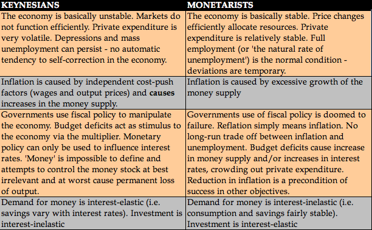

## Table of Contents

## What is Keynesian Economics?

Keynesian Economics is a theory about how economies work, developed by John Maynard Keynes. It says that governments should step in to help the economy when it's not doing well. Keynes believed that during tough times, like a recession, people and businesses save more money and spend less. This can make the economy worse because when people spend less, businesses make less money and might have to let workers go. To fix this, Keynes suggested that the government should spend more money, even if it means borrowing, to get the economy moving again.

The main idea of Keynesian Economics is that demand drives the economy. If people want to buy things, businesses will produce more and hire more workers. But if demand drops, the economy can get stuck in a bad cycle. Keynes thought that by increasing government spending, you can boost demand and help the economy recover faster. This approach was very different from what many economists thought before, who believed that markets would fix themselves without government help. Keynesian Economics became very popular, especially after the Great Depression, and it's still used by many countries today to guide their economic policies.

## What is Monetarism?

Monetarism is an economic theory that says the amount of money in an economy is the main thing that affects how the economy does. It was made popular by an economist named Milton Friedman. Monetarists believe that if there's too much money, prices go up, which is called inflation. If there's not enough money, the economy can slow down and even go into a recession. They think the government, especially the central bank, should control the amount of money to keep the economy stable.

Monetarists say that instead of the government spending more money like in Keynesian Economics, it's better to control the money supply. They believe that if the government just keeps the amount of money growing at a steady rate, the economy will do well on its own. This idea is different from Keynesian Economics, which focuses more on changing government spending and taxes to fix economic problems. Monetarism became very popular in the 1970s and 1980s, and it still influences how some countries manage their economies today.

## Who were the key figures behind Keynesian Economics and Monetarism?

The main person behind Keynesian Economics was John Maynard Keynes. He was a British economist who wrote a big book called "The General Theory of Employment, Interest, and Money" in 1936. In this book, Keynes explained his ideas about how governments should help the economy during tough times. He believed that if people and businesses were not spending enough, the government should step in and spend more money to get things moving again. His ideas became very popular, especially after the Great Depression, and many countries started using his methods to manage their economies.

The key figure behind Monetarism was Milton Friedman. He was an American economist who worked at the University of Chicago. Friedman believed that the amount of money in an economy was the most important thing for keeping the economy stable. He thought that if the government, especially the central bank, controlled the money supply carefully, the economy would do well on its own. Friedman's ideas became popular in the 1970s and 1980s, and they influenced how many countries managed their money and economies during that time.

## How do Keynesian Economics and Monetarism view the role of government in the economy?

Keynesian Economics says that the government should play a big role in the economy. When the economy is not doing well, like during a recession, people and businesses save more and spend less. This can make the economy worse. Keynes thought the government should step in and spend more money, even if it means borrowing, to help the economy. By spending more, the government can boost demand and help businesses and workers. This way, the economy can get moving again. Keynes believed that without government help, the economy might stay stuck in a bad cycle.

Monetarism, on the other hand, says the government should focus on controlling the amount of money in the economy. Milton Friedman, the main person behind Monetarism, thought that if there's too much money, prices go up and cause inflation. If there's not enough money, the economy can slow down. Monetarists believe the government, especially the central bank, should keep the money supply growing at a steady rate. They think this is better than the government spending more money like Keynes suggested. Monetarists believe that if the government just controls the money supply well, the economy will do fine on its own without needing more government spending.

## What are the main differences in how Keynesian Economics and Monetarism approach economic stability?

Keynesian Economics and Monetarism have different ways to keep the economy stable. Keynesian Economics says the government should spend more money when the economy is doing badly. This is because when people and businesses are scared and save more, it can make the economy worse. By spending more, the government can help businesses and workers, making them spend more too. This way, the economy can start growing again. Keynesians think that without this help, the economy might stay stuck in a bad spot for a long time.

Monetarism, on the other hand, focuses on controlling the amount of money in the economy to keep it stable. Milton Friedman, who came up with Monetarism, believed that if there's too much money, prices go up and cause inflation. If there's not enough money, the economy can slow down. Monetarists think the government, especially the central bank, should make sure the money supply grows at a steady rate. They believe this is better than the government spending more money like Keynesians suggest. Monetarists think that if the money supply is managed well, the economy will do fine on its own without needing more government spending.

## How do Keynesian economists and monetarists differ in their views on the causes of inflation?

Keynesian economists think that inflation happens when there's too much demand for things. They say that if people and businesses want to buy more than what's available, prices go up. This can happen if the government spends a lot of money, which puts more money in people's hands. Keynesians believe that to control inflation, the government should raise taxes or spend less money. This way, there's less demand, and prices can stay stable.

Monetarists, on the other hand, believe that inflation is all about the amount of money in the economy. They say that if there's too much money, prices will go up no matter what. Milton Friedman, a famous monetarist, said that inflation is always and everywhere a monetary phenomenon. Monetarists think the best way to control inflation is for the central bank to keep the money supply growing at a steady rate. They believe that if the money supply is managed well, inflation can be kept under control without the government needing to change its spending or taxes.

## What are the Keynesian and monetarist perspectives on the effectiveness of fiscal policy?

Keynesian economists believe that fiscal policy, which means the government changing how much it spends or taxes, can help the economy a lot. They think that when the economy is doing badly, the government should spend more money, even if it has to borrow. This spending can help people and businesses, making them spend more too. Keynesians say this can get the economy moving again. They believe that without this help, the economy might stay stuck in a bad spot for a long time. So, they see fiscal policy as a powerful tool to fix economic problems.

Monetarists, on the other hand, don't think fiscal policy is that important for the economy. They believe that the amount of money in the economy is what really matters. Milton Friedman, a famous monetarist, thought that if the government spends more money, it might not help the economy much. Instead, he said the central bank should focus on keeping the money supply growing at a steady rate. Monetarists think that if the money supply is managed well, the economy will do fine on its own without needing the government to change its spending or taxes. So, they see fiscal policy as less effective than controlling the money supply.

## How do Keynesian Economics and Monetarism differ in their views on the money supply?

Keynesian Economics doesn't focus much on the money supply. Keynesians think that the economy is more about how much people and businesses want to buy things. They believe that if people aren't spending enough, the government should spend more money to help. This can make people and businesses spend more too, which helps the economy grow. Keynesians see the money supply as less important than making sure there's enough demand for things.

Monetarism, on the other hand, says that the money supply is the most important thing for the economy. Milton Friedman, who came up with Monetarism, believed that if there's too much money, prices go up and cause inflation. If there's not enough money, the economy can slow down. Monetarists think the central bank should keep the money supply growing at a steady rate. They believe that if the money supply is managed well, the economy will do fine on its own without needing the government to spend more money.

## Can you explain the Keynesian and monetarist approaches to unemployment?

Keynesian economists believe that unemployment happens when there's not enough demand for things. They think that if people and businesses are not buying enough, companies don't need as many workers. To fix this, Keynesians say the government should spend more money. This spending can help create jobs and make people spend more too. That way, businesses will need more workers, and unemployment can go down. Keynesians see government spending as a way to help the economy and reduce unemployment.

Monetarists, on the other hand, believe that unemployment is more about the money supply. They think that if there's not enough money in the economy, businesses can't grow and hire more people. Monetarists say the central bank should make sure the money supply grows at a steady rate. They believe that if the money supply is managed well, businesses will have the money they need to hire more workers. Monetarists don't think the government needs to spend more money to fix unemployment. Instead, they focus on keeping the money supply stable.

## What historical economic events have shaped the debates between Keynesian Economics and Monetarism?

The Great Depression of the 1930s was a big reason why Keynesian Economics became popular. During that time, many people lost their jobs and businesses failed because people were not spending enough money. John Maynard Keynes said that the government should spend more money to help the economy. Many countries started using his ideas, and they seemed to work. After World War II, many countries used Keynesian policies to keep their economies growing. This made a lot of people believe that Keynesian Economics was the best way to manage the economy.

Later, in the 1970s, something called stagflation happened. This was when the economy was not growing, and prices were going up at the same time. Keynesian ideas didn't seem to fix this problem. That's when Milton Friedman's ideas about Monetarism became more popular. He said that the amount of money in the economy was the most important thing. Many people started to think that controlling the money supply was a better way to manage the economy. The debate between Keynesian Economics and Monetarism has continued ever since, with different countries trying both approaches at different times.

## How have Keynesian Economics and Monetarism evolved in response to global economic challenges?

Keynesian Economics has changed a lot since it first came out. After the Great Depression, many countries used Keynes' ideas to help their economies grow. But when stagflation happened in the 1970s, people started to think that maybe Keynes' ideas weren't working so well. So, economists started to mix Keynesian ideas with other theories. They came up with things like "New Keynesian Economics," which still thinks that the government should spend money to help the economy but also looks at how prices and wages can be sticky, meaning they don't change quickly. During the 2008 financial crisis, many countries used Keynesian ideas again, with governments spending a lot of money to help their economies recover. This showed that even though Keynesian Economics has changed, it's still used to deal with big economic problems.

Monetarism also changed over time. In the 1970s, when stagflation happened, Milton Friedman's ideas about controlling the money supply became very popular. Many countries started to use these ideas to fight inflation. But as time went on, people saw that just controlling the money supply wasn't enough to fix all economic problems. So, economists started to mix Monetarism with other ideas. They came up with things like "New Classical Economics," which still thinks the money supply is important but also looks at how people expect prices to change. Even though Monetarism isn't as popular as it used to be, the idea of controlling the money supply is still used by central banks around the world to help keep the economy stable.

## What are the criticisms and limitations of both Keynesian Economics and Monetarism from an expert perspective?

Keynesian Economics has been criticized for focusing too much on government spending to fix economic problems. Some experts say that if the government spends too much money, it can lead to big debts and higher taxes later. They also think that government spending might not always help the economy in the best way. For example, if the government spends money on things that people don't need, it might not create many jobs or help the economy grow. Another limitation is that Keynesian ideas don't always work well when there's inflation. During the 1970s, when prices were going up and the economy was not growing, Keynesian policies didn't seem to fix the problem. This made some people think that Keynesian Economics has limits in dealing with certain economic challenges.

Monetarism has its own set of criticisms and limitations. Some experts say that focusing only on the money supply is too simple. They think that other things, like how much people want to buy things or how businesses make decisions, also affect the economy a lot. Another criticism is that it can be hard to control the money supply perfectly. If the central bank makes a mistake, it could cause big problems like high inflation or a slow economy. Monetarism also doesn't have good answers for times when the economy needs quick help, like during a big crisis. For example, during the 2008 financial crisis, just controlling the money supply wasn't enough to fix the problem quickly. This shows that Monetarism has limits in dealing with fast-changing economic situations.

## What is Keynesian Economics?

Keynesian Economics, a cornerstone of modern macroeconomic theory, was developed by economist John Maynard Keynes during the Great Depression of the 1930s. It proposes that active government intervention is essential for managing economic cycles and achieving economic stability. The primary focus of Keynesian Economics is to address short-term economic fluctuations through fiscal policies, particularly during downturns.

At the heart of Keynesian theory is the concept that aggregate demand—total demand for goods and services within an economy—is a crucial driver of economic activity. During periods of economic downturn, when private sector spending decreases, Keynesians advocate for increased government spending and reduced taxes to stimulate aggregate demand. This counter-cyclical fiscal policy is aimed at creating jobs and boosting consumption, thus helping to lift the economy out of recession.

Keynesian Economics suggests that a proactive fiscal policy is more effective than monetary policy in achieving macroeconomic stability, particularly in the face of unemployment. During recessions, reducing unemployment takes precedence over controlling inflation. By increasing government expenditures, whether through infrastructure projects, social programs, or other public sector investments, the government can inject money directly into the economy. This infusion stimulates demand, encouraging businesses to increase production and hire more workers. As a result, consumer spending rises, further driving economic recovery.

A simplified representation of this approach can be seen in the Keynesian multiplier effect, which quantifies how an initial increase in spending leads to a larger overall increase in economic output. Mathematically, the multiplier effect (k) can be expressed as:

$$
k = \frac{1}{1 - MPC}
$$

where $MPC$ is the marginal propensity to consume, reflecting the proportion of additional income that consumers are likely to spend. A higher MPC heightens the multiplier effect, implying that increased government spending will have a more pronounced impact on economic output.

While Keynesian Economics acknowledges the role of money supply, it places greater emphasis on the influence of government spending. The rationale is that during a [liquidity](/wiki/liquidity-risk-premium) trap or when interest rates are low, changes in the money supply have limited effect on real economic activity. Consequently, fiscal intervention becomes a critical tool for stimulating demand and managing economic cycles.

In summary, Keynesian Economics underscores the importance of government intervention in managing economic cycles, advocating for increased public spending and tax reductions to stimulate aggregate demand. Its impact is evident in fiscal policies that prioritize reducing unemployment and stabilizing consumption, particularly during economic recessions.

## References & Further Reading

[1]: Keynes, J. M. (1936). ["The General Theory of Employment, Interest, and Money."](https://www.files.ethz.ch/isn/125515/1366_KeynesTheoryofEmployment.pdf) London: Macmillan.

[2]: Friedman, M. (1968). ["The Role of Monetary Policy."](https://www.aeaweb.org/aer/top20/58.1.1-17.pdf) The American Economic Review, 58(1), 1-17.

[3]: Friedman, M., & Schwartz, A. J. (1963). ["A Monetary History of the United States, 1867-1960."](https://www.jstor.org/stable/j.ctt7s1vp) Princeton University Press.

[4]: Keynes, J. M. (1930). ["A Treatise on Money."](https://en.wikipedia.org/wiki/A_Treatise_on_Money) London: Macmillan.

[5]: Mishkin, F. S. (2007). ["Monetary Policy Strategy."](https://direct.mit.edu/books/edited-volume/3276/Monetary-Policy-Strategy) The MIT Press.

[6]: Jansen, S. (2020). ["Hands-On Machine Learning for Algorithmic Trading."](https://www.amazon.com/Hands-Machine-Learning-Algorithmic-Trading/dp/178934641X) Packt Publishing.

[7]: Aronson, D. R. (2006). ["Evidence-Based Technical Analysis: Applying the Scientific Method and Statistical Inference to Trading Signals."](https://www.amazon.com/Evidence-Based-Technical-Analysis-Scientific-Statistical/dp/0470008741) Wiley.

[8]: Chan, E. P. (2008). ["Quantitative Trading: How to Build Your Own Algorithmic Trading Business."](https://github.com/ftvision/quant_trading_echan_book) Wiley.