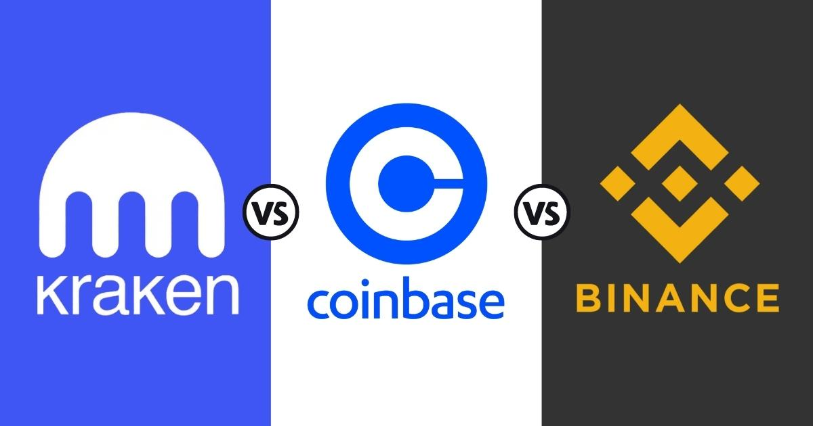

## Table of Contents

## What are Kraken and Binance?

Kraken is a cryptocurrency exchange where people can buy, sell, and trade digital currencies like Bitcoin and Ethereum. It's like an online marketplace but for cryptocurrencies. People use Kraken because it's secure and has been around for a long time, which makes it trustworthy. Kraken also offers different services like staking, where you can earn rewards by holding certain cryptocurrencies.

Binance is another popular cryptocurrency exchange where you can trade many different cryptocurrencies. It's known for having a lot of trading options and lower fees compared to some other exchanges. Binance also has its own cryptocurrency called Binance Coin (BNB), which you can use to pay for fees on the platform. Many people use Binance because it's easy to use and has a lot of features, like futures trading and a mobile app.

## How do Kraken and Binance differ in terms of user interface and experience?

Kraken's user interface is designed to be straightforward and easy to use, but it can feel a bit old-fashioned compared to some other exchanges. When you log in, you'll see a clean layout with options to trade, deposit, or withdraw funds. The trading section is well-organized, showing charts and order books clearly. However, some users might find it less intuitive at first, especially if they're used to more modern designs. Kraken focuses on providing a secure and reliable experience, so while it might not be the flashiest, it's trusted by many for its safety and stability.

Binance, on the other hand, has a more modern and sleek user interface that many users find more appealing and easier to navigate. When you open Binance, you'll see a lot of options right away, like different types of trading (spot, futures, etc.) and tools to help you make decisions. The platform is designed to handle a lot of activity, so it's quick and responsive, which is great for active traders. Binance also offers a mobile app that's easy to use, making it convenient for people who want to trade on the go. Overall, Binance's user experience is often described as more user-friendly and engaging, especially for those who like a lot of features and options.

## What are the fee structures for trading on Kraken versus Binance?

Kraken has different fees depending on what you're doing. For trading, they use a maker-taker model. Makers add [liquidity](/wiki/liquidity-risk-premium) to the market and pay lower fees, while takers take liquidity and pay higher fees. The fees can range from 0% to 0.26% for makers and 0.10% to 0.26% for takers, depending on your trading [volume](/wiki/volume-trading-strategy) over the last 30 days. If you're just buying or selling crypto with a bank transfer or card, the fees can be higher, up to 3.75% plus a small fixed fee. Kraken's fees can seem a bit complicated, but they're pretty standard for the industry.

Binance also uses a maker-taker fee model, but their fees are generally lower than Kraken's. For makers, the fee can be as low as 0.01%, and for takers, it's 0.01% to 0.10%, depending on your trading volume and whether you're using BNB to pay the fees. If you pay with BNB, you can get a discount on your trading fees. For buying crypto with a card or bank transfer, Binance charges a fee of around 0.5% to 2%, which is usually less than what Kraken charges. Overall, Binance is known for having lower fees, which is one reason why many people choose to trade there.

## Which cryptocurrencies can be traded on Kraken but not on Binance, and vice versa?

Kraken has some special cryptocurrencies that you can't find on Binance. For example, you can trade Tether Gold (XAUT) on Kraken, which is a token backed by physical gold. Another one is Augur (REP), which is used for betting on the outcome of events. These are just a couple of examples, and Kraken might have other unique cryptocurrencies too.

On the other hand, Binance offers some cryptocurrencies that Kraken doesn't have. One of them is Binance Coin (BNB), which is Binance's own [cryptocurrency](/wiki/cryptocurrency). Another example is VeChain (VET), which is used for supply chain management. Binance usually has a wider range of cryptocurrencies, so you might find more options there that aren't available on Kraken.

## How do the security measures of Kraken and Binance compare?

Kraken takes security very seriously. They keep most of their customers' cryptocurrencies in cold storage, which means the money is kept offline where hackers can't reach it. They also use two-[factor](/wiki/factor-investing) authentication (2FA) to make sure only you can log into your account. Kraken has never been hacked, which is a big reason why people trust them. They also have a bug bounty program where people can earn money for finding and reporting security issues, which helps keep the platform safe.

Binance also focuses a lot on security, but they've had some problems in the past. In 2019, hackers stole a lot of money from Binance, but the company paid back all the affected users. Since then, Binance has improved its security a lot. They use cold storage too, and they have 2FA to protect your account. Binance also has a Secure Asset Fund for Users (SAFU), which is like an insurance fund to help cover losses if something goes wrong. Both Kraken and Binance take steps to keep your money safe, but Kraken has a better track record of avoiding hacks.

## What are the customer support options available on Kraken and Binance?

Kraken offers customer support through email and a help center with lots of information. You can send them an email if you have a problem, but sometimes it might take a while to get an answer. They also have a section on their website with answers to common questions, which can be helpful if you want to fix something quickly. Kraken doesn't have live chat or phone support, so if you need help right away, you might have to wait.

Binance has more ways to get help. You can use their live chat to talk to someone right away, which is good if you have an urgent problem. They also have a big help center with lots of articles and videos to help you learn about trading. If you want, you can also send them an email, but like Kraken, it might take some time to get a reply. Binance doesn't offer phone support, but their live chat makes it easier to get quick help.

## How do the liquidity levels on Kraken compare to those on Binance?

Binance usually has higher liquidity than Kraken. This means there are more people buying and selling on Binance, so it's easier to trade your cryptocurrencies quickly without affecting the price too much. Binance is one of the biggest exchanges in the world, so it attracts a lot of traders. This high liquidity is good for people who want to trade a lot of different cryptocurrencies without waiting too long.

Kraken also has good liquidity, but it's not as high as Binance's. Kraken is still a popular exchange, but it might not have as many people trading at the same time. This can sometimes make it harder to buy or sell large amounts of cryptocurrencies without moving the price. If you're trading less common cryptocurrencies, you might find it takes a bit longer on Kraken than on Binance.

## What advanced trading features does Kraken offer that Binance does not, and vice versa?

Kraken offers a feature called "margin trading" which lets you borrow money to trade more than you have. This can help you make bigger profits, but it's also riskier. Kraken also has a tool called "stop orders" which let you set a price at which your trade will happen automatically. This can be useful if you want to buy or sell at a certain price without watching the market all the time. Kraken doesn't have as many advanced tools as Binance, but these features can still be helpful for traders.

Binance has a lot of advanced trading features that Kraken doesn't have. For example, Binance offers "futures trading," which lets you bet on the future price of cryptocurrencies. This can be a way to make money even if the price goes down. Binance also has "options trading," where you can buy the right to trade at a certain price in the future. These features are more complex and are usually used by experienced traders. Binance's platform is designed for people who want a lot of different ways to trade and make money.

## How do the regulatory compliance and licensing of Kraken and Binance differ across various countries?

Kraken works hard to follow the rules in different countries. In the United States, Kraken is registered with the Financial Crimes Enforcement Network (FinCEN) as a Money Services Business and is also licensed in several states as a money transmitter. They have to follow strict rules to make sure they are doing things the right way. In Europe, Kraken is registered with the Financial Conduct Authority (FCA) in the UK and follows the rules in other European countries too. They try to be open and honest about what they do to keep customers safe and happy.

Binance also tries to follow the rules, but it can be a bit more complicated. In some countries, Binance has to follow strict rules just like Kraken. For example, in the US, they have a separate platform called Binance.US that follows the rules set by the government. In Europe, Binance is working on getting licenses in different countries to show they are serious about following the rules. However, Binance has faced some problems in certain places because some countries think they are not following the rules closely enough. Binance is always trying to improve and make sure they are doing things the right way.

## What are the staking and earning opportunities available on Kraken compared to Binance?

Kraken offers staking for a few different cryptocurrencies like Ethereum (ETH), Cardano (ADA), and Tezos (XTZ). When you stake your crypto on Kraken, you earn rewards without having to do anything extra. The rewards can be pretty good, but they depend on the cryptocurrency you're staking. Kraken takes a small fee from your rewards, but it's usually less than what other places charge. Staking on Kraken is easy because they handle everything for you, so you don't need to know a lot about how it works.

Binance has a lot more options for staking and [earning](/wiki/earning-announcement). They offer staking for many different cryptocurrencies, including some that Kraken doesn't have. Binance also has something called "savings" where you can earn interest on your crypto by lending it out. They have different plans with different interest rates, so you can choose what works best for you. Binance's fees for staking and savings can be lower if you use their own cryptocurrency, BNB. Overall, Binance gives you more ways to earn money with your crypto, but it can be a bit more complicated to figure out.

## How do the mobile apps of Kraken and Binance compare in terms of functionality and user experience?

Kraken's mobile app is simple and easy to use, but it doesn't have as many features as Binance's app. You can buy, sell, and trade cryptocurrencies on Kraken's app, and you can also stake your crypto to earn rewards. The app is designed to be safe and easy to use, but some people might find it a bit slow and not as fancy as other apps. If you're new to trading, Kraken's app might be easier to understand because it's not too complicated.

Binance's mobile app is more advanced and has a lot more features than Kraken's. You can do everything you can do on the website, like trading, staking, and even futures trading. The app is fast and has a lot of tools to help you make smart trades. It's designed to be easy to use, even though it has so many options. If you like to trade a lot and want to use different ways to make money with your crypto, Binance's app might be better for you.

## What are the experiences of expert traders with the API functionalities of Kraken and Binance?

Expert traders often find Kraken's API to be reliable and easy to use. They like that Kraken's API gives them a lot of information about the market, which helps them make smart trades. The API is good for people who want to trade a lot of money because it can handle big orders without problems. Some traders say that Kraken's API is not as fast as Binance's, but it's still good enough for most people. Kraken also has good support for their API, so if you have a problem, they can help you fix it.

Binance's API is very popular with expert traders because it's fast and can handle a lot of trades at once. Traders like that Binance's API has a lot of features, like futures trading and different ways to trade. This makes it easier for them to try different strategies and make more money. Some traders say that Binance's API can be a bit hard to understand at first because it has so many options, but once you learn how to use it, it's very powerful. Overall, expert traders often choose Binance's API because it's fast and has a lot of tools to help them trade better.

## References & Further Reading

[1]: Bergstra, J., Bardenet, R., Bengio, Y., & Kégl, B. (2011). ["Algorithms for Hyper-Parameter Optimization."](https://dl.acm.org/doi/10.5555/2986459.2986743) Advances in Neural Information Processing Systems 24.

[2]: ["Advances in Financial Machine Learning"](https://www.amazon.com/Advances-Financial-Machine-Learning-Marcos/dp/1119482089) by Marcos Lopez de Prado

[3]: ["Evidence-Based Technical Analysis: Applying the Scientific Method and Statistical Inference to Trading Signals"](https://www.amazon.com/Evidence-Based-Technical-Analysis-Scientific-Statistical/dp/0470008741) by David Aronson

[4]: ["Machine Learning for Algorithmic Trading"](https://github.com/stefan-jansen/machine-learning-for-trading) by Stefan Jansen

[5]: ["Quantitative Trading: How to Build Your Own Algorithmic Trading Business"](https://www.amazon.com/Quantitative-Trading-Build-Algorithmic-Business/dp/1119800064) by Ernest P. Chan