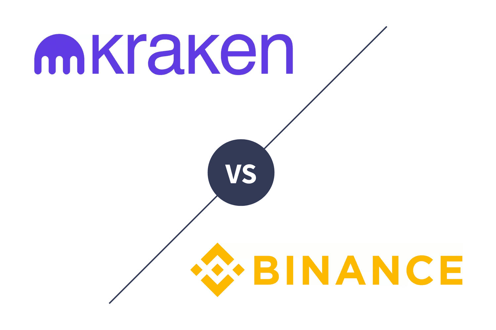

The world of cryptocurrency trading is undergoing rapid transformation, propelled largely by algorithmic trading and the ubiquity of trading platforms like Kraken and Binance. These platforms have positioned themselves at the forefront of the cryptocurrency industry, offering unique features that cater to both individual traders and institutional investors. Algorithmic trading, or algo trading, refers to the use of computer programs that follow a set of instructions to place trades at speeds and frequencies that a human trader cannot match. Platforms such as Kraken and Binance are integrating these technologies to enhance trading efficiency and provide sophisticated trading tools to their users.

Kraken, established in 2011, remains highly respected for its strong security measures and strict adherence to regulatory standards. Its advanced trading features attract those who prioritize safety and transparency, making it a preferred choice among investors who demand robust security for their digital assets. On the other hand, Binance, founded in 2017, has quickly gained popularity due to its extensive cryptocurrency offerings and lower trading fees, appealing to a broad spectrum of users across the globe.



Algorithmic trading within these platforms unlocks opportunities for executing strategies based on pre-defined parameters. By leveraging algorithms to analyze vast datasets, traders can make informed decisions at lightning speed, enabling strategies such as arbitrage, trend following, and market making. This evolution represents a significant shift from traditional trading methods and offers substantial benefits, but also presents challenges regarding market volatility, security, and compliance with regulations.

In this article, we will explore algorithmic trading on Kraken and Binance, understanding the distinct features each platform offers, the benefits and challenges associated with algo trading, and how such innovations are reshaping the cryptocurrency market.

## Table of Contents

## Overview of Kraken and Binance

Kraken and Binance stand out as two of the most prominent cryptocurrency exchanges worldwide, each offering distinct features that cater to a wide range of investors. Kraken has built a reputation for its stringent security measures and adherence to regulatory standards, making it a preferred choice for those prioritizing safety and compliance in their trading activities. This commitment to security is exemplified by the exchange's use of cold storage systems to safeguard assets, with 95% of user funds held offline to mitigate the risk of cyber breaches.

Binance, on the other hand, appeals to international users with its extensive variety of available cryptocurrencies and its competitively low trading fees. These features make Binance an attractive option for traders looking to explore diverse investment opportunities while minimizing transaction costs. Binance's user-oriented policies have contributed to its rapid growth, establishing its presence in numerous markets worldwide.

Both Kraken and Binance have developed sophisticated trading platforms designed to meet the needs of experienced investors. These platforms incorporate advanced trading tools and features, such as customizable interfaces, comprehensive charting capabilities, and access to a wide range of order types. Such tools enable traders to execute complex strategies with precision and efficiency. As a result, both exchanges continue to attract a dedicated user base seeking reliable and innovative solutions within the dynamic [cryptocurrency](/wiki/cryptocurrency) market.

## Algo Trading Explained

Algorithmic trading utilizes computer programs to automate the execution of trades based on predefined strategies and algorithms. This approach enables traders to capitalize on the speed and precision afforded by modern technology, eliminating the manual components of trading that can result in delays and human error. At its core, [algorithmic trading](/wiki/algorithmic-trading) is designed to manage complex datasets and execute orders that can be triggered by various market signals.

AI and [machine learning](/wiki/machine-learning) have significantly enhanced these trading algorithms. By leveraging these technologies, trading bots can rapidly analyze vast datasets, identifying patterns and insights that support informed trading decisions. For instance, a [deep learning](/wiki/deep-learning) algorithm might be trained on historical market data to predict price movements or identify optimal trading opportunities. Python libraries such as TensorFlow or PyTorch can be employed to build and train models capable of performing these tasks, allowing for sophisticated analysis and real-time decision-making.

Key strategies employed in algorithmic trading include:

1. **Arbitrage**: This involves exploiting price differences of the same asset on different exchanges. Trading bots are programmed to detect these disparities and execute simultaneous buy and sell orders to profit from the difference. For example, if Bitcoin is priced at $10,000 on one exchange and $10,050 on another, a bot could purchase Bitcoin on the cheaper exchange and sell it at the higher price elsewhere.

2. **Market Making**: Market makers provide liquidity to the market by continuously buying and selling a particular asset, profiting from the spread between bid and ask prices. Algorithms facilitate efficient management of these transactions, adjusting prices dynamically based on market conditions to optimize the spread.

3. **Trend Following**: This strategy focuses on tracking and capitalizing on the momentum of asset prices. Algorithms utilizing moving averages or other technical indicators can systematically execute buy or sell orders aligned with these trends. An example of such an algorithm might use the following Python logic:

```python
def trend_following_strategy(prices, short_window, long_window):
    short_mavg = prices.rolling(window=short_window, min_periods=1).mean()
    long_mavg = prices.rolling(window=long_window, min_periods=1).mean()

    signals = (short_mavg > long_mavg).astype(int)
    return signals.diff()  # Buy when 1, sell when -1

# Example usage
import pandas as pd

prices = pd.Series([110, 112, 115, 117, 111, 115, 118])
signals = trend_following_strategy(prices, short_window=2, long_window=3)
print(signals)
```

These strategies are greatly enhanced by algorithmic trading's speed and precision, which allow for the quick execution of trades based on real-time data. Moreover, the ability to back-test trading strategies on historical data further enables traders to refine their approaches, optimizing outcomes and mitigating risks in a volatile market.

## Algo Trading on Kraken

Kraken stands out as a leading platform for algorithmic trading, primarily due to its commitment to security and versatile technological offerings. A pivotal aspect of its security infrastructure is its practice of storing 95% of digital assets in offline, cold storage. This significantly mitigates the risk of cyber theft and is a reassuring feature for traders who prioritize asset safety. 

Beyond security, Kraken facilitates a wide range of transaction types and provides extensive API support, making it a suitable platform for integrating custom trading bots. The APIs—available in both REST and WebSocket forms—grant users the flexibility to develop algorithms capable of performing complex trading functions. This allows traders to implement strategies like [arbitrage](/wiki/arbitrage), [market making](/wiki/market-making), and [trend following](/wiki/trend-following) with greater precision and efficiency.

Kraken's educational resources further enhance its appeal to algo traders. Recognizing the intricacies involved in algorithmic trading, Kraken offers comprehensive guides and tutorials that help users navigate its features. These resources are invaluable for both novice and seasoned traders who wish to deepen their understanding of complex trading options and technological integrations. By offering this support, Kraken empowers users to optimize their trading strategies and execute trades seamlessly within its platform. 

The combination of robust security measures, flexible API capabilities, and educational materials makes Kraken a formidable choice for those engaging in algorithmic trading in the cryptocurrency market.

## Algo Trading on Binance

Binance provides a comprehensive platform that facilitates algorithmic trading for both novice and experienced traders. This platform supports the development and deployment of custom-built trading bots, which enable automated decision-making processes driven by pre-defined algorithms. One of Binance's standout features is its competitive fee structure. Lower trading fees, typically a percentage of the transaction value, make it an attractive choice for traders looking to maximize profitability. Furthermore, Binance offers an extensive selection of cryptocurrencies, thereby allowing traders a diverse pool of options which can be crucial for implementing varied trading strategies.

One key feature of Binance's algorithmic trading capabilities is the grid trading functionality. This system allows traders to automate buy and sell orders within specific price parameters, creating a 'grid' of orders at incremental price levels. Such a method ensures that traders can capitalize on market [volatility](/wiki/volatility-trading-strategies) by buying low and selling high within their set framework. This approach is particularly beneficial in range-bound markets where price oscillates within a set range. 

For example, a simple grid trading strategy could be implemented through the following Python pseudo-code:

```python
def grid_trading(start_price, end_price, step, amount):
    grid = []
    price = start_price
    while price <= end_price:
        grid.append(price)
        price += step

    for price_point in grid:
        # Execute buy order at each price point
        buy_order(price_point, amount)
        # Set sell order at a higher price within the grid
        sell_order(price_point + step, amount)

def buy_order(price, amount):
    print(f'Placing buy order at {price} for {amount} amount.')

def sell_order(price, amount):
    print(f'Placing sell order at {price} for {amount} amount.')
```

This hypothetical strategy allows a trader to establish buy and sell limits across a range of prices, enabling the capture of profits as the market fluctuates. It's important to note that effectiveness is contingent on the trader's understanding of market trends and volatility.  

In summary, Binance's algorithmic trading toolkit, characterized by its low fees, wide cryptocurrency selection, and advanced features like grid trading, offers a robust foundation for developing and executing automated trading strategies.

## Challenges and Considerations

Algorithmic trading, while advantageous for its speed and precision, presents several challenges and considerations that need to be carefully managed. One significant challenge is the inherent market volatility in cryptocurrency trading. Unlike traditional markets, cryptocurrencies are known for their rapid price movements, which can lead to substantial losses if trading algorithms are not constantly monitored and adjusted to market conditions. Continuous monitoring allows traders to optimize their strategies in real time, mitigating risks associated with sudden market changes.

Security is another pressing concern when engaging in algorithmic trading on cryptocurrency exchanges. As these platforms are prime targets for cyberattacks, choosing a secure and reliable platform is crucial. Both Kraken and Binance invest heavily in security measures; for instance, Kraken keeps 95% of its assets in cold storage, minimizing the risk of hacking. Nonetheless, users must remain vigilant and ensure their trading bots are safeguarded against unauthorized access.

Compliance with regulatory requirements is essential, especially given the global nature of cryptocurrency trading. Regulations vary significantly across jurisdictions, impacting how algorithms can be deployed. Traders must stay informed about legal obligations, such as anti-money laundering (AML) regulations and know-your-client (KYC) procedures, to avoid potential legal issues. Understanding these requirements is vital to ensure that trading activities are lawful and ethically conducted on each platform.

In summary, while algorithmic trading offers substantial benefits, traders need to navigate through challenges such as market volatility, security risks, and regulatory compliance to maximize potential outcomes effectively.

## Conclusion

Both Kraken and Binance stand out as formidable platforms for algorithmic trading in the cryptocurrency market, each bringing distinct strengths to the table. Kraken is renowned for its rigorous security measures and regulatory compliance, making it a solid choice for those who prioritize asset protection and regulation adherence. Its support for complex trading features and educational resources also aids traders looking to understand and implement advanced algorithmic strategies.

Conversely, Binance is favored for its vast selection of cryptocurrencies and lower transaction fees, offering an attractive proposition for traders aiming to engage in diverse trading activities. Its platform is also tailored to support custom automated trading bots, with functionality like grid trading enabling seamless execution of strategies within predefined parameters.

When deciding which platform to use, investors must align their trading needs and strategies with the features offered by these exchanges. Factors such as the desired level of security, available cryptocurrencies, fee structures, and the complexity of trading tools should all play a part in this assessment. 

The ongoing evolution in algorithmic trading technologies portends a new era of trading efficiency and effectiveness within the cryptocurrency space. By integrating advanced algorithms powered by AI and machine learning, traders can leverage data-driven insights to optimize performance and mitigate risks. As these technologies continue to develop, they promise to dramatically enhance trading outcomes, making them an indispensable aspect of modern crypto-trading strategies.

## References & Further Reading

[1]: Bergstra, J., Bardenet, R., Bengio, Y., & Kégl, B. (2011). ["Algorithms for Hyper-Parameter Optimization."](https://dl.acm.org/doi/10.5555/2986459.2986743) Advances in Neural Information Processing Systems 24.

[2]: ["Advances in Financial Machine Learning"](https://www.amazon.com/Advances-Financial-Machine-Learning-Marcos/dp/1119482089) by Marcos Lopez de Prado

[3]: ["Evidence-Based Technical Analysis: Applying the Scientific Method and Statistical Inference to Trading Signals"](https://www.amazon.com/Evidence-Based-Technical-Analysis-Scientific-Statistical/dp/0470008741) by David Aronson

[4]: ["Machine Learning for Algorithmic Trading"](https://github.com/stefan-jansen/machine-learning-for-trading) by Stefan Jansen

[5]: ["Quantitative Trading: How to Build Your Own Algorithmic Trading Business"](https://www.amazon.com/Quantitative-Trading-Build-Algorithmic-Business/dp/1119800064) by Ernest P. Chan